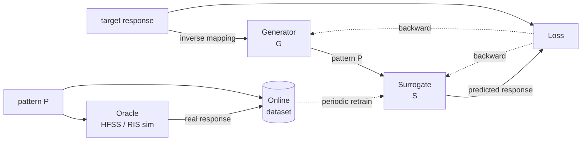
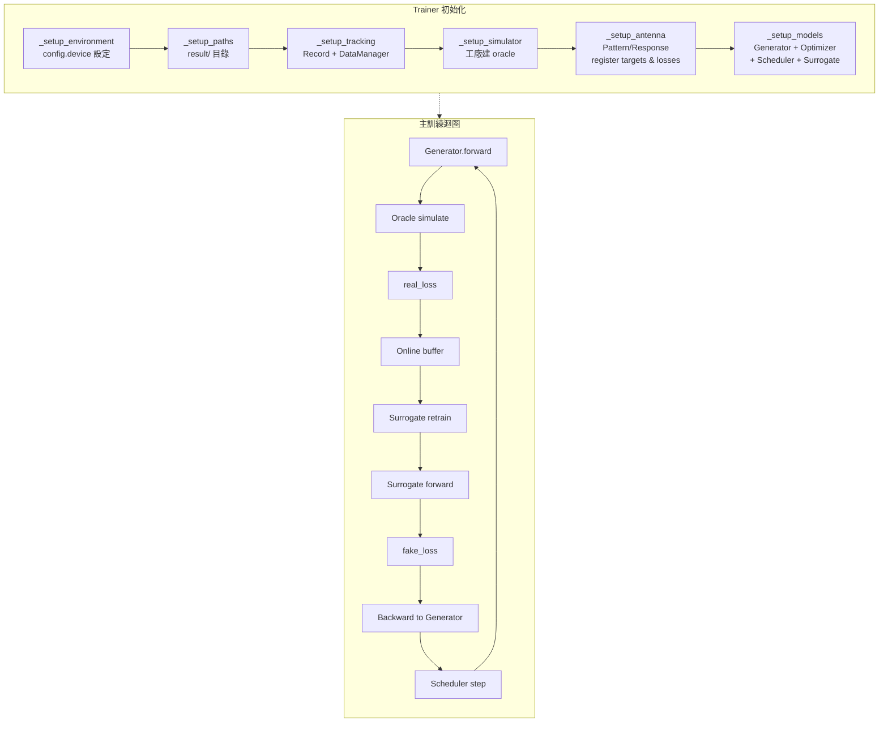

# Antenna 訓練架構：基於代理模型的線上學習

本文針對 `antenna/training/trainer.py` 現行實作做詳細拆解，包含整體流程、每個階段的資料流、關鍵超參數、以及現行實作值得討論的幾個設計選擇。

> 本文件以 **RIS 訓練**為具體例（`+experiment=train_ris`）講解，但整個流程對 patch 完全適用（差異只在 simulator 昂貴度：RIS 幾乎不花時間，patch 一次 HFSS 模擬要幾分鐘）。

---

## 目錄

1. [核心觀念：Inverse design via learned surrogate](#1-核心觀念inverse-design-via-learned-surrogate)
2. [角色一覽](#2-角色一覽)
3. [高階資料流](#3-高階資料流)
4. [每個 epoch 的內部流程](#4-每個-epoch-的內部流程)
5. [代理模型的 online learning 細節](#5-代理模型的-online-learning-細節)
6. [Generator 端的梯度路徑](#6-generator-端的梯度路徑)
7. [參數詳表](#7-參數詳表)
8. [現況觀察與可能的改善點](#8-現況觀察與可能的改善點)
9. [RIS vs Patch 的差異](#9-ris-vs-patch-的差異)

---

## 1. 核心觀念：Inverse design via learned surrogate

要解的問題是一個**反問題 (inverse problem)**：

> 給定想要的頻域響應 `target`，找出一張 pattern `P`，使得真正模擬出來的響應 `oracle(P) ≈ target`。

對 patch 來說 `oracle` 就是 HFSS，是黑盒而且昂貴（一次幾分鐘）。直接對 HFSS 做 gradient descent 不可行（不可微）。

解法是引入兩個網路：
- **Generator `G`**：`G(target) → P`
- **Surrogate `S`**：可微的 HFSS 近似，`S(P) → response`

把它們組合起來：`S(G(target))` 是完全可微的，可以做 gradient descent。但 surrogate 只有在它訓練過的 `P` 附近才可信——這就是為什麼要**持續線上更新 surrogate**：generator 漂到哪裡，surrogate 就要跟到哪裡。



---

## 2. 角色一覽

| 角色 | 類別 | 位置 | 職責 |
|------|------|------|------|
| **Generator** | `SigmoidGEN`, `GumbelSigmoidGEN` | `antenna/models/generators/` | 把 target response 映射到 pattern logits |
| **Surrogate** | `OldSM` | `antenna/models/surrogates/surrogate_model.py` | 近似 oracle，提供可微響應 |
| **Oracle** | `RISSimulator` / `SinglePortSimulator` / `DualPortSimulator` | `antenna/ris/`, `antenna/patch/` | 真實物理模擬；絕對正確但貴（patch）或便宜但要當作貴（RIS） |
| **Trainer** | `Trainer` | `antenna/training/trainer.py` | 協調以上三者，管 online dataset、early stopping、rollback |
| **Record** | `Record` | `antenna/utils/record.py` | 每個 epoch 的 loss / tau / pattern 快照 |
| **DataManager** | `DataManager` | `antenna/utils/data.py` | online dataset 的實體儲存（pickle + 去重） |

---

## 3. 高階資料流



---

## 4. 每個 epoch 的內部流程

`antenna/training/trainer.py::Trainer.run()` 的單 epoch 展開：

```mermaid
sequenceDiagram
    autonumber
    participant R as Record
    participant G as Generator
    participant O as Oracle (sim)
    participant B as Online Buffer
    participant S as Surrogate
    participant L as Loss + Regularization

    Note over R: early_stop 檢查 real_loss patience
    R->>R: if early_stop → rollback + S.train_by_datas(B)

    R->>G: target = AntennaResponse.target.concat()
    G->>G: forward → pattern logits → pattern P
    Note over G: GumbelSigmoid sample（隨 tau 退火）

    G->>O: P
    O-->>R: real_response
    L->>L: real_loss = criterion(real_response, target)

    alt 同一 pattern 沒出現過
        R->>S: S.train_one_data(P, real_response) 直到 loss&lt;0.1
        R->>B: if real_loss &lt; avg(real_loss) → B.add(P, real_response)
    else 重複 pattern
        R->>R: 從 buffer 取 cached real_response
    end

    G->>S: P
    S-->>L: fake_response
    L->>L: fake_loss = criterion(fake_response, target)
    L->>L: + total_variation / island_suppression / sc / gc weights

    L->>G: backward + optimizer.step
    G->>G: scheduler.step(real_loss)
    G-->>R: save checkpoint generator_{epoch}.pth
```

關鍵：**backward 只流經 surrogate，不流經 oracle**。Oracle 只負責提供「真實的 (P, response) 對」給 surrogate 學習。

---

## 5. 代理模型的 online learning 細節

這是整個流程最精巧、也最需要調教的部分。

### 5.1 Buffer 管理

`online_dataset: DataManager` 儲存 `(pattern, response)` pairs。

**加入策略**（`trainer.py` 約 L293）：
```python
if self.record("real_loss") < self.record.average("real_loss"):
    self.online_dataset.add_and_save([~output_element, stack_output_result])
```
只有「本 epoch 的 real_loss 比歷史平均好」才加入，過濾掉 generator 試誤時產生的爛 pattern。

**去重**：DataManager 內部以 `make_hashable` 算 hash（Unit 13 已優化 tensor tobytes 重複成本）。

### 5.2 Surrogate 訓練

有兩條路徑：

**A. 每個 epoch 的「即時 fit」**（L287）：
```python
self.smodel.train_one_data(output_element.series, stack_output_result)
```
拿當下這對 `(P_t, real_response_t)` 把 surrogate 訓練到 loss &lt; 0.1 或達 20,000 iter（以 `config["HFSS.min_loss"]` / `config["HFSS.max_epoch"]` 為上下限）。**每個 epoch 只用新這一對資料**，不做 replay。

**B. early stopping rollback 時的「批次 fit」**（L272）：
```python
self.smodel.train_by_datas(self.online_dataset)
```
在 generator 陷入停滯（連續 `patience` 個 epoch real_loss 不進步）觸發 rollback：把 generator 退回 best checkpoint，然後 surrogate 在**整個 online buffer** 上 re-fit。重新探索的起點要準確，所以值得花時間。

### 5.3 Rollback 機制

```python
if self.record.early_stop("real_loss", self.cfg.patience):
    # 退到 best epoch 的 generator 權重
    self.generator.change(
        self.record.find("real_loss", self.record("min_loss", inf), "epoch"),
        save=True, load=True,
    )
    self.smodel.train_by_datas(self.online_dataset)
```

這個機制的效果像「局部最小值脫離」——Generator 卡住時，拉回 best、再用整個 buffer 把 surrogate 重新校準，然後從 best 繼續探索。

---

## 6. Generator 端的梯度路徑

```
target ──→ Generator ──→ pattern_logits
              │              │
              │              ├── clamp([-5, 5])
              │              │
              │              ├── GumbelSigmoid.apply(logits, tau)  ← 可微
              │              │          │
              │              │          └── STE：forward 硬二值，backward 走 sigmoid
              │              │
              │              └── pattern
              │                     │
              │                     ▼
              │                 Surrogate ── fake_response
              │                     │
              │                     ▼
              │                   custom_loss(fake, target)
              │                     │
              │                     + total_variation_loss(pattern, w_tv)
              │                     + island_suppression_loss(pattern, w_is)
              │                     + sc_loss(pattern_4d, w_sc)
              │                     + gc_loss(pattern_4d, w_gc)
              │                     │
              │                     ▼
              └────── backward ←──  loss
```

**Gumbel-Sigmoid straight-through**（`antenna/models/autograd/functions.py`）：
- **Forward**：`(sigmoid(logits / tau) + gumbel_noise) > 0.5` → 0 或 1
- **Backward**：走連續的 `sigmoid(logits / tau) * (1 - sigmoid(...))` 梯度

這讓 pattern 前向是**硬二值**（接近 oracle 能看到的真實輸入），而反向仍有梯度可回傳。`tau` 是 `nn.Parameter`，可學，也可以被 scheduler 調整。

---

## 7. 參數詳表

### 7.1 `config.yaml`（根設定）

| 欄位 | 預設 | 意義 |
|------|------|------|
| `epochs` | 1000 | 外層 epoch 總數 |
| `patience` | 10 | 連續 N 個 epoch `real_loss` 不進步 → rollback |
| `model` | `sigmoid_gen` | Generator 選擇（`sigmoid_gen` / `gumbel_sigmoid_gen`） |
| `simulator` | `single_port` | Oracle（`single_port` / `dual_port` / `ris`） |
| `experiment_name` | `[Patch-Single-{device}-{hash_id}]` | 結果資料夾名，支援 `{device}` / `{hash_id}` / `{tid}` / `{id}` 標記 |
| `total_variation_loss_weight` | 0.0 | TV loss 權重（0 = 關閉） |
| `island_suppression_loss_weight` | 0.0 | 孤島懲罰權重 |
| `spectral_connectivity_loss_weight` | 0.0 | 譜連通性權重 |
| `gap_closing_loss_weight` | 0.0 | 縫隙關閉權重 |

### 7.2 `environment`

| 欄位 | 預設 | 意義 |
|------|------|------|
| `device` | `cpu` | `cuda:0` / `cpu` |
| `network_drive_letter` | `T:` | 網路磁碟字母 |
| `rootdir` | `""` | 結果根目錄（空字串 → 用 `antenna/utils/__init__.py` 的 `ROOTDIR`） |

### 7.3 `pattern`

| 欄位 | 預設 | 意義 |
|------|------|------|
| `coordinate` | `[0, 25, 0, 25]` | 2D pattern 的 `[x_min, x_max, y_min, y_max]`，決定像素數（25×25 = 625） |

### 7.4 `response`（範例：RIS）

```yaml
labels: [response]
x: ris
label_configs:
  response:
    target:
      side: -20      # 兩側的 dB 值
      center: 0      # 中心（beam peak）的 dB 值
      width: [140, 0, 40, 0, 181]   # 五段寬度：side / ramp / center / ramp / side
    loss_fn: custom_loss
    loss_params: {}
```

- **target 的五段寬度**：`[w0, w1, w2, w3, w4]` 從左到右代表「左側 side 區 / 左側過渡 / 中心 / 右側過渡 / 右側 side 區」。RIS 範例 `[140,0,40,0,181]` 總和 361 個樣本點。
- **loss_fn** 字串：經 `LOSS_FN_REGISTRY` 查表找實際函數。RIS 專用 `custom_loss` 在 `antenna/ris/__init__.py`。

### 7.5 `optimizer` / `scheduler`

```yaml
optimizer:
  _target_: torch.optim.Adam
  lr: 0.005
  betas: [0.5, 0.999]
scheduler:
  _target_: none   # 或 AdaptiveCyclicalScheduler 或 ReduceLROnPlateau
```

**AdaptiveCyclicalScheduler 參數**（見 `antenna/schedulers/adaptive_cyclical.py`）：

| 欄位 | 預設 | 意義 |
|------|------|------|
| `T_0` | 100 | 一個週期長度 |
| `T_mult` | 1 | 週期倍增係數 |
| `lr_max` / `lr_min` | 0.005 / 1e-6 | cosine 範圍 |
| `temp_max` / `temp_min` | 4.0 / 0.1 | 同步調整 tau 的上下限 |
| `warmup_ratio` | 0.2 | 前 20% 線性 warmup |
| `patience` / `factor` | 25 / 0.7 | 內嵌的 ReduceLROnPlateau |
| `mode` | `min` | loss 方向 |
| `on_plateau` | `linear` | plateau 時 tau 下降策略（`linear` / `cosine`） |

### 7.6 `surrogate`（Oracle 代理）

```yaml
surrogate:
  hfss_min_loss: 0.1      # surrogate 內層訓練的收斂門檻
  hfss_max_epoch: 20000   # surrogate 內層訓練的 iter 上限
  hfss_lr: 0.001          # surrogate 內層訓練的 learning rate
```

這三個參數**只在 `train_one_data` 與 `train_by_datas`** 起作用，決定 surrogate 有多「緊追」新資料。門檻越嚴（min_loss↓ / max_epoch↑）surrogate 越準，但每 epoch 越慢。

---

## 8. 現況觀察與可能的改善點

> 這幾點是本文撰寫時從程式碼讀出的感想，不代表一定要改；但要調參或改造前先知道現況比較好。

### 8.1 Buffer 使用不足

每個 epoch surrogate 只在「新這對資料」上 fit（`train_one_data`），**online_dataset 幾乎只在 rollback 時才用到**。這讓 surrogate 變成每個 epoch 重新擬合局部、容易忘掉舊資料。

**可能的改善**：
- 每 N 個 epoch 在 buffer 上跑一次 batch fit
- 或改成 replay buffer：每個 epoch 隨機抽 K 筆 + 當下這筆一起訓練
- 需要評估：緊貼當下的「局部過擬合」vs 全局資料的平均——前者可能讓 generator 在局部走得更快

### 8.2 加入 buffer 的門檻

```python
if real_loss < average(real_loss):
    buffer.add(P, response)
```
只收「比平均好」的。邏輯上合理（濾掉雜訊），但**有冷啟動問題**：前幾個 epoch average 還沒穩定，判斷可能被首個 outlier 污染。另外「比平均好」也不保證 informative（可能是 generator 陷在區域最小值附近產生一堆類似 pattern）。

**可能的改善**：
- 前 K epoch 無條件加入（暖身）
- 或改成「距離現有 buffer 中 pattern 最近鄰太遠就加入」（diversity-based）

### 8.3 去重複雜度 O(N²)

```python
if record.index("patch_pattern_buf", ~output_element) is None:
    ... simulate ...
```

`record.index` 實際上會掃整個歷史 list（`Record.__setitem__` 是 append，不是 overwrite），所以**去重確實覆蓋全部歷史**。這裡的潛在問題不是正確性而是效率：

- 每 epoch 對整個 buffer 做線性搜尋 (O(N))
- Buffer 無上限成長，記憶體 + 搜尋成本雙重疊加
- 100 epoch 還好，10k epoch 會變慢

**可能的改善**：
- 改用 hash set 儲存已見過的 pattern id
- 或 DataManager 既有的 `make_hashable` 直接用於主迴圈（目前只在 DataManager 內部用）
- Buffer 設上限（例如 keep 最新 1000 筆）

### 8.4 Tau 沒被正確 log（已修 `824cc23`）

```python
self.record["tau"] = 0
```
硬編碼 0。已修：改為讀 `self.model.tau.detach().cpu().item()`（GumbelSigmoidGEN 的 tau 是 `nn.Parameter`），修正後可以畫 tau 隨 epoch 的退火曲線。

### 8.4a Scheduler tau_callback 沒接到 generator（已修 `497d694`）

`AdaptiveCyclicalScheduler` 預設的 tau_callback 只更新 `AntennaPattern.tau`（class attribute），不影響 `GumbelSigmoidGEN.tau`（nn.Parameter）。修正：trainer 的 `_make_tau_callback()` 回傳一個 in-place 寫 `model.tau.data` 的 closure，讓退火真的生效。

### 8.4b Rollback 把 scheduler state 一起拉回去（已修 `77b5078`）

`Models.load()` 會還原 `scheduler.load_state_dict(...)`，這代表每次 rollback 都把 tau 退火進度拉回 best epoch 當時的狀態。實測 v4（56 次 rollback）tau 完全無法進步；v5（1 次 rollback）scheduler 才走半段。修正：trainer 在 rollback 前後備份/還原 scheduler state，讓 model/optimizer 回到 best，但 scheduler 繼續向前 anneal。

### 8.4c 實驗觀察：低 tau 時梯度 vanishing（GumbelSigmoid STE 的結構限制）

Gumbel-Sigmoid 的 forward 是 `sigmoid(clamp(logits, -5, 5) / tau) + noise`，backward 的梯度是 `sigmoid * (1 - sigmoid)`。當 tau=0.1 時，clamp 邊界的 logit=±5 送進 sigmoid 變成 sigmoid(±50) ≈ 0 or 1，**梯度接近 0**。

實測對比（15×15 RIS 100 epoch，target 固定）：

| Run | Scheduler | patience | Tau 最低到 | Rollbacks | min_loss | 結論 |
|-----|-----------|---------|-----------|-----------|----------|------|
| v4 | T_0=200, scheduler 會被 rollback 拉回 | 20 | 3.23 | 56 | 3.14 | 高 tau + 頻繁 rollback = 近似 simulated annealing |
| v5 | T_0=100, scheduler 也會被 rollback | 60 | 1.4 | 1 | 5.76 | rollback 不夠，generator 漂移 |
| v6 | T_0=100, scheduler decoupled | 20 | **0.1** | 30 | 7.86 | tau 完全退火但低 tau 梯度 vanish，反而學不動 |
| **v7** | T_0=200, scheduler decoupled | 20 | 2.08 | 37 | **3.02** ✅ | **v4 + decoupling = 目前最佳**，tau 能比 v4 多降一點又不觸及梯度 vanish |
| v8 (20×20) | T_0=120, scheduler decoupled | 20 | 2.08 | 13 | 3.53 | **物理現象反直覺**：元素增加 → beam 反而更窄 → 對寬 target 反而 worse |
| v9 (10×10) | T_0=200, scheduler decoupled | 20 | 2.08 | 32 | 3.48 | 元素更少也 worse — beam 形狀不夠尖銳，能量散布過廣，sidelobe 反過頭抬高 |
| v11 (15×15, target plateau 40→20) | T_0=200, scheduler decoupled | 20 | 0.10 | 56 | 3.06 | **target 窄化沒突破** — best pattern 仍 100% 全亮，響應跟 V7 幾乎相同；loss 下界跟 target 形狀無關 |

**結論**：對這類二值 inverse design 任務，**tau 應維持在 2-4 區間**（避免 vanishing），配合頻繁 rollback 做隨機探索；同時讓 scheduler 不被 rollback 拉回讓 tau 能單調往下。後續若要做完整退火到 tau<1，需解決梯度 vanishing（例如擴大 clamp 範圍、或使用其他 STE 近似）。

**Pattern 大小 vs target 寬度的物理關係**（v7 vs v8 對比揭露）：

> RIS 元素愈多（陣列增益愈高）→ 主波束愈窄（半功率波束寬度愈小）。對固定的 target plateau 寬度而言：
> - 元素**過少**：beam 太寬，主峰高度不足
> - 元素**剛好**：beam 寬度貼近 target plateau
> - 元素**過多**：beam 太窄、能量集中在中心一點，覆蓋不到 plateau 邊緣

V7 (15×15) 的 beam 比 V8 (20×20) 寬，反而更貼近此 target 的 40-sample plateau，所以 loss 較低。要再降低 loss 應該：
1. ~~**減少元素數**~~ ❌（v9 = 10×10 = 3.48 也較差，beam 太散 sidelobe 抬高）
2. **放寬 target 至更窄 plateau**（接近現有 beam 寬度的 ~20 samples）
3. **接受目前 ~3.0 為此 target × 此元素數的物理下界**

**Sweet spot 已確認**：v7 (15×15) → v8 (20×20) → v9 (10×10) = 3.02 → 3.53 → 3.48。**15×15 為 local optimum**，兩個方向放大或縮小都 worse。要進一步改善 loss 必須**改 target 形狀**（變窄）或**改變陣列幾何**（非方形、稀疏排列）。

### 8.4d 觀察：Generator 沒真的「學到」discrete pattern（待解決）

實測 V7 best epoch 的 hard-binarized pattern：**225/225 全亮（100% on）**。Generator 的 sigmoid(logits) 雖有微小波動，但全都 >= 0.5，threshold 0.5 後沒有結構。

這代表訓練期間「最佳」響應其實**不是來自 generator 學到的 mapping**，而是來自 Gumbel-Sigmoid 在 forward 時的隨機採樣 — Gumbel noise 混入後產生的非全亮 pattern 偶爾比較好，被 rollback 抓住。

**結論**：目前的「訓練」實際上是用 Gumbel-Sigmoid 採樣 + rollback 跑 simulated annealing，**不是真正的 inverse design 學習**。要讓 generator 真的學到 target → pattern 的 mapping，可能要：
1. 擴大 `clamp([-5, 5])` 範圍，讓 logits 能拉開正負區隔
   → 已實作 `WideGumbelSigmoidGEN` (clamp [-20, 20])，在 `MODEL_REGISTRY` 中以 `wide_gumbel_sigmoid_gen` 註冊；preset `train_ris_v12wide.yaml`。
2. 用更強的 STE（例如 hard sample + softmax 反向）
3. 加 reconstruction-style 約束（例如 binary entropy regularization 鼓勵兩極化）
4. **改 loss 設計** → 已實作 `custom_loss_directivity`：tolerance + main beam reward 風格（不只是「不要過低」，直接獎勵峰值升高）；preset `train_ris_v13directivity.yaml` 結合 wide gumbel 與此 loss。

可用 `script/inspect_ris_run.py` 檢視任一 run：
- `pic/best_pattern_hard.png` — best epoch 的 hard-binarized pattern
- `pic/samples/sample_NN.png` — 10 張不同 target → pattern → 實際響應的三聯圖。**用於檢驗 generator 是否真為 conditional**：若 10 個不同 target 卻得到相同 pattern，就確認 collapse。

### 8.5 Surrogate 每 epoch 花 up to 20000 iter

內層迴圈上限 20,000，對每個 epoch 都是嚴重的 overhead（實測 ~50 秒/epoch）。在 RIS 這個可微 oracle 的場景下，每一對 `(P, response)` 都能 exact 算出來，surrogate 「學不到新東西」時還硬 fit 是浪費。

**可能的改善**：
- 下限也可以設：`hfss_max_epoch` 降到 2000，保證 surrogate 跟上但不 overshoot
- 對 patch 場景這個問題不存在：HFSS 一次 5 分鐘，surrogate 20000 iter 總共也只要幾十秒，比例合理

### 8.6 Single target 訓練 vs multi-target conditional

目前 `target` 是靜態的（從 YAML 讀一次、整個訓練不變），雖然 generator.forward 吃 target 當 input，實質上退化成「對這一個 target 的最佳化」。要做真正的 conditional generation，需要：
- 每個 batch 隨機 sample 一組 target 分布
- Generator 學到的是「target → pattern」的 mapping，不是單一 pattern

**但這對 patch 是有意義的**：想像使用者在 UI 拖曳 target 曲線，generator 瞬間輸出對應 pattern。未來要做的話，trainer 需大幅改造。

---

## 9. RIS vs Patch 的差異

| 維度 | RIS | Patch |
|------|-----|-------|
| Oracle | `RISSimulator`（純 torch，可微） | HFSS（COM 自動化，不可微） |
| 單次呼叫成本 | 毫秒 | 分鐘 |
| Surrogate 必要性 | 技術上不需要（oracle 可微）；但為了練習 patch 流程仍保留 | 必要（唯一的梯度路徑） |
| Buffer 寶貴程度 | 廉價；隨時可重算 | 極寶貴；每筆資料都花真實模擬時間 |
| 內層 surrogate fit | 看起來很 overhead（oracle 很快） | 合理（oracle 很慢，surrogate 20000 iter 相對便宜） |
| FeedReachability | 不適用（RIS 元素獨立） | 必要（貼片銅箔需連通到饋電點） |
| Island Suppression | 弱（RIS 容許零散分布） | 強（孤島沒意義） |

換言之：**RIS 是練兵場，讓整個 pipeline 在一個便宜 oracle 上跑順，之後移植到 patch 時不用再 debug 流程本身、只要調「資料昂貴度」相關的超參**。

---

## 相關檔案索引

- `antenna/training/trainer.py` — 主訓練迴圈
- `antenna/models/generators/gumbel_sigmoid_gen.py` — 帶 tau 退火的生成器
- `antenna/models/surrogates/surrogate_model.py` — OldSM 代理模型
- `antenna/ris/simulate_ris.py` — RIS oracle（純 torch）
- `antenna/patch/patch_simulator/` — Patch HFSS oracle
- `antenna/utils/record.py` — 訓練追蹤
- `antenna/utils/data.py` — Online dataset 管理
- `antenna/conf/experiment/train_ris.yaml` — RIS 預設組合
- `antenna/conf/experiment/train_ris_v7best.yaml` — V7 已知最佳組合（min_loss 3.02 @ 15×15）
- `script/inspect_ris_run.py` — 單 run 結果視覺化（loss/tau/pattern/response/best-hard pattern/10 張 sample 三聯圖）
- `script/compare_ris_runs.py` — 多 run cross-overlay 比較（loss/tau/best-response 疊圖 + summary 表，支援 mixed-target）
- `antenna/conf/experiment/train_ris_v7best.yaml` — 已知最佳設定（min_loss 3.02 @ 15×15）
- `antenna/conf/experiment/train_ris_v12wide.yaml` — V7 + WideGumbelSigmoidGEN 變體
- `antenna/conf/experiment/train_ris_v13directivity.yaml` — wide gumbel + directivity loss 雙管齊下
