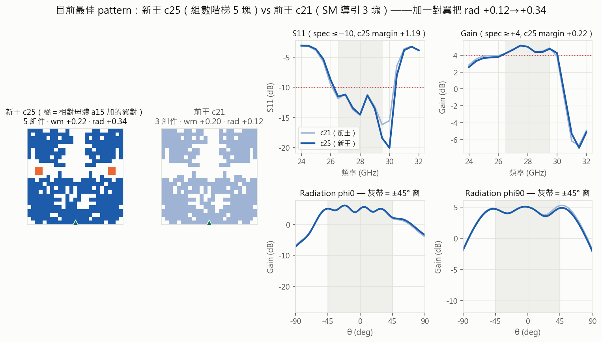

# 冠軍名鑑（certified；最後更新 2026-07-31——**margin 王易主:c48nq1p05_16 +0.79**〔R48,嫁接+爬山兩段式〕;真相源以 records.json 為準）

> **三標**＝帶內（26.5–29.5 GHz）S11 ≤ −10、Gain ≥ +4 ＋ rad ±45°/3dB（雙切面）＋ 可製造（全件 ≥4px、零粉塵）。
> 榜上每筆皆經公證（重複量測一致；量測體系：雜訊地板 ≈0、掃頻擬合誤差 ≈0）。配方全決定性可重現。
> **價值軸（2026-07-12 Ricky 定調）**：三標＝硬閘門，過線後帶內餘裕邊際價值 ≈0，**收益軸＝帶外壓低**
> （字典序：①三標 ②oob_bad 升冪；「永不拿帶內換帶外」不變）。**帶外王＝旗艦頭銜**；
> 可用/製造候選另要求 **wm ≥ +0.15 buffer**（R11：缺陷存活＝margin 函數）。
> **學長池關鍵參照 pattern**（oracle F0／論文圖 4-4 t07_top／我方對稱母本 F2）見 [senior_reference_patterns.md](senior_reference_patterns.md)。

## 現任頭銜

| 頭銜 | id | 數字 | 判準依據 |
|---|---|---|---|
| 👑 **margin 王** | **c48nq1p05_16** | **wm +0.79**／rad +0.20／lo +4.36（公證 3/3 bit 級,2026-07-31 r48n2） | **嫁接+爬山兩段式首王**（R48:B 式嫁接體 gr48_021〔王朝 m42 骨架×c41 左側翼槽引擎,wm−0.15〕當錨,c48nq1 鏈 5 包爬 +0.94;雙空間定位=主流聲孤島形/王朝翼變體款式;前任 m42b1_003 +0.73 在位 5 日）——詳 round-48/records.json |
| 前 margin 王 | m42b1_003_o26b3_022_o2 | wm +0.73／rad +0.01／oob 11.63（公證 2026-07-26 r42n2a） | M 臂樂透嫁接,+0.17 全史最大單跳（R42;血統 o26b3 系） |
| 🌊⬅ **usable_lo 王** | **c41grp2p02_02** | **lo −3.46**（公證 3/3,2026-07-25） | **R41 組算子鏈 grp_grow 第二包破紀錄**（「組=變異單元」定案的直接產物;前任 c8trip03_01 −2.63;左右側拆帳紀錄鍵=oob_gain_max_lo）——詳 round-41/records.json |
| 🏭 **製造首選** | **x00** | wm +0.19／rad +0.19（**缺陷存活 13/18＝72%**） | margin 相近時穩健性優先（R12 bakeoff） |
| 📡 **rad 王** | **o23b1_007** | **rad +1.00**（wm +0.09/oob 10.15,三標;公證 3/3） | 同日二度易主（R23 sel 鍵首批;前任 m5_054 +0.89 在位 13hr;血統 C 臂 k7_004→k8_042→o23b1_007——rad 頭進鍵首批即出 rad 王,非巧合） |
| ⚖ 平衡王 | g16 | wm +0.21／rad +0.49（公證✓） | margin×rad 雙高（R15） |
| 🎯 帶內紀錄 | **m28b3_016** | **wm +0.61**（公證 3/3 bit 級）——rad −0.37 未過＝非三標 | 帶內天花板連五批爬升 0.46→0.49→0.51→0.58→**0.61**（R28b3 M 純隨機臂,k26b1_010 系;前任 s25b1_006_g16 0.58）——（歷史註:此比較基於**當時**的 margin 王 +0.50;現任 margin 王 +0.79 已高於此帶內紀錄） |
| 🛡 rad 備援 | pc18_full | wm +0.09／rad +0.53（c18 全對稱版） | 對稱度=rad 旋鈕的產物（R11） |
| 🌊 **帶外王** | **o6_001_o4_035** | **oob 8.61**（wm +0.00/rad +0.32;三次 8.61-8.63） | o3_058→o4_035→o6_001（O 臂三代;R22 n2 公證易主,前任 o1_035 8.65;地板 ≈8.6 逼近中） |
| 🏆🌊 **左側合格解首例＋可用帶外紀錄** | **c8trip03_01** | **oob 7.78∧lo −2.63**（wm +0.15/rad +0.03;3/3 bit 級） | **左側戰役 36hr 達陣**:全史第一筆 wm≥0.15∧rad≥0∧lo≤−2;帶外一次深 1.19dB;血統=c2rad→c7→c8 tri 鏈系（碎片語言;左右拆帳制+換系統戰略的直接產物,Ricky 定軸）;前任 c3g1p01_24 在位 1 天 |
| 🌊 前任可用帶外 | c3g1p01_24 | oob 8.97（wm +0.20/rad +0.43;公證 3/3 bit 級） | **破 9.0 天花板**（R30 窮舉定案僅限高側構造法——嫁接=第三路:selfgen 錨 a218_00010 反向爬 wm 一步命中;血統 selfgen〔⚠表型仍王朝結構=好錨天然王朝〕;前任 m24b2_015 9.0 在位 10 天〔R36 c3g1 嫁接鏈首包〕） |

## 現任榜（三標全過且公證，按 wm 排序）

| # | id | wm | rad | 組件 | 出身（round） |
|---|---|---|---|---|---|
| -3 | **c48nq1p05_16** | **+0.79** | +0.20 | — | 👑 **現任 margin 王**:嫁接+爬山兩段式（R48;B 式嫁接體 gr48_021 當錨,鏈 5 包爬 +0.94;公證 r48n2 3/3 bit 級） |
| -2 | **m42b1_003_o26b3_022_o2** | **+0.73** | +0.01 | — | 前任 margin 王:M 臂樂透嫁接,+0.17 全史最大單跳（R42;公證 r42n2a 3/3;在位 5 日） |
| -1 | **o29b2_011** | **+0.56** | +0.28 | — | 前前任 margin 王:O 臂 o26b2 系冷支（R29b2;+0.06 大跳三軸均衡;公證 3/3 bit 級） |
| 0 | s28b3_005_a024 | +0.50 | +0.02 | — | 前任:a024 冷支,S 槽鏈臂 d5（R28b3;加壓稅輪冷支出王;公證 3/3;在位 10hr） |
| 1 | m23b4_030 | +0.49 | +0.12 | — | 前任 margin 王:c18 王朝 r3_001 子代,純隨機臂（R23b4;+0.08 巨躍;公證3/3;在位 2 日） |
| 2 | o26b3_022 | +0.44 | +0.01 | — | O 臂 R26b3,o25b1_002 系（原測 +0.53 雙穩態,重測 ×2 定 +0.44——公證制度第 4 攔） |
| 3 | k23b1_021 | +0.41 | +0.11 | — | cc_r9s2→g1 填空池→C 冷支臂（R23b1;前任 margin 王,在位 1 日） |
| 3 | r2_016 | +0.39 | +0.09 | — | c18 王朝:c18→vg0338→r2_016（每代 1px;R20） |
| 3 | r3_001 | +0.36 | +0.27 | — | r2_016 再 1px＝全能型（rad/oob 均優） |
| 4 | a024 | +0.35 | +0.12 | 6 | R16 收益圖唯一正點（前前任） |
| 5 | vg0765_a024 | +0.31 | +0.25 | — | R19 vargen（兩次一致;同批 vg0258=雙穩態案例 0.20 定） |
| 6 | i02 | +0.29 | +0.21 | 6 | R15 知情臂 |
| 7 | c25 | +0.22 | +0.34 | 5 | R11 組數階梯＝a15＋翼對（Ricky 提議） |
| 8 | g16 | +0.21 | +0.49 | 7 | R15 GA 臂＝c21＋三塊 |
| 9 | c21_sm | +0.20 | +0.12 | 3 | R10 SM 導引（原旗艦） |
| 10 | **x00** | +0.19 | +0.19 | 3 | 🏭 製造首選:R11 wide X 臂＝c21 翻 2px（破對稱） |
| 11 | a00_k2 | +0.15 | +0.13 | 3 | R10 盲掃 |
| 12 | m5_054_m3_026 | +0.14 | +0.89 | — | R21 b5 樂透（g1_038 系;前 rad 王,在位 13hr） |
| 13 | b11_k2 | +0.13 | +0.22 | 3 | R10 知情編輯 |
| 14 | **o23b1_007** | +0.09 | **+1.00** | — | 📡 rad 王:C 臂 k7_004→k8_042 系（R23） |
| 15 | pc18_full | +0.09 | +0.53 | 3 | R11 全對稱探針 |
| 16-18 | c10/c18/c17_sm | +0.07 | +0.10~0.35 | 3 | R10 SM 導引 |
| 19 | a15_k4 | +0.03 | +0.56 | 3 | R10 盲掃（前前 rad 王） |
| 20 | a11_k2 | +0.01 | +0.24 | 3 | R10 盲掃 |
| 21 | **o6_001** | +0.00 | +0.32 | — | 🌊 帶外王 oob 8.61:o3_058 礦脈三代（R22;wm 壓線＝刀鋒王） |

（互異三標過解累計 280+；上表僅列公證過的代表。R19 公證定案:cc_c25_r6s2_r9s3 **+0.36 為真但 rad −0.22＝非三標**
（帶內榜第 2,次於 g14）、cc_x00 與 cc_r9s2 見榜。**新單次待公證**:vg0338_c18 帶外 8.84（挑戰 9.04 紀錄）、
vg0258_c25 +0.32/+0.34/9.64、vg0765_a024 +0.31——R20 搭載。）

### 帶外榜（三標內,oob_bad 升冪;R17/R18 帶外戰役定案:地板 ≈9.0）
| # | id | oob | wm | rad | 公證 |
|---|---|---|---|---|---|
| 1 | **o6_001_o4_035** | **8.61** | +0.00 | +0.32 | R22 n2 公證 2/2＋b1 原次（o3_058 礦脈三代:o3_058→o4_035→o6_001） |
| 2 | o1_035_vg0396 | 8.65 | +0.04 | +0.40 | R21 batch2 公證 2/2＋batch1 原次（c18 王朝三代;前帶外王） |
| 2 | vg0338_c18 | 8.84 | +0.05 | +0.36 | R20 公證三次一致（前帶外王） |
| 2 | vg0396_c18 | 8.94 | +0.05 | +0.25 | 兩次一致（c18＋2×2 塊）——c18 鄰域＝帶外富礦 |
| — | **c3g1p01_24** | **8.97** | **+0.20** | +0.43 | R36 n1 3/3 bit 級 ✓——🌊🏭 可用帶外紀錄（嫁接鏈;前任 m24b2_015 9.0） |
| — | m24b2_015 | 9.0 | +0.15 | +0.46 | R24 n2 3/3 ✓——前紀錄（在位 10 天） |
| 3 | c18_sm | 9.04 | +0.07 | +0.32 | 跨店雙響應 ✓（前帶外王） |
| — | cc_x00_r5s2_r8s3 | 9.82 | **+0.21** | +0.03 | R19 2/2 ✓——「wm≥0.2 且帶外<10」平衡最佳 |
| 2 | x20_a00k8 | 9.15 | +0.08 | +0.31 | R18 ✓ |
| 3 | vb43_a1_d0 | 9.24 | +0.06 | +0.35 | R18 2/2 ✓ |
| 4 | vpc18_f_d2 | 9.54 | +0.07 | +0.22 | R18 2/2 ✓ |
低側（24-25.5）雙判死＝三標內不可壓（詳 decisions 2026-07-09;非三標的 oob 極值:lw_t11_s10 6.84,wm −24.6）。

## 歷史對比圖：i02 vs c25（R15 換王當時;**（R15 時代註）當時 margin 王＝r2_016**,rad 王對比圖見 round-22 assets）



i02＝在 c25 上加**一個中央塊（8px）**→ 6 組件、wm +0.22→+0.29（S11 餘裕 +1.41 全場最寬）。
血統三代都是「組件級加塊」：a15（3 塊）→ c25（＋翼對＝5 塊）→ i02（＋中央塊＝6 塊）。
圖：`script/figs/report_newking.py`（決定性可重跑）。

## 頭銜判準說明（工程上誰該被選）

- **送製造 → x00**：R12 bakeoff（缺陷 k1×18 統計級）定案 x00 存活 72% ＞ c25 56% ＞ c21 28%。
  教訓：margin 相近時**穩健性才是製造判準**（x00＝c21 翻 2px，穩健 28%→72%）；i02 缺陷 3/4 方向好但樣本小，
  要搶製造首選需補 bakeoff 級樣本。
- **展示／論文主圖 → i02**（margin 王）；**帶內天花板論證 → g14**（+0.40 為真但 rad 未過＝三標張力的實測上界）。

## 血統（完整可追溯鏈）

```
學長 24k 池 → 跨家族普查(R9) → F2 錨點(−0.01,碎片雲)
  → 10-5-10 對稱化 = s05 (−0.29)              [R9 破紀錄]
  → 翻8px＋再對稱化 = w17 (−0.06)              [R10 前任]
  → 三臂精修 = 八冠軍 (+0.01~+0.20)             [R10]
  → 組數階梯加翼對 = c25 (+0.22)                [R11,Ricky]
  → 組件空間＋中央塊 = i02 (+0.29)              [R15]
  → 添加收益圖唯一正點 3×3@r9c11 = a024 (+0.35)  [R16 出土,R17 公證]
  → c18 王朝三連代（每代翻 1px）= vg0338(帶外 8.84)→r2_016(+0.39)→r3_001(全能) [R19-R20 現任]
```
每步算子＋seed 在對應 round 檔。第一代 gallery：`log/assets/round-10/champions8_gallery.png`；
血統圖：`log/assets/round-10/w17_lineage.png`。

## 結構定律（為什麼是這個長相；證據見 round-13/14/15）

- **設計語言**：下主件（匹配底座，尺寸鎖定 235-250px）＋雙翼（帶內引擎 ~6dB，刀鋒敏感 73-83px）＋小塊
  （rad/選擇性旋鈕，甜蜜點 4-6 塊）。
- **三標張力載體＝翼**：翼買帶內、付 rad＋帶外（消融＋理論模板 0 翼端點連成完整曲線）。
- **w17 家族特殊性**（R12）：非 w17 池家族深掘全敗——24k 池內唯一可製造達標區。
- 尺寸分布：不均度對三標全面有害；金屬分給翼勝過堆主件（analysis-02，相關性級）。
- **學長碎片族結構定律（R27 因果級,2026-07-14）**：圖 4-4 家族=「骨架＋網布」雙層——塊內粉塵=自由度
  （可實心化,電性不掉）;塊間網布=**逐像素承載本體**（重抽/重排即崩 6-13 dB）;低側選擇性住網布。
  電性半成品:p00 half +0.42/t07 half +0.35/n09 half +0.20（wm+低側達標,全卡 rad——R28 手術病人）。

## 驗證譜系與公差

- 公證制度：紀錄級一律重複量測（+0.48 假象教訓）；R12 crown 起 12 候選公證**零假象**＝制度成熟。
- 掃頻交叉驗證 9/9 逐位同、跨機 bit 級一致（41 次）。
- 公差：整面 erode/dilate 1px 全滅（極端應力）；局部缺陷存活＝margin×位置函數（bakeoff 見上）。

## 侷限與進行中

- 全部結論在現行 HFSS 設定內；真 ground truth＝實作量測（**x00 為首選送測候選**）。
- 全員 w17 家族（特殊性已證、非疏漏）；帶外三標地板 ≈9.0 已定案（低側雙判死,decisions 2026-07-09）。
- 帶外戰役已定案（R17/R18）:三標內帶外地板 ≈9.0;帶外回歸 tiebreak。進行中:R19 模型線（SM v5+GA）籌備。

---
證據索引：round-10/11/12/13/14/15 檔＋reports · 規則：[design_priors.md](design_priors.md) ·
區調整指南：`report/assets/region_guide.png` · 成果報告：`report/progress-r{1-r10,11-r14}.md`
