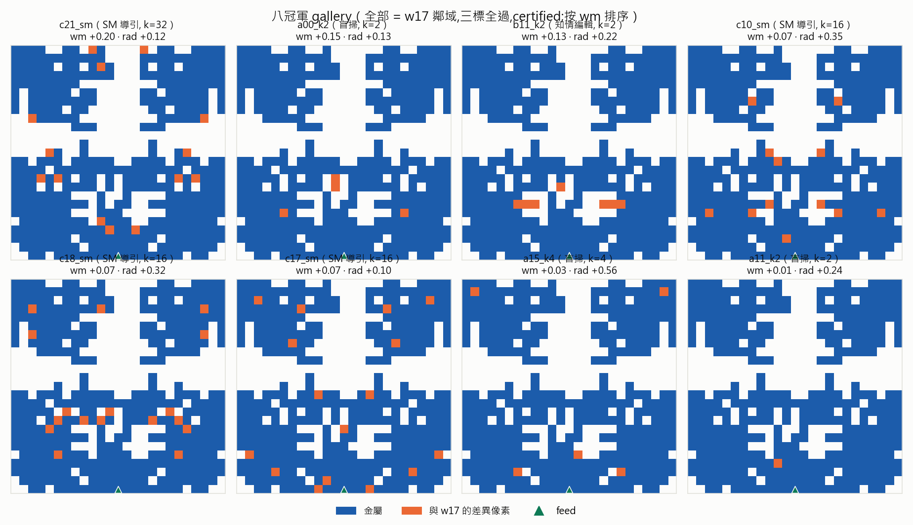
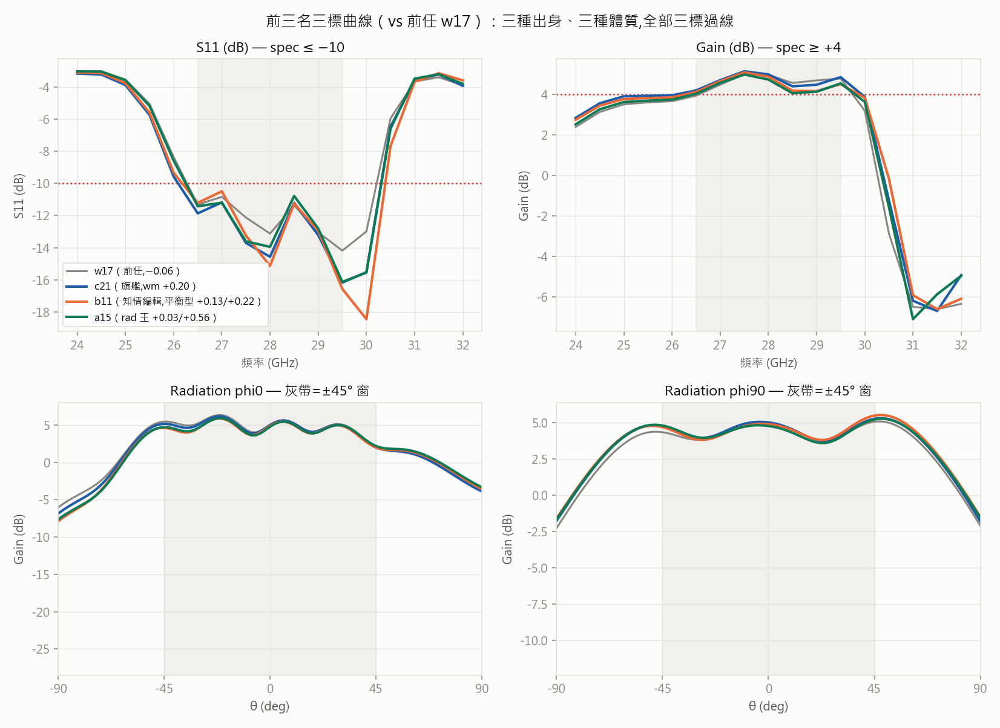

# 冠軍名鑑 — 八個三標全過的可製造 pattern（certified，2026-07-07）

> 專案第一批**正式冠軍**：S11＋Gain＋rad±45°＋可製造，四關全過。每筆都通過完整驗證譜系
> （見下），margin 值可直接引用。配方全決定性——每個冠軍可用一行指令從錨點重現。
> 規格：帶內（26.5–29.5 GHz）S11 ≤ −10、Gain ≥ +4；rad ±45°/3dB（phi0＋phi90 雙切面）；
> 可製造＝全件 ≥4px、零粉塵。量測體系：雜訊地板 ≈0、掃頻擬合誤差 ≈0（round-09/10 公證）。

## 榜單（按 wm 排序；margin 單位 dB，皆為正＝過線餘裕）

| # | id | wm | S11 | Gain | rad phi0 | rad phi90 | 出身 | 配方（錨點 w17 + …） |
|---|---|---|---|---|---|---|---|---|
| 🥇 | **c25** | **+0.22** | +1.19 | +0.22 | +0.34 | — | **組數階梯（5塊）** | a15 翼對加塊（R11 ref3）＋10-5-10 對稱化——**新王,公證✓** |
| 🥈 | c21_sm | +0.20 | +1.18 | +0.20 | +0.12 | +1.73 | SM 導引 | 翻 32px（seed 7489）＋10-5-10 再對稱化——**穩健王(缺陷存活 50%)** |
| 🥈 | a00_k2 | +0.15 | +0.99 | +0.15 | +0.13 | +1.62 | 盲掃 | 翻 2px（seed 6000）＋再對稱化 |
| 🥉 | b11_k2 | +0.13 | +0.49 | +0.13 | **+0.22** | **+1.91** | **知情編輯** | 承重圖低成本區翻 2px（seed 6059） |
| 4 | c10_sm | +0.07 | +0.85 | +0.07 | +0.35 | +1.73 | SM 導引 | 翻 16px（seed 7344） |
| 5 | c18_sm | +0.07 | +1.10 | +0.07 | +0.32 | +1.87 | SM 導引 | 翻 16px（seed 7430） |
| 6 | c17_sm | +0.07 | +0.60 | +0.07 | +0.10 | +1.75 | SM 導引 | 翻 16px（seed 7375） |
| 7 | **a15_k4** | +0.03 | +0.78 | +0.03 | **+0.56** | +1.83 | 盲掃 | 翻 4px（seed 6015）——**rad 王** |
| 8 | a11_k2 | +0.01 | +0.65 | +0.01 | +0.24 | +1.77 | 盲掃 | 翻 2px（seed 6011） |

> **2026-07-08 製造冠軍定案（R12 bakeoff,缺陷 k1×18）**：**送製造首選＝x00**（c21 翻 2px 變體,wm +0.19/rad +0.19,
> 公證✓）——**缺陷存活 13/18=72%,遠勝 c25(56%)與 c21(28%)**,缺陷後最壞僅 −0.44。教訓:2px 之差改變穩健性甚鉅
> （x00 剛好避開 c21 的脆弱邊緣像素）→ **margin 相近時穩健性才是製造判準**。c25 仍是 margin/rad 王(展示用)。
>
> **2026-07-08 更新（R11/R12）**：新王 **c25 wm +0.22**（S11 +1.19 全場最寬、rad +0.34），出身=你的**組數階梯 5 塊翼對**
> ——首個「加塊」冠軍,證明離開 3 塊構型也能過三標。另收 **pc18_full**（八冠軍 c18 全對稱版,wm +0.09/rad +0.53）
> =rad 保單。**送製造首選看穩健性不看 margin**（見上方 bakeoff：18 樣本定案 x00 72% > c25 56% > c21 28%,
> 早期 tol 小樣本高估了 c21）。**第二山頭裁決（R12 family2）：非 w17 家族 F0/F1/F4/F6 深掘全敗**
> （最佳 F6 clean wm −1.45,距 spec 遠）→ **w17/F2 家族特殊性確立**,可製造三標解只住這一片高原。

共同體質（原八冠軍）：**全部 3 個組件、零粉塵、主件 240-250px、金屬 391-404px**——同一種「10-5-10 對稱、
下主體＋上雙翼」的構型（w17 家族）。短板一致是 **Gain 帶緣**（wm＝Gain margin，全員如此）；
S11 餘裕最寬（+0.49~+1.18）、rad phi90 全員 >1.6（phi0 是 rad 的緊邊）。

## 目前最佳：新王 c25 vs 前王 c21


c25＝在 a15（3 塊 rad 王）上用**組數階梯加一對翼**（橘）＋10-5-10 對稱化 → 5 組件、wm +0.20→+0.22、
**rad +0.12→+0.34**。帶內 S11/Gain 與 c21 幾乎重疊（c25 略勝），rad phi90 邊緣抬高＝多的翼對買到的覆蓋餘裕。
圖:`script/figs/report_newking.py`（決定性可重跑）。

## Gallery（橘＝與前任 w17 的差異像素）



肉眼可讀的訊息：八個冠軍都是 w17 的**小步保對稱變體**（差異像素 2-32 個、鏡射成對）——w17 高地
是一整片高原，不是孤峰。三種出身（盲掃／知情編輯／SM 導引）都在這片高原上找到過線點，
其中 SM 導引佔 4 席＝重錨後導航儀的直接戰績（它敢挑 k=16-32 的遠鄰居而且挑得準）。

## 前三名三標曲線（灰＝前任 w17）



- **c21（旗艦）**：S11 帶內全程 −11 以下（margin +1.18 全場最寬）、Gain 帶緣站上 4.20。
- **b11（平衡型）**：rad 兩切面全場最佳（+0.22／+1.91）＝知情編輯「避開承重區」的設計意圖兌現。
- **a15（rad 王）**：phi0 +0.56 遙遙領先，wm +0.03 貼線——如果 rad 規格日後收緊，它是保單。

## 驗證譜系（每筆冠軍都走完全程）

| 驗證維度 | 方法 | 結果 |
|---|---|---|
| 批次脈絡 ① | ref2 過夜批（37,舊萃取碼,122 筆中段） | 值與②一致 |
| 批次脈絡 ②＋修復版萃取 | ref2v 重驗批（37,`align_curve` 後） | 10/11 與①逐位同（唯一崩的 b20 被淘汰） |
| 掃頻硬解＋跨機 | champ_disc（218,`--sweep Discrete` 17 點逐點） | **8/8 與②逐位同** |
| 量測地基 | 雜訊地板 ≈0（41 次跨機公證）＋掃頻擬合誤差 ≈0 | round-09 §4 附錄／round-10 §4 |

對照教訓：前任 w17 曾以「+0.48 單次量測」被誤封三標全過,後被公證翻案（萃取 bug,已修）——
本批八筆正是在那次教訓建立的鐵則（**紀錄級結論一律多維驗證後才算數**）下產生的。

## 血統（完整可追溯鏈）

```
學長 24k 池 → 跨家族普查(R9) → F2 錨點(−0.01,碎片雲)
  → 10-5-10 對稱化 = s05 (−0.29)          [R9 破紀錄]
  → 翻8px+再對稱化 = w17 (−0.06)          [R10 ref1,前任]
  → 三臂並發精修 = 八冠軍 (+0.01~+0.20)    [R10 ref2,本批]
```
每步的算子與 seed 都在對應 round 檔;血統圖見 `log/assets/round-10/w17_lineage.png`。

## Pattern 本體與重現

- **8 冠軍 25×25 純文字**：[`log/assets/round-10/champions8_patterns.txt`](log/assets/round-10/champions8_patterns.txt)
  （repo 內零依賴可讀）;原始 .pt 在 NAS `dedust_r`（ref2 輸入夾）。
- **重現任一冠軍**：`dedust_ref1_input/w17_k8.pt` 為錨點 → A/B 臂＝`symmetrize(perturb_repair(w17, k, seed), 10)`
  （B 臂的 perturb 換 `perturb_blocks(..., blocks=[[0,1],[0,2],[3,1],[3,2]])`）；C 臂＝同 A 生成後由
  `sm_reanchor.pth` 排序選中。批次驗證：`python -m script.dedust report --input dedust_ref2v_input --store dedust_ref2v`。

## 侷限與進行中

- **公差掃描（R11 tol + R12 bakeoff）**：整面 erode/dilate 1px 三員全滅（極端應力測試）;局部邊緣缺陷存活率
  =margin 的函數。**製造冠軍定案（bakeoff 缺陷 k1×18,大樣本）：x00 72% > c25 56% > c21 28%**——早期 tol 小樣本
  高估 c21;2px 之差（x00=c21 翻 2px）可讓穩健性 28%→72%（避開脆弱邊緣像素）。災難崩=缺陷踩承重邊緣（與承重圖同構）。
- 全部結論在現行 HFSS 設定內；真 ground truth＝實作量測。
- 八筆同族（w17 高原）——多樣性不足是已知取捨;跨家族的第二座山頭（F3/g24 線）留待後續。

---
證據索引：[round-10](log/round-10-refine-attribution.md)＋[report](log/round-10-report.md) ·
規則背景：[design_priors.md](design_priors.md) · 期望基準：[round-06](log/round-06-offline-expected-best.md)
