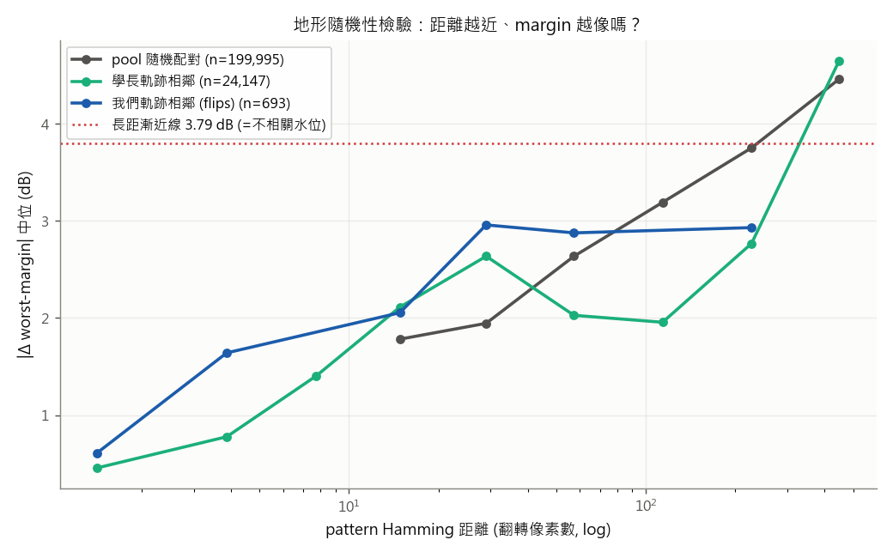
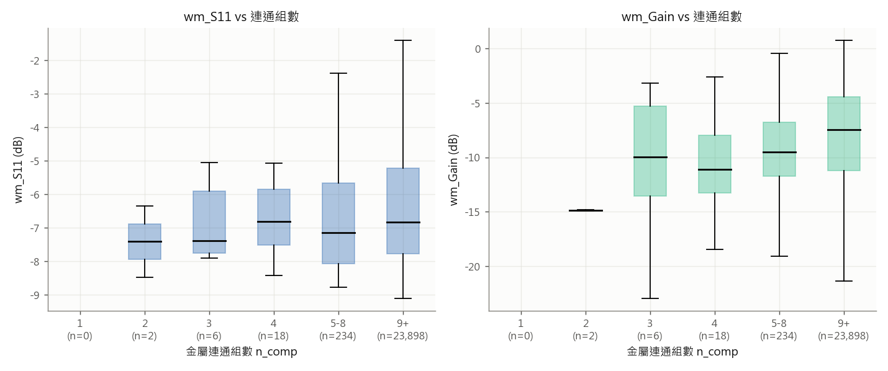
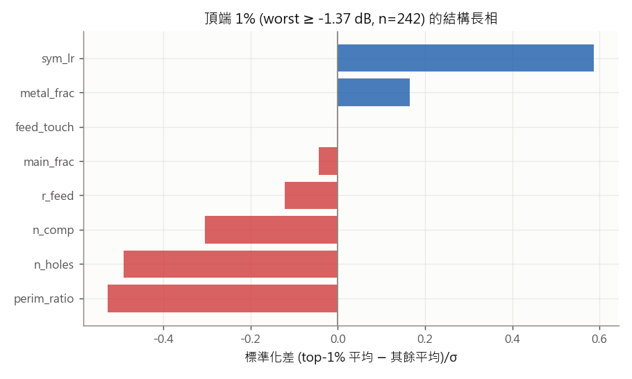
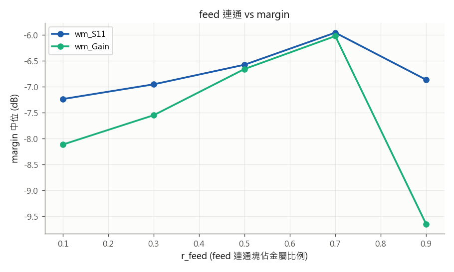
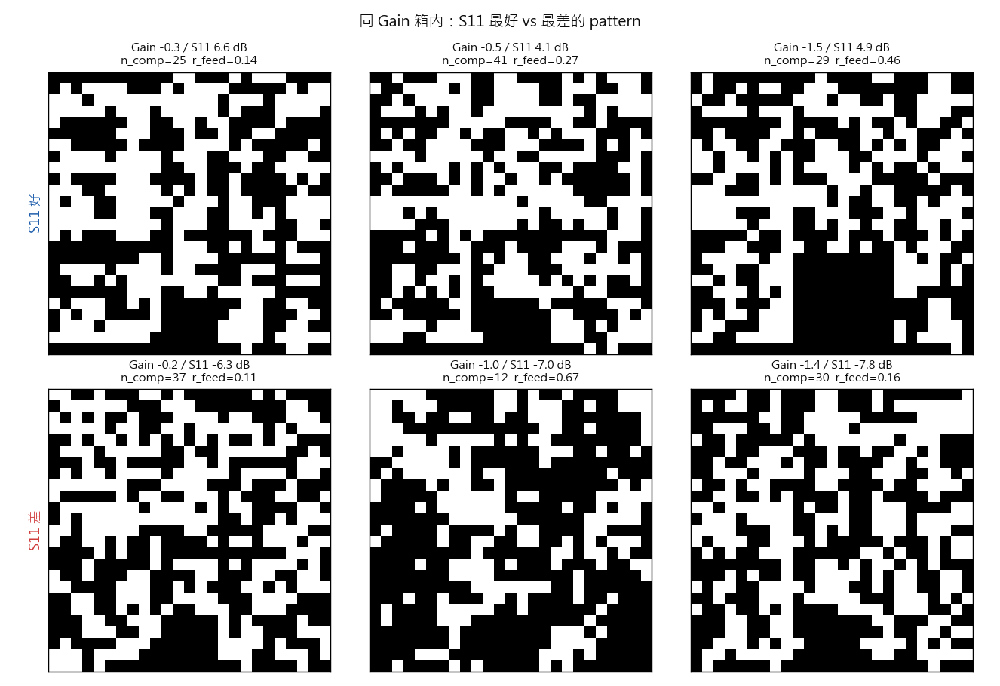

# Analysis 01 — pattern 解剖：地形隨機性 × S11/Gain 結構歸因

- **系列**: 離線分析（analysis-NN，**不佔 round**——慣例 2026-07-03：round 只給燒 HFSS 的實驗）
- **狀態**: archived（2026-07-03 當日完成；零 HFSS）
- **一句話問題**: (A) 學長「找 pattern 很隨機、成功靠運氣」的論點成不成立？(B/C) 相似 Gain/S11 的 pattern 在結構上差在哪——是不是差在「連成一塊算一組」的組數（Ricky 假設）？
- **一句話結論**: **(A) 地形不是抽獎**——翻 1-2 像素時 |Δwm| 只有不相關水位的 12-16%（0.46-0.61 vs 3.79 dB），局部結構強、引導式搜尋有依據，但相關長度 ~數十翻轉、躍遷（R4 的 -2.89@154）仍屬機率事件；**(B/C) Ricky 的組數假設在配對檢驗下成立且方向明確**——同 Gain 之下 S11 好的 pattern **組數少 9.5 組、feed 連通高 0.21、更整塊**；反向同 S11 之下 Gain 好的 pattern **洞少 5 個**（組數反而略多）。S11 與 Gain 吃的結構不一樣：**S11 ← 少組＋feed 連通（共振體完整）；Gain ← 少洞（口徑乾淨）；共同敵人＝細碎度**。
- **指向**: 工具 `script/pattern_anatomy.py` · 圖 `assets/analysis-01/` · 快取 `tmp/pattern_anatomy/`（可重建，collect ~15 分）· 資料＝harvest 池 24,189 筆＋學長 41 條軌跡（唯讀）＋我們 R4/R5 csv

## 1. 假設

- **A（學長運氣論點）**: 若「pattern 距離近 ⇏ margin 像」（variogram 全平），搜尋確實≈抽獎；若短距 |Δmargin| 顯著低於長距漸近線，地形有局部結構、引導式搜尋有依據。
- **B/C（Ricky 結構假設）**: 相似 Gain 但 S11 不同的 pattern，差異可能在「連通組數」等結構特徵。
- 特徵定義（4-連通十字，對齊 `FeedReachability`）: `n_comp` 金屬組數 / `main_frac` 最大組佔比 / `r_feed` feed 連通塊佔比 / `metal_frac` / `sym_lr` 左右鏡射一致率 / `perim_ratio` 邊界長÷金屬數（細碎度）/ `n_holes` 被金屬包住的介質組數 / `feed_touch`。

## 2. 結果

### A. 地形隨機性（variogram）——|Δ worst-margin| 中位 vs Hamming 距離

| Hamming 距離 | pool 隨機配對 | 學長軌跡相鄰 | 我們軌跡相鄰 (flips) |
|---|---|---|---|
| 1-2 | — | **0.46** (n=3,248) | **0.61** (n=48) |
| 3-5 | — | 0.78 (n=4,769) | 1.64 (n=49) |
| 6-10 | — | 1.40 (n=5,478) | — |
| 11-20 | 1.78 (n=107) | 2.11 (n=4,386) | 2.05 (n=119) |
| 21-40 | 1.95 (n=423) | 2.64 (n=2,522) | 2.96 (n=244) |
| 41-80 | 2.64 (n=928) | 2.03 (n=1,212) | 2.88 (n=72) |
| 81-160 | 3.19 (n=3,081) | 1.96 (n=1,142) | — |
| 161-320 | 3.75 (n=180,768) | 2.77 (n=1,170) | 2.93 (n=120) |
| 321-625 | 4.46 (n=14,655) | 4.65 (n=220) | — |

- **長距漸近線（=不相關水位）3.79 dB**；翻 1-2 像素只造成 0.46-0.61 dB（**12-16%**）→ 地形局部平滑、非抽獎。
- 相關性隨距離衰減：~20 翻轉時已到漸近線的 ~55%、~百餘翻轉後幾乎不相關 → **局部引導有效半徑約數十翻轉**；跨區大跳（R4 E 臂 ping-pong 的 ~300 翻轉）落在不相關區＝等同重抽。
- 學長軌跡在 d=81-160 仍只有 1.96（低於 pool 隨機同距的 3.19）→ 他的 run 內樣本聚在同一價值區（run 級聚集效應）。
- 

### B. 結構特徵 × margin（Spearman ρ，池 n=24,189）

| 特徵 | ρ(wm_S11) | ρ(wm_Gain) | ρ(worst) | 分層ρ(S11)* |
|---|---|---|---|---|
| n_comp | **-0.24** | -0.13 | -0.15 | -0.22 |
| main_frac | +0.15 | +0.04 | +0.06 | +0.15 |
| r_feed | **+0.16** | +0.04 | +0.06 | +0.14 |
| metal_frac | +0.11 | -0.01 | +0.01 | -0.00 |
| sym_lr | +0.16 | +0.18 | +0.18 | +0.13 |
| perim_ratio | **-0.31** | **-0.25** | -0.26 | -0.32 |
| n_holes | -0.17 | **-0.29** | -0.28 | -0.21 |
| feed_touch | （池內恆為 1——管線強制 feed 為金屬，無變異） | | | |

*分層ρ＝metal_frac 五分位層內的 ρ(特徵, wm_S11) 中位——控制「特徵天然隨金屬比例動」的混淆（metal_frac 本身分層後歸零＝它是混淆因子非因子）。

- **S11 專屬因子**: `r_feed`/`main_frac`（+0.15 級,對 Gain 幾乎為零）＋ `n_comp`（S11 -0.24 vs Gain -0.13）→ 共振體要「整塊且連著饋電」。
- **Gain 偏向因子**: `n_holes`（-0.29 vs S11 -0.17）→ 輻射口徑不要破洞。
- **共同敵人**: `perim_ratio` 細碎度（雙邊最強 -0.31/-0.25）；**共同朋友**: `sym_lr` 對稱（+0.16/+0.18，支持 ONGOING 的 10-5-10 部分對稱候選）。
- ⚠ 池的 n_comp 中位＝35（碎 pattern 主導，n_comp≤8 只佔 ~1%）→ 邊際分箱表（`ncomp_box.png`）在低組數區樣本極少、且與 metal_frac 混淆，**判讀以下面的配對檢驗為準**。
-   

### C. 配對對比（控制一個 margin、比另一個）——Ricky 假設的直接檢驗

**Gain 同箱（0.5dB）內、S11 前/後十分位差 ≥3dB 的 26 個箱**（Δ＝S11 好 − S11 差，跨箱中位）：

| 特徵 | Δ | 讀法 |
|---|---|---|
| **n_comp** | **-9.5** | 同 Gain 之下，S11 好的 pattern **少 9.5 個組**——假設命中 |
| r_feed | +0.21 | feed 連通塊多佔 21% 金屬 |
| main_frac | +0.15 | 更整塊 |
| perim_ratio | -0.13 | 更不細碎 |
| n_holes | +2.0 | 洞略多（S11 不忌洞） |

**S11 同箱、Gain 前/後十分位差 ≥3dB 的 21 個箱**（Δ＝Gain 好 − Gain 差）：

| 特徵 | Δ | 讀法 |
|---|---|---|
| **n_holes** | **-5.0** | 同 S11 之下，Gain 好的 pattern **少 5 個洞** |
| n_comp | +3.5 | 組數反而略多（Gain 不忌散塊、可能寄生輻射有利） |
| r_feed | -0.13 | feed 連通對 Gain 無益（略負） |

- 

## 3. 結論

1. **學長運氣論點：局部錯、全域對。** 翻幾個像素的效果高度可預測（12-16% 水位）→ SM 引導在局部有真實依據，「搜尋=抽獎」不成立；但有效半徑僅數十翻轉，**跨區大跳確實≈重抽**——R4 E+D 的 -2.89 躍遷屬於後者，所以「進步靠躍遷=靠機率」在全域尺度是對的。兩人各對一半：**引導負責局部開採、機率負責跨區發現**——這正是「提高躍遷率」與「信任域開採」該分工的原因。
2. **S11 與 Gain 的結構配方不同**（Ricky 假設證實＋細化）：S11 ← 組數少＋feed 連通＋整塊；Gain ← 洞少（組數無妨）；共同敵人＝細碎度、共同朋友＝對稱。這解釋了 R3-D 的謎：sigmoid 連通先驗把 r_feed 拉到 0.95 →「S11 側的結構」對了，但它不管洞和細碎 → Gain 沒起色 → worst_margin（=min 兩者）被 Gain 卡住。
3. **可操作含義**: 結構先驗要「分工」——連通/整塊先驗服務 S11、**去洞/平滑先驗服務 Gain**（現有 island_suppression 與 tv loss 剛好對應,但從未以「服務 Gain」的視角調權重）；對稱先驗雙邊有利（10-5-10 候選 +1 佐證）。

## 4. 侷限（誠實條款）

1. 軌跡相鄰對是**搜尋選出來的移動**、非隨機鄰居——A 的短距平滑度可能略被高估（但學長與我們兩個獨立來源一致，方向穩）。
2. margin 用學長當年 HFSS response 重算（同 round-06 的侷限：oracle/margin 未經現在的 HFSS 重模擬驗證）；相關性結論吃的是排序、對重模擬噪聲較穩健。
3. Spearman 是單變量關聯、特徵彼此相關（n_comp×perim_ratio×n_holes 都是「碎」的面向）；配對檢驗（C）控制了目標 margin 但沒控制特徵間相關——「哪個是根因」需要之後的介入實驗（改 generator 先驗直接測）。
4. 池以碎 pattern 為主（n_comp 中位 35）——「整塊區」的統計外插到 sigmoid 型 pattern 時樣本薄。

## 5. 指向 / 促成

- 促成候選（ONGOING 🔜）: **「去洞/平滑先驗服務 Gain」**——island_suppression/tv 權重以 Gain 視角重審（觸發：R5 收檔判讀時一起看）；對稱 10-5-10 候選 +1 佐證。
- memory: [[project_benchmark_vs_random]] · [[project_generator_hyperfeature_pivot]]（sigmoid 只解 S11 側的結構之謎）
- 工具可重複: `python -m script.pattern_anatomy collect-pool|collect-trajs|report`。
