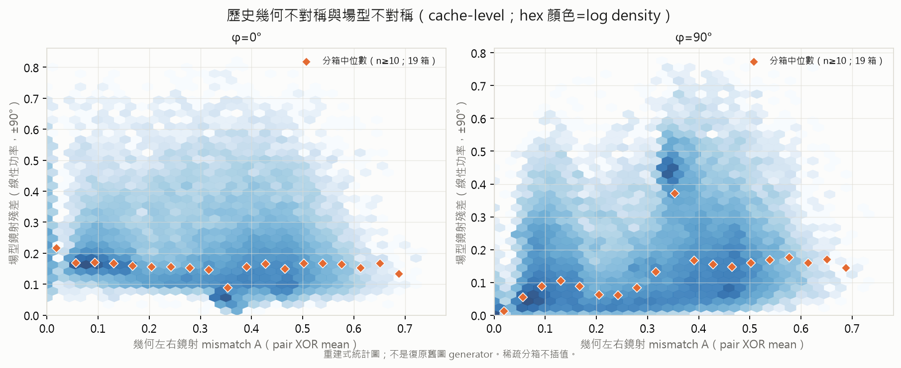
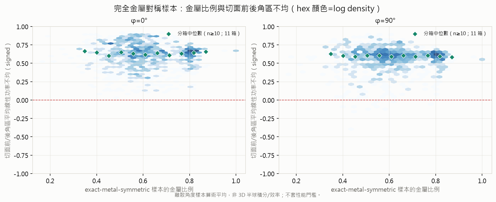
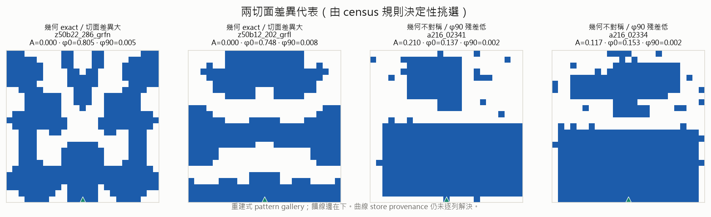

# analysis-18 — 歷史金屬鏡射與場型對稱盤點（零 HFSS）

- **狀態**：concluded（2026-10-07）
- **一句話**：2026-08-10 browser snapshot 中，39,111 張 pattern 有 1,030 張完全左右金屬對稱；有 rad 的
  1,021 張 exact 樣本在對應的 φ90 切面呈低鏡射殘差（±90°線性功率殘差中位 0.012、P90 0.051），
  但 φ0 中位 0.222——這是切面座標關係，不是「金屬對稱卻違反物理」；本盤點支持收集天然 exact-metal
  樣本與場型關係，**不把 R55 事後鏡射的性能下降重述成對稱假說失敗**。
- **產物**：[逐列資料（gzip CSV）](assets/analysis-18/symmetry_census.csv.gz) ·
  [摘要與 provenance JSON](assets/analysis-18/symmetry_census_summary.json) ·
  [幾何×場型](assets/analysis-18/geometry_vs_field_symmetry.png) ·
  [exact 金屬比例×切面前後角區](assets/analysis-18/exact_symmetry_metal_frontback.png) ·
  [兩切面代表](assets/analysis-18/symmetry_counterexamples.png)

## 0. Scope、來源與限制

這是**既有 cache 的描述性普查**，沒有跑 HFSS、沒有產生新 gain/S11/rad 值，也沒有用任何性能門檻篩樣本。
輸入是 `application/pattern_browser/data/` 的 `patterns.npz`、`meta.json`、`resp.npz`、`rad.npz`、
`variant_resp.json`、`curve_state.json`。檔案實際 mtime 為 **2026-08-10 17:02–17:39（台北）**；
`curve_state` 記錄 746 店，店快照範圍 2026-07-03 22:43 至 2026-08-10 17:11。故本文只稱它
「2026-08-10 browser snapshot」，**不稱全部最新歷史**。六檔 SHA-256、大小與時間均在摘要 JSON。

三份 NPZ 的 39,111 個 id 與 meta id 逐列完全相同且唯一，故 pattern/resp/rad 可依 **cache index**
配對；這只證明 cache 內索引契約，**不等於同 geometry/store 的 raw 來源已獲證明**。producer 的增量流程會把
舊曲線依 bare id 回填；若 first-seen store 後來改變，曲線未必重讀。
因此 `meta.store` 只保留為**指標來源候選**，不可宣稱是該列 curve 的真 store。逐列 CSV 明列
`pattern_source_folder`、`metric_store`、`curve_provenance=cache_id_aligned_store_unresolved`、pattern SHA-256，
不以 bare id 去另一店補值。本次最終產物沒有 raw `.pt` spot check；為維持低負載，沒有把代表列核對外推成全體證明。

備份只讀工作限於 cache 點名的 674 個 store 對應 `hfss_setup.json` / `manifest.json`：675 個 JSON、
共 13,052,164 bytes；沒有掃 backup 的 `.pt`、rad 或全部 store。候選量測分層為：

| `meta.store` 候選分層 | 列數 | 可解讀範圍 |
|---|---:|---|
| standard / legacy unspecified | 36,071 | 沒有顯式 bridge/mesh 儀器欄；不可當單一同質設定 |
| unmeasured / unindexed | 3,033 | cache 沒有 metric store |
| meshconv + solver profile `db037376` | 7 | 可保留成獨立候選層，不與主層取最好 |

主索引沒有可逐列證明的 bridge-width curve 層；這是**涵蓋缺口**，不是「bridge 無效」。因此本文不做
bridge/mesh 效果比較、不跨設定取最佳，也不從既有數字推因果。

## 1. 定義與涵蓋

- 幾何鏡射 `A`：25×25 金屬圖左右 25×12 對的 XOR mean；中心欄不與自己重複計數。
- 分類：完全對稱 `A=0`；近對稱 `0<A≤0.1`；非對稱 `A>0.1`。
- 場型鏡射殘差：原始 28 GHz φ0/φ90 曲線先轉線性功率，分 ±45°、±90° 算
  `Σ|P(+θ)-P(-θ)| / Σ(P(+θ)+P(-θ))`；另存 dB pair MAE。
- 主瓣方向：在正面 ±90° 中，以 peak−3 dB 樣本的線性功率質心計算；argmax 只留診斷欄。
- 前後不均：φ0、φ90 兩條主切面各自把 θ 的前角區（|θ|≤90°）與後角區（|θ|>90°）做離散樣本
  算術平均，再算 `(front-back)/(front+back)`；這**不是 3D 半球積分總輻射功率，也不是效率**。
- 結構欄另含 metal fraction、上下半金屬比例差、`n8`；響應欄含 28 GHz 及 26.5–29.5 GHz 帶內
  gain/S11 描述量，**未依它們刪列或過閘**。

| 涵蓋 | 全部 | 有 response | 有 rad |
|---|---:|---:|---:|
| 全列 | 39,111 | 35,998 | 35,995 |
| exact | 1,030 | 1,021 | 1,021 |
| near | 6,510 | 6,430 | 6,426 |
| asymmetric | 31,571 | 28,547 | 28,548 |

缺 metric store 3,033；缺 response 3,113；缺 rad 3,116；兩者都缺 3,112；候選量測 profile 未解 3,041。

## 2. 幾何鏡射與兩個場型切面



圖是本次 CSV 的**重建式統計圖**，不是復原舊圖 generator；hex 顏色是 log density，橘菱形只畫
樣本數 ≥10 的分箱中位數，稀疏區不插值。

| 幾何類 | rad n | φ0 ±45 中位 / P90 | φ0 ±90 中位 / P90 | φ90 ±45 中位 / P90 | φ90 ±90 中位 / P90 |
|---|---:|---:|---:|---:|---:|
| exact | 1,021 | .239 / .491 | .222 / .433 | **.014 / .059** | **.012 / .051** |
| near | 6,426 | .134 / .204 | .169 / .237 | .064 / .215 | .069 / .241 |
| asymmetric | 28,548 | .131 / .329 | .156 / .352 | .141 / .337 | .142 / .429 |

左右金屬鏡射對應 φ90 的 θ↔−θ 關係，不要求正交的 φ0 切面也同時對稱。故 exact 類的 φ90
中位很低，而 φ0 並不低，是合理的 plane-specific 結果。全體 Spearman ρ(A, φ90 ±90 殘差)=+0.368；
φ0 則為 −0.138。這些是混合世系、選樣與量測歷史的描述值，不是幾何不對稱造成場型殘差的因果係數。

exact 類 φ90 的 peak−3 dB 功率質心中位 **+0.07°**（IQR −0.45° 至 +0.73°）；同類 φ0
質心中位 −6.23°（IQR −20.64° 至 +4.91°）。這再次顯示不能把兩切面平均成一個「物理反例」。

## 3. exact-metal 的金屬比例與切面前後角區



exact 且有 rad 的 1,021 列，metal fraction 中位 0.602（IQR 0.525–0.712）；切面前後角區不均中位
φ0 0.630、φ90 0.598。metal fraction 與前後不均的 Spearman ρ 分別 −0.032、−0.043，圖上分箱中位
也近乎平坦。這只表示此 snapshot 沒看到簡單單調關係；不能外推成「金屬量不影響前後比」，也不能
把這兩條切面統計當作 total radiated power 或天線效率。

## 4. 切面差異與反向代表



左二是 exact geometry 中 φ0/φ90 殘差差最大的代表：例如 `z50b22_286_grfn` 為 φ0 0.805、
φ90 0.0048。它展示座標切面的差異，**不是鏡射物理的反例**。右二是 `A>0.1` 但 φ90 殘差低的代表；
例如 `a216_02341` 為 A=0.210、φ90 0.0021。反向例提醒：**本 snapshot 中** exact geometry 與較低
φ90 殘差有明顯關聯，但 cache 不足以宣稱 exact 是充分條件；低場型殘差也不要求金屬圖逐 pixel exact，
可能有電磁等效、幅度權重或 cache/store 未解等來源。

## 5. Gain / S11 描述量（不篩性能）

| 幾何類 | response n | S11@28 中位 | Gain@28 中位 | 帶內 S11 mean 中位 | 帶內 Gain mean 中位 |
|---|---:|---:|---:|---:|---:|
| exact | 1,021 | −2.81 | −6.36 | −3.17 | −7.06 |
| near | 6,430 | −13.77 | +4.79 | −12.61 | +4.47 |
| asymmetric | 28,547 | −4.45 | +0.86 | −5.29 | +0.77 |

表格沒有 gate，也不等於「near symmetry 最好」。exact/near/asymmetric 來自不同生成世系、round 與候選量測設定，
curve store provenance 又未逐列解決；直接比較性能會把選樣史當成對稱效應。

## 6. R9 / analysis-11 / R55 的新解釋

1. **R9** 的 10-5-10 部分對稱化曾救起特定家族並得到當時的單次性能結果；它回答的是「從既有親本做
   特定編輯後怎麼變」，不是天然 exact-metal 族群的橫斷面關係。
2. **analysis-11** 已指出 argmax 在平頂場型不穩，改用 peak−3 dB 功率質心。本盤點沿用這條儀器原則，
   argmax 不作唯一判定。
3. **R55** 證明事後半場鏡射能把 φ90 置中，但大幅改寫承載電流/拓撲，性能下降回答的是「這個大型手術
   是否可行」。它**不能被改寫成『對稱實驗失敗』**，更不能否決「原生 exact-metal 樣本與場型的關係」。

新目標因此是收集與辨識 **exact-metal-symmetric** 樣本，研究 geometry ↔ φ90/φ0 場型關係；不設 gain、
S11 或 rad 通過門檻，也不先承諾性能提升。

## 7. 重現

從 repo 根、`ant` Python、`OMP_NUM_THREADS=4`：

```powershell
$env:OMP_NUM_THREADS='4'
& 'C:\Users\ricky\miniforge3\envs\ant\python.exe' -m script.symmetry_analysis --raw-checks 0
& 'C:\Users\ricky\miniforge3\envs\ant\python.exe' -m script.figs.symmetry_census
& 'C:\Users\ricky\miniforge3\envs\ant\python.exe' -m pytest tests\test_symmetry_analysis.py -q `
  --basetemp tmp\pytest_census_20261007_v1 -o cache_dir=tmp\pytest_cache_census_20261007
```

CSV 以 gzip level 6、mtime=0 決定性寫出；圖只讀該 gzip CSV 與 pattern cache。測試涵蓋 synthetic mirror、
flat peak（argmax 與 centroid 分離）、missing/non-finite、batch/single 一致與 measurement profile 分層；
不使用 GPU、HFSS、網路或外部寫入。
