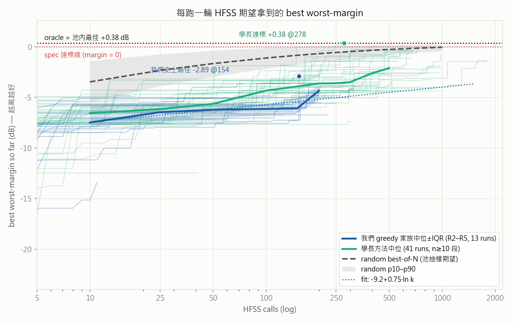
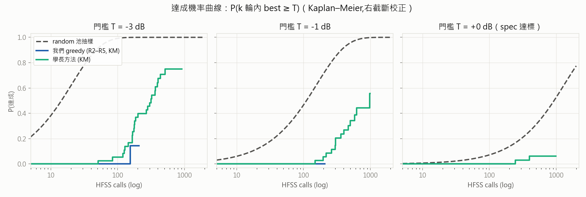
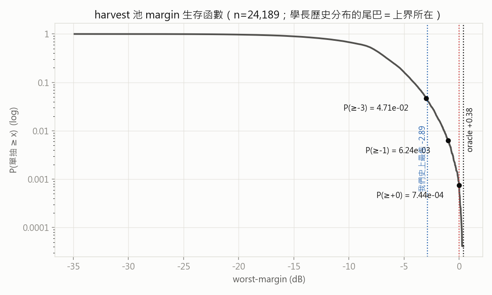
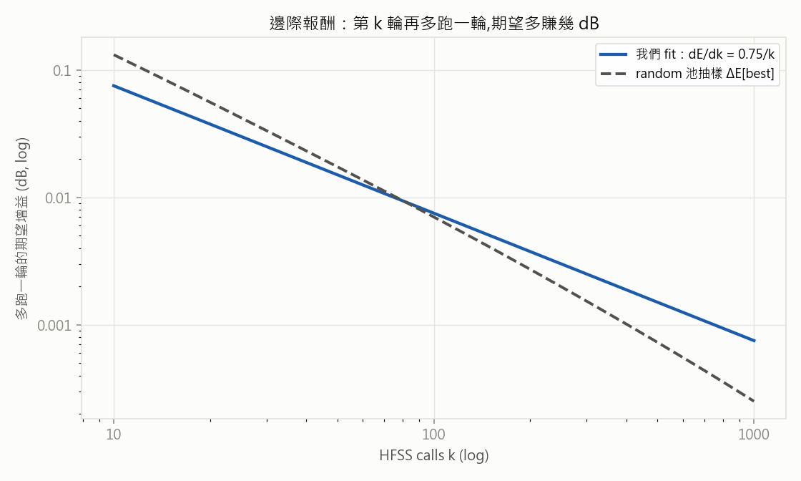

# Round 06 — 離線期望基準：每跑一輪 HFSS，期望拿到的 best 是多少？

- **狀態**: archived
- **提出 / 開跑 / 結論**: 2026-07-03 / 2026-07-03 / 2026-07-03（離線分析，當天完成）
- **一句話問題**: 現行 greedy 方法每多跑一輪 HFSS，「期望」能把 best worst_margin 壓到哪？理論上界在哪？
- **一句話結論 (TL;DR)**: 我們的期望曲線 ≈ **-9.18 + 0.75·ln k** → 期望爬升到不了 spec（需 ~2×10⁵ 輪），實際進步靠罕見躍遷；**達標 pattern 已在 harvest 池內（oracle +0.38 dB）**；學長方法同預算贏我們 1-2 dB、500 輪內達標機率 6%（我們 0%）；random 池抽樣等效預算領先 200-450× → **候選分布 ≫ 選點策略**。
- **指向**: 工具 `script/expected_best.py` · 圖 `assets/round-06/` · 快取 `tmp/expected_best/`（可重建）· 討論源頭 `docs/discuss/scratch.md`「理論邊界」塊 · memory [[project_benchmark_vs_random]]

> 本檔只放**連結指向**其他層，不複製內容。本 round **零 HFSS 成本**（純離線讀歷史），與 Round 5（線上，運行中）平行、不衝突。

## 1. 假設 (Propose)

- **問題 / 假設**: (a) 現行 greedy 的「期望 best vs HFSS 輪數」曲線長怎樣、邊際報酬多少？(b) 上界在哪——spec 可達嗎？(c) 單一軌跡隨機性大，要用**分布/機率視角**（期望帶、達成機率）而非單條曲線下結論。
- **為何現在做**: 承接「理論邊界」討論（scratch 2026-07-03）；R1-R5 一直用單 run 終點比較，缺一把「隨機性下的期望」尺。
- **預期結果與判準**: 三條曲線放同一把尺——我們家族、學長方法、random best-of-N（池抽樣）——加 oracle（池內最佳）與 spec 線；若我們的期望曲線遠低於 random 池抽樣線 → 「分布 ≫ 策略」成立。
- **依據**: `docs/research_landscape.md`（文獻預測輸 random）· memory [[project_benchmark_vs_random]]

## 2. 實驗設計 (Design)

非訓練 round；「臂」= 三塊歷史資料來源，margin 全用同一份 `antenna.losses.worst_margin` + 現行 targets 重算（R2-R5 targets 已驗一致）→ 跨來源可比：

| 來源 | 資料 | 角色 |
|---|---|---|
| 我們 greedy 家族 | R2-R5 各臂 metrics.csv（13 runs；R1 3 runs 只畫參考細線） | 現行方法的期望帶 |
| 學長原始軌跡 | 學長 result 樹各 run `online.dataset`（**唯讀**，41 條 single，最長 1802 輪） | 前代方法對照 + 長預算段 |
| harvest 池 | `harvest_single` 24,189 筆逐筆 margin | random best-of-N 閉式解 + oracle |

- **判準**: E[best@k]（中位±IQR）、P(k 輪內達門檻 T)（**Kaplan–Meier**，run 提早停=右截斷）、到達門檻所需輪數、每輪邊際增益。
- **HFSS 預算**: 0（純離線）。

## 3. 執行紀錄 (Run)

```
python -m script.expected_best collect-ours      # ~秒
python -m script.expected_best collect-pool      # ~12 分（NAS I/O, 24k 筆）
python -m script.expected_best collect-senior    # ~分鐘（學長樹唯讀）
python -m script.expected_best report            # 4 張圖 + markdown 表
```
- 快取落 `tmp/expected_best/`（git 忽略）；學長樹全程唯讀（裸 pickle、不經 DataManager）。
- 事件：無。

## 4. 分析 (Analyze)

### 表 1 — best worst-margin @ k（中位；帶 IQR 與存活 n）

| k | 我們 greedy 中位 (IQR, n) | 學長中位 (IQR, n) | random 池抽樣期望 (p10…p90) | fit |
|---|---|---|---|---|
| 10 | -7.49 (-7.90…-5.83, n=13) | -6.56 (-7.44…-5.92, n=41) | -3.47 (-5.46…-1.41) | -7.45 |
| 25 | -6.47 (-7.41…-5.76, n=10) | -6.17 (-7.05…-5.59, n=41) | -2.34 (-3.89…-0.74) | -6.76 |
| 50 | -6.22 (-7.17…-5.66, n=10) | -5.64 (-6.28…-4.58, n=39) | -1.66 (-2.95…-0.38) | -6.24 |
| 100 | -6.15 (-6.75…-5.69, n=9) | -4.34 (-5.61…-3.59, n=36) | -1.11 (-2.14…-0.09) | -5.72 |
| 150 | -6.10 (-6.57…-5.06, n=7) | -3.93 (-4.56…-3.24, n=35) | -0.85 (-1.73…0.01) | -5.41 |
| 200 | -4.34 (-5.30…-3.77, n=6) | -3.63 (-4.43…-2.40, n=35) | -0.68 (-1.47…0.03) | -5.20 |
| 250 | -3.87 (n=1) | -3.61 (-4.35…-1.87, n=34) | -0.56 (-1.29…0.07) | -5.03 |
| 500 | — | -2.12 (-3.34…-1.01, n=24) | -0.26 (-0.78…0.15) | -4.51 |
| 1000 | — | -3.56 (n=2，組成假象) | -0.05 (-0.43…0.25) | -3.99 |

- 家族期望曲線 fit：**best(k) ≈ -9.18 + 0.751·ln k** → 期望路徑到 spec 需 **k ≈ 2×10⁵ 輪**。
- 邊際增益 = 0.75/k：k=100 每輪 +0.008 dB、k=250 +0.003 dB。
- 躍遷主導度（最大單跳/總改善，k≥10 後中位）：我們 **46%**、學長 39% —— 進步是躍遷事件，不是期望爬升。
- oracle（池內最佳）= **+0.38 dB**（學長 `pixel_base_2` @278）；我們史上最佳 -2.89@154。
- 池尾巴：P(單抽 ≥ 0) = 7.4e-4（池內 18 筆達標點）、P(≥ -3) = 4.7%。

### 表 2 — 到達門檻 T 的效率（KM = Kaplan–Meier，右截斷校正）

| T (dB) | 我們:達成/中位輪數 | 我們 KM P(≤500輪) | 學長:達成/中位輪數 | 學長 KM P(≤500輪) | random:P50 / P90 抽樣數 |
|---|---|---|---|---|---|
| -5 | 7/13 / 89輪 | 49% | 35/41 / 73輪 | 87% | 4 / 13 |
| -3 | 1/13 / 154輪 | 14% | 27/41 / 201輪 | 71% | 15 / 48 |
| -2 | 0/13 | 0% | 20/41 / 307輪 | 46% | 36 / 117 |
| -1 | 0/13 | 0% | 14/41 / 333輪 | 30% | 111 / 368 |
| +0 | 0/13 | 0% | 2/41 / 322輪 | 6% | 932 / 3094 |

### 圖（`assets/round-06/`）

**主圖——三方法期望帶 + oracle/spec 線**（錨點：我們 -2.89@154、學長 +0.38@278）：



**達成機率 P(k 輪內 best ≥ T)**（Kaplan–Meier，右截斷校正；T = -3 / -1 / 0 dB）：



**harvest 池 margin 生存函數**（尾巴 = 上界所在；P(單抽達標) = 7.4e-4）：



**邊際報酬——第 k 輪再多跑一輪，期望多賺幾 dB**（雙 log）：



- **觀察**:
  1. 我們的期望曲線在 k>100 後每輪 <0.01 dB —— 平掉了；-2.89 是 13 條 run 的 max envelope（躍遷），不是期望水位。
  2. 學長方法 k≥100 起中位穩定高我們 1-2 dB；到達 -2/-1/0 dB 我們機率為 0、他 46%/30%/6%。
  3. random 池抽樣（= 若候選分布有學長歷史那麼好）4 抽到 -5、15 抽到 -3；等效預算領先我們 fit 200-450×。
  4. R5 快照（2026-07-03，ep 11-17）：E -13.4 / D -7.9 / E+D -4.9 —— 對照帶太早，不判讀。

### 侷限（誠實條款）

1. **random 線 ≠ uniform random**：池 = 學長各 run 搜尋軌跡的聯集（偏好區），此線是「分布上界參照」；真 uniform random 會低很多（`harvest_single_random` 為空，無從對照）。
2. 我們 k>200 存活 run 剩 1 條（R2 @430），該段靠 fit 外插；R2-R5 各臂變體不同、非 iid 樣本。
3. 學長軌跡序 = `online.dataset` 插入序（假設≈時間序）；他的 run 經人工挑選/調參，存活偏差未校正（KM 只校正「提早停」）。
4. 閉式解假設 iid 有放回；池經 hash 去重（重複模擬只留一份），尾端機率略有偏移。
5. margin 用**我們的** targets 重算學長資料——衡量一致，但學長當年優化的目標未必完全相同。

## 5. 結論 (Conclude)

- **學到什麼**:
  1. **上界具體化**：spec 可達（oracle +0.38，池內 18 筆達標點）——「差 4-5 dB」不是物理限制，是搜尋沒到。
  2. **期望爬升死路實錘**：0.75·ln k 的曲線註定到不了 0；有效進步全靠躍遷 → 提高「躍遷率」比推高「平均水位」重要。
  3. **分布 ≫ 策略**：跟池抽樣 200-450× 的等效預算差距，遠大於任何選點策略能補的量級。
- **決策**: 資源優先投「讓候選分布變好」（warm-start、結構先驗），選點策略（acquisition 微調）降優先。
- **促成候選**（回寫 ONGOING 🔜）: ① **harvest 池頂端 warm-start**（新增；候選/初始 pattern 從池內 top 樣本出發，不只 SM 暖啟動）② 給「週期 harvest 重錨」+1 佐證 ③ 學長機制對照（他 300-700 輪逼近/達標，我們拆掉的成分裡有有效的——先文件比對 `docs/senior_method.md`，不急著跑）。

## 6. 後續決策 (Next)

- **解鎖**: 這把尺可重複用——之後每 round 收檔，跑 `report` 把新 run 疊上同一張圖讀 headroom。
- **新產生的待辦**: harvest 池頂端 warm-start 已掛 ONGOING 🔜（觸發：R5 收檔後討論排程）；EVT 尾部外插（池外上界估計）暫不做——池內已有達標點，上界問題對本 spec 已足夠回答。

## 7. 歸檔指向 (Archive)

- configs/README 列: 無（零 config；工具腳本 `script/expected_best.py`）
- 結果夾: 無 NAS 結果夾；快取 `tmp/expected_best/`（丟了可用 collect-* 重建，~15 分鐘）
- memory: [[project_benchmark_vs_random]] · [[project_litreview_direction]]
- 設計文件: `docs/research_landscape.md`（文獻預測與本量化互證）
- ONGOING 動作: 直接進 ✅ 區（離線 round，當日完成）
