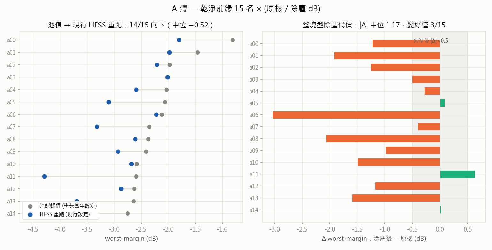
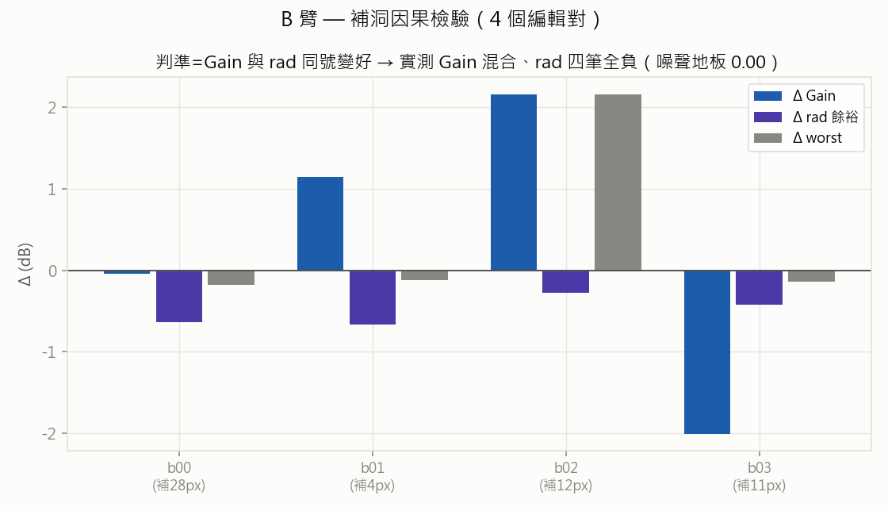
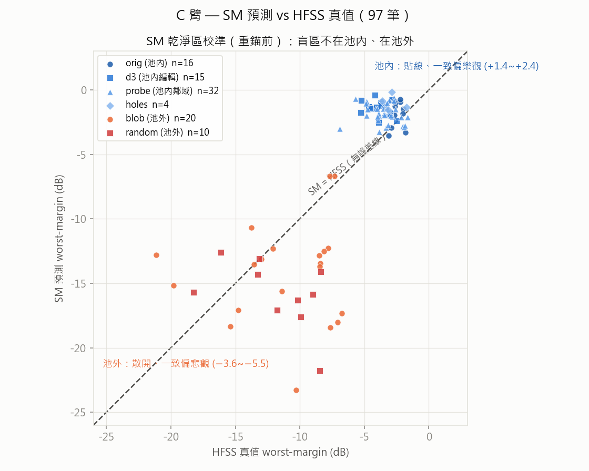
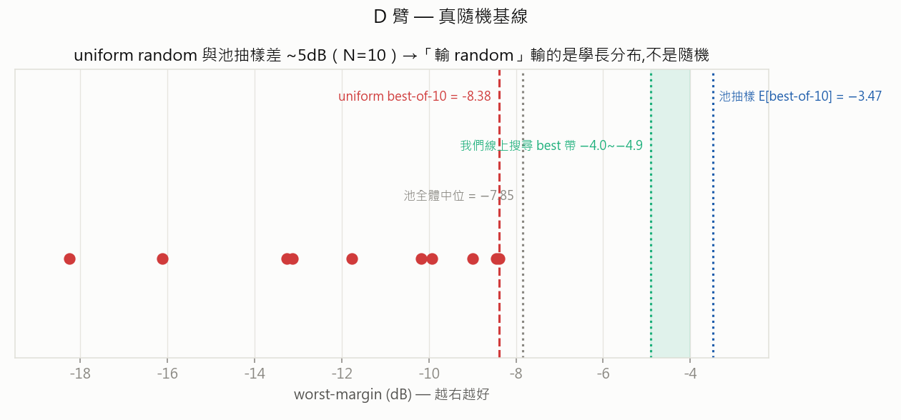

# R8 乾淨子空間測繪 — 結果報告（附圖詳解）

> Round 08 · 除塵系列 · 2026-07-05 收檔。97 筆 HFSS（單筆 ~2-3 分；斷電中斷一次、續跑收完）。
> 判準全部在發車前寫死於 [round-08](round-08-clean-mapping.md)；margin 一律用現行 `worst_margin` + R5 targets 重算。
> 本檔＝round-08 §4 的展開版（圖＋細節）；round 檔本體只放結論與指向。

## 總覽（五格 verdict）

| 臂 | 問題 | 判定 | 關鍵數字 |
|---|---|---|---|
| A | 整塊型除塵是通則嗎 | ❌ **崩** | \|Δ\| 中位 1.17（判準 <0.5）、變好僅 3/15 |
| B | 補洞是因果算子嗎 | ❌ **敗** | rad 四筆全負、Gain 兩正兩負 |
| C | SM 乾淨區能用嗎（重錨前） | 🟡 **半亮** | 池內 1.5–2.4 dB、池外 4.4–5.5 dB |
| D | 真隨機的地板在哪 | ✅ **實錘** | 輸池抽樣 ~5 dB（N=10） |
| ⚠ | 池值可信度（意外收穫） | ⚠ **警訊** | 池→現行 HFSS 系統性漂移中位 −0.52 |

**怎麼讀**：R8 是在精修 round 發車前，把四件事各買一份證據——**起點**多好（A）、**編輯規則**哪些是真的（B）、**導航儀**能不能用（C）、**對照組地板**在哪（D）。所有 Δ 的可信度由一個數字保證：同一張 pattern 跨 session 重跑 HFSS 差異 **0.00 dB**（b00_ref vs R7 p03_d3）——現行模擬設定完全可重複，看到的每個差異都是真效果、不是雜訊。

---

## A 臂 — 整塊型除塵通則 ❌ 崩：通則不成立

**問**：main_frac≥0.9 的「整塊型」pattern，拔掉粉塵是不是近零代價？（R7 p03 的推廣檢驗）

*左：同一批 pattern 的池記錄值 → 現行 HFSS 重跑，14/15 向下（灰點→藍點）。右：除塵（d3）相對原樣的 worst-margin 變化，橘=變差、綠=變好，灰帶=發車前判準 |Δ|<0.5。*

結果：|Δ| 中位 **1.17 dB**（判準 <0.5），除塵後變好的只有 **3/15**，Δ 中位 −1.17——平均拔 16px 就付出約 1.2 dB。R7 在碎片雲 pattern 看到的「粉塵=共振的一部分」，在最有希望豁免的整塊型身上**一樣成立**；p03 那次近零代價是特例。

**含義**：「先找到好解、再後處理拔粉塵」路線正式關閉。乾淨（可製造）必須**生成時內建**——正是 round-08 §5 預留的分岔「A 崩 → 轉 DIP 生成式搜尋」。同時，乾淨前緣的 HFSS 真值 best = **−1.80**（a00 原樣），低於精修直發線 −1.5。

A 臂 15 對逐筆數字

| 家族 | 池值 | HFSS 原樣 | 漂移 | 除塵 Δ | 拔 px |
|---|---|---|---|---|---|
| a00 | −0.81 | −1.80 | −0.99 | −1.22 | 16 |
| a01 | −1.46 | −1.98 | −0.52 | −1.91 | 25 |
| a02 | −1.97 | −2.21 | −0.24 | −1.25 | 17 |
| a03 | −2.02 | −2.01 | +0.01 | −0.50 | 10 |
| a04 | −2.03 | −2.59 | −0.56 | −0.28 | 12 |
| a05 | −2.06 | −3.10 | −1.04 | +0.09 | 24 |
| a06 | −2.12 | −2.22 | −0.10 | −3.03 | 12 |
| a07 | −2.35 | −3.32 | −0.97 | −0.40 | 17 |
| a08 | −2.37 | −2.61 | −0.24 | −2.06 | 19 |
| a09 | −2.41 | −2.93 | −0.52 | −0.98 | 14 |
| a10 | −2.58 | −2.68 | −0.10 | −1.49 | 15 |
| a11 | −2.59 | −4.29 | −1.70 | +0.64 | 18 |
| a12 | −2.63 | −2.87 | −0.24 | −1.17 | 21 |
| a13 | −2.64 | −3.69 | −1.05 | −1.59 | 13 |
| a14 | −2.75 | −4.55 | −1.80 | +0.02 | 16 |

## B 臂 — 補洞因果檢驗 ❌ 敗：不是因果算子

**問**：analysis-01 看到「洞少 ↔ Gain 好」的相關性——真的補洞就會變好嗎？

*4 個編輯對（補 4–28px），每對看 ΔGain（藍）、Δrad 餘裕（紫）、Δworst（灰）。判準：Gain 與 rad 同號變好才升級為精修算子。*

結果：ΔGain 兩正兩負（+2.16 / +1.14 / −0.04 / −2.01），**Δrad 四筆全負**（−0.28 ~ −0.67）。SM 預篩曾預測 b00 補洞 Gain +1.79，實測 −0.04——SM 也被這個相關性騙了。

**含義**：analysis-01 的「Gain←少洞」是 confound（洞多的 pattern 通常還有別的毛病），不是可操作的設計規則。補洞從精修算子清單**除名**。知識格帳面上是負結果，但四筆就排除一條會誤導精修的假規則，便宜。

## C 臂 — SM 乾淨區校準 🟡 半亮：盲區不在池內、在池外

**問**：SM 對乾淨區的 5–15 dB 盲，是資料缺口（可餵）還是架構缺口（不可救）？

*97 筆全體：橫軸 HFSS 真值、縱軸 SM 預測（重錨前）、虛線=完美預測。藍系（池內：orig/d3/probe/holes）貼線；暖色（池外：blob/random）散開且系統性低估。*

結果把原假設「乾淨區盲 5–15 dB」直接修正：

| 區域 | kind | \|err\| 中位 | bias 中位 |
|---|---|---|---|
| 池分布內 | orig / d3 / probe / holes | **1.5–2.4 dB** | 一致**樂觀** +1.4~+2.4 |
| 池分布外 | blob / random | **4.4–5.5 dB** | 一致**悲觀** −3.6~−5.5 |

**含義**：導航儀在「池內精修」這個用途上比預期可用——一致的 bias 是可校正的。但判準的正式答案還欠一步：拿 r7+r8 共 **111 筆真值**離線重錨 SM，量乾淨區誤差是否進 ~2 dB 帶（零 HFSS，開發機可跑）。附帶收穫：rad 曲線累計 ~112 條，Stage-3 rad head pretrain 資料已足。

## D 臂 — 真 uniform random 基線 ✅ 實錘：改寫「輸 random」敘事

**問**：R6 的 random 線用的是「池抽樣」（學長分布）——真隨機到底有多爛？

*10 筆 iid p=0.5（feed 強制、不修復）的 worst-margin（紅點），對照池抽樣期望、池中位、與我們線上搜尋的 best 帶。*

結果：uniform random best-of-10 = **−8.38**、中位 −10.97；池抽樣 E[best-of-10] = −3.47。**同預算差 ~5 dB**。

**含義**：「我們輸 random」一直欠一個限定詞——輸的是**從學長歷史分布抽樣**（幾萬筆模擬換來的強先驗），不是輸隨機。我們的線上搜尋（best 帶 −4.0~−4.9 @100–200 輪）**大勝真隨機**。對指導者簡報：這條紅色基線該畫上去，系統的學習是真的在工作；主戰場在「候選分布」，與 R6「分布≫策略」互相咬合。

---

## ⚠ 意外收穫 — 池值系統性樂觀（R6 oracle 存疑）

A 臂 15 筆「池記錄值 → 現行 HFSS 重跑」：**14/15 向下**，中位 −0.52、最大 −1.80。配上 0.00 的重跑噪聲地板，這不是隨機誤差，是**學長當年模擬設定與現行設定之間的系統性偏移**（mesh / 版本 / 邊界條件，機制待定位）。

直接後果：R6 說「達標 pattern 已在池內（oracle +0.38）」——打完 −0.5~−1.0 的折扣後**很可能不成立**。池內 18 筆帳面達標的 pattern，在現行設定下可能一筆都不達標。這個問題值 ~1 小時 HFSS 就能裁決（見下）。

## 下一步 — 37 的下一個實驗（提案）

1. **R9：池頂端重驗批次**（37，~30 筆 ≈ 1.5 hr HFSS）——池內帳面 wm≥0 的 18 筆全部＋ −1~0 帶抽 ~12 筆，現行設定重跑。一次回答兩件事：**這個 spec 在現行設定下有沒有已知解**（R6 的尺要不要重刻），以及「池值→現行值」的**校正曲線**（讓 24k 池資料打折後繼續可用）。工程量小：`dedust.py` 加 `select-r9`，run/report 原樣復用。
2. **SM 重錨離線跑**（開發機，零 HFSS，可與 R9 平行）——r7+r8 111 筆真值併訓，補完 C 臂判準：乾淨區誤差進 2 dB 帶 → 精修 round 的導航儀合格。
3. **精修 vs DIP 分岔**——等 1、2 落地再定：R9 若顯示池頂在現行設定全滅，「精修池內好解」的天花板更低，DIP 生成式搜尋權重上升；若池頂存活幾筆，精修 round（乾淨 warm-start + 校準過的 SM）直接發。

## 侷限（誠實條款）

- A 臂 n=15、B 臂 n=4、D 臂 n=10——都是小樣本；結論強度來自「方向一致性」（14/15、4/4）而非樣本量。
- 除塵只測了 d3（膨脹半徑 3 的粉塵定義）一種強度；「輕手除塵」（只拔 1px 孤點）未測。
- 池值漂移的**機制未定位**（mesh/版本/邊界條件）；R9 校正曲線只能修正量、不能解釋因。
- C 臂判準的正式答案（重錨後）還沒跑；本報告 SM 數字全部是「重錨前基線」。
- blob/random 的 SM 悲觀 bias 也可能部分來自這些 pattern 本身 rad 特性極端，非純粹「沒見過」。

---

**資料**：NAS `dataset/dedust_r8/`（results.json + SampleStore 97 筆）· 輸入 `dataset/dedust_r8_input/`（manifest 含 SM 預篩）· 重現：`python -m script.dedust report --input dedust_r8_input --store dedust_r8` · 前作：[round-07](round-07-dedust.md)、[analysis-01](analysis-01-pattern-anatomy.md)、[round-06](round-06-offline-expected-best.md)
