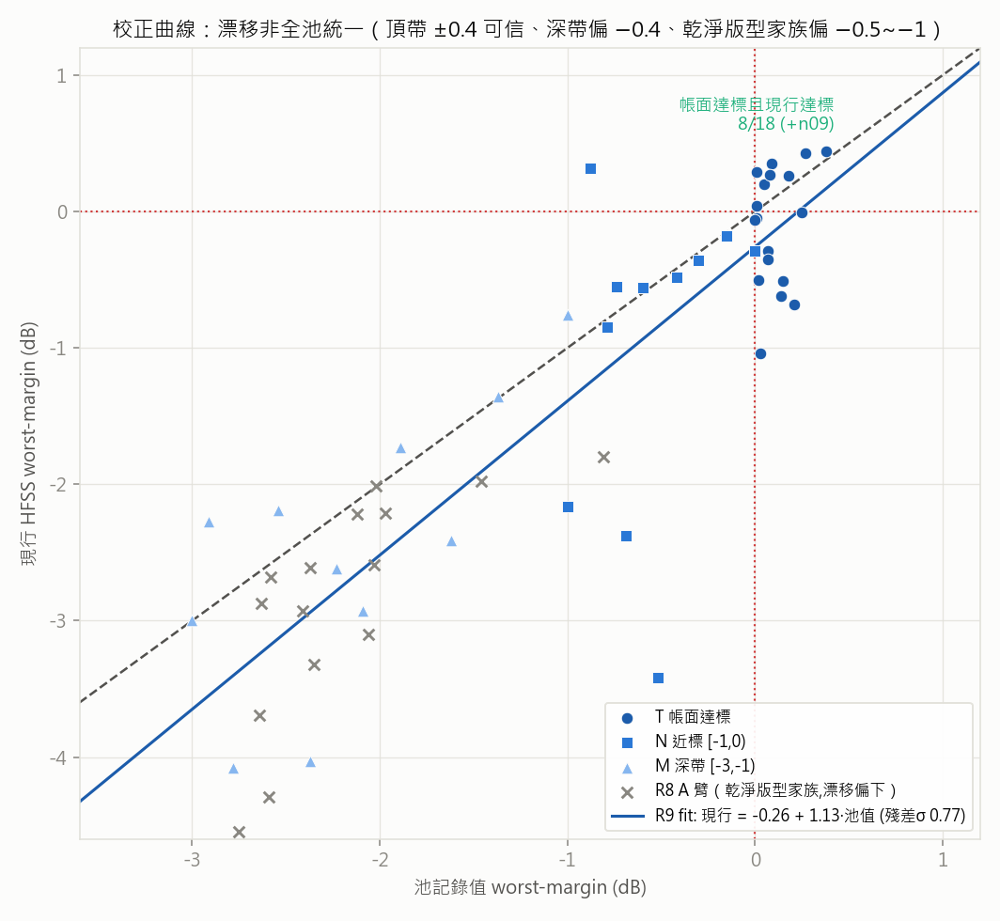
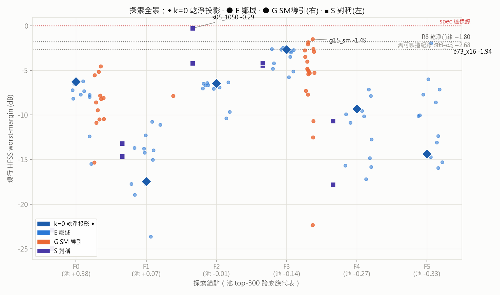
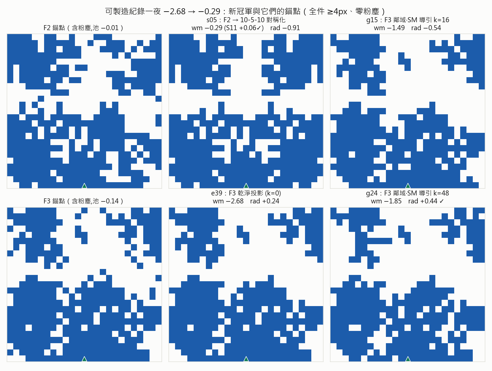
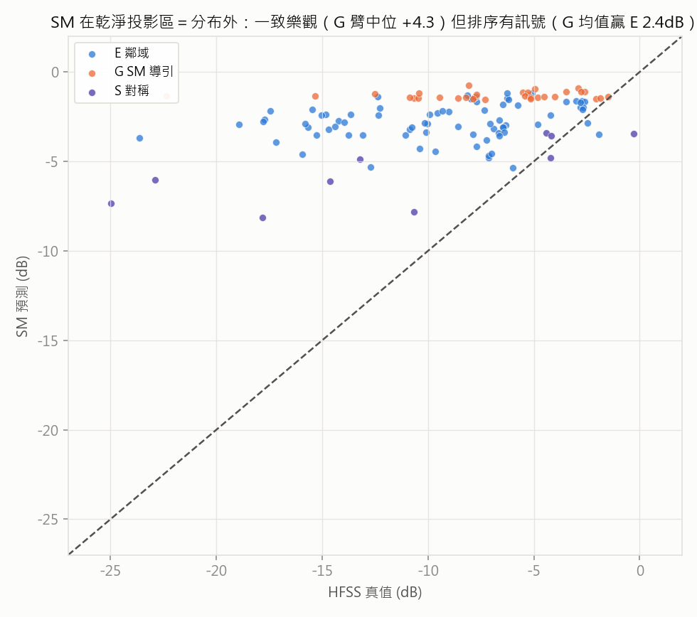

# Round 9 — 池頂端重驗＋乾淨前緣探索（過夜批次，162 筆）

- **狀態**: archived（159/162 收檔；3 筆 COM error 待補跑，不影響結論）
- **提出 / 開跑 / 結論**: 2026-07-05 / 2026-07-05 晚 / 2026-07-06 晨
- **一句話問題**: 池內帳面達標的 pattern 在現行 HFSS 設定下還活著幾筆？「池值→現行值」校正曲線長怎樣？＋跨家族乾淨投影鄰域裡有沒有更好的可製造 pattern？
- **一句話結論 (TL;DR)**: **oracle 活著（8/18 存活,t00 +0.44）**；漂移非全池統一（頂帶 ±0.4 可信）；**可製造紀錄 −2.68 → −0.29**（s05 = F2 錨點 × 10-5-10 對稱化,S11 已過、Gain 差 0.29）；F3 家族=可製造沃土（top-10 佔 7）；SM 分布外絕對值大暴走（+4.3）但**排序有訊號**（G 贏 E 2.4dB）
- **指向**: 工具 `script/dedust.py`（select-r9/run/report，`--input dedust_r9_input --store dedust_r9`）· 輸入 `DATASET_PATH/dedust_r9_input/`（162 筆＋manifest 含 SM 預篩與 anchor_pool_wm）· 前作 [round-08](round-08-clean-mapping.md)／[round-08-report](round-08-report.md)（漂移警訊出處）· R6 oracle [round-06](round-06-offline-expected-best.md)

> 本檔只放**連結指向**。R9 是 R8「意外收穫」的直接後續：池值系統性樂觀 → R6 的 oracle（+0.38 達標）與整個 24k 池資料的可信度都要重刻。

## 1. 假設 (Propose)

- **承接**: R8 A 臂實錘「池記錄值 → 現行 HFSS 重跑」14/15 向下、中位 −0.52、最大 −1.80；配噪聲地板 0.00（b00_ref ≡ R7 p03_d3）→ 漂移是**系統性設定差**（學長當年 vs 現行），不是隨機噪聲。
- **假設**: ① 池內 18 筆帳面達標（wm≥0）打完折後**大部分不再達標**（悲觀估全滅）；② 漂移量可用「池值→現行值」的單調校正曲線描述（讓 24k 池資料折價後續用）；③ R7 曾重驗 p00 得 +0.44 達標——若本輪 t00（同為池頂）也活，表示池頂不是全滅、精修仍有種子。
- **預期結果與判準**（發車前寫死）:
  - **主判準**: T 臂 18 筆中現行設定 wm≥0 的存活數 `k`。`k=0` → R6 oracle 修正為「未知」，精修天花板下修、DIP 生成式權重上升；`k≥1` → 現行設定已知解存在，精修 round 種子確定。
  - **副判準**: 30 筆 (池值, 現行值) 散點的校正關係——線性/單調偏移？帶寬多少？供 24k 池資料折價使用。
  - **附帶**: 30 條 rad 曲線入袋（Stage-3 累計 ~142）；T 臂 pattern 全是碎片雲（n_comp 21-35、粉塵 5-16 顆）——順看達標與碎片度在現行設定下的關係。
- **依據**: [round-08-report](round-08-report.md)「意外收穫」節 · [round-07](round-07-dedust.md)（p00 重驗 +0.44 的單點先例）· [round-06](round-06-offline-expected-best.md) 侷限⑤

## 2. 實驗設計 (Design)

**重驗組**（R8 池值漂移警訊的直接後續）：

| 臂 | 內容 | 筆數 | 買什麼 |
|---|---|---|---|
| T | 池內帳面 wm≥0 **全數**（降冪 t00-t17） | 18 | oracle 裁決：現行設定的已知解存在性 |
| N | 近標帶 [-1, 0) 共 133 筆 rank 分層（`spread_idx`） | 12 | 校正曲線 0 附近加密 |
| M | 深帶 [-3, -1) rank 分層 | 12 | 校正曲線延伸到搜尋工作區 |

**探索組**（找有效 pattern；錨點＝**池 top-300 greedy 家族聚類的跨家族代表前 6 名** F0-F5——
普查實錘 R8 乾淨前緣只是邊緣家族（上下兩分型 F13,a02 之後連 top-300 都排不進）、top 家族是全面散布
碎片雲等多種形態，見 `assets/round-09/pool_families.png`；`perturb_repair` 內建除塵 → 探的是各家族
**乾淨投影**的鄰域）：

| 臂 | 內容 | 筆數 | 買什麼 |
|---|---|---|---|
| E | 每錨點 k=0（純除塵=家族乾淨投影真值）+ k∈{4,8,16,32}×3 seed | 78 | 跨家族局部地形＋撞可製造新 best |
| G | 960 候選（錨點×k≤48×40 seed）SM 排序＋互異(Hamming>30)取前 32 | 32 | 批次版 SM-guided 搜尋（SM 池內誤差 1.5-2.4 可用） |
| S | 錨點前 5 × {全鏡射, 10-5-10 部分對稱} | 10 | 「把對稱做對」候選初測 |

- margin 同一把尺；manifest 帶 anchor_pool_wm/SM 預篩（重錨前基線再+162 點）。
- **HFSS 預算**: 162 筆 ≈ **8.1 hr** @3分/筆（R7/R8 實測；worst ~9.5hr,含 COM error 重試裕度)。可中斷續跑。

## 3. 執行紀錄 (Run)

```
# 正式機 .37（先 git pull）
python -m script.dedust run --input dedust_r9_input --store dedust_r9
# 任一機看進度/收檔
python -m script.dedust report --input dedust_r9_input --store dedust_r9
```
- 事件: 2026-07-05 晚發車（無人值守 ~10hr）；~3.4 分/筆；**3 筆 COM error**（`n10_near`/`e10_x32`/`e32_x8`）
  → 37 有空重跑同指令即補（續跑規則=成功跳過、error 重試）。

## 4. 分析 (Analyze)

### 重驗組 — oracle 活著、漂移「家族依賴」而非全池統一



- **主判準：T 臂存活 k = 8/18**（t00 **+0.44**、t01 +0.43、t07/t08/t04/t11/t14/t15）——現行設定**已知解存在**，
  且 t00 與 R7 單點重驗 p00（+0.44）完全吻合。另 **n09（池 −0.20 帶）現行 +0.32** → 帳面未達標帶也藏達標者。
- **校正**（T+N+M, n=41）：漂移中位 −0.06、mean −0.36、std 0.78；線性 fit **現行 = −0.26 + 1.13·池值**（殘差σ 0.77）。
  分帶：T 帶漂移 −0.06±0.40（**池頂端基本可信**）/ N 帶 −0.06±1.07 / M 帶 −0.39±0.88。
  → **修正 R8 敘事**：「系統性樂觀 −0.5」是乾淨版型家族（R8 A 臂）的局部現象；碎片雲頂端家族的池值誤差 ±0.4 內。

### 探索組 — 可製造紀錄一夜 −2.68 → −0.29



| 嚴格可製造 top-5（全件≥4px、零粉塵） | wm (S11/Gain) | rad 餘裕 | 來源 |
|---|---|---|---|
| **s05_1050** | **−0.29**（+0.06✓/−0.29） | −0.91 | F2 錨點 × **10-5-10 部分對稱化** |
| g15_sm | −1.49 | −0.54 | F3 鄰域·SM 導引 k=16 |
| g24_sm | −1.85 | **+0.44 ✓** | F3 鄰域·SM 導引 k=48 |
| e73_x16 | −1.94 | −2.21 | F5 鄰域 k=16 |
| g28_sm | −2.07 | +0.32 ✓ | F3 鄰域·SM 導引 k=32 |



- **六家族乾淨投影全部崩**（F0 +0.38→−6.26、F1 +0.07→−17.45…最好 F3 −2.68=恰等舊紀錄 p03_d3）——
  頂級碎片雲的粉塵是主承重（R7 結論在頂端家族更慘烈）；但 **F3「下大塊+上散布」家族是可製造沃土**（top-10 佔 7）。
- **S 對稱分家族**：爛投影家族被救起（F1 +2.8/F2 **+6.2**）、好投影家族被毀（F0 −18.7/F3 −1.8）；
  **10-5-10 > 全鏡射（4/5 家族）**——使用者的部分對稱直覺拿到首個 HFSS 證據，且 s05 直接破紀錄。
- **G vs E**：G mean −7.03 vs E mean −9.45（**+2.4dB**）、top-5 佔 3——SM 分布外絕對值大暴走
  （pred−真 中位 **+4.28**、最大 +21）但**排序仍有訊號**；「批次 SM 導引→HFSS 驗證→回灌」的 loop 可行。



## 5. 結論 (Conclude)

- **學到什麼**：① oracle 存在（k=8，判準走 `k≥1` 分支）→ 精修路線保住，且**可製造側自己長出了種子**：
  s05 −0.29（S11 已過、只差 Gain 0.29）；② 漂移家族依賴、池頂可信 → 24k 池資料配 fit（−0.26+1.13x、σ0.77）
  折價後續用；③ 「高性能靠粉塵」與「可製造」在池頂端幾乎不相交，但 **F2 對稱化 / F3 鄰域**兩條路都通向
  可製造高分——乾淨解要「構造」出來（對稱化、模板），不是「修」出來（與 R7/R8 一致）；④ SM 排序訊號
  在分布外仍可用 → 批次 guided loop 成立。
- **決策**：精修 round 圍繞 **s05（主種子,補 Gain+rad）與 g24（rad 已過,補 wm）** 設計；設計規律萃取（R10）
  的首批規則假設=「10-5-10 對稱化救散亂上半」「F3 下大塊模板」「大主件少組件（3-6 組,主件 200-250px）」。
- **促成 / 排除**：促成 R10（設計規律目錄,scratch 已記）+ 精修 round（種子齊了）；「把對稱做對」候選
  從待試升級為**有 HFSS 證據**；排除「頂級家族乾淨投影直接當 warm-start」（全崩）。

## 6. 後續決策 (Next)

- **R10 Stage A（離線,零 HFSS,可立即）**：SM 重錨（r7+r8+r9 ~270 筆真值）＋三路歸因
  （occlusion/saliency/E 臂 72 對真值迴歸）→ 規則假設清單（含上述三條首批假設）。
- **R10 Stage B / 精修（37 下批,~3-4hr）**：s05 補 Gain（洞區微調/主件邊緣編輯）+ g24 補 wm ＋
  規則成對驗證＋物理遮蔽掃描——目標：**三標全過第一筆**。
- 37 空檔先補跑 3 筆 error；R6 期望圖加「池值折價」註記（校正 fit 落地）。

## 7. 歸檔指向 (Archive)

- configs/README 列: 無（零新 config；`script/dedust.py` 擴充 select-r9＋`spread_idx` 測試）
- 結果夾: `DATASET_PATH/dedust_r9/`（NAS）
- memory: [[project_benchmark_vs_random]]
- ONGOING 動作: 發車時 🔵、收檔移 ✅（與 R8 一起補 README 索引）
