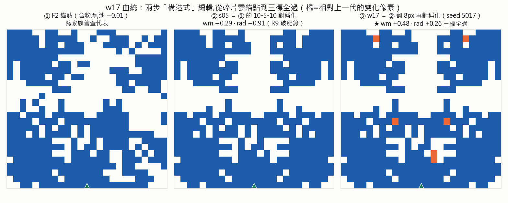
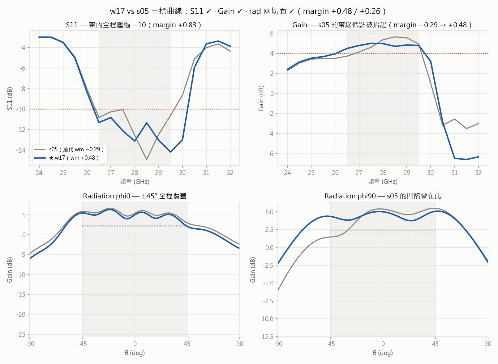
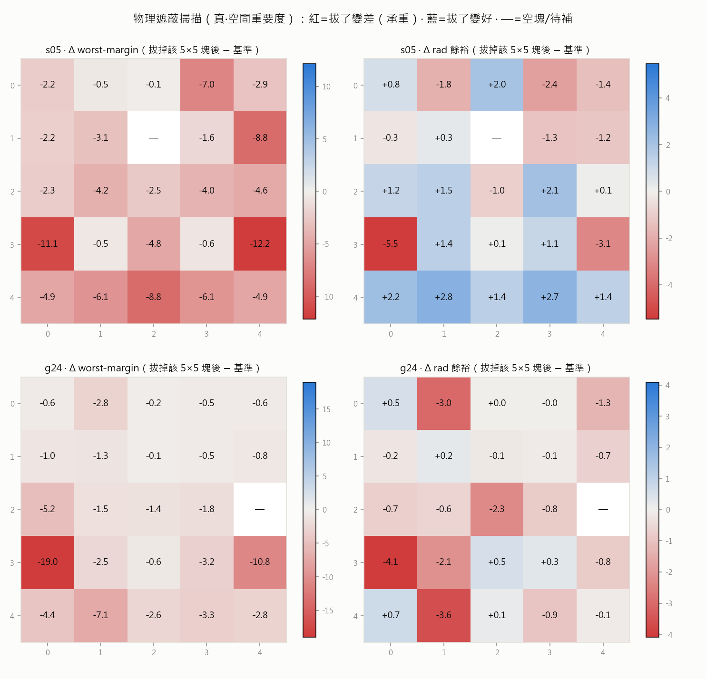

# R10 報告 — 三標全過的第一筆：w17 誕生記（附圖詳解）

> Round 10 · 2026-07-06 午後收 ref1＋遮蔽掃描。判準發車前寫死於 [round-10](round-10-refine-attribution.md)。
> 雜訊地板已由 41 次重複公證為 ≈0（[round-09](round-09-pool-revalidation.md) §4 附錄）——本報告每個數字都是真效果。

> **⚠ 更正啟事（2026-07-06 晚,公證後）**：w17 十次公證 8/8 給出 **wm −0.06**（非下文的 +0.48）；
> S11 +0.83 與 rad 曲線與原次逐位一致,分歧只在 Gain 一點。採信 −0.06 →「三標全過」**收回**,
> w17 改記為**可製造新紀錄（−0.29→−0.06,差全過 0.06）**。下文 +0.48 相關敘述保留當歷史記錄;
> 詳見 round-10 §4「公證揪出的新已知問題」。這正是公證制度存在的原因。

## 頭條（更正前原文）

**`w17_k8`：專案第一筆「S11＋Gain＋rad±45°＋可製造」四關全過的 pattern。**

| 關卡 | 規格 | w17 | 判定 |
|---|---|---|---|
| S11 | 帶內（26.5–29.5 GHz）≤ −10 dB | margin **+0.83** | ✅ |
| Gain | 帶內 ≥ +4 dB | margin **+0.48** | ✅ |
| rad ±45°（phi0／phi90） | 窗內 ≥ G(0)−3dB | **+0.26／+1.75** | ✅ |
| 可製造 | 全件 ≥4px、零粉塵 | 3 組件、主件 248px、0 粉塵 | ✅ |

配方完全決定性可重現：`s05_1050` → `perturb_repair(k=8, seed=5017)` → `symmetrize(10-5-10)`。
（10 次公證批次已備 NAS `dedust_w17rep_input/`，37 跑完即蓋章。）

## w17 的血統——「構造式」路線的完整勝利

從 R9 的跨家族普查代表 F2（含粉塵碎片雲、池值 −0.01）出發，**兩步構造式編輯**走到全過：
第一步 10-5-10 對稱化（R9 的 s05，−0.29）、第二步保對稱微擾（本輪 w17，+0.48）。
對照組全數陣亡的事實讓這條路線更有說服力——「後處理除塵」（R8 崩）、「補洞」（R8 敗）、
「對稱化已經好的」（本輪 X 臂 4/4 變差）都不行；**乾淨解是construct出來的，不是修出來的**（R7 預言，R10 蓋章）。

曲線層面看修復：R9 判讀定位的 s05 兩個缺陷——Gain 帶緣低點（26.5–27 GHz，3.7 dB）與 rad phi90
左側凹陷（θ≈−45~−20°）——被 8 個像素（鏡射成對）同時治好；S11 幾乎不動（+0.06→+0.83 還變好）。
微小編輯 × 大 margin 擺動（wm +0.77、rad +1.17），與 analysis-01「地形有效半徑～數十翻轉」一致。

## ref1 三臂全成績（37/40，3 筆 COM error 已排補跑）

| 臂 | 設計 | 結果 |
|---|---|---|
| **W** s05 保對稱鄰域（18） | perturb→再對稱化，k∈{2,4,8} | **w17 全過**；另 w14 −0.11、w05 −0.21——s05 鄰域整片高地 |
| **X** 對稱化救援推廣（4） | 對「已經好的」冠軍做 10-5-10；**發車前預測＝變差** | **4/4 命中預測**（−1.5 ~ −12）→ 規則升級 |
| **Y** g24 鄰域（18） | rad✓ 種子小步擾動補 wm | best y05_k2 **−0.97（rad +0.48 保持）**，−1.85→−0.97 |

X 臂值得單獨講：這是本專案第一條**通過「預測→驗證」因果關**的設計規則——
**「10-5-10 對稱化救爛投影、毀好結構」**（R9 相關性 → 本輪 4/4 可證偽測試命中）。可以載入 generator 了：
當作**修復算子**（對散亂結構用）而非通用先驗（對優化過的結構禁用）。

## 物理遮蔽掃描——真·空間重要度圖（43/48，5 筆待補）

每格＝拔掉該 5×5 塊後的 margin 變化（紅＝承重、藍＝拔了反而好）。讀出的規則草案：

1. **s05 的 wm 承重全面分布**（25 塊全紅）——沒有「白吃的區塊」；底排（row 4）最重（−4.9~−8.8）。
2. **wm 與 rad 的承重結構互相衝突**：s05 底排拔掉會讓 rad **+1.4~+2.8**（但 wm 崩）——rad 覆蓋想要
   少一點底部金屬、S11/Gain 想要多——**三標的張力有了空間定位**，精修的本質是在這張圖上找平衡點。
3. **免費編輯區存在**：s05 的 b(0,2)（頂中）拔除＝rad **+2.0** 而 wm 只 −0.1——「rad 微調旋鈕」；
   對照 w17 實際的修復像素也落在頂區＋中區（血統圖橘點），互相印證。
4. **g24 的 b(3,0) 單塊承重 −19.0**（rad 也 −4.1）——主共振器所在；周邊大片近零（±1 內）＝自由編輯區大，
   解釋了 Y 臂為何小步就能推 0.9 dB。

## 能力線（SM 重錨，Stage A）

held-out 乾淨區 |wm 誤差| 中位 **3.20 → 1.41**（p90 9.70→5.22）、harvest 2.11→2.32（無遺忘）——
導航儀合格（R8 C 臂結案）。`sm_reanchor.pth` 已上 NAS，ref2 起改用。

## 記分板（R7 三指標框架）

| 指標 | R7 起點 | 現在 |
|---|---|---|
| **產品**（可製造 best） | −2.68（p03_d3） | **+0.48 全過（w17）**，一週 +3.16 dB |
| **能力**（SM 乾淨區誤差） | 盲 5–15 dB | **1.41 dB**（重錨後 held-out 中位） |
| **知識**（驗證過的規則） | 0 | **3**：對稱化救爛毀好（因果）＋承重圖 ×2（s05/g24 全塊定量） |

## 下一步

1. **w17 十次公證**（37，~30 分）＋ ref1/occl 共 8 筆 error 補跑——蓋章。
2. **ref2 過夜批次**（目標從「求過」升級為「推高餘裕＋第二冠軍」）：w17 保對稱鄰域＋遮蔽圖定向編輯
   （免費區微調 rad、避開承重區）＋重錨 SM 從大候選池挑 top-K＋g24 線續推。
3. **規則 → generator**（R11 工程）：對稱化修復算子、承重圖 → 像素先驗 logit map 的第一版。
4. 外部檢查（建議）：w17 拿去學長原始專案設定/或實作量測前的獨立驗證，畢竟這是要交付的 pattern。

## 侷限（誠實條款）

- w17 是**單點**：鄰域穩健性未量（ref2 會補——像素容差對製造公差很重要）；10 次公證跑完前，
  嚴格說是「1 次模擬的全過」（不過雜訊地板 ≈0，翻案機率極低）。
- 遮蔽圖解析度 5×5＝粗粒度；塊內像素級結構未解析；5 筆 error 的格子待補。
- 規則目前綁定 s05/g24 兩個家族的鄰域，跨家族普適性未驗。
- 全部結論在現行 HFSS 設定內（與學長設定的系統差見 R9）；真 ground truth＝實作量測。

---

**資料**：`dedust_ref1/`（37 筆）、`dedust_occl/`（43 筆）、`sm_reanchor.pth`、公證輸入 `dedust_w17rep_input/` ·
**重現**：`python -m script.dedust report --input dedust_ref1_input --store dedust_ref1`（occl 同理）·
**前作**：[round-09](round-09-pool-revalidation.md)（種子與缺陷定位）、[round-08-report](round-08-report.md)（路線淘汰賽）
