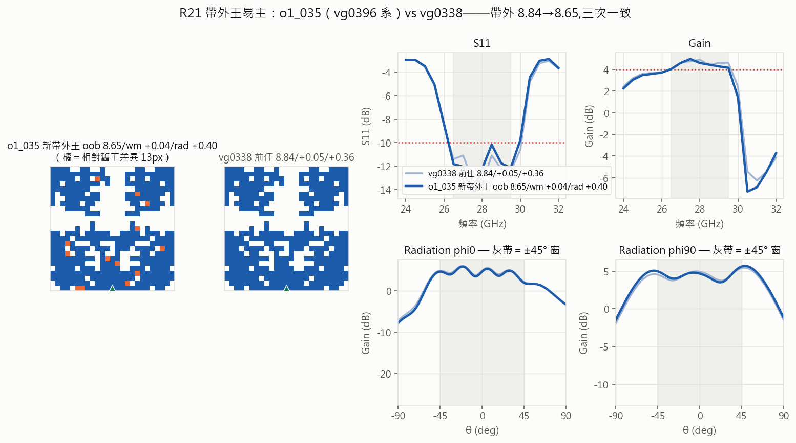

# Round 21 — 收割管線：隨機生成＋SM 帶外過濾（R20 贏家配方量產）

- **狀態**: running（2026-07-11 batch1 發車）
- **提出 / 開跑 / 結論**: 2026-07-11 / 2026-07-11 / —
- **一句話問題**: R20 選出的配方（隨機＋帶外過濾）能否穩定量產三標且帶外<10 的解＋margin 紀錄？
- **一句話結論 (TL;DR)**: 待跑
- **指向**: `select-r21harvest` · 前作 [round-20](round-20-evolution-loop.md)（三代終審＝配方依據）· Ricky 拍板 (a)

## 1. 假設 (Propose)
- R20 終審：SM 有效維度＝帶外（③19:10）、margin 大獎全出自隨機（+0.39/+0.36 皆 d1）、GA 選代拆除。
- **判準（發車前寫死）**：
  - **O 帶外收割臂**：「三標且帶外<10」佔比 ≥ **11%**（R20 GA 臂基準）＝配方成立；
    連兩批 < 6%（R20 隨機臂基準）＝配方失效，停批回檢。
  - **M margin 樂透臂**：三標過率對照隨機基準 ~22%；wm > +0.39 或 oob < 8.84 ＝紀錄候選。
  - **鐵則**：紀錄級單次一律下批搭載公證；毒名單（g2_029/t14/vg0795 血系）不入錨。
  - 前瞻 ρ 持續記（判讀看無偏 M 臂）；每批後重錨（v8,v9,…）。
- **停止/升級條件**：Ricky 喊停；或連兩批零紀錄候選且 O 臂效率跌破 6% → 回報討論。

## 2. 實驗設計 (Design)
- 每批 150＝O 75（pred_wm 砍尾 40%→pred_oob 升冪→多樣性）＋M 75（純隨機,不經 SM）。
- 錨點：現任榜加權（**c18 王朝血系重倉 ~50%**：r2_016/.14、r3_001/.14、vg0338/.10、vg0396+g1_038/.12）
  ＋自動吸收前批三標贏家（wm≥0.15 或 oob<9.5）。
- 算子：flips .50／addblock .28／rmblock .22（R19 校準的產優三傑）,鏈 1-2,d 1-25,強制可製造。
- 三夾 %3 交錯 → `jobs-add` prio 3;工廠自動並行,一批 ≈2hr。

## 3. 執行紀錄 (Run)
```
# 每批: python -m script.dedust select-r21harvest --batch N [--sm sm_reanchorX.pth]
#       check-dup ×3 → jobs-add ×3;收檔 → 判讀 → 重錨 → 下一批
# batch1: 2026-07-11 11:22 發車（150 筆,查重 0;SM=v7）
```
| 批 | 狀態 |
|---|---|
| 1（r21b1{a,b,c}） | ✅ 13:56（146/150;a 夾 4 error 重派中） |
| 2（r21b2{a,b,c}＋公證×2） | ✅ 16:35（146/150） |
| 3（r21b3{a,b,c}） | 🔵 準備中（v9） |

## 4. 分析 (Analyze)
**batch1（2026-07-11 13:56 收檔,146/150;4 error 已重派）**：
| 臂 | 三標過 | 三標且 oob<10 | best |
|---|---|---|---|
| O 帶外收割 | 17/73（23%） | **16（22%,門檻 11% 的 2×）✓ 配方成立** | o1_044_r2_016 +0.34/+0.02/10.14 |
| M 樂透 | 16/73（22%） | 8（11%） | m1_062_g1_038 +0.28/+0.24/9.37 |
- 兩臂三標率相同、帶外命中率差一倍＝過濾器價值的乾淨呈現。
- **紀錄候選：o1_035_vg0396 帶外 8.65**（<8.84,單次）→ batch2 公證 ×2。
- m1_012_g1_038 rad +0.60（距 rad 王 0.02,單次）;g1_038 錨點兩臂皆出貨。
- **前瞻（無偏 M 臂）：wm ρ +0.324（p=.005,歷來首次顯著）**、oob ρ +0.487——v7 在血系鄰域可用度上升。
- batch1 後重錨 v8（+gen3+r20n+vgen3+batch1）。

**batch2（2026-07-11 16:35 收檔,146/150;b1a 補測全清 error=0）**：
| 臂 | 三標過 | 三標且 oob<10 | best |
|---|---|---|---|
| O 收割 | 11/72（15%） | 10（**14%**,仍過 11% 門檻;兩批累計 18%） | o2_068 +0.24/+0.28/9.72 |
| M 樂透 | 15/74（20%） | 6（8%） | m2_001_r3_001 +0.38（d1,差 0.01 平紀錄） |


- **公證：帶外王三度易主——o1_035_vg0396 8.65**（2/2＝8.67/8.67＋batch1 8.65,三次一致;
  wm +0.04/rad +0.40 三標過）——收割管線首個獵物即紀錄;帶外地板再下修 ≈8.6。
- 血系動態：o1_016_g1_038 子代霸 O 臂前三（g1_038→o1_016=新礦脈）;r3_001 子代連出 +0.38/+0.37。
- 前瞻（M 臂）：wm ρ +0.301（連兩批顯著）;**oob ρ −0.07 本批崩**（batch1 0.487→波動,batch3 觀察）。
- ⚠ 4 error 血系集中（o1_040 子代 2/2、o1_016 子代 1）——毒名單觀察名單 +o1_040。
- batch2 後重錨 v9。

## 5. 結論 (Conclude)
（待）

## 6. 後續決策 (Next)
- 紀錄候選 → 下批公證;效率達標 → 續產;跌破 → 停批討論。

## 7. 歸檔指向 (Archive)
- 結果夾: `dataset/dedust_r21b*`
