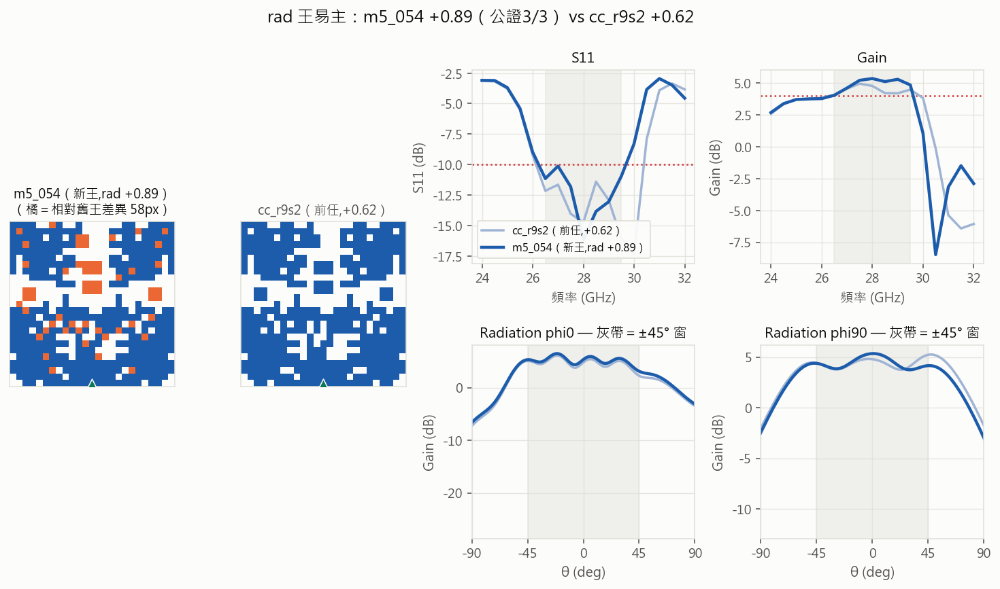
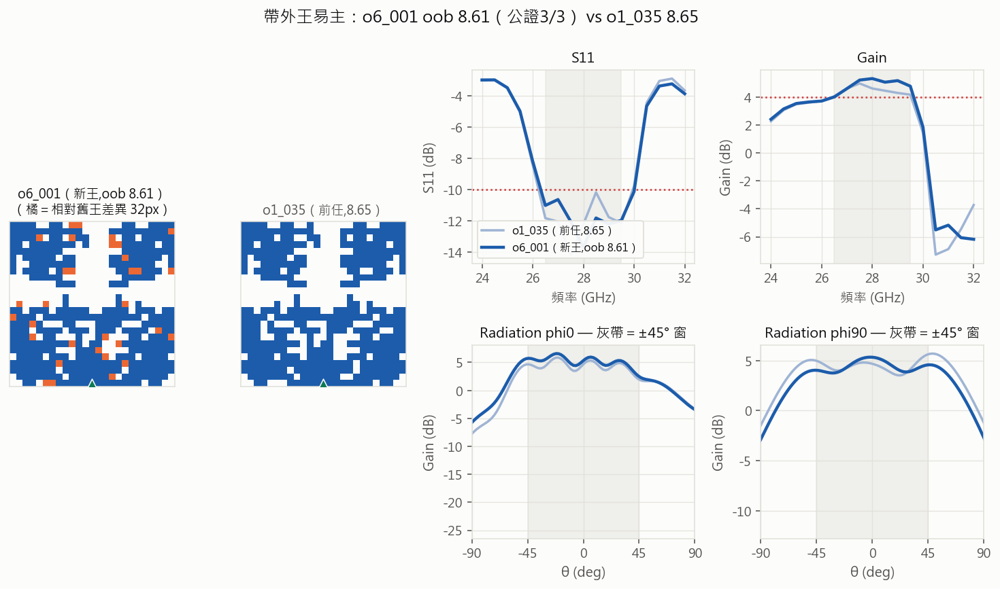

# Round 22 — 分布組合批：降王朝比例、六臂分散探索

- **狀態**: running（2026-07-12 03:22 b1 發車）
- **提出 / 開跑 / 結論**: 2026-07-12 / 2026-07-12 / —
- **一句話問題**: R21 的收效遞減是「王朝鄰域這個分布」枯竭所致嗎？——把預算分散到其他分布能否重啟紀錄產出？
- **一句話結論 (TL;DR)**: 待跑
- **指向**: `select-r22mix` · 前作 [round-21](round-21-harvest-pipeline.md)（遞減證據）· Ricky 拍板 2026-07-12
  「照這樣做,hslot 也進;短期內沒有取得足夠好的表現得容忍」

## 1. 假設 (Propose)

- **遞減證據（R21 四批）**：連三批零紀錄候選;wm best 卡 +0.35±0.03;王朝鄰域已採 ~570 筆;
  SM 帶外過濾增值歸零（O<M 連兩批、前瞻 oob ρ 連三批死）——「王朝鄰域 d≤25」這個分布的每筆新資訊在掉。
- **假設**：紀錄斷產是分布級枯竭,不是搜尋引擎壞掉（M 臂三標率穩定 15-27% 佐證引擎正常）→
  分散到未開採分布（冷支/偏科生修復/構造法）能重啟。
- **判準（2026-07-12 發車前寫死）**：
  - **C 冷支深耕 / Q 偏科生修復**：三標率 ≥6%（隨機基準）＝礦脈活、續跑;連兩批 <6% 收臂。
  - **Q 臂加判**：任一「三標且 oob<10」＝修復路線成立（偏科生的深帶外保住＋帶內修回）。
  - **H hslot 部分槽**：①劑量反應（lo_realized vs 槽長）方向與 R17 一致＝機理重現;
    ②**兩批內出「三標且 lo_realized<+1.0」→ 低側線重啟;否則低側正式收案**（沿用 R21 L 臂判準）。
  - **O 哨兵（10 筆）**：前瞻 oob ρ ≥0.3 復活 → O 臂回名額;否則維持哨兵量。
  - **紀錄候選**照 champions 門檻（wm>+0.39 / oob<8.65 三標 / rad>+0.62）→ 鐵則下批公證。
  - **期望管理（/gain-check 三層帳,2026-07-12 基線）**：M 臂邊際增益 ≈+0.058 dB/百筆（全程擬合＝樂觀上界）、
    近王級(≥+0.30)→紀錄推進轉換 ≈2.2:1;新臂走存活測試,**不給 dB 期望**——
    Ricky:工具本意＝避免對算法過早悲觀,短期整批三標率下滑是買分布資訊的價格,可容忍。
- **停止/升級**：Ricky 喊停;或全部新臂連兩批死＋M 臂近王斷產 → 帶 gain 儀表數字回報討論
  （候選出路:d1 殼層窮舉,見 ONGOING 🔜）。

## 2. 實驗設計 (Design)

- 每批 150＝O 10（pred_wm 砍尾→pred_oob 升冪,哨兵）＋M 50（兩池 70/30 照舊）＋
  **C 40（冷支池專屬配額**:a024/cc 系/c25/x00/g16/i02/vg0765＋無王朝標記吸收系;batch4 三標 55% 非王朝＝依據）＋
  **Q 30（錨=深帶外偏科生** w4_007(oob 4.54)/w4_003(8.94)/o3_020(5.41)/m2_046(8.30),
  pred_wm **降冪**選=用 SM 還活著的 wm 排序（+0.372）修帶內,棄用已死的 oob 排序）＋
  **H 12（構造法**:r3_001/a024/c25 × 槽長 3/5/8/12,主件最寬列開中央部分槽,決定性零 rng）＋W 8（d 26-60）。
- 算子照 R19 校準三傑（flips .50/addblock .28/rmblock .22,鏈 1-2）;吸收=R21 全史＋R22 前批（照 DYN 歸池）。
- id 前綴 {o,m,k,q,h,w}6（全域批號延續）;6 夾切片（慢機不拖全隊）。

## 3. 執行紀錄 (Run)

```
# 發車（等 batch5 收檔+v12）:
#   python -m script.dedust select-r22mix --batch 1 --sm sm_reanchor12.pth
#   check-dup ×6（dedust_r22b1{a..f}_input）→ jobs-add ×6 --prio 3
# 每批收檔: /gain-check + 臂別判讀 → 重錨 → 下一批
# b1 發車 2026-07-12 03:22（v12,查重 0×9;三機已 pull tier-2 搶佔碼重開）
#   搭載: r22n1=m5_054 rad 0.89 公證×2（prio 2,先跑）;
#   r21g2{a,b,c}=tier-2 填空池 72 筆（prio 9,空窗糧;每批收檔檢查存量<48 即補）
```
| 批 | 狀態 |
|---|---|
| n1（m5_054 rad 公證×2） | ✅ 03:25（**rad 王易主 +0.89 公證 3/3**） |
| 1（r22b1{a-f}） | ✅ 06:28（150/150 零 error;六臂首判） |
| n2{o,h,w}（三候選公證×2） | ✅ 06:50（**帶外王易主 8.61**/死區破確立/h6_010 假象攔截） |
| 2（r22b2{a-f},v13;C50/M40,H 錨輪替） | 🔵 06:44 發車（查重 0） |
| 填空池 | r21g2 35/72 已耗（tier-2 搶佔驗證✓）;補 r22g1×72（正名,prio 9） |

## 4. 分析 (Analyze)
**n1 公證（2026-07-12 03:25,37 機）——★ rad 王易主確立**：
| 次 | wm | rad | oob |
|---|---|---|---|
| batch5 原測（218） | +0.14 | **+0.89** | 9.14 |
| r00_rep（37） | +0.14 | **+0.89** | 9.14 |
| r01_rep（37） | +0.14 | **+0.89** | 9.14 |
- **m5_054_m3_026_m1_01 rad +0.89 公證 3/3,跨機 bit 級一致**——前任 cc_r9s2 +0.62,
  **+0.27＝rad 史上最大級跳**;且 wm +0.14 三標過、oob 9.14（帶外<10）＝三優型。
- 血統:g1_038（王朝）→ m1_012（b1 rad +0.60 單次,當時距王 0.02）→ m3_026 → m5_054——
  **樂透臂三代把 b1 的單次苗子養成了王**;與前任差 58px＝獨立山頭非近親。
- phi90 切面 +1.4:窗內全平頂;出處=M 樂透（純隨機）,再添「大獎出自隨機」一例。


**b1（2026-07-12 06:28 收檔,150/150 零 error——連三批全綠）——六臂存活首判＋三紀錄候選**：
| 臂 | 三標 | 存活判定 |
|---|---|---|
| O 哨兵 | 3/10（30%） | 續掛;★ **o6_001 oob 8.63**（差 0.02 破紀錄;o3_058 新礦脈系）→ n2 公證 |
| M 王朝 | 5/50（**10%**,b5 24% 驟降） | 觀察:錨點 101 稀釋嫌疑;前瞻 v12 wm ρ **+0.519 史上最強** |
| C 冷支 | **11/40（28%）** | **✓ 存活大勝**（門檻 6% 的 4.6×,反超王朝 M）→ b2 加碼 |
| Q 修復 | 0/30（0%） | ✗ 首批未過（連兩批 <6% 才收臂）;**方向有效**:m2_046 系帶內 −0.78→−0.22
  （+0.56）且帶外保持 8.2-9.0 → b2 續跑 |
| H hslot | 4/12（33%） | ✓ 三標存活;**lo 目標 0 筆**（劑量反應 ρ +0.19 n.s.,部分槽≠R17 整列槽）;
  意外:**L5-8 中槽=帶內旋鈕**（三錨皆 wm 增益,★ h6_010_c25 **wm +0.43** 挑戰帶內紀錄 g14 +0.40,
  rad −0.33 非三標）→ n2 公證 |
| W 彩票 | **1/8** | ★ **w6_006_ccr9s2 d=28 三標過（wm+0.09/rad+0.12/oob 9.57）＝26px 死區告破**
  （歷史 0/16;四段 flips 鏈）→ n2 公證 |
- 三候選皆單次 → `r22n2{o,h,w}` 各 ×2 公證（prio 2,tier-2 讓位實戰首測）。
- tier-2 搶佔實戰:b1 尾段 g2 池被吃 35/72、tier-1 到即讓位——空窗歸零機制驗證 ✓。
- b1 後重錨 v13（+b1 六夾+n1+g2a）;b2=C 加碼 50/M 40、H 錨輪替（r2_016/x00/g16）、Q 續跑 30。

**n2 公證判定（2026-07-12 06:50）**：
| 候選 | 原測 | 重測 ×2 | 判定 |
|---|---|---|---|
| o6_001 帶外 | 8.63 | **8.61/8.61**（wm 0.00/rad 0.32 三標） | ★ **帶外王易主 公證 3/3**（前任 8.65;榜鏈 9.04→8.84→8.65→8.61） |
| w6_006 d28 | +0.09 | **+0.09/+0.09 全復現** | ★ **26px 死區告破確立**（歷史 0/16 → 錨 cc_r9s2 四段 flips 鏈） |
| h6_010 wm | +0.43 | **+0.35**（−0.08） | ✗ **假象攔截第三例**（<g14 +0.40;帶內挑戰不成立,量測敏感樣本） |
- 帶外新王=o3_058 礦脈三代（o3_058→o4_035→o6_001,batch4 判讀點名的新礦脈兌現）;與前任差 32px。


## 5. 結論 (Conclude)
（待）

## 6. 後續決策 (Next)
- 新臂存活 → 加碼該分布;全滅 → d1 殼層窮舉候選（ONGOING 🔜）。

## 7. 歸檔指向 (Archive)
- 結果夾: `dataset/dedust_r22b*`
