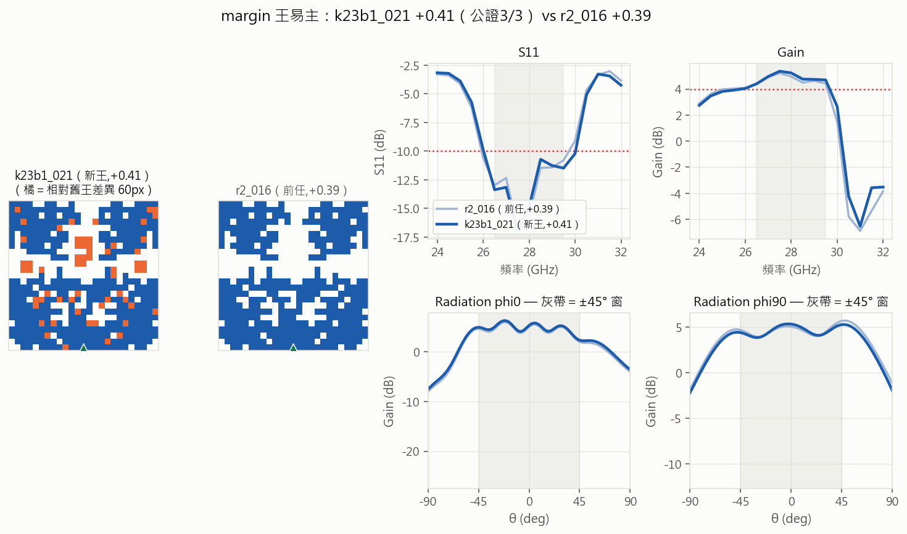
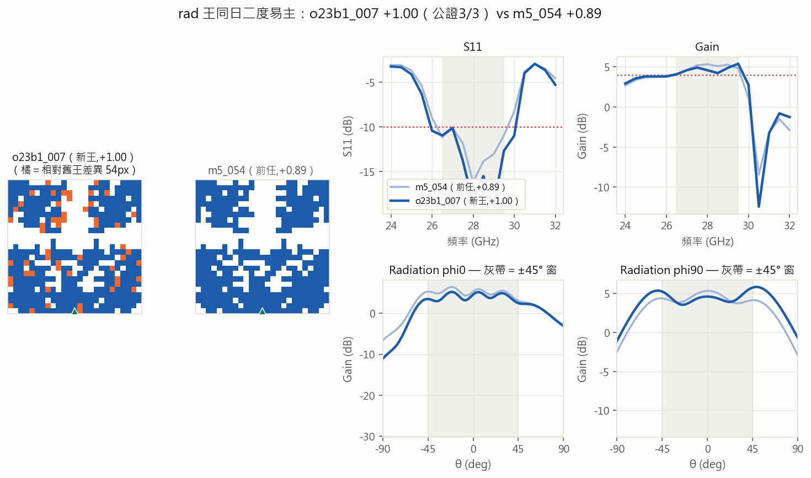

# Round 23 — 價值軸主戰：sel_score 選批，壓「可用帶外」

- **狀態**: archived（2026-07-13 收輪,四批＋公證;R24 降根接棒）
- **提出 / 開跑 / 結論**: 2026-07-12 / 2026-07-12 / —
- **一句話問題**: 以 sel_score（三標硬閘＋帶外主鍵）直接當選批鍵，「可用帶外」（wm≥+0.15∧rad≥0 的
  min oob，基線 **9.09**）能壓多深？刀鋒稅（vs 科學紀錄 8.61 的 0.48 差距)能否縮小？
- **一句話結論 (TL;DR)**: 待跑
- **指向**: `select-r23` · 價值軸定案（Ricky 2026-07-12,decisions「價值軸修正」）·
  前作 [round-22](round-22-distribution-portfolio.md)（分布組合＝C 冷支確立/Q·H 判死/三公證紀錄）

## 1. 假設 (Propose)

- **價值軸（Ricky 定調）**：三標＝硬閘門，過線後帶內餘裕邊際價值 ≈0，收益軸＝帶外壓低。
  `sel_score = oob_bad + 10·max(0, 0.15−wm) + 10·max(0, −rad)`（越低越好;dedust.sel_score）。
- **假設**：選批鍵從「wm 砍尾→oob」改為 pred_sel 升冪後，「可用帶外」會比 R21/R22 的
  副產品式進步（9.37→9.09）更快下壓——因為預算第一次直接花在這個量上。
- **判準（2026-07-12 發車前寫死）**：
  - **主指標＝可用帶外紀錄**（wm≥+0.15∧rad≥0 min oob）：基線 9.09（k7_038,R22b2 C 臂）。
    任一批推進（<9.09）＝方向成立;**連三批零推進 → 回報討論**。
  - **O 主力臂（sel 鍵,50/批）**：「合格解率」（wm≥0.15∧rad≥0∧oob<10）對照 M 臂同指標——
    連兩批 O≤M ＝ sel 鍵無增值（v7 過濾器教訓的複測),回報討論。
  - **S 槽鏈臂第二批（15）**：判準沿用 R22 §1 修訂原文——三標且 wm≥+0.30＝成立;
    三標率連兩批 <6%＝收臂（R22b3＝第一批,本輪 b1＝第二批）。
  - **C 冷支（42）**：既確立臂,三標率 ≥6% 續跑;連兩批 <6% 回檢。
  - **紀錄鐵則**：科學紀錄（oob<8.61/rad>0.89/wm>0.39）與可用帶外紀錄（<9.09）皆單次→下批公證。
  - **rad 頭（K=16,Ricky 提議）**：pred_rad **一律**隨 manifest 記（供前瞻驗證）;
    **進選批鍵（--rad-key）門檻＝held-out ρ≥0.4 或 M 臂前瞻連兩批 ρ≥0.4**。
    首訓（rad_head1,30ep,4065 筆）held-out ρ=+0.331/MAE 0.80——未過門檻;
    **第二訓（rad_head2,100ep）ρ=+0.498（p=7e-37）過門檻 → b1 起 --rad-head rad_head2.pth --rad-key
    進鍵**（兩次試訓用完;後續以每批 M 臂前瞻 ρ 監督,連兩批 <0.3 即退鍵）。
  - 每批 /gain-check（oob 階梯=旗艦儀表）;每批重錨;查重必跑。
- **停止/升級**：Ricky 喊停;或主指標連三批零推進＋O≤M 連兩批 → 帶儀表數字回報
  （備選出路:d1 殼層窮舉、sel 鍵下的定向 GA）。
- *修訂（2026-07-12 傍晚,b3 發車前、b3 結果未回;Ricky「非王朝要有常設比例+針對訓 SM」＋
  「允許漸進式增長,前期很爛沒關係」）*：**D de novo 常設臂 12/批（學費預算制）**——
  池外隨機塊構造,篩選用 **sm_harvest 34k 底座**（現存分布最廣=「非王朝 SM」v0;
  資料 ≥36 起訓 sm_denovo 接棒,與底座 held-out 對決誰準用誰）。
  **判準＝學費預算制**:投資額度 5 批×12;前期 KPI=進步趨勢（best wm 逐批/sm_denovo held-out ρ 逐批）,
  **三標=畢業（轉正加碼）非存活條件**;5 批燒完帶趨勢數據回報 Ricky 裁決,**不自動處決**。
  名額調整:O 46/M 33/C 40/S 15/D 12/W 4（W 死區問題已答,減半讓位）。

## 2. 實驗設計 (Design)

- 每批 150＝O 50（pred_sel 升冪＋多樣性;SM 無 rad 頭→rad 罰項僅量測後生效,選批時 sel≈oob+wm 罰）
  ＋M 35（純隨機對照）＋C 42（冷支專屬）＋S 15（槽鏈第二批）＋W 8（彩票）。
- 錨點兩池 70/30＋吸收（R21/R22 全史贏家）;算子三傑;毒名單照舊。
- 命名照規範:夾 `dedust_r23b<N>{a-f}`、id `{o,m,k,s,w}23b<N>_*`、公證 `r23n*`、填空池 `r23g*`。
- 6 夾切片＋tier-2 填空池墊底（佇列永不見底）。

## 3. 執行紀錄 (Run)

```
# 發車（R22 收檔+v15 後）: python -m script.dedust select-r23 --batch 1 --sm sm_reanchor15.pth
#   check-dup ×6 → jobs-add ×6 --prio 3;池存量 <48 補 r23g*
```
| 批 | 狀態 |
|---|---|
| 1（r23b1{a-f}） | 🔵 13:28 發車（v15;--rad-head rad_head2 --rad-key;S 錨輪替;查重 0×9） |
| r23g1 填空池（72,prio 9） | 🔵（前池被 b3 尾段耗盡,照政策補） |

## 4. 分析 (Analyze)
**b1（2026-07-12 16:02 收檔,150/150 零 error——連六批全綠）——sel 鍵首批雙紀錄候選**：
| 臂 | 三標 | 合格率(wm≥.15∧rad≥0) | 判定 |
|---|---|---|---|
| O sel 主力(50) | 15（30%） | **10%** | **首批 O>M（10% vs 6%）＝sel 鍵有增值**（判準:連兩批 O≤M 才收） |
| M 對照(35) | 6（17%） | 6% | 前瞻 v15:wm ρ +0.09/oob +0.10 死;**rad 頭首戰 ρ=+0.610（p<.001,勝 held-out 0.498）** |
| C(42) | **19（45%）** | **24%** | 四批遞增 28→28→34→45%;兩個紀錄候選皆其血系 |
| S 二批(15) | 2（13%） | 13% | 存活（≥6%）;本批無 ≥0.30（b3 已達標一次）;錨輪替後 c25/r3_001 子代仍多死於製造閘 |
| W(8) | 0 | 0% | 累計 1/40 |
- **★ 紀錄候選 ×2（單次）→ r23n1{w,r} 公證 ×2**：
  **k23b1_021_m22g1_025_cc wm +0.41**（挑戰 margin 王 +0.39;rad +0.11/oob 9.68 合格級;
  血統=cc_r9s2→g1 填空批 m22g1_025→k23b1_021——**填空池直接參與了紀錄鏈**）;
  **o23b1_007_k8_042 rad +1.00**（挑戰三小時前登基的 rad 王 +0.89;C 臂 k7_004→k8_042 血系）。
- 可用帶外:本批 best 9.4（k23b1_019）,未破 9.09（第一批;連三批零推進才觸發回報線）。
- b1 後重錨 v16;b2 同組成續產（rad 頭前瞻過 0.3,續鍵）。

**n1 雙公證判定（2026-07-12 16:14）——雙王同日易主**：
| 候選 | 原測 | 重測 ×2 | 判定 |
|---|---|---|---|
| k23b1_021 | wm +0.41 | **+0.41/+0.41** | ★ **margin 王易主**（前任 r2_016 +0.39;且 oob 9.68 合格級=新王本身就是三優解） |
| o23b1_007 | rad +1.00 | **+1.00/+1.00** | ★ **rad 王同日二度易主**（m5_054 +0.89 在位 13 小時;rad 頭進鍵首批即出 rad 王） |
- 兩王血統皆出 C 冷支系,margin 王還經過 g1 填空池——**冷支×填空池×sel 鍵的合成產物**;
  c18 王朝的 margin 線（r2_016/r3_001）首次被 cc_r9s2 家族推翻（差 60px=異山頭）。



**b2（2026-07-12 19:08 收檔,150/150——連七批零 error）**：
| 臂 | 三標 | 合格率 | 判定 |
|---|---|---|---|
| O sel(50) | 17（34%） | **20%**（b1 10%→翻倍） | **連兩批 O>M（20% vs 6%）＝sel 鍵增值確認**;新王子代 o23b2_006 已出貨（+0.32/9.72） |
| M(35) | 6（17%） | 6% | 前瞻 v16:wm +0.23 n.s./**oob +0.448（p=.007）復活**/**rad 頭 +0.465 連兩批過線=續鍵** |
| C(42) | 10（24%） | 12% | 從 45% 回落但健康 |
| S(15) | 4（27%） | 27% | 存活;無三標且≥0.30（b3 續） |
| W(4→8 舊額) | 0/8 | 0% | 累計 1/48 |
- 可用帶外:best 9.27 未破 9.09——**連兩批零推進,b3=回報線前最後一批**。紀錄候選:無。
- b2 後重錨 v17;b3=D 臂學費首航（O46/M33/C40/S15/D12/W4）。

**b3（2026-07-12 22:38 收檔,150/150——連八批零 error）——回報線觸發＋停滯協議首用**：
| 臂 | 三標 | 合格率 | 註 |
|---|---|---|---|
| O sel(46) | 10（22%） | 11% | 仍 >M（9%）但差距縮 |
| M(33) | 6（18%） | 9% | 前瞻 v17:wm +0.30 邊緣/oob 死/**rad 頭 +0.097 首破 0.3**（0.61→0.47→0.10;連兩批<0.3 才退鍵,b4 觀察） |
| C(40) | 10（25%） | **18%** | 穩;可用帶外 top5 佔四席 |
| S(15) | 1（7%） | 0% | 存活線上緣（>6%）;R22b3 已達標過,續跑 |
| **D 首航(12)** | 0（學費制預期內） | 0% | **學費基線:best wm −7.66**;帶外狂野——d23b3_000 **oob 0.29**/兩筆<4.1
  ＝池外存在極端選擇性交換點（碎片區信念第一筆實測佐證,詳 scratch）;批 1/5,資料 ≥36 起訓 sm_denovo |
| W(4) | 0 | 0% | — |
- **★ 回報線觸發：可用帶外連三批零推進（9.4→9.27→9.29 vs 9.09）→ /stall-protocol 第一層驗屍:
  三道全綠（同輪雙王易主=多軸爆發/C 臂梯子施工中 9.29 貼線/近王在產）＝非真停滯 → 照戰略定調續產**
  （Ricky 2026-07-12:停滯=暫時,常升目標=探索×資料量）;已回報使用者。
- L0:全史真值 4,800+;本線探索類 26%。**弱模型化驗收:本批全程照 /batch-cycle 文本執行 ✓**。
- b3 後重錨 v18（`train --add` 一鍵首用）;b4 同組成,--rad-key 保留觀察。

## 5. 結論 (Conclude)
（待）

## 6. 後續決策 (Next)
（待）

## 7. 歸檔指向 (Archive)
- 結果夾: `dataset/dedust_r23b*`
