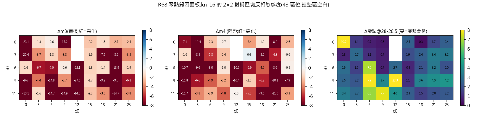

# Round 68 — dual 零點歸因輪:kn_16 區塊敏感度地圖(m3 死軸的結構解)

- **狀態**: running
- **提出 / 開跑 / 結論**: 2026-08-13 / 2026-08-13 / —
- **一句話問題**: R67 判定 m3(S21 通帶)=位元語言死軸;但缺口拆帳顯示 3dB 主成分=
  **帶中 28-28.5 GHz 傳輸零點+帶緣塌落(形狀非耗散)**——用系統性區塊翻轉面板找出
  「零點跟哪個結構區走」,存在 m3 選擇性旋鈕就 b2 定向手術。
- **指向**: [round-67](round-67-dual-dynasty.md) §5(m3 死軸二連證+缺口拆帳)·
  [round-56](round-56-block-ablation.md)(single 組消融方法論前例)·records_dual(wm_r2 −3.05)

## 1. 假設 (Propose)

**假設**:kn_16 的帶中零點由特定局部結構(諧振器/耦合縫)產生;2×2 對稱區塊翻轉面板
能定位它,且存在「動 m3 不砸 m4'」的區位(通濾非完全同源)。

- **判準(發車前寫死,2026-08-13 00:2x,b1 尚未生成)**:
  1. **儀器判準**:存在 ≥3 個區位使 Δm3 ≥ +0.3(通帶改善)或 |ΔS21@28-28.5| ≥ 1.5dB,
     且 Δm4' ≥ −1 → **「m3 選擇性旋鈕存在」**,b2=該區位組合/細掃手術。
  2. **鎖死判定**:所有動得了 m3 的區位都同時 Δm4' < −2 → 通濾同源鎖死 →
     25×25 規格 v2 可達性降級,R69=50×50 匯合決策(接先斬後奏線)。
  3. 副產出(無論成敗):zero-map(S21@28/28.5 對區位的位移圖)+六軸敏感度地圖入 assets。
  4. 面板=kn_16 單親(歸因乾淨);2×2 區塊對稱翻轉,格點 r0∈{0,3,6,9,11}×c0∈{0,3,..,23}
     (~45 筆,饋墊區自動豁免);全數入鍋;≤3 批必收輪。
- 修訂紀律:結果回來前+日期註記。

## 2. 實驗設計 (Design)

親本=d62b3_kn_16(wm_r2 王 −3.05,m4' +0.03,S21 通帶中位 −3.7 但 28-28.5 吸點 −6.05)。
變體=位置 (r0,c0) 的 2×2 區塊連同上下鏡像區塊一起「反相」(0↔1),饋墊由 dual_pads 復原;
與親本重複/超出金屬範圍者由 gate 剔除。seed=68001 決定性(面板本身是枚舉,無隨機)。

## 3. 執行紀錄 (Run)

| 事件 | 狀態 |
|---|---|
| 開檔+判準寫死 | 2026-08-13 00:2x |

## 4. 分析 (Analyze)

### b1 面板判讀(2026-08-13 01:0x 收檔;43/43 零 error)

1. **判準①過:選擇性旋鈕 4 個**——(3,15)(零點動 1.91、m4' **+0.61 反而變好**)、
   (6,23)(零點 2.00/m4' −0.47)、(3,23)(零點 3.20/m4' −0.64)、(11,12)(零點 4.04/
   m4' −0.29)。**鎖死判定②未觸發**:33 個 m3/零點敏感區位中 4 個不砸阻帶=通濾非完全同源。
2. **結構解剖**(對照地圖):①右側 c15-23 帶=「零點調諧區」(動零點不動阻帶);
   ②(0,9)/(3,0)=「通帶命脈」(m3 崩 −17/−20 而 m4' 幾乎不動——載流路徑);
   ③中央脊柱 r9-11×c0-12=全軸連動核心((9,12) 零點狂移 22.3dB 但全崩);
   ④面板全 43 筆 Δm3 無一為正=2×2 反相粒度對「改善」太粗,只能歸因不能手術。
3. 面板 best wm_r2 −3.67(未破王,符合預期——探針不是手術)。

### b2 判準(發車前寫死,2026-08-13 01:1x,b2 尚未生成)

1. **主判準(細手術)**:旋鈕區(3,15)/(6,23)/(3,23)/(11,12)的 4×4 窗內
   **單像素對稱翻轉**全枚舉+旋鈕區內 2px 組合:任一 **Δm3 ≥ +0.3 ∧ Δm4' ≥ −0.3** →
   「m3 微調旋鈕實證」,b3=組合爬山;任一 wm_r2 > −3.05 → 破王公證。
2. **全滅判定**:90 筆無一 Δm3 > 0 → 1px 語言在旋鈕區也死 → R68 收輪,結論=
   「25×25 位元語言全譜(d1-10/嫁接/SM/2×2/1px)死於 m3」→ 50×50 匯合(證據鏈完整)。
3. ≤3 批必收輪。

### b2 判讀(2026-08-13 02:4x 收檔;90/90 零 error;單次)

1. **判準①命中 0**(Δm3 ≥ +0.3 ∧ Δm4' ≥ −0.3 無一筆);破王 0(best −3.27)。
2. 誠實記帳:判準②字面(「無一 Δm3 > 0」)未嚴格觸發——有 2 筆正 Δm3(+0.46/+0.11,
   全出 k(3,15) 窗、全是**挖空**、共同活性成分=(2,16) 格),但代價 m4' −8.05/−6.47
   =**匯率 1:17**。續行條件①=0 → 依判準意旨不開組合爬山。
3. **25×25 位元語言全譜至此判死於 m3**:d1-10 鄰域/嫁接/SM 定向/2×2 反相/1px/2px
   手術,六種粒度全數無法在不砸阻帶下抬通帶。
4. 域內最後一把刀=R60 亞像素縫(b2 只證明「整像素劑量」匯率 1:17;若匯率隨劑量
   **非線性**——小劑量買到不成比例的 m3——25×25 仍有路)→ b3 劑量反應實驗。

### b3 判準(發車前寫死,2026-08-13 02:5x,b3 尚未生成;本輪最後一批)

亞像素縫劑量反應:位點 A=(2,16)+鏡像(b2 活性成分)/B=(5,15)+鏡像/C=A+B/
D=(2,15-17) 長縫,寬度 w ∈ {0.05, 0.10, 0.15}mm——12 個(位點×寬度)單樣本店,
bits 全=kn_16(kind=slotw,查重豁免,**永不入鍋**,`_pot_eligible` 已加閘+回歸測試)。

1. **可行旋鈕判定**:任一組合 Δm3 ≥ +0.3 ∧ Δm4' ≥ −1 → 「亞像素縫=m3 旋鈕」,
   R69=縫參數精掃+多縫組合(25×25 續戰);
2. **線性鎖死判定**:Δm3/|Δm4'| 匯率與整像素(0.46/8.05≈1:17)同量級等比縮放 →
   通濾同源鎖死到亞像素尺度=**25×25 判死,50×50 匯合**(證據鏈:六粒度+劑量反應);
3. 全部無感(三軸 |Δ|<0.1)→ 縫太細無效,結論同 2(域內無旋鈕)。
4. ≤3 批鐵則:b3 收檔即收輪。

## 5. 結論 (Conclude)

## 6. 後續決策 (Next)

## 7. 歸檔指向 (Archive)
