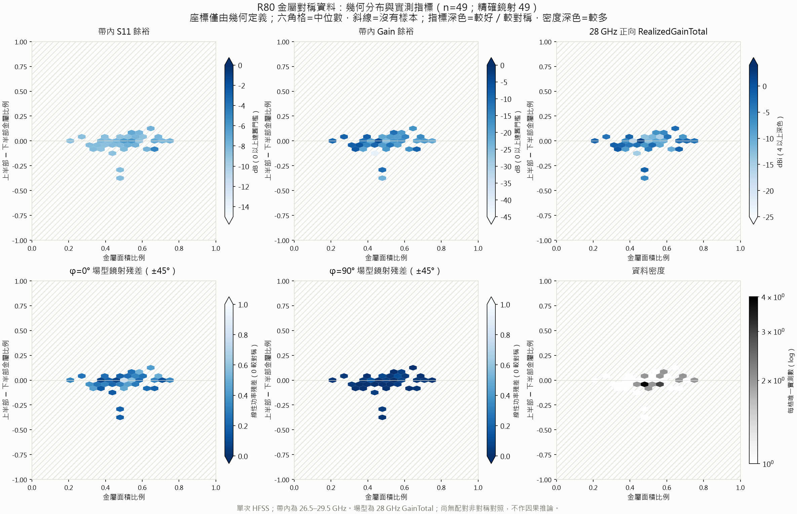
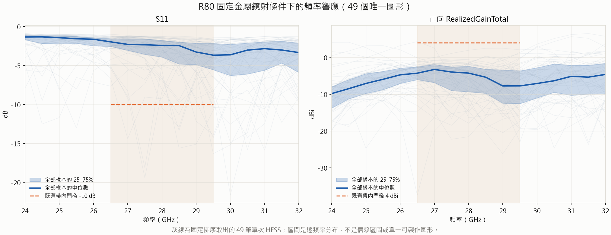
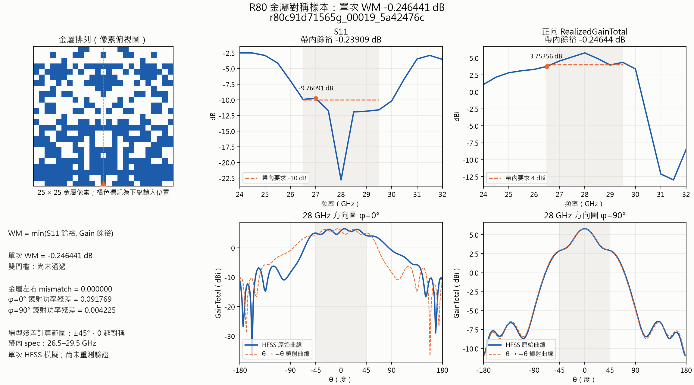
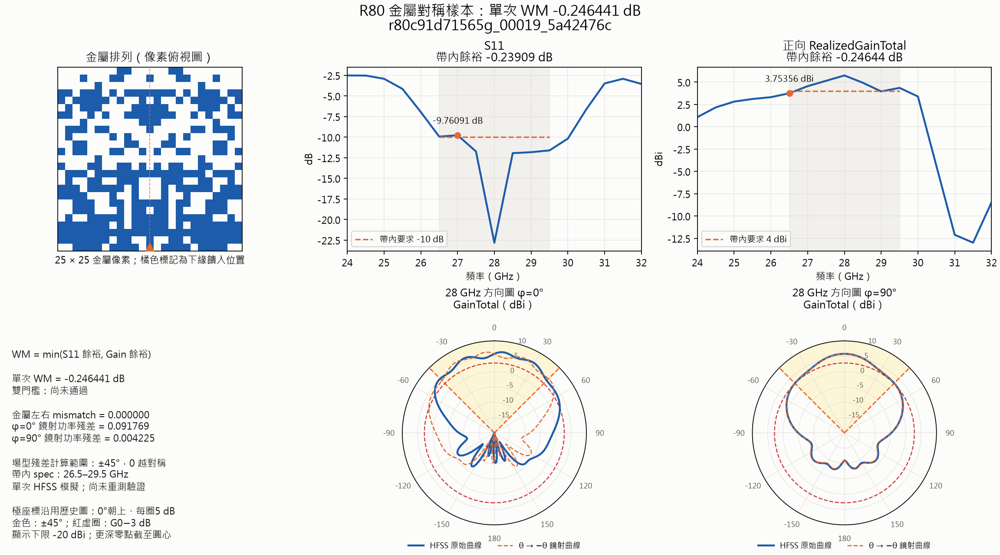
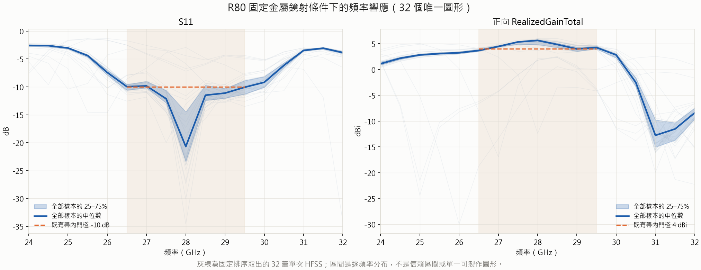
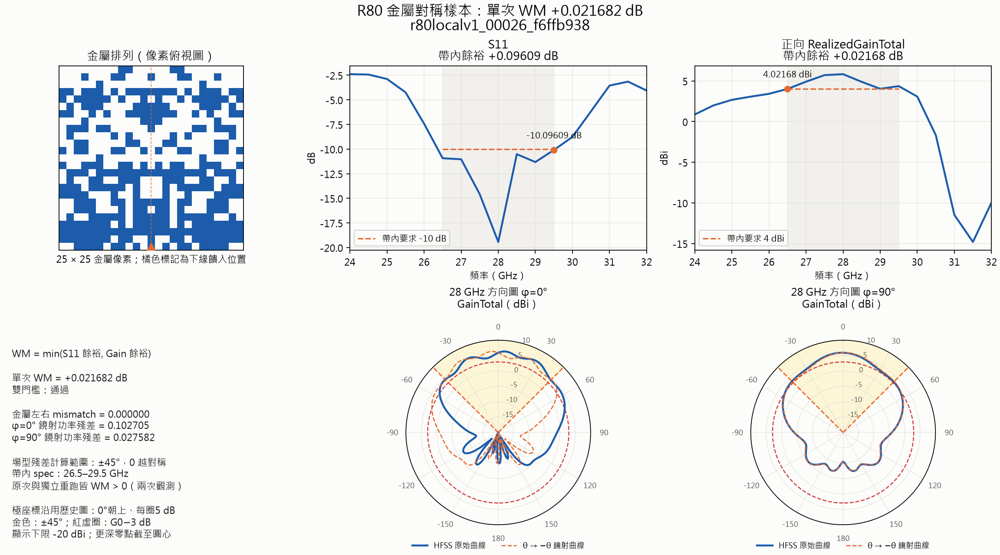

# R80：金屬對稱下的場型與頻率響應探索

最新狀態（2026-10-09 16:04）：family development controller已接手；2,359唯一實測截點／5,000，最佳圖見本文末段。開篇與中間紀錄為當時設計／歷史狀態，後續使用者5,000目標及操作紀錄覆蓋最初三批上限。

2026-10-09 16:44更新：首輪新protocol已完成模型更新與48筆派工，fit2,344／固定dispatch截點2,373。新候選HFSS真值尚待，不以這個里程碑改寫最佳WM或宣稱性能提升。

2026-10-09 17:17更新：使用者要求的最新全量最佳查詢為2,431唯一成功pattern；最佳仍同一個，極座標圖與收據见本文末段。

2026-10-09 17:46更新：最新只讀全量查詢為2,458唯一成功pattern；最佳仍同一個，依使用者要求沿用既有腳本重新渲染，圖與原始曲線核對見本文末段。

日期：2026-10-07。狀態：實作與本機備料；尚無本輪 HFSS 結果。沿用 Antenna，不遷移 emforge。

## 問題與歷史

本輪問的是「金屬左右對稱時，兩個主切面的實際場型如何變化，與 S11/Gain 有何關係」。
金屬對稱是本輪實驗條件；場型對稱、S11 與 Gain 都是待觀察的結果。
不將場型不對稱量放進最佳化 loss，也不用 4 dBi、舊 ±45° 餘裕或 S11 過線篩掉送測候選。

原單埠 spec 的 Gain 為正 z 軸 boresight **RealizedGainTotal**，26.5–29.5 GHz ≥4 dBi；
S11 同頻帶 ≤−10 dB。歷史 rad 則是 28 GHz 的 **GainTotal**、phi=0/90 兩切面；
舊 ±45° 相對 boresight 的 3 dB 窗與前者不是同一個量。
本輪保留這些背景，但不新增「場型對稱才合格」的正式 spec。

歷史脈絡：R54 明確化菱形橋；R55 的事後鏡射樣本屬舊目標下的局部探針，不能據此否定新的探索。
R73 線上迴圈未勝批次流程；R75–79 及 analysis-16/17 顯示家族與採樣偏差。
因此採用原有批次架構，但把探索、量測、評分與舊資料匯入分開。
歷史統計見 [analysis-18](analysis-18-symmetry-census.md)，其快取來源限制須一併閱讀。

## 固定設計

- 25×25，左 12 欄與右 12 欄精確鏡射；中欄自由、中心饋點保留。
- 橋寬 0.1 mm；用 simulator 同一份 `diag_bridge_sites` 檢查實體橋亦鏡射。
- S11/RealizedGainTotal：24–32 GHz、0.5 GHz，共 17 點。
- rad：28 GHz，phi=0/90，原始 theta −180..180、步距 2° 全保留；SM 預測 ±90° 的兩條 91 點曲線。
- 每批 48：random、幾何覆蓋、ensemble disagreement、預測曲線多樣性各 12，最多 3 批共 144 個新圖形。
- 另選兩個幾何相距較遠的首批代表，各增加兩次重測，共 4 次，分開保存。
- 首批沒有本 profile 真值模型：SM 兩臂明記 fallback；第二、三批才用前批模型。
- 每批先比較**送測時保存的預測**與新真值，再匯入訓練；分列 S11/Gain/phi0/phi90 MAE。
- 訓練兩個 CPU MLP；按 lineage 與 geometry profile 分组 holdout，不能用近親變體隨機拆分灌高分。

## 判讀與停止

主要報告金屬 XOR 對稱度、兩切面的線性功率對稱指標、波束質心、Gain28、S11/Gain 頻率曲線、
密度與幾何覆蓋。低 Gain、差匹配與場型不對稱樣本仍保留；數值損壞/缺失則另記錯誤。
比較探索臂的覆蓋與 prospective SM 誤差，不把「找到合格解」當作本輪成功條件。
完成三批即收輪；缺資料、模型無效或 HFSS 不穩時明記原因，不暗中擴充預算。

配置：[single_r80_symmetry_explore.yaml](../../configs/single_r80_symmetry_explore.yaml)。
操作：[共同 runbook](symmetry-filter-20261007-runbook.md)。沒有新實測前，不寫成「對稱已改善場型」。

## 2026-10-07 排程更正（append-only）

本次先執行首批48個圖形及兩組各2次重測，共52次；先前「最多三批」仍是研究設計上限。第二、三批未預先產生或混入首批佇列，會在前一批收檔、稽核與模型回填後依序產生。worker由使用者啟動，目前尚未開始HFSS。

備料預設為 `--phase single`，只讀34個R55 seeds。local controller為 `tmp/r80_symmetry_20261007_single/single`，NAS初始備份為 `controller_initial/single`。已部署並逐檔比對158個檔案；`-CheckOnly`確認三個single jobs共52次，combined queue會在worker前遭拒。完整pytest **544 passed / 361.29秒**，golden bytes不變；worker實作 `29a6834` 已推送Git `main`，舊ZIP不再使用。HFSS尚未開始，實際結果仍待正式機量測。

## 2026-10-07 分支更正

使用者確認 Antenna 開發與每台 worker 全部使用 `GAN`。初次交付只推送 `main`，導致尚未更新的 `GAN` 缺少啟動腳本；已補推至 `GAN`（`b3f1064` 包含已驗證的 worker）。此後以 `git checkout GAN`、`git pull --ff-only origin GAN` 更新；操作文件與私人 NAS 啟動說明同步採用 `GAN`。原始部署收據保留首次交付歷史，量測設定與佇列不變。

## 2026-10-07 18:16 台北：啟動與監看

使用者回報三台已啟動，並授權每30分鐘檢查直到對稱與後續spec任務完成。NAS首次檢查：218主批3/48成功；216重測1的2/2完成，完整sample/rad hash與observation重播通過；重測2一筆出現HFSS RPC錯誤，既有worker尚可重試。認領檔只觀察到216/218，不能由此聲稱第三台已實測。原始快照與限制見[監看收據](assets/r80_monitor_start_20261007.json)。目前尚未將首批局部結果用於SM訓練或後批選樣。

## 2026-10-07 18:34 台北：依使用者新指示擴大資料工廠

使用者明確將主目的改為至少10,000筆有效、唯一、精確金屬鏡射的HFSS資料，盡量利用SM優化S11、Gain與場型，允許歷史非對稱資料訓練及大量低tier預備池。這項新授權覆蓋前述「最多三批即停」的總預算；舊首批48及重測snapshot保留。工廠目標10,240筆，三批仍可作研究檢視節奏，並非資料停止條件。1.5週對三台等於每台平均每筆約272秒；這是吞吐需求，尚非實際完工預測。

依[論文§III](../paper/manuscript-draft-2026-10.html#method)與歷史`select-smpool`，採用資料回饋的批次學習：新資料先做預測前瞻稽核，再以累積新真值更新模型、挑下一批。初始更新間隔48筆有效唯一新資料；重複驗證不灌水計數。SM高分/分歧/盲選約40/30/30，保留完整曲線與模型版本，低性能有效資料也入學習池。v108歷史SM只作冷啟動先驗，其rad前瞻ρ=0.213不足以宣稱可靠，因此保留軟訊號和配額，隨新資料檢查。

原48筆不可拆搶；補充job各16筆、同一tier可供不同worker各自認領。初始盲選預備池2,048筆（34個R55 seeds多親本變異與全域新圖形），先釋出64筆，SM正式小批prio1；補池prio6。prio6低於worker預設tier2讓位門檻8，避免現存「求解後、存檔前讓位」路徑浪費剛算完的一筆；16筆job在批界交回排程。本次不改live worker。配置見[single_r80_symmetry_factory.yaml](../../configs/single_r80_symmetry_factory.yaml)。

18:34:56已將四個16筆小job `dedust_r80g00111`–`dedust_r80g00114`加入私人NAS佇列；每job包含8筆全域新圖形及8筆不同親本變異，無SM分數篩選。64筆均通過具名profile、橋接/鏡射/饋點、檔案hash及獨立check-dup；重複檢查成功後才發車。預備池不是已量測資料；目前未宣稱這64筆完成。[備料與派送證據](assets/r80_factory_buffer_20261007.json)。

## 2026-10-07 18:46 台北：首波SM選樣與三機實測

使用v108三個響應模型及rad head冷啟動，10,000個候選經精確鏡射、feed/橋接驗證後選32筆；配額為性能13、分歧10、盲選9。候選生成包含多親本變異、演化及全域探索；rad只作裁剪後的弱導航項。保留模型hash與量測前S11/Gain/兩切面曲線，拆成`dedust_r80b2a/b`各16筆、prio1，獨立查重後於18:45送出。此32筆與2,048盲選預備池及初始pilot均去重；SM預測不列入真實資料點數。

完整選樣/模型hash/分片/派送收據見[SM首波證據](assets/r80_sm_wave_20261007.json)。後續模型版本/量測身分/已訓唯一樣本數由checkpoint綁定，不接受呼叫端任意宣稱；舊v108固定冷啟動0筆。`snapshot_successes`可將長批已成功的資料另建不可變子集合（標記partial_snapshot），保持原工作繼續跑，使48筆新資料的更新節奏不必等待整個48長批結束。

18:46:31私人NAS實體稽核：23次有效量測、20個唯一圖形；主批14/48、補池兩job為2/16及3/16，兩組重測均2/2完成。216的RPC失敗已由既有重試恢復；216/218/37均有認領及實測進展。solver time中位174秒尚不含全部等待/重試/重開開銷，不能直接承諾1.5週。原監看只數wm會漏掉observation-only結果，已增加具名成功欄位與私人scope入口。[本次收據](assets/r80_factory_snapshot_20261007_1846.json)；下次例行檢查19:16。

### 18:56 工程驗證

完整既有回歸及本次選樣/分片/监看套件574 passed /329.30秒，golden原始bytes不變、零warning；該次明確排除仍在開發的`test_symmetry_training.py`。最終分片快照、模型身分绑定及catalog變更另跑53 tests /4.88秒全部通過，pyflakes/diff通過。第一輪曾發現catalog將新factory模式誤套舊三批validator，已改為專用完整factory白名單驗證；未修改live worker求解程式。訓練模組及實際新資料更新是下一個獨立里程碑，本段不宣稱已完成訓練。

### 19:05 親本家族識別修正

對照34筆實際seed manifest發現，同一`t07_top`家族的多個鏡射變體具有不同seed ID。初版SM生成器以seed ID記ancestry，首波收據的13種ancestry因此是seed來源數，不能當作13個獨立家族。後续生成器改用明確canonical_group/lineage，再退回個別seed ID，保留source_id追溯個體；11項選樣回歸通過。已排入NAS的32筆輸入/預測不回寫；其訓練分組另以已知seed→家族對應處理，不藉修改原始資料補證據。

### 19:08 新資料批次訓練介面

`symmetry_training.py`已接上新資料：具名profile成功快照經hash/曲線重播後累積，更新觸發只計唯一圖形，重測可保留但不灌水；固定家族分組保留20%，已知34 seed→13家族映射與來源manifest hash綁入protocol。歷史非對稱資料僅作預訓練，先排除與當前保留集相同圖形/家族的訓練資料；共享由當前訓練子集估計的input/target標準化，避免兩階段換座標系，驗證集不參與選checkpoint。

每個版本重新初始化三個MLP（625–512–512–256–216），分別seed0/1/2；batch128、Adam lr0.001、歷史30ep＋當前100ep。216維為兩條17頻點響應＋兩切面各91前半球採樣；原HFSS完整181角度仍永久保存。這是當前工廠的新全曲線模型配置，**不是宣稱沿用v108權重或已比v108好**；前瞻誤差與選樣效果另行觀察。checkpoint保存Adam/RNG及epoch，模型成員、資料版、量測身分、唯一計數與歷史先驗hash均綁定，不能以複製同一成員偽造分歧。

訓練protocol已在`tmp/r80_factory_20261007/training_v2`初始化，[快照](assets/r80_factory_training_protocol_20261007.json)可查；先前未訓練的`training`保留。完整回歸585 passed /390.61秒，golden bytes不變、零warning；最後家族別名/模型介面再驗17 tests /3.13秒，pyflakes通過。另有Sol只讀整合檢查與真checkpoint形狀/複製成員拒絕測試。歷史資料掃描正在背景進行，尚未啟動真實資料SM訓練；滿48個新真值後才建立首個更新版本。

### 19:15 實測進度與歷史先驗登錄

三機實體稽核為50次有效量測、47個唯一圖形；主批22/48，兩個補池13/16及11/16，重測兩組均2/2，無警報。中位solver time175秒；重測不灌入唯一數，SM預測亦不計入。[實測收據](assets/r80_factory_snapshot_20261007_1915.json)綁定jobs與input/store metadata；下次例行監看19:45。

歷史備份只讀掃描791 stores，43,846筆通過圖形到response唯一配對、有限2×17響應及完整場型檢查；31筆配對不明/缺失、5個缺input store另列。依預先固定hash排序取12,000筆，含11,254個唯一圖形、4,323個lineages；登錄和實體快取61.14秒，原歷史檔不修改。固定分割為legacy train10,150、holdout1,850，但當前保留集圖形/家族仍在每版訓練前額外排除。來源條件混雜/未知，不能用作本profile真值或驗證。這是資料準備里程碑；尚未由登錄本身產生任何新SM準度結果。[登錄與來源hash](assets/r80_factory_legacy_20261007.json)。

### 19:23 首個新資料SM完成

19:19成功凍結52次量測→49個唯一圖形（3個實體重複移除），全部含有效S11/Gain及原始181角度場型。來源store繼續由worker寫入，凍結副本另行保存。當時送測前有效預測為0（23筆明示fallback、26筆未提供），因此前瞻ρ尚不可計算。data-v001固定家族分割為32筆train、17筆holdout，29/12個canonical groups互斥；20%是家族hash門檻，不保證每批剛好20%資料。

三成員CPU訓練162.895秒，CUDA未初始化；模型、資料、protocol及歷史先驗身分均綁定。Sol實體稽核與conductor獨立重算17筆保留集誤差一致：S11 MAE1.9606 dB、Gain3.7696 dB、phi0 3.1413 dB、phi90 2.6610 dB，總MAE2.8955。訓練/保留集差距大，這是首版更新工程里程碑，不能宣稱優於v108或盲選；後續仍保留40/30/30並以送測前預測評估新量測。[模型與重播收據](assets/r80_factory_first_fit_20261007.json)。

首版模型及完整49筆凍結資料已另存私人NAS `experiments/r80_symmetry_20261007/sm_versions/data-v001`，121個payload檔37,708,863 bytes，加上archive manifest共122檔；原子發布後逐檔SHA256重讀全部一致。含歷史先驗manifest/provenance，但不複製12,000筆本機快取。沒有動公共NAS或worker佇列。[備份收據](assets/r80_factory_first_fit_archive_20261007.json)。

49筆初始描述統計：金屬鏡射49/49；26.5–29.5 GHz目前沒有任何一筆Gain全帶≥4或S11全帶≤−10。±45°線性功率鏡射残差中位phi0=0.2685、phi90=0.0209。這一早期子集合以盲選/幾何探索為主，尚無同條件非對稱對照，不能據此推論對稱改善/損害性能。原地形圖的左右金屬差x軸在本輪恆為0；後续視覺化須改用獨立幾何特徵，不能沿用該軸而假造二維分布。[描述統計](assets/r80_factory_first_snapshot_statistics_20261007.json)。

### 19:42 滾動controller驗證

單輪controller完成physical snapshot→精確新唯一集合→凍結前瞻誤差稽核→累積重訓→候選池→分片→逐片獨立check-dup/jobs-add。prepare與dispatch都有具名profile/protocol/模型/資料綁定；guided通常16筆一片，總額末尾可明記不足16筆，待跑不超過96，實測加預留不超過10,240。局部訓練checkpoint、bundle與派送收據可恢復，kernel locks避免重複controller；正常results.json更新使用專用可延後例外，身分/manifest損壞仍停止。

watcher每1800秒啟動週期，支援私人scope/global STOP與本機STOP、設定/配置變更拒絕、重啟attempt保存及錯過tick跳過。只驅動本機SM及私人NAS派工，不開HFSS、不改live worker；完成資料額後停在對稱collection邊界，R81另走工程檢查。conductor整合74 tests /12.46秒通過；最後競態分類修正後cycle+watch再驗34 tests /6.81秒，Sol獨立34 tests /6.82秒與bounded review通過，pyflakes/diff通過。此段只記程式驗證，實際常駐啟動另記。

### 19:45 實際新SM選樣及常駐啟動

從已提交`e0716ba`實際prepare 18.798秒：當時73次有效量測、70唯一；主批26/48，兩盲選補池均16/16，冷啟動SM小批8/16及3/16。data-v001仍綁定49筆，未把新到的21筆誤稱已訓練。新SM評估10,000候選，選48（性能LCB19/分歧15/盲選14），凍結三個16筆片段；guided既有待跑42，加本波48為90，不超過96；真值＋全部預留192，不超過10,240。

conductor核對模型hash/配額/派送預算後，19:45:17以hidden process PID13976啟動watcher。第一輪逐片check-dup/jobs-add完成，加入`dedust_r80cbdb25da6g01`–`g03`，12個jobs總額；每片NAS bytes與queue重讀一致，沒有啟動本機HFSS。watch狀態waiting、completed_cycles=1，下次20:15:19；後續按48新增唯一量測觸發更新。啟動時監看code已凍結，三台worker不需重啟。

模型/資料首版已在私人`sm_versions/data-v001`，本輪action/SM audit/完成標記/設定/啟動/prepare收據另外逐檔核對存到私人`controller_receipts/bdb25da6e4e419869f1bef4da6d89b14efe28c4c658ac55ee8299cf8d34292a5`。[完整啟動與派送證據](assets/r80_factory_watch_launch_20261007.json)。48筆新候選尚待HFSS，不灌入70筆實測計數；新SM選樣效益仍待未來真值驗證。R81尚未派送，對稱collection與spec工作皆未宣稱完成。

### 20:09 首版資料的可重跑對稱與頻率圖

擴充既有`symmetry_analysis.py`的`profile`入口，對19:19凍結的49個唯一圖形逐項重播具名量測、橋接鏡射、sample/rad hash及source bindings；新分析不重新讀取live store。JSON保留來源、原始manifest/result與描述分位數，NPZ保留對齊的2×17響應與2×181場型。這49筆已經是資料版本v001的去重集合；不是20:09最新累計筆數，也沒有新增HFSS。

左右金屬差在49筆皆為0，因此地形座標改成金屬面積比例及上半部減下半部金屬比例，固定範圍[0,1]×[−1,1]、24×24六角格，只有有樣本格取中位數，不插值。此早期圖格多數近單點；顏色不代表連續曲面。頻率圖畫全部49筆與逐頻率中位數／25–75%分布，區間不是信賴區間或單一可製作圖形。兩個28 GHz GainTotal切面的±45°鏡射殘差不是完整3D對稱；去重後的單次圖也不估重測變異。





conductor既有＋新入口9 tests /0.20秒通過；實際49筆以double precision獨立重算S11/Gain全帶餘裕完全一致，兩切面線性功率殘差相符至1e−12，49筆皆精確鏡射。Sol只讀review PASS，新入口3 tests通過，並核對全部row/hash與完整頻角軸。兩張PNG已目檢中文字、標籤與版面，pyflakes/compile/diff檢查通過。來源以不可變凍結副本為契約，不應在分析途中另行修改。

20:08:53前已存到私人NAS `experiments/r80_symmetry_20261007/analysis_versions/data-v001`，7個payload共1,370,732 bytes，加manifest共8檔；發布後逐檔SHA256重讀一致，程式來源一併保存。[完整來源、圖表hash與歸檔證據](assets/r80_profile_analysis_20261007.json)。本批S11/Gain全帶門檻均0/49、phi0/phi90殘差中位0.2685/0.0209，與先前初步統計一致；無配對非對稱對照，尚不證明SM選樣或金屬對稱的性能效果。watch/worker程式與排程未改動。

### 20:22 第二版SM自動回填及派工確認

常駐PID13976於20:15:19準時開始第二輪，20:17:09完成，全週期109.766秒（含稽核、訓練、選樣及派工，非單獨訓練時間）。20:16:48的實體快照為103次有效量測、99個唯一圖形；主批37/48、舊SM兩小批16/16與12/16，新SM首片2/16。相較19:43:51快照新增29唯一／32.94分鐘，短期產速52.82筆／小時；樣本時間仍短，不據此保證完工日期。

本輪先凍結50個新增唯一圖形，與v001的49筆無交集，再稽核送測前預測並累積訓練data-v002（99 unique）。30筆完整預測其實是28筆v108冷啟動＋2筆data-v001；其餘20筆缺失（包含14筆明示無效fallback）。分版本後，v108的S11/Gain前瞻MAE為2.7255/3.8740 dB、factory-score Spearman 0.8681（n=28）；data-v001為2.5430/8.7254 dB（n=2），不報兩筆的排序相關。混合30筆的高ρ不能當作新版SM有效的證據；未因低分或高誤差剔除真值。

data-v002固定家族分割59 train／40 holdout，52／13個家族完全互斥；v001的49筆與原分割保持不變。Sol只讀實體重播確認99唯一、50新圖形、別名／分割一致、歷史train與當前holdout圖形及家族無交集；三成員hash與40筆保留集重算完全相符。ensemble S11/Gain/phi0/phi90 MAE為2.6643/5.0645/3.0002/2.8407 dB，整體3.0690。保留集已由17增至40，不能直接將兩版總誤差解讀為同一測試集上的進步或退步；新模型效益仍待更多前瞻真值。

新SM從10,000候選選32（性能13／分歧10／盲選9），以兩片16筆prio1加入`dedust_r80c91d71565g01/g02`。派送前guided待跑61，加32為93≤96；實測＋全部待跑＋新派224≤10,240。conductor重新核對兩片NAS完整輸入tree/hash與jobs，總14 jobs；新32筆未算入99實測。後續輕量狀態讀取看到三台各有近期進展（主批39、舊SM第二片13、新SM首片4），無status警報；這些metadata不另冒充完整唯一數稽核。未結案job內HFSS錯誤保留給既有重試，未重啟worker或清掉錯誤證據。

第二版三模型、累積manifest、50筆新凍結曲線／場型、前瞻與派工收據已存私人`sm_versions/data-v002`，122檔、payload 28,906,941 bytes；发布後SHA256全數重讀一致，原49筆raw由已綁定hash的v001父歸檔保存。20:21再確認controller原PID存活且waiting，下次20:45:19，下一次更新門檻累積147唯一。[本輪完整收據、版本分層前瞻統計及歸檔hash](assets/r80_factory_cycle_v002_20261007.json)。尚未完成10,240筆或R81正WM目標。

### 20:31 兩版SM相同保留集的配對診斷

以原v001已固定的17筆／12家族作共同基準，另在v002的40筆／13家族上對兩版重播CPU預測。兩版current與實際legacy train均核對無任何比較圖形或家族交集；17筆選取規則未依v002表現改動。兩版模型已凍結、v002已派工，這次未改訓練、checkpoint或選樣政策。

| 相同資料上的MAE（dB） | 固定17：v001 → v002 | 擴充40：v001 → v002 |
| --- | --- | --- |
| 全216維 | 2.8955 → 2.9031 | 3.2708 → 3.0690 |
| S11 | 1.9606 → 1.9162 | 2.6793 → 2.6643 |
| Gain | 3.7696 → 3.9323 | 5.1492 → 5.0645 |
| phi0 | 3.1413 → 3.3355 | 3.2594 → 3.0002 |
| phi90 | 2.6610 → 2.4628 | 3.0418 → 2.8407 |

固定17總誤差幾乎持平，各分量有改善也有退步；擴充40有24/40筆總誤差下降，整體改善主要來自場型。全216維等權MAE內有182維場型，不能將這個總數當作S11/Gain改善。新增23筆屬於本次資料收集分布，擴充40是回溯診斷，並非獨立前瞻確認；家族內樣本相關，不宣稱統計顯著性或SM選樣效益。

實際CPU兩模型重播完成，CUDA未初始化；Sol另由綁定NPZ以float64重算，彙總差最多2.83e−7、逐筆差最多6.55e−7，review PASS。完整預測／真值矩陣、診斷程式及收據存私人`analysis_versions/model-compare-v001-v002`，4檔發布後hash核對一致；[配對診斷證據](assets/r80_sm_matched_holdout_20261007.json)保留兩組全部IDs、模型版本與來源hash。原HFSS及模型檔未變動。

### 20:51 第三輪巡檢：126唯一，沿用SM v002

controller於20:45:19開始、20:45:51完成第三輪（31.438秒）。20:45:32實體稽核130次有效觀測、126唯一圖形；相較模型訓練99筆只多27，尚未到147更新門檻，所以本輪不重訓、不新建前瞻訓練稽核。仍用data-v002從10,000候選選16（性能6／分歧5／盲選5、10個祖系），查重後以同tier prio1派`dedust_r80c28d601d2g01`。guided待跑66＋16=82≤96；全部實測＋待跑＋新派=240≤10,240，16個新派候選不是新實測。

Sol只讀核對三模型hash、binding、本機及NAS輸入tree、queue登錄，對訓練99及14個已綁定job manifests去重皆零交集；完整NAS歷史掃描及130份raw/rad重播未重做，前者依controller的逐片查重通過收據、後者依本次物理稽核收據。conductor另驗NAS tree與queue並執行status，三個v001小片均有近期進展，alarms為空。20:51原PID13976仍存活且waiting，下次21:15:19；未重啟worker、controller或啟動R81。

第三輪完整輸入及action收據已保存私人`controller_receipts/28d601d2...`，46檔、payload465,471 bytes，發布後逐檔SHA256重讀一致，綁定既有v002模型歸檔。這次沒有新模型或新訓練快照，原始觀測仍在來源store；[第三輪證據](assets/r80_factory_cycle003_20261007.json)保存稽核時間、限制及獨立review範圍。10,240對稱蒐集與R81正WM目標均未完成。

### 21:30 第四輪：155筆訓練v003，訓練後156唯一

controller於21:15:23開始、21:17:50完成（147.781秒）。先凍結56個新增唯一圖形，累積155筆訓練data-v003（100 train／55 holdout）；21:17:22更新後再次稽核得到160次有效觀測、156唯一。兩個數字是不同時間的快照，第156筆未進本次SM，留待下一更新；下一門檻203唯一。

conductor唯讀重播完整56筆凍結store，核對模型binding、三個member hashes與55筆保留集sample/rad hashes，再重新預測得到S11 MAE2.4814、Gain5.0850、phi0 3.1930、phi90 2.9185、全216維3.1703 dB，與模型收據一致。保留集由40增加至55，這些總數不能作配對版本改善結論。本輪45筆完整前瞻分為舊v108 4、v001 35、v002 6，保存原模型身分，不用混合誤差推論v003選樣效益；尚未完成v003的前瞻驗證。

新模型選32候選分成兩片16筆，同tier prio1派`dedust_r80c452a2930g01`／`g02`，本機與NAS輸入tree、queue及profile均核對。guided待跑52＋32=84≤96，實測＋全部待跑＋新派272≤10,240；新派不計HFSS成果。21:30執行`script.status --factory`無警報；部分job仍在已認領狀態，claim不等於即時worker心跳，未重啟worker或另開controller。

模型、56筆新凍結真值及收據已存私人`sm_versions/data-v003`，135檔、payload29,192,207 bytes，發布後逐檔SHA256重讀一致，父歸檔綁定data-v002（前99筆）。[本輪證據](assets/r80_factory_cycle_v003_20261007.json)保留模型重播、前瞻分層、派工及歸檔hash；未再次全掃所有live原始store與全部歷史，156數量依controller實體稽核收據。R80資料蒐集與R81正WM目標仍未完成。

### 22:01 第五輪巡檢：179唯一，沿用SM v003

controller於21:45:23開始、21:46:18完成（55.672秒）。21:45:42實體稽核183次有效觀測、179唯一圖形，含4次重複；相較v003訓練155筆新增24，未到203更新門檻，因此不重訓、不建立新的訓練前瞻稽核。以既有v003從10,000候選選32，分成兩片16筆同tier prio1派`dedust_r80c743c7eb1g01`／`g02`；guided待跑61＋32=93≤96，實測＋全部待跑＋新派304≤10,240。新派候選不計實測成果。

Sol只讀重算cycle ID、三成員模型與155筆實體訓練資料hash／100 train、55 holdout分割；32份保存預測及8個score欄位重播最大誤差≤2.9e−6。兩片本機／NAS輸入tree、queue及量測profile一致，與之前17 manifests的272唯一圖形及模型155筆無新圖形交集。本次未重做183份live raw/rad重播或全部歷史查重，依controller已綁定的實體稽核及逐片check-dup收據。

21:51確認之前`r80cbdb25da6g_00035_948bdee0`的RPC超時已由原worker重試成功，該job16/16且.done存在；沒有人工清理或重啟worker。22:00實際執行`script.status --factory`無警報，三個已認領job均有近期結果；原PID13976仍存活、waiting，下次約22:15:23。179是21:45快照，後續輕量metadata不另冒充更新的唯一計數。

本輪action／輸入／稽核收據已保存私人`controller_receipts/743c7eb1...`，82檔、payload891,732 bytes，發布後逐檔SHA256重讀一致。[第五輪證據](assets/r80_factory_cycle005_20261007.json)保存root與Sol驗證範圍、重試恢復及歸檔hash。10,240筆對稱收集與重測確認的新濾波器WM > 0目標均未完成；R81仍未派工。

### 2026-10-07 使用者調整監看方式

讓HFSS與SM背景循環持續運作，每30分鐘只做健康檢查；沒有需處理的結果時掛著即可，不持續主動喚醒。例行小批不再額外反覆全量重播、獨立review或發進度訊息；錯誤／停滯、重要結果驗證及階段邊界才介入。原controller補池、每48新增唯一量測的前瞻稽核及SM更新機制維持，原始資料與自動收據保留；不因此重啟worker、另開controller或提前派R81。

### 2026-10-07 22:28：目標改5,000，區分兩種停滯

使用者將對稱實測目標由10,240改為5,000個有效唯一圖形，覆蓋之前至少10,000的數量授權；性能停滯要通知，工作停滯自主處理。正式factory config只改target，量測／score／學習protocol不變；移除validator內過時的10,000硬編碼下限，仍驗正整數預算、40/30/30配額、同tier及48新真值更新。已派輸入與原測試資料不回寫，最後尾批可少於16，派工前逐片重查實測＋預留不超額。

舊PID13976完成22:15第六輪（202唯一、仍用v003，新增一個16筆job）後，在22:16:43依local STOP正常退出，process handle已消失；僅停止開發機controller以重新綁定config，不停HFSS。22:20實際status顯示三個已認領小批均有近期成功結果，佇列還有待跑；old state／attempt／10240 config及v003 model hashes保留於本機handoff，正式commit後以新5000 profile恢復唯一attempt。

conductor完整回歸677 tests通過（370.14秒，無warnings）；其後新增5,000目標的最後8筆尾批及4,999＋2超額邊界驗證，factory／cycle／watch共42 tests通過（7.54秒），正式程式未再變。pyflakes、diff通過，golden未改。本次沒有worker部署或HFSS producer變更。

性能判讀參照既有`stall-protocol`，只依綁定到選樣時SM版本的實測S11/Gain／場型，多軸及前緣共同判讀。三個成熟版本合計≥96真值才具備提醒窗口；cold-start、重測、無綁定、預測分數、SM保留集MAE或數量增長不能當性能證據。詳細政策保存私人handoff，屬conductor的advisory判讀，未宣稱controller已自動通知；目前沒有足夠成熟版本支持停滯宣稱。工作故障仍由conductor修復，性能提醒不擅自停HFSS或改物理搜索範圍。

### 22:35：5,000目標恢復首輪與工作故障

新controller PID16556於22:31從已提交`235a52e`隱藏啟動，launch `1e4bc90a746e42f9a52ec0be7a29f324`，與舊PID13976沒有重疊。首輪22:31:05至22:33:28（143.375秒），以211唯一圖形訓練data-v004（相較v003新增56），更新後live稽核212唯一；這兩個數字屬不同快照。新SM派`dedust_r80c2e16eb62g01`一片16筆、prio1，guided待跑76＋16=92≤96，全部實測＋預留＋新派336≤5,000。原量測／score與v003模型及protocol hashes未改；首輪功能恢復已驗證，未在本次額外宣稱完整v004模型性能重播或改善。22:35新controller存活且waiting，下次約23:01。

交接狀態、旧10240／新5000 config、STOP證據、新attempt、首輪action及性能停滯政策已保存私人`controller_handoffs/target5000_20261007`，14檔、payload83,246 bytes，manifest SHA256 `47f7af521e1f630bfb1d4ab9f05d576b3ef302d6a16425a282dfee73e56b27dd`，發布後逐檔hash重讀一致。[恢復收據](assets/r80_target5000_resume_20261007.json)綁定驗證範圍；不需為目標變更重啟三台HFSS。

22:35實際`script.status --factory`另報`dedust_r80c91d71565g02.fail`；原37號機本批15/16成功，剩餘`r80c91d71565g_00015_659f82ca`三次COM `0x80070223`，22:33:16因profile未完整而停worker。claim不是活機心跳，不能以它宣稱三台仍在線。原15筆成功與error／fail保存；這是工作故障，獨立於性能停滯，正在查閱歷史與恢復機制。歷史同錯曾涉及磁碟滿，但本次原因未驗證，不以舊事件直接歸因。

### 22:45：故障資料凍結，未改重試帳或成功結果

故障store、原16筆inputs／profile、claim／fail及凍結producer已保存私人`operational_incidents/worker37_20261007_223316`，59檔、payload491,104 bytes，manifest SHA256 `a25c1a599c5023dc797440126ec258ea5dbc8ab16b342ad183ee12a3f35946e3`，發布後逐檔hash核對。以`verify_completed(require_complete=False)`實體重播全部15筆成功的sample/rad與指標通過；副本與來源copy前後hash一致。[故障收據](assets/r80_worker37_fault_20261007.json)明記原error三次、沒有.done；不刪claim／fail、不修改live results、不重置attempts。

既有跨機接管會在下一個job邊界取此fail，初次todo對attempts≥3的error仍試一次，後續retry passes才限制<3，因此不需人工清帳或重跑15筆成功。37號的SSH／WinRM端點無回應，Windows DCOM唯讀disk inventory驗證被拒；没有遠端變更，已透過非阻塞問題請使用者在該機原終端重啟。其他兩機目前仍有已認領jobs，未干涉其HFSS。針對新scoped worker的單筆殘留錯誤容錯正在另行修正，尚未宣稱已部署。

### 23:13：scoped worker部分HFSS失敗容錯通過，待機台部署

本次工作故障修正僅放行具型別的部分HFSS終態失敗：全部manifest IDs均有終態、至少一筆成功經sample/rad hashes與原始曲線重播、殘留僅HFSS錯誤且attempts≥3。profile observation無效、錯scope、schema/hash損壞、缺／外來ID及全失敗不放行。連續scoped worker保留fail／claim／raw且不寫.done，本機跳過失敗store繼續其他jobs，記憶集合避免跨機接管換claim空窗再搶同批；三批連續部分失敗停機，完整成功才重置計数，`--once`與舊無scope仍回報失敗。

獨立Sol review發現部分失敗會跳過原正常暫存清理，可能持續吃滿磁碟，已在HFSS關閉及原始成功重播後修正：只刪本job預設`_dedust_<store>`，先驗resolved parent等於cwd且basename完全相符；自訂out／其他歷史目錄保留。路徑不符或清理錯誤轉普通停機，不能假裝修復後續跑。status保留批次失敗警報並分列續跑決定；決定不是心跳，已明記終態的partial claim不再重複當作仍在求解的stale job。

conductor最終完整回歸**695 passed／328.50秒**、無warnings；golden未改，pyflakes／diff通過，獨立Sol最終只讀審查無未解重要缺陷。新增10項HFSS替身整合測試及31項相關回歸通過，涵蓋補測attempts≥3一次、失敗續跑／第三批停機／成功重置、claim空窗記憶與當批暫存安全清理；status9項通過。先前完整回歸691通過／4項Windows暫存路徑過長，短目錄重跑factory-cycle20項後，再以短fresh basetemp完整通過；未改程式邏輯或golden以迴避失敗。新驗證器對22:33私人凍結故障的15筆成功與1筆error也通過相容重播。[修正收據](assets/r80_scoped_worker_recovery_20261007.json)綁定最終source hashes、測試log hash與部署限制；沒有在本機啟動HFSS或變更live重試帳。

23:02按30分鐘節奏做輕量health check：controller PID16556存活，第二輪23:01:05–23:02:04、58.625秒，稽核227唯一，沿用v004。派`dedust_r80cc154845dg01`一片16筆、prio1，guided76＋16=92≤96，全部實測＋預留＋新派351≤5,000；下次約23:31。另兩批12/16、8/16均有2–3分鐘內的新結果；37號fail仍在，未確認恢復。未額外全量重播本輪原始資料、模型性能或NAS歷史；227依controller具名稽核，原自動收據保留。R80／R81目標仍未完成，沒有性能停滯結論。

新worker需在正式機pull GAN並於job邊界重啟原行程才生效；本次只驗程式与凍結故障相容，沒有遠端權限替37號啟動，亦未停／重啟另兩台仍工作的worker。不以推送等同部署，不另開第二份controller或重複worker。

### 23:35：218完成跨機補測，使用者重啟37

使用者回報已重啟37並貼出22:33舊停機log，允許需要時打補丁後pull新指令；既有修正`c640fdd`已在GAN，不重寫或新增不必要的補丁。23:33實際status無警報，原fail已消失：218於23:11:26帶`prior_fail=[37]`接手`dedust_r80c91d71565g02`，23:15:11.done為16/16、零error。conductor重播全16筆原始sample/rad與指標通過，與私人故障副本對比原15筆results及實體hash均未改；只補原error的`r80c91d71565g_00015_659f82ca`，沒有重置attempts或重跑已成功15筆。[恢復收據](assets/r80_worker37_recovery_20261007.json)保存實際新結果與claim／done。這個圖形跨機可成功求解；不由此推定37的具體COM／磁碟病因。

37於23:31:35新認領`dedust_r80c9dfe3fc7g01`，與使用者重啟回報一致；第一筆新真值及執行中Git revision仍未驗證，不能僅憑claim宣稱補丁已部署。另兩機current jobs為4/16與2/16、均有近期結果。controller PID16556實際存活，23:31第三輪46.265秒完成，稽核246唯一、仍v004，下次約2026-10-08 00:01。例行health未重播全部live資料或模型；本次16筆物理重播只為驗證工作故障確實恢復，R80／R81目標仍未完成。

### 23:40：使用者回報三台均重啟，37首筆已落檔

使用者回報「我全部都重開了」。重啟確認時的輕量status無警報：218的`dedust_r80c743c7eb1g01`為4/16、最新結果約1分鐘前；216的同組g02為4/16、約3分鐘前；37的`dedust_r80c9dfe3fc7g01`為1/16、約5分鐘前。37已超出只有claim的證據，首筆新結果實際落檔；這些結果時間可能早於本次全部重啟回報，未獨立核對遠端行程／Git版本，不把metadata進度當作新的唯一真值稽核。

唯一controller PID16556仍存活、waiting，維持30分鐘週期，下次約2026-10-08 00:01；最新具名稽核仍是23:31的246唯一，模型v004。既有工作故障已補測恢復，未再開worker或controller、未做額外全量重播，也不要求使用者重複重啟。保持背景HFSS與批次SM循環，僅在錯誤、性能停滯或重要結果時介入；R80／R81目標仍未完成。

### 2026-10-08 01:12：首個成熟SM性能窗口，尚未觸發性能停滯

v001／v002／v003的全部11個已派小片於00:33後均終態、零error；依原選樣manifest、controller輸入tree、量測／protocol身分及精確模型member hashes歸因，分別48／48／80個有效唯一圖形，共176筆。以凍結於v001前的`first_fit_snapshot`49筆作歷史基準，逐代加入成熟世代的全部HFSS真值；這是完成世代的描述性推進判讀，不能推論後續selector在選樣當時已知的資料或對稱造成改善。

| 世代 | 唯一實測 | 當代最佳factory margin (dB) | 相對先前累積最佳 (dB) | 符合相關條件的新增2D／3D點 | 實質推進 |
|---|---:|---:|---:|---:|---|
| v001 | 48 | −6.376099 | +1.451952 | 3／4 | 有 |
| v002 | 48 | −0.246441 | +6.129658 | 4／4 | 有 |
| v003 | 80 | −4.271248 | −4.024807 | 0／0 | 無 |

原基準最佳−7.828051 dB，此窗口累積最佳維持v002的`r80c91d71565g_00019_5a42476c`：26.5–29.5 GHz最差S11−9.760910 dB、最低RealizedGainTotal3.753559 dBi，兩餘裕−0.239090／−0.246441 dB。它仍未達原天線雙門檻，只是單次觀測，沒有公證或規格達標宣稱。v003當代最佳較已有最佳差4.025 dB，累積最佳未退回；其原始低分真值仍全部保留。場型坐標沿用GainTotal的±45°相對boresight−3 dB floor，不以這項坐標證明場型鏡像對稱。

判讀`progressing`、`notify_user=false`：最後一次實質推進在v002，後面只有v003一個未推進世代／80筆；原判準需連續三個成熟世代及該連續窗口至少96筆，不能以全窗口176筆代替。原0.30／0.30／0.50 dB解析度與相關性能條件維持。v004以後尚不在本次判讀，不用保留集誤差或資料增長替代性能證據。

基準解讀留痕：49筆內有一筆明示重測`dedust_r80repeat1_00_001c970d`，原判準允許它只作歷史基準、不能列入SM世代。稽核先完成排除該筆的48筆診斷後才更正此解讀，當時conductor未讀到或發布數值；依原政策恢復凍結49筆作主分析，同時保留固定48筆敏感性。未用後來成功的原parent替換舊曲線。兩版最佳值、精確前緣hash、實質推進事件與判讀完全相同，只有P90描述統計略有變化；原v001模型fit49身分與所有舊資料均未改。

獨立Sol重播全225筆主分析與224筆敏感性的sample/rad SHA及float64餘裕精確一致；146個原始綁定檔案前後hash一致。conductor另實體重播基準及三代最佳共4筆，確認金屬左右鏡像及五項餘裕精確一致。15項生成數值檢查通過，run008／run009收據與通知窗口ID一致；這些是數值檢查，不是終態錯誤分支的端到端驗證。本次腳本只驗證11片零error窗口：實際路徑仍要求`require_complete=True`，且marker錯誤比對僅有數量、沒有error-ID集合；未宣稱它已支援一般≥90%產率的部分失敗世代或自動通知。

凍結曲線、原選樣、主／敏感性收據、政策、診斷producer與conductor驗證已存私人`analysis_versions/performance-window-v001-v003_20261008`，643檔、payload6,382,966 bytes，manifest SHA256 `634ff5aca5ba4bf6fb86a42903d186f9594ab25b67375c1d1f9d8ac634ee183d`，發布後逐檔hash核對。[窗口收據](assets/r80_performance_window_v001_v003_20261008.json)保留適用限制與基準修正時序。歸檔期間mkdtemp新目錄被NAS拒絕存取，改用普通mkdir沿用父目錄權限後完成；未改ACL或刪舊資料，兩個失敗暫存目錄保留。

背景作業維持：00:01第四輪以270唯一訓練v005、訓練後271唯一；00:31第五輪300唯一沿用v005；01:01第六輪更新v006、稽核326唯一。01:04確認PID16556 live／waiting、stderr空、status無警報；current jobs15/16、15/16、9/16，最新成功19／2／0分鐘前。這些輕量進度與自動稽核不冒充本次窗口外的性能分析；下一例行健康檢查約01:34，無worker／controller重啟，R81仍未派工。

### 2026-10-08：v005新增性能取捨點，未形成連續三世代停滯

依controller收據及原始staged manifest完整盤點17片，v001–v005分別48／48／80／48／48筆，共272個唯一實測，全部終態、零error。fit49／99／155／211／270嚴格遞增，未漏派工或錯置世代；當前v006／v007仍排在此窗口之外。主分析沿用凍結49筆基準，另保留固定48筆敏感性，不替換歷史重測曲線。

| 新增世代 | 唯一實測 | 當代最佳factory margin (dB) | 相對先前累積最佳 (dB) | 相關新增2D／3D點 | 實質推進 |
|---|---:|---:|---:|---:|---|
| v004 | 48 | −5.867223 | −5.620782 | 0／0 | 無 |
| v005 | 48 | −1.246967 | −1.000526 | 1／1 | 有 |

v005新增`r80c961ec405g_00022_c64ecf92`（high_disagreement／seed_mutation）落在原相關性能條件內，且不被先前2D或3D前緣以原0.30／0.30／0.50 dB解析度覆蓋。帶內最差S11−10.464542 dB、最低RealizedGainTotal2.664778 dBi，兩餘裕+0.464542／−1.335222 dB；場型floor餘裕+0.424717 dB，不代表場型鏡像。這是S11與Gain的取捨，仍未達雙門檻。該點和v005綜合最佳`21d938fb`是兩個不同圖形；後者factory−1.246967 dB，仍比已有最佳差1.000526 dB。

判讀`progressing`／`notify_user=false`：v003、v004各無實質推進，v005以這一個2D／3D增量重置計數，因此未構成連續三個未推進成熟世代。窗口321筆（49+272）的綜合最佳仍是v002的`5a42476c`、−0.246441 dB；不把它當作最新408筆全量的最佳，或原天線達標、對稱因果改善。固定49／48基準的判讀、最佳、精確前緣與實質事件全部相同。

舊225／224筆沿用首窗口的獨立raw重播，在重核腳本／收據、146個綁定、凍結樹及本地store後再利用，未重讀舊NAS raw。獨立Sol新重播96筆（192個sample/rad SHA、語意pattern hash及float64餘裕），並重算321／320筆全部數值前緣、事件與計數；conductor另外重播v004最佳、v005最佳及新取捨點共3筆，確認金屬左右鏡像、五項餘裕精確一致，且新點不被273筆先前真值覆蓋。新pass92個綁定前後相同，歸檔前conductor合併重核234個metadata綁定；21項數值檢查通過，run001／run002的收據／通知窗口ID一致。適用範圍仍為零error窗口：未宣稱實際路徑已支援一般≥90%產率的終態錯誤世代或自動通知。

新證據已存私人`analysis_versions/performance-window-v001-v005_20261008`，223檔、payload5,589,448 bytes，manifest SHA256 `80a8ff60e67be3f0a0e720bddb9c284174d22a0dda3c32fb7a9dfe3ee3291eeb`，發布後逐檔hash核對；舊raw不重複複製，以原643檔封存及manifest hash為前置證據。[延伸窗口收據](assets/r80_performance_window_v001_v005_20261008.json)保留重用、重播及future-error限制。

背景controller與量測／score spec／SM協定／派工比例均未改。01:34稽核347唯一／v006；02:04為379／v007；02:34為408／v007，三次具名PID16556實際存活、stderr空且status無警報。最近current jobs13/16、10/16、5/16均有3分鐘內新結果；下一例行健康檢查約03:04。5,000筆目標尚未完成，R81仍未派工。

### 2026-10-08 04:50：216更新關機後恢復，殘留單筆補測完成

使用者回報216因Windows更新自動關機，要求重跑指令；已提供原repo內依序`conda activate patch`、`git checkout GAN`、`git pull --ff-only origin GAN`與`start_scoped_worker.ps1`。原controller PID16556於04:47由Win32_Process確認仍存活、waiting，沒有另開controller或在本機啟動HFSS。

`dedust_r80ce64b0644g02`先前15筆成功、殘留`r80ce64b0644g_00027_634887a3`曾出現COM `0x80070223`及attempts4；具體機況病因仍未知。216於04:31:24帶`prior_fail=[218,37]`接手，04:34:53.done記錄16/16、零error。完整16筆profile／sample／rad實體重播通過；原15筆逐檔SHA與03:04及04:34:23以前完成的兩份training_snapshot及其controller收據核對一致，只有剩餘一筆新增成功。不重置attempts或刪除claims／done／fail，也不為已恢復任務再打worker補丁。先前error原檔未單獨凍結，不宣稱持有故障前完整error快照。

[恢復收據](assets/r80_worker216_recovery_20261008.json)與原始16筆、job輸入、claim／done、前置snapshot metadata及producer共73檔存私人`operational_incidents/worker216_recovery_20261008_043453`；payload2,216,833 bytes，manifest SHA256 `9277abab421582b4884ab2e59aae5c6f8bca00e894c98e4ce7c79ceb3bd5a203`，發布後逐檔hash核對。第一次封存暫存路徑超過Windows長度限制，保留該暫存，改短stage／證據目錄後完成，未改NAS ACL或刪資料。

04:50實際status無警報，current jobs15/16、9/16、2/16均有4分鐘內新結果。最新controller具名稽核仍是04:31的508唯一／v009（fit507）；新補測尚未納入該計數，不能由16/16直接推估最新唯一總量。遠端runtime Git仍未獨立核對。後續修正retryable fail與全機耗盡fail的派工名額差異，避免最後5,000筆邊界補派後原樣本跨機恢復造成超額；目前尚未部署此修正。R80與R81目標未完成。

### 2026-10-08 05:05：修正跨機補測名額，精確5,000邊界回歸通過

實際216補測事件顯示`.fail`是機台局部失敗，別台仍可接手；舊factory卻在第一個fail釋放名額。若發生於4,999附近，補派一筆後原圖形又恢復成功，可能累積5,001。修正不改worker重試行為，而由controller明示綁定216／218／37名單，fail機台集合精確涵蓋三台才釋放殘留名額；原失敗圖形仍永久排除，改補不同圖形。未知、空名單、重複或格式錯誤證據保守預留。claim／done／fail hash掃描前後變動轉正常deferred retry；派送逐片重新核對成功加預留總額。

watcher在dispatch前驗證收據的worker名單及總額，只有有效唯一數精確等於目標且pending為零才完成；超額或成功加pending超額明示報錯。舊active prepared/training/dispatching收據缺少名單時拒絕重用，交接須先驗證並保存舊狀態；不默認猜測機台或改已發車收據。新本機設定`watch_settings_retry_v1.json`保留原設定、profile及training protocol bytes；沒有改HFSS、量測、SM配額、物理門檻或全失敗worker停機規則。

conductor完整回歸**707 passed／319.69秒**、無warnings、golden未改；獨立Sol只讀審查及47項針對性回歸8.81秒通過，py_compile／pyflakes／diff通過。兩個決定性邊界測試都實際經過本地serialized profile／sample／rad驗證：4,999＋第一台fail→跨機接手→原圖形恢復，不派替代、恰好5,000；三台耗盡→查重後派不同單筆尾批→成功、恰好5,000。其餘4,999背景數量由測試fixture提供，未用HFSS實跑5,000或宣稱無條件容錯。

[修正收據](assets/r80_exact_target_retry_fix_20261008.json)與四份最終source/tests、完整測試log、獨立審查及舊新settings／profile／protocol共13檔存私人`controller_handoffs/exact_target_fix_20261008/source_validation`；payload142,331 bytes，manifest SHA256 `63e9ba58195070bbbb7cda09ac152cde9f46269966aad83f85d4fee92fda7697`，發布後hash核對。這個里程碑先驗證並commit程式；舊PID16556仍使用先前載入的程式，實際交接另記。精確性限於三台綁定worker協定，不涵蓋全機終態後人工越過重試帳復活；遇此變更需重新對帳，不假裝超額完成。R80蒐集與R81正WM仍未完成。

### 2026-10-08 05:14：新名額協定controller首輪通過，恢復30分鐘節奏

修正已commit／push GAN `5922820`後，conductor以實際私人queue重播驗證532唯一、pending124、guided92，成功加預留656≤5,000。v009的507筆訓練manifest與三模型實體載入通過；profile／protocol bytes與修正前相同。舊controller完成05:01第14輪、稽核530唯一，waiting且沒有active cycle pointer；因此本次沒有刪或撤銷舊prepared/training收據。確認PID16556、creation time、command與唯一行程後，只在本機controller工作夾寫owned STOP；05:08:34正常退出並保存終態／attempt／舊logs，未殺行程或碰NAS worker STOP。

確認舊PID不存在及本機零其他watcher後，05:09:52從`5922820`以新版settings隱藏啟動PID25924。05:12 Win32_Process確認只有這一份，creation unix ms `1791407392268`；新attempt保留完整舊terminal state及其SHA。新首輪05:09:54–05:11:03、69.109秒，完成idle／waiting，稽核535唯一、pending121、guided89，總預留656；SM仍v009／fit507，沒有本輪模型更新或新派工，既有工作量充足。收據明示綁定216／218／37，stderr空。下次controller tick約05:39:54，conductor例行健康檢查約05:40。

05:14實際`script.status --factory --alert`回傳0／無警報，兩個current jobs3/16及6/16（最近更新5／2分鐘），另一批剛認領、尚無成功；不把claim當成新HFSS真值或worker process心跳。遠端runtime Git仍未獨立核對。交接期間原training state／manifest／receipt及三模型hash不變；worker結果、claims、重試帳、HFSS、SM選樣比例與測量spec均未由conductor改寫。

[實際交接收據](assets/r80_retry_controller_handoff_20261008.json)保存舊新行程／settings、兩次watch狀態／attempt、首輪收據、status、v009模型與producer。33檔、payload28,748,467 bytes存私人`controller_handoffs/exact_target_fix_20261008/live_handoff`，manifest SHA256 `4b42bd504b92154ae47ddeb0a9b5c972090140390890bdaf4793ef1758581c75`，發布後逐檔核對。這是操作恢復與名額協定部署的驗證，不是性能提升或5,000蒐集／R81正WM已完成的證據；保持約30分鐘健康檢查，沒有新結果／故障／性能停滯事件就掛著。

### 2026-10-08 07:00：v006–v008實測性能停滯，資料收集仍正常

依原controller收據、派工前manifest及模型bytes盤點，新增v006／v007／v008共12片、48／64／80筆，fit325／377／439；全部終態且`errors=0`、`error_ids=[]`。連同原v001–v005，29片共464個前瞻唯一真值。主分析沿用凍結49筆基準、513筆窗口；非重測48筆敏感性為512筆，不回換歷史基準或剔除低分臂。

| 世代 | 有效／派出 | 當代最佳單次factory margin (dB) | 相對先前最佳差 (dB) | 相關點 | 新2D／3D前緣 | 實質推進 |
|---|---:|---:|---:|---:|---:|---|
| v006 | 48／48 | −6.552282 | −6.305841 | 0 | 0／0 | 無 |
| v007 | 64／64 | −7.468607 | −7.222167 | 0 | 0／0 | 無 |
| v008 | 80／80 | −6.270690 | −6.024249 | 0 | 0／0 | 無 |

沿用發車前固定的0.30／0.30／0.50 dB解析度及雙響應不低於先前最佳−3 dB的相關條件，三個世代沒有相關性能點、實質最佳改善或首次非負factory margin。v005最後一次前緣增量後，連續三成熟世代共192筆未推進，超過96筆要求；主分析與敏感性均為`performance_stall_notify`。已向使用者回報，未自動停止HFSS、改派工、模型或spec。這是實測性能停滯事件，工作線持續正常。

本513筆窗口的最佳仍為v002 `r80c91d71565g_00019_5a42476c`，factory margin−0.246441 dB，26.5–29.5 GHz最差S11−9.760910 dB、最低RealizedGainTotal3.753559 dBi，仍未達原天線雙門檻。此值不是615筆全量的最新最佳，所有結果均為單次量測；場型坐標是GainTotal的±45°相對boresight−3 dB floor，未證明場型鏡像、重測公證或對稱造成性能改善。

獨立Sol以另一份程式重播全部192筆新sample／rad，核對384個raw SHA、二值25×25金屬左右鏡像、固定頻率／角度網格與float64餘裕；重算全部513／512筆摘要、前緣、世代事件、窗口及收據ID，並核對所有選樣臂、原始模型／profile／protocol／shard／done鏈。舊321／320筆沿用已review的v005證據，重新核對92個舊與161個本次binding、9個凍結local樹及原數值前綴，不再次讀live NAS舊raw。Conductor另重播三個新世代最佳點，合併歷史source bindings後重新核對390個metadata檔；26個數值檢查、py_compile／pyflakes通過。全零error限定仍保持，不宣稱一般部分失敗世代支援；本通知仍是人工採用的advisory，未接成自動notifier。

[完整收據及限制](assets/r80_performance_window_v001_v008_20261008.json)指向私人`analysis_versions/performance-window-v001-v008_20261008`：440檔、payload92,969,666 bytes，包含192筆新真值、原v006–v008九模型／summary／data receipt、獨立審查及producer。manifest SHA256 `4c0ab5f31544eeebeff63607a9cad3fd56ae8abdee5ce13e2969888e43ce34d0`，發布後逐檔hash通過；舊raw仍引用已核對的v003／v005私人封存，不重複複製。

06:42 controller完成第四輪、稽核615唯一、SM v010；發布前Win32_Process確認原PID25924／creation／command仍在，實際`script.status --factory --alert`為0／無警報，current jobs11／16、9／16、1／16有近期成功。216於05:44接手新批後繼續寫入；不把檔案進度或claim當成遠端process／runtime Git核對。R80的5,000蒐集與後續分析／規格調整、R81正WM及獨立正值重測均未完成。健康線照常跑，下次例行檢查約07:10；選樣誤差及歷史處理方式的只讀診斷另行進行，尚未採用新策略。

### 2026-10-08 07:18：停滯工程診斷重播通過，下一批鄰域測試仍為提案

以已驗證v006–v008的192個選中真值，逐筆對照原發車前保存的預測，沒有用後來模型重算。四項餘裕的誤差如下；正bias代表預測較實測樂觀，Spearman使用同值平均排名。

| 保存預測餘裕 | MAE (dB) | 平均prediction−truth (dB) | Spearman |
|---|---:|---:|---:|
| S11 | 0.751996 | +0.347647 | 0.198476 |
| Gain | 7.187376 | +5.458240 | 0.144662 |
| factory | 6.811655 | +5.604727 | 0.147818 |
| 場型相對floor | 6.102759 | +5.548928 | 0.168145 |

這是**選中樣本上的predictor scalar診斷**。S11／Gain是各模型member餘裕的平均，factory是各member雙響應最小餘裕的平均，場型是ensemble平均曲線的floor餘裕；比較值沒有LCB／不確定度／多樣性懲罰。blind臂選樣不依賴預測，不能把其預測誤差說成blind選樣校準。Gain與場型偏差、弱排序確實存在，但不足以證明造成停滯，亦不評論v009以後的模型。四份不可變pretrain audits另提供190／192筆完整曲線誤差；兩個缺完整曲線摘要的v008 ID仍有原始scalar，沒有漏掉低分真值。

配額沒有錯派：7次cycle bundle依40／30／30最大餘數法選出LCB77、disagreement60、blind55；12片16筆經balanced round-robin分成6／5／5或7／5／4。SM-guided family128筆、random family64筆，均未產生原相關性能點；分臂結果是不同分布的觀察，非因果比較。YAML的fraction欄位未傳入PoolConfig，但當前值與硬編碼一致，不能把這點當作目前配額錯誤。

凍結v001–v008窗口佳解`5a42476c`的血統`c48nq1p05_16`有3筆固定種子代表，卻沒有其exact圖形；192筆已選樣中exact／ancestry／source計數都0。原pool未保存被拒候選，不能推論10,000候選庫中完全沒有這個血統。現行`_normalise_seeds`把excluded hashes放入seen，已量測佳解若只加進seed_inputs，會在父代生成前被排除；這是可核對的介面限制，尚非停滯因果證明，也未在本里程碑改pool行為。

獨立Sol以另一份程式重播192筆及全部分組，核對77個producer來源hash、7次配額／12片split、4份action-bound pretrain audits及diagnostic ID，14項檢查全通過；另綁定原`script/symmetry_training.py` hash。Conductor以SciPy獨立重算四項scalar誤差與同值排名、190筆保存曲線摘要均值、selected血統及配額，再重核77個來源。這次不再次讀192筆raw，引用前一個v008里程碑已獨立驗證的raw／原模型證據，未冒充新模型推論或新的HFSS驗證。

[診斷收據與限制](assets/r80_stall_diagnosis_v006_v008_20261008.json)及完整來源／審查共87檔、payload9,311,094 bytes已存私人`analysis_versions/stall-diagnosis-v006-v008_20261008`；manifest SHA256 `09d00e1f08066508cb065bf3432c7e8bca7642fa60dd67ff5396234ec5568577`，發布後逐檔hash通過。原440檔raw／weights封存仍引用原manifest，不重複複製或回寫科學停滯判讀。

依歷史Claude停滯協議，下一步提案是一片15個預宣告左右對稱佳解小殼層突變＋1個固定blind control，作獨立cohort、沿用tier16及既有名額／排重／恢復閘門。所有選擇在SM annotation前固定，仍收下全部低分真值，不能把這16筆混稱普通40／30／30世代；本次僅完成只讀設計，尚未準備圖形、訓練、派工或更換controller。原5,000目標、量測／score spec及worker均保持。

07:09:54–07:13:48 controller第五輪完成（234.094秒），正式收據稽核639唯一、pending97、guided65，訓練前新unique52並更新SM v011，派一片普通16筆；07:18由Win32_Process再次核對原PID25924／creation／command。個人dataset／R80 scope的07:10健康檢查回傳0／無警報，current jobs15／16、13／16、1／16均有近期成功；不把誤掃歷史公共queue的輸出用作本輪證據。下次例行健康檢查約07:40，R80全量研究與R81正WM／重測仍未完成。

### 2026-10-08：15+1佳解鄰域測試發車前設計定案，實作待驗證

採用[固定protocol](assets/r80_incumbent_shell_pilot_protocol_20261008.json)：以v008窗口已驗證佳解作固定anchor，獨立半網格d1單bit翻轉，5個row bands×3個column bands各選一個符合profile、未預留的圖形。每格以固定salt／anchor／座標／candidate hash排序，不以SM或HFSS結果選擇；另外取既有blind池manifest第一個合格對照。16筆候選固定後才保存當時current-SM預測，明示獨立pilot cohort，與普通40／30／30 wave分開。這是小分布診斷，非全殼層窮舉或對稱因果實驗。

第一輪獨立設計審查提出三項問題，已在任何pilot結果前修正：永久空格／無blind／最後目標名額不足16時，持久記錄該exact request不可用並恢復普通planner，避免堵住5,000尾批；request的缺席／存在／path／SHA／pilot ID須在watcher啟動、每cycle、active recovery與commit全部一致；完整科學比較基準明示為**preparation-time凍結reference**。建構前後metadata／raw變動轉正常LiveSnapshotChanged，發布後保護每個chosen observation entry／sample／rad hash；允許後來增加新成功，但不改這個reference，不能稱當前全局最佳改善或全campaign首次達標。

最終Sol只讀審查PASS、無設計blocker；保留原CHANGES_REQUIRED證據與conductor addendum，不重複全量審查。20個來源／anchor tensor／profile gates核對，324個暫時d1幾何候選全部valid、分布15格，原blind池2,048個unique；這些是設計檢查，未選定／準備16筆cohort、未查詢新模型或執行HFSS。未完成實作、回歸或dispatch gates，故不把design PASS當作已派工。

[設計審查收據](assets/r80_incumbent_shell_pilot_design_review_20261008.json)與protocol、原設計、addendum、兩次審查／原source共30檔、payload998,966 bytes已封存私人`pilot_protocols/incumbent_shell_v001/prelaunch_design_20261008`；manifest SHA256 `c7f169d4a1f6ef37d51a8480069db23b9922e582fb6bafebd80c9dd5f6ccc623`，發布後逐檔hash一致。protocol SHA256 `e74221c63302b4beb1369f0e9d84c8028974c613a887444b325c12148ed07bd9`，判準在結果前固定。下一步實作可選one-shot request接既有receipt／lock／排重／5,000與guided96名額；cohort成功或不可用後普通SM wave恢復，全部valid低分真值繼續入鍋，無自動第二批。原watcher／worker／queue仍未由此設計里程碑更動。

### 2026-10-08 08:16：一次性鄰域介面驗證完成，交接等待原cycle恢復

新增獨立`script/symmetry_incumbent_shell_pilot.py`，以可選request接入原cycle／watch。15個target保留原anchor血統，blind保留其原source family；圖形先固定再annotation。request bytes及原profile／measurement／score／training protocol全部綁定；完整bundle重播15格d1、固定control與保存預測標量。reference與atomically complete bundle是持久凍結邊界，寫action receipt前中斷後仍能跨cycle ID復用原16筆、模型預測與reference。完整canonical queue消耗one-shot，永久不可用或已消耗後普通派工／4,999→5,000尾批的真實commit回歸通過。沒有request時保留舊identity與planner。

Conductor完整回歸第二次732／732通過（304.825秒、4 threads、CI unset、無warning summary、source／golden bytes不變）；獨立Sol source review及9個core＋17個高風險integration cases通過，其中5例Windows長路徑問題在獨立短路徑重跑成功。另以原NAS佳解的sample／rad重播一次新metric adapter，factory margin精確為−0.24644088745117188 dB；這只證明單筆原資料schema相容，尚非完整live frontier或actual predictor驗證。

第一次完整回歸保留為731 pass／1 fail：舊`test_jobs_add_concurrent_lock`的八執行緒之一收到PermissionError，原測試沒有保留throwing line／filename。單獨回歸及三輪原樣診斷24／24通過，Windows sharing microprobe亦存證；精確原因仍未確定，沒有泛化吞掉PermissionError或修改佇列鎖程式。第二次全綠不冒充原錯誤因果已修正。

[實作收據與限制](assets/r80_incumbent_shell_pilot_implementation_20261008.json)及source／tests／兩輪full suite／獨立審查／診斷46檔、payload1,182,554 bytes已封存私人`pilot_protocols/incumbent_shell_v001/implementation_20261008`；manifest SHA256 `a0986f84197c2d4dc07e327ed22f844085ceb230f89d88ef8e04294d4dec2ce4`，發布後逐檔hash核對。此封存綁定commit前已驗證worktree bytes；尚無實際request、prepared cohort、新模型query、dispatch或pilot HFSS結果。

08:09:45個人scope健康檢查0／無警報，原PID25924／creation／command live。08:09 cycle於08:11遇既有job新結果追加，正常LiveSnapshotChanged延後至下一30分鐘tick；留下指向尚未生成action receipt的pointer，故不直接移除或交接。08:16再次核對原process仍live；最後完成收據仍是07:42的668唯一／v011，不能將其稱08:16全量現況。原HFSS工作照常，下次例行健康檢查約08:40；先恢復原cycle，再啟用已驗證介面。R80完整研究與R81正WM／獨立重測仍待完成。

### 2026-10-08：私人一次性request與完整blind備份驗證

已push的介面`9da2a3e`建立私人`pilot_protocols/incumbent_shell_v001/request_v001/request.json`，嚴格schema及content-derived pilot ID載入通過。原protocol、addendum、anchor manifest／tensor、profile與training protocol按已驗證來源SHA固定；runtime blind池保留本機讀取路徑，完整2,048筆另存私人NAS，實體input重播及兩棵樹的hash完全一致。[request收據](assets/r80_incumbent_shell_pilot_request_20261008.json)保留request SHA與各綁定；封存2,060檔、payload10,447,968 bytes，manifest SHA256 `cb1a6e58083ffa10e32a75b3e28d3b919623f924d8bfe4f2ebe680180b01c1b0`，發布後逐檔readback hash核對。

此里程碑只凍結request及可重跑的原blind庫，尚未選出實際16筆、呼叫current-SM predictor、驗證全量preparation-time reference或派工。原08:16實作收據保留當時「尚無request」的歷史狀態，不回改結論。08:28–08:31觀察以Win32_Process核對PID25924／creation／command仍live，個人scope健康檢查0／無警報、既有jobs有新成功結果。延期pointer仍保留，等待原controller恢復後才交接；檔案活動不等於216重啟或三台runtime Git已核對。R80蒐集／完整研究及R81正WM／獨立重測仍未完成。

### 2026-10-08 08:43：一次性request controller交接完成，首輪延期待正常重試

獨立審查確認原cycle在pre-receipt穩定性檢查前就寫active pointer；LiveSnapshotChanged正常延後時不移除它，因此「waiting且無pointer」不一定能成立。此次採最小操作交接：嚴格核對原pointer SHA、canonical receipt不存在及cycle目錄空，保留原整個local，而非移除pointer去滿足護欄。08:37:33只對已核對PID25924／creation／command的sole controller寫local STOP；08:37:41記錄正常`stopped/local_STOP`，其PID已不在、watcher數0，原pointer／空目錄／STOP仍保留，沒有停止HFSS或worker。

新settings固定私人request及`controller_shell_v1`，dataset／profile／training／seed／blind池／retry roster不變。啟動綁定已push `724652e`，要求實作`9da2a3e`為其ancestor且七個已驗證source bytes相同。初次helper審查保留CHANGES_REQUIRED；補齊settings-preparation與actual STOP收據SHA／核心欄位、最後present或absent pointer檢查、atomic CreateNew launch intent及緊鄰StartProcess的old-PID／watcher0／newlocal檢查後，final Sol review PASS。08:39:37 hidden啟動新PID54448，08:40:59實體CIM核對sole PID／creation／command及新launch `e9826e086f384ee88abdf233f457679c`、request／settings／profile binding；這是controller實際啟用證據，不是pilot已派工。

首輪08:39:45開始，08:40:49因既有job成功結果追加而LiveSnapshotChanged延期，completed cycles仍0、無action receipt；同一live process按原30分鐘節奏重試，不為觀察逾時重啟。08:40個人scope健康檢查0／無警報、既有jobs仍有新成功。尚未驗證實際16筆cohort、current-SM annotation、全量reference或dispatch；最後完整controller收據仍是07:42的668唯一／v011，不能冒充最新全量。下一routine健康檢查約09:10。

[交接收據與限制](assets/r80_incumbent_shell_controller_handoff_20261008.json)及新舊初始／終態、helpers、審查原問題／final PASS、原request／實作綁定共37檔、payload260,058 bytes已存私人`controller_handoffs/incumbent_shell_v001_20261008/live_handoff`；manifest SHA256 `c1edc59f3f825da8baffc0af7aa5cd7b004041d11cfa156ef1df599902fe43a6`，發布後逐檔hash核對。新local從此固定，不能在terminal-unavailable或完成reference／bundle後輪換而丟失pre-queue的一次性證據。此為操作里程碑，未改score spec／raw／claims，未驗證三台runtime Git，也不宣稱性能推進、5,000研究完成或R81正WM達標。

### 2026-10-08：同輪稽核修正驗證完成，controller待載入

09:13個人scope健康檢查0／無警報，既有jobs持續產生成功；09:17:46 CIM核對sole PID54448／creation／command仍live、waiting、completed0。09:09:55–09:11:06第二cycle再次因既有結果追加而正常延期，無action receipt。這是已保存handle的操作狀態，沒有因觀察逾時重啟，也不把claims當作216重啟或三台runtime Git證明。

只讀診斷指出未訓練的preparation至少反覆重播stores五次，pilot commit另有三次queue view。此次改為同一run／commit的ephemeral physical proof：首次完整驗證後固定rows／results／representative order及pending／guided預留，後续仍重核所有已計數成功sample／rad SHA；manifest-known追加只對changed store驗證，晚到done／terminal fail不釋放未稽核名額。既有成功／raw／identity／terminal results破壞及穩定壞JSON仍fatal，正常error重試／claim接力仍為typed retry。沒有跨cycle快取，也沒有量測NAS wall-time加速或讀取bytes減少；SHA重核仍須讀原raw。

訓練以固定cutoff選擇並複製精確entry／raw及source_bindings v2，已發布快照的pre-receipt與active training恢復都核對原不可變內容，後來成功不重選原48–96筆。真正訓練完成後採一次fresh proof，final receipt與planner明示新的source bindings；原訓練快照保留舊cutoff。逐片commit只接受prior jobs＋一筆canonical append，in-memory union持續保護5,000／guided96。原pilot core、protocol及freeze_reference的嚴格construction邊界不變。

Owner及獨立Sol各59／59 focused cases通過；conductor完整752／752 tests通過（364.900秒、4 threads／CI unset、無warning summary、source／golden bytes不變），compile／pyflakes／diff checks通過。案例涵蓋first-results出現不跨store誤歸、4,999晚到done仍保留名額、全成功raw hash、retry／terminal差異、固定normal／repeat代表、快照tamper／恢復、post-training provenance與multi-shard exact append。implementation v001收據只因JUnit父節點解析而誤記零tests，v002已明示修正；原JUnit／log未改。

[修正收據及限制](assets/r80_same_cycle_cutoff_fix_20261008.json)與來源／full suite／focused logs／獨立審查／診斷／health共40檔、payload618,842 bytes封存私人`controller_fixes/cutoff_v001_20261008`；manifest SHA256 `27b09593d04db9552375068f4c597e9c45f8c64f65bacbed105172baf5dfe2d3`，發布後逐檔readback通過。此為已驗證code里程碑，PID54448在保存觀察時仍載入舊code；commit／push後另作同local交接，保留一次性request及所有durable pilot紀錄，不重啟HFSS worker。實際cohort／annotation／reference／dispatch、R80完整研究及R81正WM／獨立重測仍未完成。


### 2026-10-08 09:43：767筆完整cutoff，最佳未提升；稽核鎖事故已恢復

使用者詢問資料數與性能，完成一次完整原始量測重播：[進度收據](assets/r80_progress_767_20261008.json)固定09:43:39 cutoff，767有效唯一／5,000（15.34%），771成功含4重複、1 error；當時17個唯一預留未成功。固定26.5–29.5 GHz雙門檻下最佳仍`r80c91d71565g_00019_5a42476c`，factory margin−0.246440887 dB、最差S11−9.760910 dB、最低Gain3.753559 dBi，未達標。相對已審查v001–v008的513個patterns，精確新增254個的最佳−0.322389603 dB，沒有破紀錄；這個集合不是單一SM世代或因果比較。原receipt另有相對v008訓練439筆的328筆補集，不能冒充已審查窗口之後的新資料。

Conductor獨立重算767保存數值的唯一性／極值／計數及254集合差，並重播3個代表點的原sample／rad與hash。單次量測、radiation窗餘裕均不證明重測合格或場型鏡射對稱。SM v012的三個實體模型已保存、累積訓練733筆；當時外層cycle未完成，不能以模型檔存在宣稱新候選已派工。11檔／1,204,770 bytes的原receipt、raw bindings、數值、model狀態、集合差、conductor核對及事故補充保存私人`analysis_versions/current-progress_20261008_0943`，payload tree與publication SHA列於收據，發布後hash核對。

此次唯讀稽核錯誤取得dataset controller鎖，09:43:28令原PID54448重取鎖失敗。稽核退出後鎖釋放，原watcher與稽核PID均已不存在；這是我們的操作失誤，原receipt「未改controller」限制保留但由`operational_incident.json`明示更正。日後唯讀查進度不得取得controller鎖。原failed state、active training snapshot及模型未移除；09:59:32以獨立審查的helper從已push 1efe9c2同local啟動一次sole PID21720，精確繼承failed-state SHA與原training receipt，沒有重啟HFSS worker。完整恢復紀錄的NAS封存仍待自動審查要求的明確授權，已保留本機。

使用者回報216空載並要求背景低tier補池，已先實派48筆、3×16 prio6 blind jobs `dedust_r80c4d53f5d1b01`–`b03`，784全體實體預留＋48≤5,000；不把候選計入767實測。派工後scoped health exit0／無警報，首片2／16成功、其餘兩片待跑，既有兩片guided仍有結果。這只證明保存結果／claim活動，未核對遠端worker Git或程序。自動48–96待跑補池與優先插隊實作另成里程碑；目前仍不宣稱已部署。


### 2026-10-08 10:12：恢復及48筆補池證據已封存

使用者明確批准後，[恢復收據](assets/r80_failed_cutoff_handoff_20261008.json)所綁定的339檔、2,820,471 bytes已存私人`controller_handoffs/cutoff_failed_v001_20261008`；manifest SHA256 `f15d45ec09bda1d12d74ed2c4f096d12a4f00fee6d587ea87389d7156fa09903`，發布後逐檔readback通過。包含完整failed local、初始新舊process／state繼承、獨立審查及3片16筆prio6輸入，排除密碼、live logs與正在運作的controller tree。原自動審查拒絕与明確批准保留於對話；第一次copy遇Windows長路徑失敗，原stage保留，第二版用同一UNC目的地的長路徑拼法完成，不刪舊證據。

10:03首輪恢復在reference construction遇`dedust_r80g00113`合法新結果追加而延期，completed0；sole watcher按原節奏等待，HFSS仍有低tier補池。診斷指出pilot的reference建立仍比較整份mutable results SHA，正在加入已驗證cutoff介面，以原成功raw／不可變identity保護參考，合法後到點留下一輪；尚未稱修正已部署或pilot已派工。


### 2026-10-08 10:34：更新審查期間再補48筆低tier

[補池收據](assets/r80_interim_refill_20261008.json)綁定3片16筆prio6工作`dedust_r80c987251aab01`–`b03`，逐片排重、完整同輪proof及佇列append通過。同量測所有實體預留832加48為880，未將候選算成有效實測。採已驗證1efe9c2獨立source snapshot；封存的原測試bytes只作CRLF／LF等价核對後恢復，不執行正在修正的keeper source。sole PID21720處於waiting，距下一主線超過20分鐘；沒有改controller state／training／pilot，沒有重啟HFSS worker。此批用於維持更新期間供工，自動LOW keeper仍待完整回歸及獨立審查。


### 2026-10-08：LOW背景補池實作驗證

[驗證收據](assets/r80_backlog_implementation_20261008.json)綁定完整回歸796項通過、零error／failure／skip／warning；OMP／MKL4且CI未設定，golden bytes不變。獨立Sol審查通過。補池採唯一watcher內的非daemon thread，每90秒檢查自身未終態預留量，低於48時分16筆prio6補向96；主線寫入優先，SM訓練期間可供工。每輪核對metadata；實體manifest和canonical queue為權威，local index只是可重建cache。部分copy、已排隊而缺收據、STOP時進行中的交易都有恢復測試。pilot reference沿用已驗證cutoff，接受合法後到結果但保護原raw／entry／identity。

初版審查找出的metadata／部分copy／收據重建／thread join缺口已修正；兩次未完成的full suite因具體審查blocker主动取消，原記錄保留，不稱通過。這是程式驗證里程碑，尚非live部署／性能提升或R80／R81完成；只用blind stable order補底池，主線仍每48筆新唯一真值更新SM。


### 2026-10-08 10:54：背景補池controller實際同local交接

[啟動收據](assets/r80_backlog_startup_20261008.json)核對push `992f7b3`、796項完整回歸及九檔獨立審查來源。PID21720只用owned STOP自然終止，208檔local tree、空資料夾與terminal state保存；新sole PID32084／`b743fd91f1774d398124d1925bf35fdb`從同一`controller_shell_v1`啟動。訓練、active cycle4457、pretrain audit、training snapshot及一次性pilot保留。新settings只增加low_backlog；沒有重啟HFSS worker。

10:54:36新主線開始執行，LOW keeper_started事件已出現。本紀錄僅證明實際啟動／狀態繼承，首次自動補池append與本輪mainline／pilot派工仍待驗證；不得將程序啟動當成資料或性能結果。


### 2026-10-08 11:02：主線pilot派工完成；LOW歷史profile相容性修正

[修正與主線證據](assets/r80_backlog_history_compatibility_20261008.json)：實際LOW首次啟動拒絕初始`dedust_r80b1_input`的舊config；差異只在name／exploration，並非量測／solver／scope／port／score／timeout改動。PID32084在完成主線後於11:02:37自然failed，原事件與全部資料保留，沒有中止HFSS worker。早期非keeper輸入改核對物理等價性，仍保存／每輪重核其原config SHA；新LOW仍要求當前profile精確bytes。修正完整回歸803項通過，獨立Sol審查通過；實際56個輸入／896唯一預留的metadata-only preflight通過，26個歷史config兼容，未取得NAS鎖、未讀results／raw、未寫cache或NAS。第一次完整回歸802 pass／1 fail保留：既有八執行緒jobs_add測試遇到PermissionError，未捕捉精確throwing site。四輪原樣本機診斷32／32與單獨測試通過，佇列程式未改；後續全綠不代表原錯誤原因已證實或修正。

主線4457本輪已實派`dedust_r80pfaaf5a1dp01`一片16筆prio1（15鄰域＋1盲選對照），完整分片／排重／budget閘門通過，active pointer依正常dispatched流程移除。使用data-v012（fit733）作annotation；prepare reference凍結831唯一實測，最佳仍−0.2464408875 dB。Conductor核對831唯一hash與全部min(S11margin,Gainmargin)，未重做全量raw replay，不將這個截止點稱為最新全量稽核或SM因果提升。背景程序恢復與首次自動LOW append仍待後續收據。


### 2026-10-08 11:33：背景補池恢復與首次自動append

[實際恢復／派工收據](assets/r80_backlog_recovery_20261008.json)：push `7b18457`／803項全綠後，原failed local與訓練tree保存，同一工作目錄一次hidden start為sole PID16536，launch=`1744ed6a15cc42fc921468c0e2538e07`。交接原驗證讀到本來應視作runtime的`training_v2/factory-watch.lock`而報失敗；原failure保留，不再啟動程序，補列這個owned lock並逐一重核其他舊檔SHA與長度，狀態／attempt繼承與CIM身分通過。

首次自動LOW事件已實派96筆／6片各16筆prio6，逐片canonical queue／config／manifest／marker／deterministic receipt metadata核對通過；未讀NAS result stores或raw、未取得controller鎖。本機凍結results／prediction receipts僅hash-read，明示不屬新的raw／模型稽核。LOW每90秒、自身低於48補向96，主線prio1可插隊；主線沿用每48新唯一真值更新SM。11:35 scoped健康檢查無警報，兩補池job各6/16、pilot5/16，最新結果皆1分鐘前。沒有重啟HFSS，queued候選不計實測；831凍結reference最佳仍−0.246441，R80／R81尚未完成。恢復約30分鐘健康檢查，正常時保持安靜。

### 2026-10-08 12:19：15+1 pilot陰性；v013訓練與主線派工核對完成

[結果收據](assets/r80_pilot_sm013_result_20261008.json)記錄一次性15+1 cohort全部16筆終態、零marker／result error。原15個d1金屬對稱鄰域點都落在relevance範圍，但相對準備時凍結的831唯一reference，四項固定改善條件（B增益至少0.30 dB、相關2D／3D epsilon前緣增量、reference首次非負）計數均0，判讀`shell_red`。最佳鄰域點`r80pfaaf5a1ds06_d3e91af6`單次factory margin−0.435846567 dB，比凍結B＝−0.246440887 dB低0.189405680 dB；其帶內最差S11−9.767018 dB、最低RealizedGainTotal3.564153 dBi，仍未達原雙門檻。blind對照−13.411412 dB，不參與pilot陽性判定。性能停滯已再次通知；不自動重跑pilot或放寬判準，所有有效低分真值保留，普通SM與LOW資料產線繼續推進5,000筆目標。

獨立Sol重播16筆sample／rad hash、payload／幾何與角色及metrics；conductor另算全部16筆固定判準，並對最佳、鄰近候選與blind三筆原始量測重算。reference檔案SHA／content ID、831唯一及B算術均核對；沒有再次讀取全部831筆歷史raw，不宣稱campaign首次改善、場型鏡像對稱或重測公證。radiation window margin仍是原相對boresight的±45°／−3dB指標，不等同場型對稱。

v013模型fit累積829唯一（新增96），當前profile590 train／239 holdout；歷史先驗10,150 train／1,850 holdout，家族與pattern分割重播零train–holdout交集。獨立Sol34項核對通過：三個模型byte與data／protocol binding、239保留集CPU預測及478個sample／rad SHA重播一致，615個凍結來源檔案前後穩定。S11／Gain／phi0／phi90 MAE＝2.1783／5.3709／3.6232／3.1447 dB；總MAE3.4454。v012保留集214筆、v013增至239筆，版本誤差不能當作模型性能提升。v013原receipt未綁Git commit，保留的觀測source SHA只證明audit runtime。三片各16筆prio1 jobs `dedust_r80cac599772g01`至`g03`的staged tree／canonical NAS input／實體profile驗證與queue rows一致，48圖形全唯一。其cycle snapshot為868唯一，與fit829及09:43獨立全量raw cutoff767分開記帳。

模型、凍結保留集／輸入及兩份審查共628檔、52,276,669 bytes已封存私人`analysis_versions/pilot-sm013_20261008_v001`；manifest SHA256 `815b0736177674e6091e9f0c4d8464ffbae40a943225d5f1e6e71ee8bfc53bc9`，含manifest的629檔NAS readback全一致。第一次本機stage遇Windows長路徑失敗，保留v001；v002改用短路徑映射並保留原source binding後通過，未修改任何來源。此次只寫新私人歸檔與研究紀錄，沒有controller鎖、GPU訓練、HFSS／worker重啟或runtime算法變更。12:05已核對同一PID16536／creation／command，scoped健康無警報；主線三片及96筆LOW池仍有工作，下一routine健康約12:35。R80資料目標與R81正WM重測仍未完成。


### 2026-10-08 14:17：SM v013–v015同一239筆保留集比較

[固定保留集診斷](assets/r80_sm_common_v013_v015_20261008.json)使用v013的同一239筆圖形與完整216維真值，三版都仍屬保留集，原行metadata一致；家族／pattern／ID與當前訓練及歷史先驗無交集。三版資料量分別829／895／970唯一；各版自己的holdout總量239／263／301不拿來直接比較。獨立Sol以原supported predictor在CPU重播同一集合，三版9個模型SHA／summary binding及478個raw檔SHA核對通過，16項檢查全通過；conductor另用NumPy float64重算全部預測誤差、逐筆MAE、配對差與改善／惡化計數，容差2e-6 dB。Conductor沒有再做model forward或raw replay。

| SM | S11 MAE | Gain MAE | phi0 MAE | phi90 MAE | 全216維MAE |
|---|---:|---:|---:|---:|---:|
| v013 | 2.178304 | 5.370923 | 3.623201 | 3.144669 | 3.445430 |
| v014 | 2.139353 | 5.222440 | 3.538485 | 3.150903 | 3.397615 |
| v015 | 2.202063 | 5.386207 | 3.524616 | 3.133912 | 3.402437 |

v014相對v013總MAE下降0.047815 dB（131筆改善／108筆惡化）；v015相對v013下降0.042993 dB（125／114），但相對v014上升0.004822 dB（115／124）。v015相對v013的S11／Gain略差、兩個rad分量略好，不能寫成全面進步。這只是同一集合的prediction診斷，不證明SM讓HFSS最佳WM或優化效率提升；沒有bootstrap／不確定性區間／因果或泛化結論。v013原receipt未綁training Git，audit runtime HEAD不補作原訓練來源。

九個模型與凍結比較證據28檔、97,851,539 bytes已在本機create-only stage，完整hash核對；NAS尚未寫入。自動審查認為這批新內容未獲明確授權，已合併970筆統計歸檔提出確認；先前339檔的批准與既有發布均不回改。14:09唯讀查詢為1,005唯一有效實測，242筆新raw重播＋767筆精確hash匹配舊metrics，單次最佳仍−0.246440887 dB，未公證。原37單筆COM error已不在此次results error集合；scoped health無警報，同一PID16536正常，未啟動第二controller或重啟HFSS。


### 2026-10-08 14:27：970筆凍結資料的對稱／頻率圖與新版snapshot分析相容

[分析與程式驗證收據](assets/r80_profile_data_v015_20261008.json)綁定data-v015的970唯一圖形，明確不是14:09之後的live累計。由cumulative manifest指定15個本機不可變source snapshots，全部970筆經profiled_batch實體store／bridge／raw hash驗證後納入；無性能過濾、無duplicate，2030個source檔前後SHA一致。全部970片的25×25金屬左右mismatch為0。26.5–29.5 GHz雙spec同時通過0片（S11單獨通過1、Gain8）；本cutoff最佳單次WM仍−0.246440887 dB，未公證、未達雙門檻。

28 GHz GainTotal方向圖的±45°鏡射功率殘差採sum|P(+theta)−P(−theta)|／sum(P(+theta)+P(−theta))，P為線性功率、0越對稱，共22對2°至44°取樣。phi0／phi90／兩截面平均殘差中位數為0.252119／0.021490／0.147074；phi0截面的鏡射殘差通常較大，不能由金屬精確對稱推成場型精確對稱。沒有配對非對稱控制，這些分布不證明金屬對稱導致性能改善或惡化。場型GainTotal與spec正向RealizedGainTotal分開，既有±45°相對boresight window margin也不當作鏡射指標。

已重跑既有繪圖器產生geometry_terrain與frequency_responses兩張圖，conductor目檢中文／座標／色階／legend／sample count／單次與因果限制均清楚。地形座標固定為金屬面積比例與上下金屬比例差，六角格取中位數、不插值；頻率圖以全部970片中位數／25–75%區間，加固定排序200條單次曲線，陰影不是confidence interval或單一可製作圖形。完整arrays／raw snapshots／圖只放本機staged與待確認的私人歸檔，未加入公共Git圖檔。

獨立Sol29項review通過：970筆與training manifest按observation／pattern／measurement／score／source path及sample/rad hash對應；不將raw lineage label等同canonicalized training lineage。全部aligned arrays的幾何、帶內margin、鏡射殘差及quantiles重算通過；九個固定extrema（含最佳WM）再做raw tensor與SHA重播。鏡射指標最大差2.78e-16，quantile差8.33e-17；獨立審查沒有第二次全970 raw replay。

原分析consumer只收source_bindings v1，實際新factory已有v2；現在有限支持兩版並維持物理驗證。v2額外核對cutoff kind／SHA形狀、manifest選擇順序與唯一性、已驗證raw entry及canonical content ID、artifact hash、唯一source input/store及manifest/results association；summary保留原cutoff provenance。12份來源v1、3份v2；缺少原pair-proof，因此只保留／shape-check cutoff_id，不假稱重建原同輪proof。六項新回歸涵蓋合法v2、不寫source、entry／ID／selection／source篡改及未知schema。

完整809項回歸通過（343.35秒，OMP／MKL4、CI未設定），三份golden SHA全未變；pyflakes及diff check通過。第一版較長basetemp造成15個261–264字元destination在shutil.copyfile open時FileNotFoundError，794通過；原失敗完整保留，source未改、只用較短fresh basetemp重跑後全綠，未改HFSS／worker程式或Windows全域設定。分析修正不需要重啟正在運作的controller／worker。新統計歸檔2043檔、36,915,792 bytes已staged核對，但NAS尚待先前提出的合併明確授權；不得當成已發布。


### 2026-10-08 14:39：兩份新歸檔獲批准並實際發布

使用者明確批准兩份指定payload後，[私人發布收據](assets/r80_sm_profile_archive_20261008.json)確認SM v013–v015比較與data-v015統計兩個create-only資料夾已落在本人NAS。共2071個payload檔、134,767,331 bytes，加兩份manifest共2073個檔，逐檔讀回SHA全一致；原staged/pending歷史與第一次自動審查拒絕均保留。沒有新增未批准檔案、沒有覆寫舊歸檔，也沒有再次跑模型／HFSS或全量raw稽核。

14:39同一PID16536／creation／command再次核對為live，scoped health無警報；三個claimed jobs分別12/16、8/16、2/16，最新結果0–1分鐘前，另有兩片guided及六片LOW待跑。只證明結果／claim活動，不當成遠端runtime Git或OS行程稽核。下一例行健康約15:09；對稱5000筆與R81正WM重測仍未完成。

### 2026-10-08 14:50：前述最佳單次WM對稱樣本的規格圖

使用者要求渲染一張圖並存對應log，因此把14:09已驗證cutoff的最佳單次樣本`r80c91d71565g_00019_5a42476c`存為下圖。資料直接讀取剛發布私人data-v015歸檔的hash-bound analysis／NPZ，沒有新HFSS或SM預測；這是前述既有樣本，不把出圖時間當成新的全量最佳值查詢。圖含金屬像素俯視圖（第一索引向下、饋入在下緣）、26.5–29.5 GHz帶內S11／正向RealizedGainTotal，以及28 GHz兩個GainTotal方向圖與θ→−θ鏡射曲線。



單次WM仍−0.246440887 dB；最差S11−9.760910、最低Gain3.753559，尚未通過雙spec。金屬左右mismatch=0；±45°鏡射功率殘差phi0=0.091769、phi90=0.004225，場型精確對稱不由金屬對稱直接推出。圖片是25×25像素排列示意，並非完整3D橋接／材料／場景渲染。圖片與數字均未重測公證，不登錄換王紀錄。

[出圖收據](assets/round-80/best-symmetric-20261008-v001/sample_plot_receipt.json)綁定原sample／radiation SHA、PNG SHA、producer SHA與原分析／NPZ SHA。目檢文字／曲線／legend／金屬方向無裁切或重疊；新增`--sample-id`只是具名profile圖表選項，原預設兩張970筆population圖重跑後PNG bytes完全一致。實際NAS讀取／render與原14:09樣本、raw hashes及margin交叉核對通過，pyflakes／diff check通過；未為這個純繪圖增量重跑全套809項測試，先前809結果只對應14:27分析相容修正。新圖依使用者這次明確要求存本log並隨GAN交付，完整資料及模型仍留私人NAS。

從repo根目錄、ant環境重現；請用新的輸出資料夾，既有圖片不覆寫：

```powershell
$archive = "\\140.123.106.219\temp\碩二_鄒穎麒's\antenna\experiments\r80_symmetry_20261007\analysis_versions\profile-data-v015_20261008_v001"
python -m script.figs.symmetry_profile --analysis-json "$archive\analysis\analysis.json" --data-npz "$archive\analysis\arrays.npz" --sample-id r80c91d71565g_00019_5a42476c --out-dir docs/log/assets/round-80/best-symmetric-20261008-v002
```

### 2026-10-08 16:29：依使用者要求沿用既有極座標方向圖

使用者指定rad使用極座標並參考以前的腳本，因此R80圖卡直接呼叫`script/figs/report_r1r10_style.py:polar_rad_ax`；這也是既有`report_rad_polar.py`與`report_champion.py`使用的函式。沿用0°朝上、順時針角度、每圈5 dB、金色±45°窗及紅色G0−3 dB參考圈；兩截面共用−20至10 dBi刻度，藍線為原始HFSS、橘虛線為θ→−θ鏡射。參考圈不是新增硬spec。


[極座標出圖收據](assets/round-80/best-symmetric-polar-20261008-v002/sample_plot_receipt.json)綁定未修改的歷史helper SHA、R80 producer、PNG與原凍結資料；14項既有樣本／raw hash／實測指標均與14:50圖一致，單次WM仍−0.246440887 dB。沿用歷史30 dB顯示範圍：phi0有5個低於−20 dBi的取樣在圖中截至圓心、phi90為0；原資料與鏡射殘差計算不截斷。原直角座標圖保留，這次沒有新增量測或重新判定全量最佳值。

實際render後目檢刻度／角度／曲線／legend與中文排版通過；第一版文字重疊證據保留在本機ignored `tmp/r80_polar_layout_overlap_20261008_v001`，調整文字排版後以新目錄出圖。pyflakes／diff check通過；預設兩張970筆population圖重跑後SHA與原圖完全一致。此增量只驗證繪圖及凍結資料綁定，未重跑全套809測試，也未改controller／worker。

重現沿用14:50的私人`$archive`，並選新的輸出資料夾：

```powershell
python -m script.figs.symmetry_profile --analysis-json "$archive\analysis\analysis.json" --data-npz "$archive\analysis\arrays.npz" --sample-id r80c91d71565g_00019_5a42476c --out-dir docs/log/assets/round-80/best-symmetric-polar-20261008-v003
```


### 2026-10-09 08:17：修復已完成候選池在延後重試時的筆數綁定

07:30健康檢查發現原controller PID16536已不存在；watch記錄實際於07:13:30失敗，錯誤為`guided bundle completion binding differs from cycle`。同一訓練輪次已完成v029（fit 1,851唯一）與16筆候選，最後佇列驗證因新結果延後後，重試拿新的可派名額比對原16筆completion，造成停機。fit筆數不是此次live有效實測累計；沒有重新查詢最佳WM。三台worker仍有claimed jobs／新結果，07:56 scoped health無警報、LOW仍有五片待跑，不重啟HFSS／worker。

[修補與驗證收據](assets/r80_guided_recovery_fix_20261009.json)保留失敗runtime與原候選／分片證據。恢復時，已完成候選符合當前名額／排除集合就沿用原筆數；不符合時保留舊檔，在同一訓練輪次另存有content identity的候選計畫與分片。新版計畫原始來源／tree與本次佇列決策分別綁定；不新增superseded／recursive狀態，不改已prepared或dispatching的計畫。既有分片須逐行重播canonical roundrobin，核對metadata／pattern bytes、完整receipt與目錄項目；同樣筆數但重複分片或語義相同的metadata改寫均拒絕。

最終完整817項回歸通過（371.30秒，OMP／MKL4、CI未設定），九份source前後SHA相同、三份golden未變；pyflakes／diff check通過。獨立Sol最終11項focused及三種completion篡改檢查通過，動態review使用generated fixture／mocked training與pool，不宣稱實際模型或NAS重播。Conductor另以最終程式唯讀核對真實16筆canonical與精確分片、三個v029模型SHA及全部原檔未變，無model forward或新訓練。早期811項全綠在最終修正之前；兩次interim full suite只停止精確owned pytest，不作最終驗證。早期blocking review原件在備份前被覆寫，原SHA與問題記錄仍在，未假造復原；最終review另存，原production失敗證據未受影響。

本里程碑先交付程式修補，controller尚未恢復；下一步在已push GAN與source/runtime綁定通過後只啟動一個hidden開發機controller，沿用原settings／訓練／5000目標。使用者再次指定健康檢查每30分鐘；恢復後只在需處理的錯誤、結果或停滯時介入。R80資料目標與R81正WM／獨立重測仍未完成。


### 2026-10-09 08:21：已push修補並恢復唯一controller

修補`ae63e1f`已push GAN；逐檔核對10個source／launcher binding與164個原runtime前提後，08:20:04只啟動一個hidden controller PID54712（creation1791505204815）。[實際啟動收據](assets/r80_guided_recovery_launch_20261009.json)記錄新launch=`b126f3badf3649a9bc9c4ea0f28ab37f`，新attempt完整保存原failed watch status及原SHA；已觀測進入`running_cycle`、stderr空白。沿用原settings／profile／protocol／training_v2，不刪active cycle、已完成16筆候選或claims，不新增本機HFSS。

此次啟動核對只證明精確owned行程與恢復開始；第一輪prepared／dispatch／completed尚待實際確認，不先宣稱修復已完成派工。08:20私人scoped status exit0、無警報，三個claimed jobs為13/16、6/16、7/16，最新結果8／0／0分鐘前，另有三片LOW待跑。這是結果／claim活動證據，不等於遠端OS／runtime Git稽核。主線30分鐘與LOW90秒自動迴圈保持原設定，下一routine健康約08:50；沒有worker／HFSS重啟，亦無新的最佳WM查詢或私人歸檔。


### 2026-10-09 08:52：首輪實際恢復完成，原16筆已進HFSS

新controller同一PID54712／creation／command仍live。08:35:28原訓練cycle完成為`dispatched`、`dispatch_gate=passed_per_shard`，仍派原16筆prio1 store `dedust_r80c034683bdg01`；沒有重建或覆寫原canonical／分片，三份v029模型SHA均與失敗前相同。[完成派工核對收據](assets/r80_guided_recovery_completed_20261009.json)再以supported profile驗證NAS實際16筆input，整棵tree SHA與原local分片完全一致，queue只有一條相符的scope／input／priority row。此核對無model forward、新訓練或live鎖。

恢復輪次的實體cutoff為1,950有效唯一，SM v029仍fit1,851；不將兩者混成即時累計或模型進步。08:50 scoped health無警報，三個claimed jobs持續工作，該guided job已有2/16實測，另有兩片LOW待跑；watch首輪completed=1、無deferred或error，stderr空白。下一主線仍按原30分鐘更新，新真值達門檻後才更新SM；LOW90秒補池維持原設定。不重啟worker，下一routine健康約09:20，不追加例行全量raw／模型重播；沒有新的最佳WM或性能改善宣稱。


### 2026-10-09 09:56：重新核對目前最佳並沿用歷史極座標腳本出圖

依使用者要求重新查詢當前實測，再渲染最佳。09:53:20–09:54:24的唯讀逐store截點，共2,035次有效成功、去重後2,031個實體pattern；全數以原始sample／rad重播，零結果error，不重用舊排名或SM預測。各store結果是在掃描時分別凍結；掃描後新增的worker結果／queue job不包含在此數字。重複片優先保留非repeat，再依queue／manifest順序；所有成功單次的最大WM也與此最佳一致。沒有取得live鎖、改queue／claims或啟動HFSS。

最佳仍為`r80c91d71565g_00019_5a42476c`，單次WM **−0.246440887 dB**；帶內最差S11 **−9.760910 dB**、最低正向RealizedGainTotal **3.753559 dBi**，仍未通過26.5–29.5 GHz雙門檻。金屬左右mismatch=0；±45°鏡射功率殘差phi0=0.091769、phi90=0.004225。最佳未改善，既有性能停滯紀錄不因此解除；這次只有全量最大值核對，不把它冒充新的成熟世代前緣分析或重測公證。



[最新排名／截點核對收據](assets/round-80/best-symmetric-polar-20261009-v001/best_query_receipt.json)及[出圖收據](assets/round-80/best-symmetric-polar-20261009-v001/sample_plot_receipt.json)綁定raw、查詢、analysis／NPZ、PNG與未修改的renderer／歷史`polar_rad_ax`。最佳單次先以既有snapshot函式凍結，再由既有`script.symmetry_analysis profile`與`script.figs.symmetry_profile --sample-id`產生；完整查詢／raw／分析保留本機ignored `tmp/r80_best_render_20261009_v001`，Git只交付本次明確要求的圖與薄收據。圖是25×25像素俯視示意，不是HFSS完整3D模型。0°朝上、順時針、每圈5 dB及共用−20..10 dBi刻度；phi0有5點在顯示上截至圓心，原資料／指標不截斷。

目檢中文、饋線在下緣、頻率曲線與極座標圖均通過；另用凍結NPZ重算兩項margin／WM、金屬LR對稱、完整角度網格、全量去重／最大值及全部出圖hash。PNG bytes與昨日同一最佳的極座標圖完全一致，並非新性能結果。沒有改程式，因此未重跑已通過的817項回歸。09:50健康核對PID54712精確creation／command仍live、factory無警報；三片guided claimed且有新結果，另有五片LOW待跑。controller主線1800秒／LOW90秒維持原設定，按48筆新有效唯一真值門檻更新SM，v030已觀測；下一routine健康約10:20，worker不需重啟。

從repo根目錄、ant環境重現，請選新的輸出資料夾：

```powershell
python -m script.figs.symmetry_profile --analysis-json tmp/r80_best_render_20261009_v001/analysis/analysis.json --data-npz tmp/r80_best_render_20261009_v001/analysis/arrays.npz --sample-id r80c91d71565g_00019_5a42476c --out-dir docs/log/assets/round-80/best-symmetric-polar-20261009-v002
```

### 2026-10-09 10:30：最佳附近完整d1／d2掃描，SM排名32筆已備妥

依使用者新指示，以目前最佳單次WM −0.246440887 dB的圖樣做局部暴力變動。25×13獨立半格共325格，固定下緣中心饋線後有324可變格；完整列舉d1=324、d2=52,326，共52,650個精確左右金屬對稱pattern。原15+1未先由SM排序的陰性pilot保留，這次是另外一個前瞻批次。

[備料／私人歸檔薄收據](assets/r80_local_variation_prepare_20261009.json)綁定推論前固定的recipe／addenda、v031三個實體模型、排重cutoff及全池分數。凍結排除集合含2,192既有或預留pattern，包括主線準備的48筆；排除15個局部重複後，實際用v031評分52,635個。相對同模型anchor，LCB通過20,641、預測WM均值通過30,154，兩者共同通過20,067；按既有LCB（WM成員均值−成員SD＋0.2截限radiation窗margin）遞減、SHA打破平手，取前32，不放寬門檻或補盲選。全32均為d2、實體25×25 Hamming=4；兩片各16沿用既有round-robin分片，第一片是全域奇數名次，第二片是偶數名次。

**只驗證相對排序假說，不把SM改善當HFSS改善。** v031對anchor的預測WM均值−12.161608060 dB，而實測−0.246440887 dB，誤差−11.915167173 dB；anchor LCB−12.054056993。前32預測WM為−10.972058至−10.347322、LCB為−10.719801至−10.463047，絕對數值明顯未校準。anchor家族`c48nq1p05_16`的既有89筆均在profile holdout；新變體保留同一lineage，不偽裝獨立家族，也不改既有訓練分割。此家族已被最佳搜尋觸及，後續保留集表現不是未觸及驗證。主線其餘家族仍照48筆門檻累積更新SM；每個新版本重新初始化，以歷史先驗預訓練再用累積profile train訓練，不是沿用前版權重或只訓練最新48筆。

Conductor與獨立Sol全池座標／hash／feed／mirror／Hamming／排重／排名重算通過；Sol亦核對全部幾何bridge、曲線與manifest／兩分片、固定模型／recipe hash。完整120個payload檔、81,909,809 bytes加manifest已create-only封存本人私人NAS `local_variations/incumbent_radius12_sm_v001_20261009`，121檔逐檔SHA讀回一致；含全池分數／曲線、32輸入、三模型、原anchor、審查與helper。原本機CPU重算因每圈重解壓NPZ而中止，僅精確停止owned PID34628，改為一次載入後3.2秒核對通過；未影響HFSS／controller，原失敗亦記於私人證據。

目前僅備料，尚未派工或取得這32筆實測。每次最多一片16筆prio1，以既有dispatch函式重新做實體查重、5,000總額及96 guided容量檢查，額外保留主線尚未入queue的planned hashes；競態／鎖忙時保留receipt並延後，不能擠停主線。全部終態後重播原sample／rad，比較最佳WM、超過固定anchor的比例及選中32筆的預測／實測相關；這是受選樣範圍限制的診斷，不推論整個候選池或重測合格。10:20同一controller PID54712 live、scope無警報、三台claimed持續供工；v031已完成，主線1800秒／LOW90秒不變，下一routine健康約10:50。未改tracked程式，不重跑既有817回歸。

### 2026-10-09 10:56：局部排名首16筆完成派工回讀

沿用已審核v1 helper，第一片`dedust_r80c83e6601eg01`於10:50:34完成`dispatched`／`passed_per_shard`，prio1、16筆，全域奇數名次1／3／…／31。[首片派工薄收據](assets/r80_local_variation_phase01_dispatch_20261009.json)綁定實際action／preflight／readback與NAS input tree；獨立唯讀再驗證16筆supported profile、selected hashes及唯一相符queue row通過，沒有重新enqueue。10:44實體preflight算得guided含本片55／96、有效加預留含本片2,208／5,000；這是派工容量截點，不是當前有效實測累計。

原prepared私人歸檔保留不改；新派工證據另存本人私人`local_variations/dispatch_handoffs/incumbent_radius12_sm_v001_20261009_phase01_v001`，7個payload加manifest共8檔逐檔SHA讀回一致。剩餘16筆尚未派工，待主線完成後重新檢查安全窗口與容量。v1逐檔查核耗時約8分鐘，這次只有兩片，取消另造v2的方案，不刪既有實體驗證或改controller／HFSS。

10:54健康檢查同一PID54712／creation／command live、scope exit0無警報；LOW首片8／16、主線前兩片15／16及1／16 claimed，最新結果均1–2分鐘前，另有四片LOW待跑。主線10:50:51照原週期進入下一輪，沒有停機、worker重啟或新的最佳WM查詢。下一routine健康約11:24；本次16筆只證明派工完成，尚不宣稱HFSS性能改善，原32筆固定評估方案與同家族holdout限制不變。

### 2026-10-09 12:19：局部SM排名32筆均完成派工回讀

第二片`dedust_r80cb79b4fd4g01`於12:17:30完成`dispatched`／唯一queue row／16筆實體input tree讀回，prio1、全域偶數名次2／4／…／32。[第二片派工薄收據](assets/r80_local_variation_phase02_dispatch_20261009.json)綁定action、preflight、readback與實際guard；加上首片，原固定32筆均已入queue，未增補或重排候選。12:11實體容量截點為guided含本片88／96、有效加預留含本片2,304／5,000；容量數不能當作已完成實測數。

原v1派工本體、逐檔raw／input查核、碰撞與容量判斷保持不變。新增的waiting guard v2只補齊主線在receipt建立前因raw競態延後的空週期核對；獨立Sol及conductor各35項generated guard測試通過。此次實際12:10開始時，主線已完成、active pointer不存在，剩餘650秒，走原正常waiting分支；沒有使用另備的lock-first草稿、改controller或縮減掃描。自動審查曾因疑似已有完成收據拒絕重試；先唯讀確認`prepared`、queue零相符列、input／store／completion evidence均不存在，才放行此唯一提交。

原prepared歸檔與首片歸檔保留不改；第二片29檔（28個payload加manifest）另存本人私人`local_variations/dispatch_handoffs/incumbent_radius12_sm_v001_20261009_phase02_v001`，逐檔SHA讀回一致。主線沒有重啟，HFSS及SM訓練分割未改；固定anchor與v031相對排名、約11.92 dB絕對校準誤差及同家族holdout限制仍適用。全部32筆終態後才重播sample／rad與固定anchor比較，不把入queue或預測值當成改善。

12:08完成的controller實體cutoff為2,146有效唯一；v032累積納入2,114筆profile真值（本版新增85），歷史先驗另計，兩者不混為即時累計。11:58有效scope健康檢查有三個claimed工作、最新結果1–2分鐘前，局部首片進度metadata為14／16、無警報；健康指令以UTF8讀settings並先確認私人`jobs.json`存在。PID54712／launch未變，主線1800秒、LOW90秒與48筆新有效唯一更新門檻照原設定運作。下一routine健康約12:28；沒有新最佳WM或32筆HFSS結果宣稱，R80／R81仍未完成。

### 2026-10-09 12:27：固定32筆的離線判讀器完成備料

[離線判讀備料收據](assets/r80_local_variation_readout_ready_20261009.json)綁定final-dispatch v2 wrapper、既有metric／mirror／Spearman函式及兩片最終immutable receipt。兩片均須`dispatched`，16＋16筆sample／rad全部成功重播、profile／pattern／family／rank一致且raw／metadata在讀取前後不變，才輸出WM最大值、超過固定anchor的比例及選中32筆的預測／實測相關；partial／failed不能當完整試驗。準備版v1對第二片prepared receipt的綁定已由新v2覆蓋，原v1與證據不改；v2明確拒絕舊prepared收據。

Conductor source review及11項本機synthetic fixture測試通過；Sol implementer另11項通過，不宣稱額外獨立審查。沒有讀取這32筆實際結果或改主線／queue／訓練。helper、tests、synthetic fixture、固定輸入與final receipts等94檔（含manifest）、payload1,384,437 bytes封存本人私人`local_variations/readout_handoffs/selected32_final_dispatch_v002_20261009`，逐檔SHA讀回一致；所有fixture均標示非HFSS真值。一次發布preflight因兩份測試收據schema欄位不同而在建立stage／NAS前退出，修正schema核對後才發布，原失敗保留。此里程碑僅證明判讀備料完成，沒有新性能結果。

### 2026-10-09 12:37：局部變體產生新最佳，重新查詢並渲染極座標圖

依使用者要求，12:32:59–12:34:04再次唯讀核對144個queue jobs的逐store截點，原始sample／rad重播2,182次成功，去重後2,178個pattern。未套用SM預測或舊排名；所有成功觀測的最大WM與去重後最大值一致。截點另外有一筆主線HFSS COM error、attempts=1，排除於有效成功數，沒有把失敗算成低分真值；掃描後的新結果不包含在本次數字。沒有取得live鎖、改queue／claims、重啟controller／worker或啟動本機HFSS。

新最佳為首局部片`dedust_r80c83e6601eg01`的`r80localv1_00026_f6ffb938`，即推論前固定的v031全域LCB **rank27**。單次WM **+0.021682262 dB**，比固定anchor −0.246440887提高 **0.268123150 dB**；26.5–29.5 GHz格點最差S11 **−10.096088409 dB**、最低正向RealizedGainTotal **4.021682262 dBi**，兩項門檻均通過，但餘裕很小且**尚未獨立重測**。28 GHz正向RealizedGainTotal 5.833917 dBi，±45°方向窗餘裕+0.370928 dB。只確認這個已完成樣本的推進，完整32筆終態統計、預測／實測相關及成熟世代前緣判讀仍待；不以此宣稱SM校準修復或整池排序有效。


圖沿用未修改的`script.figs.symmetry_profile --sample-id`與歷史`polar_rad_ax`。金屬精確左右鏡射、中心饋入固定在下緣；與anchor僅四個實體像素不同（獨立半格座標`[13,3]`與`[24,9]`及其鏡射）。±45°鏡射功率殘差phi0=0.102705、phi90=0.027582，不把金屬對稱或WM改善當成場型更對稱。保留原家族`c48nq1p05_16`與既有holdout分割，不改成獨立訓練家族；此具名結果已被搜尋觸及，不是未觸及保留集驗證。

[本次排名／私人封存收據](assets/round-80/best-symmetric-polar-20261009-v002/best_query_receipt.json)與[出圖收據](assets/round-80/best-symmetric-polar-20261009-v002/sample_plot_receipt.json)綁定raw、analysis／NPZ、PNG及原腳本SHA。Conductor另用凍結NPZ重算頻率網格、兩項margin／WM、完整theta網格、金屬鏡射／四格變動與固定rank27 metadata，全量計數及最大值亦核對通過。2304×1280圖卡目檢中文、下緣饋入、曲線／legend與極座標均可讀；共用−20..10 dBi，每圈5 dB，phi0六點僅顯示截於圓心，原資料／指標未截斷。這是像素俯視示意，並非完整HFSS 3D模型；未改繪圖程式，不重跑既有817項回歸，也未宣稱額外獨立審查。

完整查詢cutoff／raw最佳快照／分析／圖／驗證helper共155個payload、25,919,829 bytes加manifest，create-only封存本人私人NAS `analysis_versions/best-query-20261009_v002`，156檔逐檔SHA讀回一致；Git只交付使用者要求的圖、薄收據與log。原v001圖與陰性pilot保留，沒有登錄重測公證或宣稱R80的5,000筆／R81任務完成。主線與按批次更新SM繼續，每30分鐘健康檢查不變，下一約12:58。

### 2026-10-09 13:02：首片16筆終態原始證據凍結，SM照批次更新

[首片終態薄收據](assets/r80_local_variation_phase01_terminal_20261009.json)綁定原派工、12:01:55機器216的零error終態及12:43:54本機凍結證明。沿用既有`profiled_shards.snapshot_successes`，16筆sample／rad完整驗證，來源success entries與凍結結果一致；38個凍結檔的SHA另行核對。第二片尚待執行，不把首片當成完整32筆試驗，也沒有重選候選或報告局部相關係數。

首片完整凍結證據、派工收據及凍結腳本共41個payload、349,057 bytes已備好本機清單。自動批准審查拒絕新私人NAS子資料夾的歸檔，要求對本批範圍及目的地明確授權；尚未傳輸，待使用者答覆。原25檔清單漏列rad子目錄，已另備完整41檔清單並更正授權題，原清單不執行。原worker資料仍在私人dataset，這不停止HFSS、SM或必要修正。

12:54主線原PID54712完成下一cycle並自動訓練v033，新增59筆、累積2,173筆profile真值（1,321 train／852 holdout），歷史先驗另計；該cycle實體cutoff為2,178唯一。完成收據綁定模型summary與新16筆prio1 job，不以版本增加或變動保留集MAE宣稱SM性能改善。12:56 exact CIM／creation／settings command與有效scope檢查通過，三個claimed工作均有近期新結果、無警報；下一routine健康約13:26。

最佳候選的同profile一次獨立重跑正在隔離備料。獨立審查攔下草稿的controller身份、派工中斷恢復及終態讀取缺口，尚未複製重跑input或加入queue；修正版完成並驗證後才提交。單次WM+0.021682 dB的渲染與原始證據保留，重測不算新增唯一樣本，R80／R81目標仍未完成。

### 2026-10-09 13:13：兩個已選anchor的最新SM絕對偏差仍大

[兩點診斷薄收據](assets/r80_two_anchor_sm_check_20261009.json)以未修改的current-profile CPU predictor及既有member最差margin評分，重播v031／v033各三個模型對舊anchor和新正WM變體的預測；不重訓、改queue或啟動HFSS。兩個anchor原始真值、六個模型與source／summary hashes在讀取前後一致。原家族在兩版均為holdout；新變體尚未出現在v031資料、已出現在v033 holdout，不能把已搜尋觸及的這兩點當作獨立保留集驗證。

v033對舊anchor預測WM分數−11.847624，與實測−0.246441差−11.601184 dB；新變體預測−10.813041，與實測+0.021682差−10.834723 dB。兩版都把這兩點的新變體排在舊anchor前面，但絕對偏差仍大，不把這個兩點方向一致擴大成完整候選池排序有效或SM整體改善。v033的新變體member WM標準差0.800178 dB也不能當HFSS誤差界限；v031原較小的0.062247 dB並未代表其預測準確。

本次只確認後續仍須把SM用作相對導航、靠HFSS真值及獨立重測確認達標；原selected32的事前v031排序、門檻與完整終態後才判讀的方案不變。完整兩點曲線與綁定報告留在本機ignored診斷資料夾，沒有NAS發布或額外獨立審查宣稱。

### 2026-10-09：最佳單次樣本的獨立重測準備通過審查

[單次重測準備收據](assets/r80_best_repeat_ready_20261009.json)綁定v003 helper、input／contract及獨立Sol審查。Conductor讀取完整程式、實際verify-local通過，7項generated恢復／終態測試通過；獨立5項測試及來源審查PASS。先前v001／v002被攔下的草稿與證據保留；v003分開綁定live與凍結results的序列化hash，追加前重核queue及controller／STOP，第一終態raw凍結可中斷恢復。

僅準備對目前WM+0.021682 dB樣本做一次相同profile、新store的獨立HFSS重跑，尚未發布input或派工；13:23主controller正處理cycle，等待正常空窗。保留同一家族與holdout，重測不算5,000筆新唯一或SM訓練資料。判讀原次及新次WM都嚴格大於0才確認；首個陰性或永久失敗照錄，不自動重跑。這是兩次觀測，未聲稱歷史三次觀測公證或穩定達標。

### 2026-10-09 13:41：最佳樣本的一次獨立重測實際入queue

[實際重測派工／讀回收據](assets/r80_best_repeat_dispatch_20261009.json)綁定`dedust_r80bestrep01`、v004 contract、journal及原始最佳pattern。13:41:24經原`_dedust_add`路徑只追加一列prio1；Conductor另以唯讀方式確認146列queue中同input／store恰好一次，以及NAS input逐檔SHA與審查契約一致。dispatch receipt SHA `d026d67d2025287a52e1680898cf430181eb4ee51e851750da26a43a974c52e6`。實體核對截點2,241唯一成功、79唯一待跑／預留，共2,320，仍低於5,000；重測unique增量0，這個截點不混成v033的SM fit筆數。

13:26的v003實際嘗試在第一個guard、取得鎖與寫input前拒絕：主cycle因retryable結果更新正常defer，active pointer指向尚未產生的action receipt。v004只補這個等待狀態的精確證據對應，不改controller或worker：原PID／creation／完整命令、STOP及時間窗仍查核；缺失receipt需和空cycle目錄、deferred event、attempt中的current status及上一個成功receipt一致。Conductor完整來源審查、7項generated測試、實際verify-local與唯讀真實guard通過；獨立Sol來源及12項generated／adversarial測試PASS。既有追加前queue／raw重核及單列中斷恢復不變，v003舊證據保持。

只有一次新HFSS重跑，主機由queue選取，未保證跨主機；不重啟worker或本機HFSS。原次及新次WM都嚴格大於0才確認，第一個負值／永久失敗照錄，不自動重跑，尚無重測結果。薄收據匯出初次誤讀審查JSON的`status`而拒絕，改用實際`verdict`後完成唯讀匯出，沒有重派。13:26例行exact CIM及scope無警報，三個claimed工作都有近期結果；第二局部片仍待跑，下一健康約13:56。R80完整32筆判讀、5,000筆與R81仍未完成。

### 2026-10-09：最佳pattern的原次與獨立重測均為正WM

[兩次觀測的驗證收據](assets/r80_best_repeat_result_20261009.json)綁定原始資料、第一終態凍結、原派工與獨立Sol的實際raw重播。`dedust_r80bestrep01`由37於13:51:14認領、13:54:34零error完成，solve time 176秒；原次216的156秒觀測仍保留。先凍結input／store／claim／done及queue cutoff，13:59:30後才計算指標；同pattern／同profile、新store、不同sample bytes及實際曲線差異均核對。Conductor直接從PT另算S11／Gain最差點與金屬LR；獨立Sol以獨立數值公式重播兩次並核對35個來源／proof的前後SHA一致，完整來源程式亦已審閱。

| 26.5–29.5 GHz格點指標 | 原次（216） | 重測（37） |
| --- | ---: | ---: |
| 最差S11（dB，29.5 GHz） | −10.096088 | −10.096088 |
| 最低正向RealizedGainTotal（dBi） | 4.021682（26.5 GHz） | 4.036434（29.0 GHz） |
| WM（dB） | +0.021682 | +0.036434 |
| 28 GHz ±45°方向窗餘裕（dB） | +0.370928 | +0.370928 |

原次與這一次新重測均嚴格WM>0，通過本次事前訂定的兩次確認；兩個已觀測WM的較小值+0.021682 dB不是統計下界，餘裕仍很小。全頻率raw僅25.5／26.5 GHz的S11與Gain四個值不同，Gain單點最大差0.143894 dB；WM差+0.014751 dB是最小值位置改變後的結果，不能當整條曲線均勻提高。兩次28 GHz radiation tensor數值完全相同，序列化檔案bytes不同；照實記錄，不把相同場型當更多獨立證據或場型對稱性改善。

這是同一個金屬精確左右對稱pattern的兩次已保存觀測，沿用家族與holdout；重測不算5,000筆新唯一，也不供目前SM訓練。不聲稱三次公證、網格獨立、連續頻率通過、多次穩定或未觸及保留集泛化；不再自動重跑此pattern。原[單次圖卡](assets/round-80/best-symmetric-polar-20261009-v002/sample_card.png)仍保留當時的「尚待重測」歷史註記，最新狀態以本節兩次收據為準。此次完整凍結／審查檔仍在本機ignored資料夾，worker raw已在本人私人dataset，未另發布新的NAS證據歸檔；Git僅此薄結果及log。

13:58–13:59例行CIM身份／creation／命令及scope檢查通過、無警報，三台工作皆有近期結果，第二局部片5／16；下一routine健康約14:29。背景SM本cycle處於training，未以中途receipt當新版本完成。完整32筆的事前排序／實測關聯與R80的5,000筆仍待，之後才接續R81。

### 2026-10-09 14:29：SM輸入契約及最佳家族覆蓋診斷，v034完成

[固定v033診斷薄收據](assets/r80_sm_input_contract_diagnostic_20261009.json)綁定本機凍結資料、三個checkpoint及獨立Sol重算。1,321筆profile-train的625維金屬輸入與216維target，重新計算的mean／std和三模型儲存值完全一致；target順序為S11 17點、Gain 17點、phi0／phi90各91點，推論反正規化及最差margin順序相符。檢查的路徑沒有發現編碼／正規化／Gain順序錯誤，不等於證明整套模型沒有其他問題。獨立直接MLP forward亦重現新最佳預測WM −10.813041；member最差值平均和平均曲線的最差值僅差0.240757 dB，不能解釋與實測+0.021682的10.834723 dB偏差。

最佳canonical家族`c48nq1p05_16`在v033有105筆profile-holdout（86筆直接lineage、19筆canonical aliases）、0筆profile-train；歷史先驗同家族另17筆holdout、0筆train。新資料確實已收集／登錄，但這個家族未供目前SM學習。最佳pattern距最近profile-train為241／625實體像素，最近legacy-train為192／625；另一個同家族holdout鄰點僅4／625。這支持訓練覆蓋／分布落差的假說，尚未證明是預測偏差的原因，亦不是SM品質或泛化改善結果。診斷沒有修改分割、重訓、觸及live鎖／NAS／queue或重排事前32筆；任何未來針對搜尋家族的訓練規則需另立版本、保留原分割證據並使用不同的未觸及驗證範圍，尚未採用。

[v034完成收據](assets/r80_factory_cycle_v034_20261009.json)核對實際action receipt、資料manifest／receipt、summary及三個模型檔案SHA前後一致。此版新增75個唯一profile真值，累積fit2,248（train1,359／holdout889）；歷史先驗train10,150／holdout1,850另計。controller完成派工截點2,254個有效唯一，送出3×16筆prio1；這和模型fit或持續到來的即時數不同。889筆當版holdout總MAE3.671123、Gain MAE5.779624 dB，但holdout集合變動，不把版本誤差變小當成模型進步。

14:29 exact CIM核對PID54712／creation1791505204815／完整命令，scope零警報；三個claimed工作皆有近期結果，另有LOW及guided候選待跑。第二局部片218於14:25:01零error終態，14:29:33用既有snapshot helper只讀來源並create-only凍結16筆；完整32筆已進入原定離線判讀，實際獨立核對仍進行中。下一routine健康約14:59；R80的5,000筆與後續R81未完成。

### 2026-10-09：固定32筆局部變體完整實測判讀與圖表

[完整32筆結果薄收據](assets/r80_local_variation_result_20261009.json)綁定兩片最終派工、各38檔凍結raw／metadata、profile、事前v031排名及原fixed anchor。原`readout_v2.py`對32筆全部成功後才產出結果；獨立Sol不用原判讀器計算指標，另從全部sample／rad重算WM、方向窗、鏡射功率殘差及無ties的Spearman，90來源SHA在前後一致。兩片pattern集合互斥、rank1..32／ID／家族／同profile一致，全部精確LR鏡射且固定饋入，每個候選均為anchor的兩個獨立格／四個實體像素變動；別次重測不在這32個ID內。

| 事前固定選中32筆的結果 | 實測值 |
| --- | ---: |
| 成功／唯一／金屬精確LR鏡射 | 32／32／32 |
| WM嚴格大於0 | 1／32 |
| WM嚴格超過anchor −0.246441 dB | 6／32（18.75%） |
| 最大WM | +0.021682 dB（事前rank27） |
| WM中位數／最小值 | −0.789916／−22.719912 dB |
| 事前LCB與實測WM的Spearman | −0.090176 |
| 事前member-WM平均與實測WM的Spearman | −0.105572 |

超過anchor者為rank12／16／24／25／26／27。這招確實找到一個正WM、已另一次正WM重測的pattern，但在這個被選中的同家族32筆內，SM分數與真值排序沒有正相關；不能宣稱整池52,635個候選排序有效、SM校準改善或獨立泛化。没有盲選隨機對照，18.75%不能證明比盲選有效率；保留全部31筆非正WM與極差值，沒有排除低分或改門檻。這也不是新性能停滯證據，因本次已出現相對舊anchor的實際推進。



[幾何分布／場型鏡射殘差圖](assets/round-80/local-variation32-20261009-v001/geometry_terrain.png)及[出圖收據](assets/round-80/local-variation32-20261009-v001/plot_receipt.json)沿用未修改的`script.symmetry_analysis profile`與`script.figs.symmetry_profile`。32筆／0重複／0repeat重播通過；Conductor另從出圖NPZ以float64重算每個ID的WM，和完整判讀完全一致，核對圖檔SHA并目檢文字／頻率帶／legend。頻率中位數與25–75%帶是逐頻率描述，並非信賴區間或單一可製作pattern；幾何只有兩個鄰近bins，不能分辨全部局部拓樸變體，也不作因果推論。最佳樣本的場型極座標仍見前節原圖。

第一次分析CLI誤用`--profile`在argparse前退出、沒有產物，改用既有`profile`子命令後完成；薄收據匯出第一次因NPZ float32算術與Python float64指標不完全相同而在寫出前拒絕，改為將原raw值提升float64後逐ID精確一致，沒有放寬比較或修改真值。完整新凍結／分析／獨立審查仍在本機ignored資料夾，worker raw在本人私人dataset，未另發布新NAS證據歸檔；Git交付薄結果、兩张既有腳本圖及log。R80仍以5,000有效唯一為目標，LOW補池／批次SM及每30分鐘健康檢查繼續，R81尚未派工。

### 2026-10-09：固定下一個家族學習版本，隔離實作中

[新版本固定配方](../../configs/r80_family_development_training_v1.json)只更動已被搜尋觸及的`c48nq1p05_16`之current-profile學習角色：整個canonical家族及aliases作為development train，新manifest保存原reference split，其他group／legacy角色不變。原training_v2 protocol、資料及模型保留；新版本在另一个empty workdir重建、每版仍fresh initialization、歷史30＋current100 epochs、三成員、相同MLP／group weights／norm規則及48–96更新節奏。這是針對已證實的覆蓋缺口之單因素調整，不是SM改善已成立。

方案參考`docs/memory/project_sm_training_redesign.md`的歷史單筆fit遺忘問題、`script.train_sm_offline`／`script.sm_reanchor`的累積真值／replay做法及既有scoped訓練API；不另建模型框架。新family資料不拿來驗證新模型，剩餘舊holdout亦僅作描述性的回歸監看；新候選須在HFSS真值前鎖定模型／pattern／predictions，未知家族泛化需另凍結整group驗證範圍。固定六欄checkpoint binding維持，protocol_id與manifest_id分別綁定新的角色政策及資料證據。

Conductor已核對實際v2設定及方案來源；實作在`tmp/r80_sm_development_worktree_20261009_v001`的隔離worktree進行，live GAN來源／PID54712／settings未改。訓練功能與local frozen migration utility分工、generated-fixture測試及獨立審查尚在進行，沒有實際新模型或controller切換。新工作根的watch鎖不能阻止舊watcher同時存在，因此只能在舊cycle完成後正常停止精確舊controller，再整合live程式及啟動新watcher；worker／queue／claims／raw不變，已消耗的v2-bound pilot request不可沿用。此配方先commit，實際migration、training及activation另記收據，不以計畫當完成。

### 2026-10-09 15:07：最新最佳樣本渲染（含兩次觀測註記）

依使用者要求重新查詢並渲染。目前查詢截點共**2,308個唯一成功pattern／2,313次成功觀測**；沿用原唯讀query，逐一重播raw，沒有取得controller鎖或更動queue。各store使用各自保存的截點，查詢完成後的新結果不計入。唯一pattern優先保留非repeat代表，最佳仍為`r80localv1_00026_f6ffb938`，原次WM **+0.021682 dB**。另外已核對的一次獨立重跑WM **+0.036434 dB**，兩次均正，但餘裕很小；不聲稱連續頻率、網格獨立或多次穩定達標。


沿用`script.figs.symmetry_profile`及歷史`polar_rad_ax`出圖，只新增可選的觀測狀態文字，預設文字及原曲線處理保留。這張图呈現原次響應，註記明示已有兩次正WM觀測，避免沿用舊圖「尚未重測」文字。金屬精確LR鏡射；場型鏡射殘差仍為phi0=0.102705、phi90=0.027582，沒有宣稱場型完全對稱。

[排名與驗證收據](assets/round-80/best-symmetric-polar-20261009-v003/best_query_receipt.json)及[出圖收據](assets/round-80/best-symmetric-polar-20261009-v003/sample_plot_receipt.json)綁定query、raw、analysis／NPZ、renderer／helper及PNG SHA。另以float64重算帶內WM並核對金屬鏡射與固定饋線；目檢中文、曲線與極座標legend可讀。此次原始查詢凍結保存在本機ignored資料夾，未另建立NAS封存；Git保存圖卡與薄收據。既有LOW補池、SM批次更新及30分鐘例行健康檢查維持，新家族學習版本仍在隔離審查，未切換live controller。

### 2026-10-09：整家族學習角色通過獨立 fixture 審查，遷移仍待完成

[角色功能審查薄收據](assets/r80_family_development_feature_review_20261009.json)記錄隔離commit `5774adb`：Conductor的16項owner／原訓練回歸、獨立8項額外負例及16項owner／baseline（另5 subtests）通過，tiny CPU SGD與epoch邊界恢復state bitwise一致。原預設protocol bytes／ID及固定六欄模型binding保留；opt-in整canonical家族／aliases／後續同家族點進入train，manifest保存reference split，其他／legacy角色不改。

獨立審查先抓到canonical closure、初始alias root改指、非字串群組與不存在的群組被默默接受，全部修正後才接受此封印。這是程式與generated-fixture證據，沒有實際新模型、擬合改善或泛化結論。遷移另有發布前state alias未完整綁定缺口，獨立負例已重現、修正中；真實資料尚未遷移，新watcher尚未啟動，live訓練來源及HFSS派工維持原版本。

### 2026-10-09 15:25：完成真實本機凍結遷移；15:28三成員重新訓練完成

[真實遷移薄收據](assets/r80_family_development_actual_migration_20261009.json)綁定隔離commit `645cb04`、parent **training_v2/data-v034**與全新 **training_familydev_v1/data-v001**。不讀parent mutable latest／state，不複製舊模型；來源metadata／payload／target在複製前後一致。獨立實際審查逐行確認2,248個唯一pattern與ID／真值／來源不變，只新增reference split及改指定家族角色：c48共110筆（含19筆aliases）全部由原holdout進入development train，其他2,138筆角色不變；legacy 12,000筆manifest／provenance bytes及角色完全保留。bootstrap是既有資料，new／collection／HFSS delta均0。

發布前state／alias缺口經修正並以故障注入確認拒絕；Conductor遷移19 tests及獨立含额外負例21 tests通過，訓練／SM pool／factory cycle／watch／LOW回歸162 tests＋5 subtests通過。以上fixture不代替實際審查。新protocol為`58404dbf…d57b9b`，manifest ID為`b1d9d75e…9d8498`；與舊v2歷史角色／模型分開保存。

實際來源核對另外發現：舊cache的一筆普通train代表`dedust_r80repeat1_00_001c970d`可由ID與sample／rad／pattern hashes證明來自repeat-kind觀測，位於c48以外。此次原樣繼承這個既有唯一pattern代表，沒有新引入repeat label或增加唯一筆數；不能把舊cache說成全無repeat來源。另外兩筆只共享repeat geometry，來源ID及結果hash不同，不能推定repeat來源。

15:27:16–15:28:55以CPU4完成三成員fresh initialization、歷史30＋current100 epochs，wall 99.062秒。實際train／holdout為1,469／779，legacy 10,150／1,850，模型binding載入通過且metadata／程式SHA不變；獨立正規化／推論稽核尚在進行，尚未切換controller或宣稱模型／HFSS性能改善。15:29精確PID54712仍存活，三台worker有工作，LOW排隊64筆、無工廠警報；主cycle再因retry結果在稽核期間更新而defer（共8次），正在隔離研究保留成功真值與容量截點下的修正，不停止HFSS。

### 2026-10-09：新SM實際正規化、模型與推論稽核通過

[新模型薄收據](assets/r80_family_development_actual_model_20261009.json)綁定三個實際checkpoint、99.062秒訓練收據及獨立manual replay。從1,469筆effective train原始資料獨立重建625維輸入與216維target，四個norm tensors在三模型皆精確一致；4,496個sample／rad檔案SHA及程式／metadata／模型before-after不變。模型架構、六欄binding、role metadata、signature、兩階段終態及Adam八個參數state的3,600步都核對通過。Manual forward與既有predictor最大差7.629e−6，最佳點WM分數差1.907e−6 dB，照實記錄CPU rounding，沒有宣稱逐bit一致。

在**完全相同的779筆未升級角色cohort**上，216維MAE從舊v034的3.699170至新版本3.637540（−0.061630）；S11／Gain／兩個rad切面MAE均略降。這些資料早已用於development holdout監看，因此只是描述性的同資料回歸比較，不能宣稱未觸及驗證或泛化。110筆c48之新MAE 1.042525及最佳點預測WM約−1.567980、與真值差−1.589663 dB則是**訓練擬合診斷**，不可拿來驗證新模型，也不能以此宣稱新HFSS候選會更好。

新模型可載入並通過實際契約稽核；live controller仍使用舊training_v2。既有retryable結果變動所造成的batch更新延後修正還在隔離審查，待通過後於正常cycle邊界切換唯一controller，再用事前鎖定的新候選與HFSS真值確認導航效果。最佳實測WM及兩次確認不因這次model fit而改寫，5,000筆目標／R81尚未完成。

### 2026-10-09 16:02：目前最佳重新渲染與全量查詢

沿用原只讀查詢，逐store保存截點並實際重播2,364次成功觀測，得到**2,359個唯一成功pattern／5,000**。最佳仍是`r80localv1_00026_f6ffb938`，原次WM **+0.021682 dB**；獨立重跑WM **+0.036434 dB**。同樣的金屬、raw S11/Gain與rad重新沿用既有renderer出圖，PNG SHA與前版完全相同；更新的是查詢時間與全量排名證據，沒有修改曲線。金屬左右完全鏡射，場型殘差並非零，正WM餘裕很小。


[最新查詢／圖檔收據](assets/round-80/best-symmetric-polar-20261009-v004/best_query_receipt.json)保存query／raw／分析／renderer／polar helper／PNG bindings；Conductor核對圖檔與前版相同且文字可讀，驗證重算WM、唯一排名、金屬鏡射及兩次觀測註記通過。這張圖仍展示原次響應；兩次正WM不是網格獨立、連續頻率或多次穩定達標的證明。沒有新NAS bulk歸檔。

### 2026-10-09 16:04：唯一controller正常交接，批次學習持續

retry-cutoff修正只調整有效非終態HFSS重試的重新驗證：完整驗證新entry/raw後，晚到成功列作deferred capacity，不修改原截點／成功集／候選排序。原成功entry/raw、terminal results hash、metadata及未知／不合法結果仍嚴格拒絕。獨立105項回歸與3個額外負例通過；整合後49 tests＋5 subtests通過。這是工程修正，未宣稱已完成live新cycle或改善HFSS性能。

舊controller的首個STOP guard因未發布deferred cycle沒有action receipt而在寫STOP前拒絕；保留該嘗試，再明確核對已保存typed LiveSnapshotChanged、null controller_receipt與等待狀態後，只寫本機STOP。PID54712於15:49:59正常退出，無process kill或worker重啟。三份已審查source整合並push GAN至`b1d4c4a`，新hidden watcher於16:03:04單次啟動：PID60956、creation1791532984209、launch=`555a4dbe6a7d474e8ffc70a97e555de7`。

[交接與独立startup收據](assets/r80_family_development_activation_20261009.json)證實全系統唯一watcher、exact argv／creation、profile／scope與新模型summary一致。新工作根為`controller_familydev_v1`與`training_familydev_v1`，已消耗16/16的舊pilot request不沿用，其餘settings相同。新state `running_cycle`、stdout/stderr空；**首輪完成／新候選派工尚待確認**。原訓練、鎖、raw與失敗證據保留。16:04 scope無警報，三個claimed jobs11/16、11/16、3/16及三片16筆LOW待跑，主線1800秒／LOW90秒及48–96新真值更新SM保留，下一routine約16:34；R80 5,000與R81仍待。

### 2026-10-09 16:44：首輪批次學習與真實NAS派工核對通過

新controller於16:40:08完成首輪（2,222.797秒），自然進入waiting，唯一PID／creation與設定不變；`action_receipt`終態`dispatched / passed_per_shard`。這次可用新unique113，按既定上限收96，familydev data-v002累積**2,344筆fit**；effective train1,533／hold811、reference train1,412／hold932。新增96的角色為53 train|reference-train、32 hold|reference-hold、11 train|reference-hold；c48全121筆effective train且保留reference hold，whole canonical closure政策吻合。固定派工截點**2,373唯一實測**不是16:44即時全量census，亦不同於fit資料數。

[首輪薄收據](assets/r80_family_development_cycle_v002_20261009.json)綁定原terminal receipt SHA、summary、三member與獨立稽核。三成員仍fresh initialization、legacy30／current100 epochs，Adam八state各3,600步；六欄binding完全吻合。獨立從1,533 effective train重建625維X／216維Y，四個normalization tensor在三checkpoint逐位相等，沒有讀holdout或legacy payload來重算norm。這是資料／模型契約證據，不是新holdout或泛化提升。

更新前的保存預測已先核對再匯入：96個新觀測中58個預測完整、38個缺預測、0顯式無效，缺預測沒有被丟掉或冒充SM測試。依新三模型送出`dedust_r80c63c3efcdg01`–`g03`，各16個、prio1，共48個互斥pattern。獨立稽核本機三片tree及reservation／stdout，Conductor另實際讀回私人NAS三片完整60檔SHA、profile/input有效性與三個唯一queue row，全部吻合；每筆保存S11／Gain各17點及phi0／phi90各91點預測。沒有另發布model bulk或NAS歸檔。

16:36只讀scope健康截點無警報、三個claimed jobs皆有最近結果，既有LOW待跑保留。新三片**HFSS尚未完成真值判讀**，不得把controller terminal當作48筆模擬terminal，也不得宣稱新SM引導候選更好。已完成首輪不等於5000資料或R81完成；主線1800秒／LOW90秒照常，下一routine約17:04。

### 2026-10-09 17:17：重新渲染現在最佳樣本

依使用者要求再跑相同只讀query，17:15:42至17:17:00逐store凍結截點並重播raw，得到**2,431唯一成功pattern／2,436成功觀測**，截點error0。最佳非repeat代表仍為`r80localv1_00026_f6ffb938`，原次WM **+0.021682 dB**、帶內最差S11 **−10.096088 dB**、最低正向RealizedGainTotal **4.021682 dBi**。已核對的獨立重跑仍為WM **+0.036434 dB**；repeat不增加唯一資料數。



[最新query／出圖收據](assets/round-80/best-symmetric-polar-20261009-v005/best_query_receipt.json)與[renderer收據](assets/round-80/best-symmetric-polar-20261009-v005/sample_plot_receipt.json)綁定raw／analysis／producer／polar helper／PNG。使用既有renderer、相同兩次觀測註記，因最佳raw未變，圖檔SHA與前版完全相同；Conductor核對WM／全量唯一排名／pattern鏡射與可讀圖面。沒有取得controller／dataset鎖或修改queue，也沒有新NAS bulk歸檔。金屬完全左右對稱，場型仍有非零鏡射殘差，正WM很小，不加網格／連續頻率／穩定性宣稱。

17:04例行檢查已確認同一實體PID60956／creation1791532984209仍運作，第二cycle於17:03開始、stderr空，LOW自動新增4×16 prio6；scope無警報、三個claimed jobs有0–3分鐘內新結果。這是持續工作證據，新增48筆SM引導結果還未完整判讀，不能用單次最佳未變宣稱新版本性能停滯。下一routine約17:34，R80 5,000筆及R81尚待。

### 2026-10-09 17:46：最新實測最佳重新出圖

依使用者要求重新查詢，17:44:58至17:46:15逐store保存截點並重播全部2,463次成功觀測，得到**2,458個唯一成功pattern／5,000**。最佳仍為`r80localv1_00026_f6ffb938`：原次WM **+0.021682 dB**，26.5–29.5 GHz帶內最差S11 **−10.096088 dB**、最低正向RealizedGainTotal **4.021682 dBi**。既有獨立重跑WM **+0.036434 dB**；本圖展示原次曲線，重跑不增加唯一資料數。


沿用`script/figs/symmetry_profile.py`與歷史`polar_rad_ax`，沒有另造繪圖程式。核對全量唯一排名、raw／analysis／圖檔hash、WM重算與金屬鏡射通過，圖面文字與圖例可讀；最佳raw未變，因此PNG與前版相同。[最新查詢及出圖收據](assets/round-80/best-symmetric-polar-20261009-v006/best_query_receipt.json)保留截點的一筆首次HFSS COM失敗（`dedust_r80c0f16d531g01`、attempts=1），未列作成功資料，不能視為最終毒樣本或worker停機。查詢未取得controller鎖或修改NAS queue／raw，沒有新NAS bulk歸檔。金屬完全左右對稱，場型殘差仍非零；正WM餘裕很小，兩次正觀測不證明連續頻率、網格獨立或多次穩定達標。

### 2026-10-09 17:49：第二輪SM批次學習與48筆派工核對

自動cycle `0f16d531...`於17:34:16完成，耗時1,870.640秒，自然回waiting、completed_cycles=2。v003凍結training新增75、累積**2,419**；effective train1,583／hold836，reference train1,462／hold957，c48仍全121筆effective train。原v002的2,344列逐列完整保留。三member fresh initialization／legacy30＋current100 epochs、八個Adam states各3,700步，從1,583 effective train實體sample/rad重建的四norm tensors與三checkpoint完全相同；六欄模型binding與原action receipt一致。

[第二輪薄收據](assets/r80_family_development_cycle_v003_20261009.json)記錄Conductor重播既有獨立role／manual norm helpers（並非新一次獨立agent審查），與本機bound files before/after不變。私人NAS三個`dedust_r80c0f16d531g01`–`g03`的完整60-file tree、唯一queue row與profile/input驗證通過；48個pattern互斥，每筆保存17／17／91／91預測曲線，沒有改queue／claim。固定dispatch截點2,431晚於fit截點2,419，不能用dispatch minus previous-fit推算本版訓練增量。人工audit初稿的87推算在寫通過收據前被assert拒絕，原稿保留；改以實體manifest差75驗證後通過，controller與模型本身沒有失敗。

派工完成不代表HFSS完成或性能提升。使用者隨後明確授權維持SM排名、開始尋找更多不同潛力的對稱圖形；新探索將以前瞻候選／模型／去重／幾何分散紀錄另立批次，保留原已派批次與陰性結果。R80 5,000與R81仍未完成，健康檢查維持約30分鐘。

### 2026-10-09：前瞻多樣對稱搜尋配方固定（尚未執行）

依使用者新授權，先固定[diverse SM v1配方](../../configs/r80_diverse_sm_search_v1.json)，在既有factory加opt-in分支，不另造queue writer。候選池20,000個：沿用`exploration.generate_candidates`，一半全域合法對稱新圖，一半來自不同實測親本的變體。親本使用當版凍結manifest的hash-valid實測，實際WM前四分位內，以既有maxmin Hamming取最多32個、每canonical家族最多2個、至少8家族，親本間實體距離至少64／625；最高WM只佔一個起點。

48筆標準批次改為global-LCB／parent-LCB／high-disagreement各16，第三臂須在predicted mean的p60以上。每臂按SM分數降序／pattern SHA tie排序，逐一選最高可行候選，整批共同限制距離至少64／625、每canonical家族最多2筆；不足即拒絕，不放寬門檻或偷偷換盲選。小於48的容量按等權largest-remainder分配。既有LOW盲選補池、48–96新真值學習、三模型與所有HFSS/spec不變。新批仍透過原priority1／16筆分片／96 outstanding／5,000 valid-plus-reserved gates；原已派候選不改。

這個決策參考既有d1/d2試驗的低幾何距離與弱SM排序，以及[Claude-era R11–14](../report/progress-r11-r14.md)的有界多策略經驗；不把舊add-block成功套到本profile，也不復活無差別大幅翻轉。此次同時改pool與臂分配，屬前瞻探索策略，不是單因素因果比較。實作、獨立review、實際本機pool核對與正常waiting-state controller交接仍待完成，尚無新多樣性派工或性能結果。

### 2026-10-09 18:02：正常等待邊界交接，HFSS工作保留

18:00私人scope status exit0／零警報，三片已認領為6/16、3/16、0/16，另五片16筆LOW排隊；metadata顯示119筆待跑。為切換已授權的新候選策略，核對精確PID60956／creation1791532984209／argv／settings、waiting且已完成第二cycle、原action SHA與v003實體稽核後，18:01:20只在`controller_familydev_v1`建立create-only本機STOP。Controller於18:01:46自然退出；18:02 CIM確認原PID absent與全機watcher數0，沒有送process signal。

[交接停止薄收據](assets/r80_diverse_sm_controller_stop_20261009.json)保存request／terminal／policy hash；HFSS worker、queue、claims、raw與原模型完全保留。新實作仍在隔離worktree，審查與實際pool核對後才以新controller工作根、同一training根單次啟動；此刻不能聲稱新多樣候選已派工。這是短暫controller源碼交接，不是使用者暫停研究或完成goal。既有worker繼續消化預備工作，routine健康檢查下一約18:30。

### 2026-10-09：新familydev首批48筆完整真值判讀

固定首輪`63c3efcd...`的三個16筆job已全部.done且無.fail；完整input／store metadata、96個sample/rad raw與48個互斥pattern重播成功，凍結副本及source bindings保存在本機私人實驗tmp，原NAS不變。[48筆薄結果收據](assets/r80_familydev_first_cohort_result_20261009.json)顯示：最佳`r80c63c3efcdg_00013_d073e6f4` WM **−5.617131 dB**，median **−16.231790 dB**，最低−31.452421 dB；0/48正WM、0/48超過已知+0.021682最佳。最佳來自LCB臂，S11餘裕−5.617131、Gain餘裕−2.036056。

原臂LCB／disagreement／blind分別19／15／14筆，最佳WM −5.617131／−5.739492／−6.979341。全48保存LCB對實測WM Spearman **0.038645**；各臂factory-scoreρ −0.007018／0.092857／−0.032967，只是這次選中樣本的前瞻排序診斷。整批pairwise physical Hamming min5／median304／max399，近親仍存在，不用中位數掩蓋。這個描述性判讀發生在部分真值已供較新模型學習之後，但比較只使用送測前已保存預測，沒有事後改排名。單批陰性結果不足以成立三世代停滯、SM學習無效或多樣策略改善的因果結論；原結果、低分真值與已固定的新探索配方全部保留。


### 2026-10-09：多樣SM實作與20,000候選實體核對通過

既有cycle/watch已加入opt-in搜尋配方，原無配方與LOW流程保留。獨立27項focused checks及最後一項arm-count regression通過；修正親本最多32的語義、sample/rad讀取前後hash、完整六欄predictor binding及新臂計數。Root實際controller環境focused tests通過，並使用v003真實三模型、2,419筆凍結實測、NAS唯讀2,592排除pattern，產生並評分20,000候選；10,000全域新圖＋10,000不同親本變體，32親本／31家族。

凍結bit圖形／SHA／合法LR對稱、排序及三臂greedy selection另行重播；48候選再以真實模型評分核對。Global-LCB／parent-LCB／high-disagreement各16，入選37家族、每家族最多2、pairwise最小65／625，無門檻放寬。[薄實作與pool收據](assets/r80_diverse_sm_implementation_20261009.json)保留來源與模型binding；完整20k排名、48本機bundle與read-only exclusions存本機tmp。這是v003的本機preview，未寫NAS／queue；live controller可能先吃新真值並訓練v004，因此不宣稱preview48等於未來派工或性能改善。下一步以同training root、新controller root單次接手；HFSS原queue持續工作。


### 2026-10-09 18:28：多樣SM自動controller單次接手

實作與實體pool里程碑`5802b79`已push GAN。經create-only launcher核對舊controller正常stop、全機watcher為0、HEAD等於origin/GAN、14個source／v003模型binding與本機preview通過後，18:27:39以hidden Start-Process單次啟動PID **15944**／creation **1791541659267**，launch **42afe91c263f4bacb74f6d6c5c6bbcb7**。再以實體CIM核對完整argv／creation及唯一watcher；新status為running_cycle、completed_cycles0、stderr空白。

[新controller啟動薄收據](assets/r80_diverse_sm_controller_launch_20261009.json)保存政策與身份。新工作根`controller_diverse_sm_v1`，沿用`training_familydev_v1`、主線1800秒、LOW90秒。背景仍按48–96新唯一真值重訓三個fresh SM，再從多樣pool選子代／原factory派工；原HFSS worker無需重啟。第一live fit／候選／NAS派送尚待terminal核對，不能把v003 preview或初始running狀態當已派工；下一routine健康約18:58，無警報時掛著。


### 2026-10-09 19:04：首輪多樣SM更新與48筆實際派工核對

新controller第一cycle`50b9234d...`於18:57:21完成，使用新v004模型，不是先前v003 preview。新真值81、累積fit **2,500**；原2,419 manifest列逐列保留，effective train1,653／hold847、c48全121筆train。三個fresh member legacy30＋current100、Adam各3,700步，四norm tensors由實體effective train完整重建並逐member一致。48筆保存曲線與navigation quantities以實際v004重播，最大差3.815e−6、小於固定2e−5。

[首輪派工薄收據](assets/r80_diverse_sm_first_dispatch_20261009.json)綁定原action／模型與獨立review。Sol另行重播完整20k packed geometry／SHA／LCB排序與strict greedy，確認10k新圖＋10k親本變體，32親本／30家族；三臂各16選48、37入選家族、同家族最多2、最小幾何距離65。三個`dedust_r80c50b9234dg01`–`g03`私人NAS input各20檔、queue row、profile／互斥pattern與source tree逐片讀回一致。獨立review驗證frozen selection與bindings，root另驗raw norm／checkpoint及NAS，沒有把獨立binding檢查誇大成獨立tensor重播。

較晚dispatch截點 **2,508** 不等於較早fit2,500或最新live census。18:58精確CIM PID15944／creation／argv持續live，completed_cycles1、18:57:41下一cycle開始、stderr空白；scope無警報，三台各有新結果，首48尚在queue等待批次交替。按原48–96真值批次繼續fresh SM學習及LOW補池。第一多樣cohort尚無完整HFSS真值，不宣稱性能改善／停滯；下一routine約19:28，沒有新NAS bulk歸檔或worker重啟。R80 5,000與R81仍未完成。


### 2026-10-09 20:17：使用者詢問最新最佳，全部實測只讀重算

重用既有 `query_and_freeze.py`，在新的本機 v007 目錄逐一核對所有成功 sample/rad raw，共2,592個唯一圖形、2,597次成功觀測；較17:46多134個唯一圖形，沒有新的最佳。最佳仍是 `r80localv1_00026_f6ffb938`，WM +0.0216822624 dB、帶內最差S11 −10.0960884 dB、最低Gain 4.0216823 dBi；既有獨立重測 +0.0364336967 dB。best pattern/sample/rad SHA與前次已審查收據一致，重新凍結的response與幾何核對通過，因此沿用既有極座標圖，不重新產生相同圖片。

[查詢收據](assets/r80_best_status_20261009_2017.json)保留來源cutoff及hash。首批多樣性48仍未全數完成；raw cutoff內一筆一次COM例外尚在既有重試機制，未當作成功資料。20:15 scope無警報，PID15944/creation/完整argv與原launch相符、stderr空。v005 summary與state顯示新增78、fit2,578；這是觀察到的訓練binding，並非已完成新的完整模型/派工審查，本輪terminal receipt尚未產生。圖形資料累計、模型fit cutoff與排隊量分開記錄；不以未完成的首批判定提升或性能停滯。NAS/queue/claim/raw均未更改，維持約30分鐘檢查。


### 2026-10-09：多樣SM v005重訓及容量限制16筆派工核對

Cycle `205a8627...`於20:20:23完成。新增78有效唯一真值、累積fit **2,578**；原2,500 manifest列逐列保留，effective train1,720／hold858，c48 development train123。三fresh模型legacy30＋current100、Adam各3,800步；四個norm tensors由實體effective train完整重建，逐模型一致。已派16筆保存預測以實際v005重播，最大差4.768e−6，低於固定2e−5。

[完整核對薄收據](assets/r80_diverse_sm_cycle_v005_20261009.json)綁定模型、原action及獨立review。獨立Sol重播全部20k幾何／來源／SHA／LCB排序及strict round-robin greedy；容量16的equal-largest-remainder配額為global6／parent5／disagreement5，13家族、同家族最多2、最小Hamming72。32親本來自30家族；本機bundle與staged shard各16個tensor全部核對。Root另讀私人NAS單片20-file input tree及唯一queue row，與原action tree相同。準備派工時guided待跑69／上限96，故只補一片16，不放寬政策或塞滿48。

20:28實體CIM controller PID15944／creation／完整argv不變、completed_cycles4、下一cycle20:27:41開始、stderr空，scope無警報。首批多樣48當時三片結果entry數16／12／8，仍未全數完成；完整cohort真值判讀尚未執行。fit2,578、較早dispatch snapshot2,587與另外20:17全量查詢2,592分開記錄；最佳仍以最新已完成raw query為準。驗證不更動NAS/queue/claim/raw，不重啟worker，不宣稱性能提升或停滯。下一routine20:58；R80 5,000與R81仍未完成。


### 2026-10-09：首批多樣性48筆HFSS真值完成判讀

21:28三個 `dedust_r80c50b9234dg01`–`g03` 全部.done／無.fail；重用既有完整input/store/sample/rad與保存預測判讀流程，48有效唯一、全金屬LR鏡射、零error。最佳 `r80c50b9234dg_00004_4247dda1` WM **−4.820067 dB**（parent變體）；中位數 **−12.214764 dB**，最低−33.371231，**0/48正WM、0/48超過已核對的全域參考+0.021682**。這一批沒有新的合格圖形。獨立Sol逐一re-hash本機48 sample/rad，以獨立算式重算WM、rad/navigation、1,128組Hamming距離、average-tie Spearman和curve MAE，未import專案metric/summary/spearman helpers；所有數字與root判讀一致。[結果收據](assets/r80_diverse_sm_first_cohort_result_20261009.json)。

| SM選擇臂 | 筆數 | 最佳WM(dB) | 中位WM(dB) | 正WM |
|---|---:|---:|---:|---:|
| global LCB | 16 | −5.781328 | −11.069358 | 0 |
| parent LCB | 16 | −4.820067 | −14.042150 | 0 |
| high disagreement | 16 | −7.939806 | −13.367542 | 0 |

選入來源為fresh18／parent30，不等於pool的10k／10k比例。最小／中位／最大幾何Hamming **65／307／365**；37家族、同家族最多2。保存LCB與真實WM Spearman **0.151324**；預測曲線MAE為S11 **1.883363**、Gain **4.556437**、radφ0 **3.620443**／φ90 **3.441780 dB**，顯示本批排序與Gain預測仍弱。與較早familydev48比較，cohort最佳約好0.797 dB、中位約好4.017 dB；模型資料版本2與4、pool、配額和幾何均不同，僅描述，不能宣稱策略造成改善。更不能把cohort最佳−4.820誤稱全域最佳或超過+0.021682。

已用既有 `script.symmetry_analysis profile` 與 `script.figs.symmetry_profile` 畫出[首批48幾何／指標圖](assets/round-80/diverse-sm-first48-20261009-v001/geometry_terrain.png)及[首批48頻率響應](assets/round-80/diverse-sm-first48-20261009-v001/frequency_responses.png)，兩圖均視覺核對；不加點、不插值、不挑性能子集。這些圖僅為這48筆，並非全部R80。幾何圖的rad是純量鏡射殘差，不是角度場型；既有最佳的場型極座標圖保留原樣。

保存的v004預測是在送測前產生，但本次完整cohort判讀是在部分真值可能已進v005之後的posthoc讀回；shared prediction helper的固定before-training文字不作本次時序證據。獨立審查v1把全域參考誤標為previous-familydev-best，僅作hash-bound v2文字／欄名修正，原v1/算術helper保留，數字與tensorchecks未改。只有一個完整多樣cohort，不宣稱三代停滯或穩定提升；按原48–96新真值更新SM，接續批次仍跑。Controller PID15944／身分不變、completed_cycles6、stderr空、scope無警報；不為負WM候選補跑最佳認證重測，不更動queue/claims/raw。下一routine21:58；R80 5,000與R81仍待完成。


### 2026-10-09 22:09：最新最佳查詢與第二批多樣48核對

既有只讀query原樣重用，逐store固定cutoff並重播sample/rad，共2,675唯一成功圖形、2,680成功觀測。較20:17多83，最佳pattern/sample/rad/WM與前版完全一致：WM+0.0216822624 dB、帶內最差S11−10.0960884 dB、最低Gain4.0216823 dBi；既有獨立重測+0.0364336967 dB。沿用原極座標圖。[最新查詢](assets/r80_best_status_20261009_2210.json)。cutoff保留3筆首次HFSS/RPC/COM error，不計成功；目前job仍claimed、未達3連敗毒樣本判定，沿用worker重試，不清claim/done。

第二批48全有效唯一／exactLR／零error，獨立Sol從凍結raw與保存預測重算WM、curve MAE、Spearman和Hamming；root確認全部source hashes及算術與判讀一致。最佳WM−5.1022787094、中位−12.1839690208、最低−32.3267993927，0正WM／0超過既有最佳；Hamming70／309／374。LCB對真實WMρ0.1037776813，Gain MAE5.209754 dB，排序仍弱。[第二批完整數字與binding](assets/r80_diverse_sm_second_cohort_result_20261009.json)。兩批96同用v004 fit2500；不可稱兩代fresh SM，更不可當成多代停滯證據。SM目前v006已新增63、fit2,641，summary只作更新觀察，完整模型／派工審查仍待。三台claimed工作、scope零警報、唯一PID15944精確身分不變；不改queue/claims/worker、不中斷收資料。R80 5,000與R81仍未完成。


### 2026-10-09：歷史SM目標量測定義的局限

[限定只讀診斷](assets/r80_legacy_target_contract_diagnostic_20261009.json)核對既有training/HFSS原始碼、固定legacy manifests及v006摘要。當前Gain明確為boresight `dB(RealizedGainTotal)`／Sweep；rad為28GHz `dB(GainTotal)`／LastAdaptive，分段目標與WM順序未發現錯誤。歷史12,000筆匯入驗證配對、有限2×17曲線與rad coverage，但缺少能認證quantity、angle、frequency、solution的逐筆metadata。10,179筆geometry unknown、957筆明示其他橋寬／負橋寬slot、864筆+0.1橋寬；864也不能據此認證完整量測定義。這是來源／domain局限，並非已證明歷史數值或單位錯誤。

v006 current holdout868筆Gain MAE5.559408、S11 MAE2.135740 dB；兩批v004同樣Gain誤差較大，不能只以資料數解釋，也不能據此認定legacy預訓練就是原因。Root重算geometry census、核对metadata數字及所有引用SHA；沒有重新讀NAS歷史tensor、沒有訓練或改live。準備固定v006相同資料／split／架構／seeds／current100的current-only背景對照，再比較hold868與尚未送回真值的32筆保存預測；對照尚未執行，不宣稱修復或提高性能。


### 2026-10-09：v006三fresh SM與32筆私人派工核對

原cycle21:56:01完成，新增63／fit2,641，原2,578列完全保留；effective train1,773／hold868，c48 development125。Root從實體train重建四norm tensors、核對三fresh legacy30＋current100及Adam各3,800步，32保存預測重播最大5.409e−6<2e−5。[薄收據](assets/r80_diverse_sm_cycle_v006_20261009.json)。獨立Sol一次重播凍結20k完整幾何／SHA／排名／strict round-robin greedy：配額11／11／10、23家族／cap2、minHamming84、32親本／31家族；兩片本機staged16與root實讀私人NAS兩片40-file tree／唯一prio1 queue完全吻合。guided待跑52再補32≤96，不變更容量政策。這32筆真值未完成，不以模型更新宣稱性能提升。fit2,641、dispatch截點2,652、22:09全量查詢2,675分開；維持原controller、worker及約30分钟routine。R80 5,000與R81仍未完成。


### 2026-10-09：固定current-only背景SM對照，啟動前記錄

針對legacy量測來源局限，固定[配方](../../configs/r80_sm_currentonly_shadow_v006.json)及[備料／獨立審查](assets/r80_sm_currentonly_shadow_prepared_20261009.json)：相同v006的2,641資料、1,773 train／868 hold、三fresh seeds0/1/2、架構512/512/256、batch128／lr0.001／current100，只取消legacy30，不讀新HFSS真值。所有5,282凍結sample/rad SHA與split/alias核對，32選樣皆不在training manifest；約25.30MB備料。獨立審查通過。新current phase index0取代原1，epoch permutation也改變，因此是標準current-only診斷，不是嚴格只改預訓練的因果實驗。固定868評估曲線MAE及WM-of-mean／member-mean factory／LCB的三種rank，另保存32新shadow預測再讀真值；不得沿用live的predicted_before_hfss=true。只用4 CPU threads及既有trainer，不改controller/queue/NAS、無HFSS或GPU、不以holdout誤差單獨採用模型。此記錄在training之前，尚無性能結果。


### 2026-10-09 22:29：current-only背景SM對照陰性

固定配方41a1b99先commit/push；單次hidden CPU PID27908於22:28:48進入train，22:29:20 completed／31.340秒、stderr空，root實體CIM確認該PID已退出。三fresh seeds、各100 current epochs／Adam1,400步、四train-only norm與live模型一致；既有trainer及scorer未改。32shadow預測先保存，未讀它們HFSS真值；這是held-label-unread，不是事前HFSS送測預測。原live32保存預測仍保留其真正前瞻標籤。[完整結果](assets/r80_sm_currentonly_shadow_result_20261009.json)。

同868 development holdout：full MAE **3.605768→3.758972**、S11 **2.135741→2.354672**、Gain **5.559409→5.573625**、rad phi0 **3.743792→3.939856**／phi90 **3.377398→3.501430 dB**，全部略差。factory-score Spearman **0.072579→0.074856**、LCB **0.064484→0.067239**，變化很小、兩者排序仍弱；真值及預測正WM皆0，不能据此認證false-positive控制。獨立Sol只從NPZ/JSON重算actualWM、五MAE、average-tie三種rank、classification及32identity/binding/timing，所有數字通過；未重新forward/model/train。原comparison字段NAS_HFSS_truth_read有歧義，另保留hash-bound v2，明示讀固定holdout真值／沒讀NAS／沒讀32新真值，沒有重跑或改數字。

保留目前live SM，沒有派額外HFSS或更換controller。這不是legacy錯標的因果證據；移除legacy同時改epoch phase-index排序，且holdout為development描述。接下來參考既有CNN與影子比較歷史，先固定一個相同當前資料的架構對照，不把增加資料或替換架構預先宣稱有效。


### 2026-10-09 22:38：routine健康檢查

實體CIM核對唯一controller PID15944／creation1791541659267／完整argv／launch不變，completed_cycles8、下一cycle running；scope零警報，三片claimed的result entries15／14／13、最新3／2／1分鐘，另六片LOW與prio1候選排隊。[健康收據](assets/r80_health_20261009_2238.json)。三片仍未終態，不把entry數當成功真值或完成cohort。Cycle5f196a41沿用v006，terminal dispatched／新補一片16；僅讀回action metadata，不聲稱新完整pool審查或性能改善。dispatch saved snapshot2,669與22:09逐store全量raw query2,675不是同一live截點，現況最佳仍以後者為準。未重啟worker／清claim或調queue。下一routine約23:08。


### 2026-10-09 22:54：依使用者詢問重新核對最佳

既有只讀query原樣重用，逐store保存cutoff並重播sample/rad；2,713唯一有效圖形／2,718成功觀測，比22:09多38。最佳pattern/sample/rad與WM完全相同，WM+0.0216822624 dB、帶內最差S11−10.0960884 dB／最低Gain4.0216823 dBi；既有獨立重測+0.0364336967 dB，原極座標圖繼續適用。[核對收據](assets/r80_best_status_20261009_2254.json)。22:53 CIM精確PID15944／creation／完整argv身分通過，三片v006 claimed結果entries5／2／2，最新0／0／1分鐘、scope零警報；entry數不是完整有效cohort數。未改佇列、claims、HFSS或live模型。背景current-only陰性結果保留，CNN僅準備中，未宣稱改善；維持約30分鐘健康檢查，R80 5,000及R81未完成。


### 2026-10-09：固定既有CNN背景架構對照

沿用既有CNNNet，僅加native B×1×216到B×216的adapter；不重寫網路。固定與已完成current-only MLP相同2,641資料、1,773 train／868 development hold、三fresh seeds、100epochs／Adam.001／batch128／phase0／groupweights與train-only norms；CNN710,585參數。實際凍結first128 CPU gate通過，loss1.006364、13/13梯度finite/nonzero，CPU4threads。一次獨立靜態／hash核對通過；先前preflight/recovery身分binding不足已修正，僅重跑同一真實minibatch gate。[準備收據](assets/r80_sm_cnn_shadow_prepared_20261009.json)。模型／結果尚不存在；先commit固定配方，再單次hidden CPU背景训练，32候選預測先保存、其真值不讀，最後固定868評估。既有歷史CNN效果不作R80改善證據；不改live SM、HFSS或queue。


### 2026-10-09 22:59：CNN背景對照單次啟動

固定配方commit d91f5ec之後，hidden CPU wrapper62684／creation1791557942230／完整argv與啟動receipt核對；真實Adam epoch checkpoint已保存，尚無terminal比較。[啟動收據](assets/r80_sm_cnn_shadow_launch_20261009.json)。首次PowerShell布林token拼寫拒絕發生在attempt寫檔／Start-Process之前，確認三項absence後修正一次，未重複啟動。只使用CPU4threads、原凍結資料；live HFSS／SM／queue不變。下一HFSS routine仍約23:08。


### 2026-10-09 23:02：CNN對照完整結果，暫不採用

三fresh模型100epochs／Adam各1,400 steps，CPU4threads單次完成194.923秒、exit0／wrapper已消失、stderr空。Root實體三PT核對producer、norm與凍結MLP完全一致、finite模型與Adam moments、互異hash、complete100；實作者另以NumPy-only重播868真WM／五MAE／平均tie Spearman與32保存預測身分，另有先前不同Sol的prelaunch碼審查，明示不把同一實作者的算術核對稱完全獨立訓練驗證。[完整結果](assets/r80_sm_cnn_shadow_result_20261009.json)。

相同current-only MLP對照：fullMAE3.758972→3.582178、S11 2.354672→2.099027、Gain5.573625→5.327265、phi0 3.939856→3.746756、phi90 3.501430→3.368668。live v006的full3.605768／Gain5.559409也略降，但factoryρ只有0.074856→0.078286、LCBρ0.067239→0.077054；mean-WMρ0.075130→0.057899下降。868真值全負，兩模型全部predicted positives0不證明正樣本辨識。只屬development描寫，未採用live；32CNN預測先保存再由此evaluator評估holdout，其HFSS preflag為false，global查詢先前已讀部分raw結果，不冒稱prospective。保留供後續實際cohort對照、不加HFSS解算。R80/R81仍未完成。


### 2026-10-09 23:09：v005同代三片48終態核對

三個不同action／不同20k池與保存cutoff，各片16使用同v005 fit2,578；done marker／全部sample/rad／exactLR／來源before-after一致，48有效唯一、terminal error0。讀回posthoc，保存原前瞻v005預測與每cycle／arm／origin分母；不同Sol準備的獨立NumPy＋raw helper由root單次執行，真WM／rad／MAE／平均tie Spearman／全1,128pair Hamming及原報告hash通過。[真值結果](assets/r80_diverse_sm_v005_generation_result_20261009.json)。最佳r80ceec7d671g_00001_7f75af40為parent_lcb／rank1，WM−0.637783、S11margin−0.588987／Gainmargin−0.637783／radmargin+0.469140；中位−12.490290、min−37.731880，0正WM、0超過全域+0.021682。較v004兩批best−4.820067／−5.102279更接近合格但不同候選不能當因果代際改善；factoryρ0.009010、LCBρ0.067086、GainMAE5.596653仍弱。每片16內Hamming至少64，合併48卻min20／median308.5，不把單片約束冒稱全48約束。此前205片COM一次error已在原worker重試完成；不清claims／改raw。已核對v004/v005兩fresh generations，尚無三代停滯判定，探索5,000未完成。

23:08實體CIM確認同一PID15944／creation／argv、9cycles waiting、scope零警報；三片v006 claimed entries10／6／7，最新3／1／1分鐘。v007 terminal action已訓練並補派兩片16，但此處只作metadata觀察，完整checkpoint／rank／NAS-tree核對待做。最新全量raw census仍22:54的2,713／最佳不變。[健康收據](assets/r80_health_20261009_2308.json)。下一routine23:38，不重啟worker或controller。


### 2026-10-09：v007模型與實際32派工核對

沿用pin住的既有實際verifier、manual target/norm及role helper，檢查新的v007實體產物而不重跑訓練／broadtests。新增50、fit2,691，旧2,641 rows完全保留；1,812 train／879 development hold、reference roles保留、c48dev131。三fresh模型legacy30＋current100、Adam各3,900steps、effective-train-only四norm tensors逐位吻合；兩片各16私人NAS input tree與唯一queue row吻合、32互斥pattern及保存17／17／91／91曲線重播max5.722046e−6＜2e−5。[模型派工收據](assets/r80_diverse_sm_cycle_v007_20261009.json)。dispatch saved scan2,702不是模型fit2,691；不把差11當新訓練列，真新增由新舊manifest差50核對。root僅核對新資料／模型／派工與32預測，未做新一輪完整20k獨立排名重播，未讀候選HFSS或宣稱性能改善。較晚全量query2,713和best+.021682仍以22:54報告為準。原SM recipe/source不變，current-only/CNN shadows未發布。


### 2026-10-09：固定spec-band加權MLP背景對照

歷史與當前碼核對：現有216-coordinate normalized MSE有182rad coordinates（84.26%）、精確spec-band S11／Gain各7（合6.48%）。這是loss維度分配事實，不等於已證明弱排名的原因。沿用既有current-only MLP625-[512,512,256]-216、2641資料／1773train／868hold、三fresh seeds／Adam.001／batch128／100epochs／phase0／原norm與familyrowweights；唯一變更per-row objective為.35 S11band mean＋.35 Gainband mean＋.10其餘response20 mean＋.10 phi0 mean＋.10 phi90 mean。保留全部216outputs，不加WM heads或改scorer。loss policy綁新protocol／signature／checkpoint；actual frozen first128 CPU4 gate loss.877457、8/8 finite/nonzero gradients、770008參數。獨立一次prelaunch審查通過、formal產物尚不存在。[準備收據](assets/r80_sm_weighted_loss_shadow_prepared_20261009.json)。先commit固定coefficients再訓練，不依已知868結果調權重；32預測先保存，其timing明示非完整prospective，不新增HFSS解算、不發布live。


### 2026-10-09 23:24：帶內加權loss結果，等待新真值判读

固定配方422cb95後hidden單次wrapper52240／creation1791559387027啟動，54.908秒exit0／程序已消失／stderr空。三fresh MLP100epochs／Adam各1,400，root檢查實體三checkpoint finite tensors/nonzero moments／八parameter states、norm與凍結current-only MLP相同、loss-policy及producerbinding；不同Sol再以獨立NumPy/JSON重播868真WM／七MAE／average-tieρ／32ID/hash/有限curve值／terminal模型hash，不forward/rescore或重訓。[完整結果](assets/r80_sm_weighted_loss_shadow_result_20261009.json)。

對相同current-only基線，fullMAE3.758972→3.737744、S11band2.438553→2.232216改善，Gain5.573625→5.595082及Gainband5.531811→5.592033卻變差。factory-scoreρ0.074856→0.130230、LCBρ0.067239→0.117539、mean-WMρ0.075130→0.126117，排序改善但仍弱；868全負與全部pred-positive0不證明正樣本辨識／HFSS有效性。只一份固定development比較，未調coefficients／發布live；保存32不同shadow預測，候選HFSS真值對照將一次讀回，不加HFSS解算。主線v007及worker續跑，下一routine23:38；全量與最佳仍以22:54為準，R80/R81尚未完成。


### 2026-10-09 23:38：健康通過，first32等待實際終態

精確CIM同PID15944／creation／argv／launch、running_cycle、completed9，scope零警報。v006 g01/g02各14/16 result entries、最新1／0分鐘；第三台已認領v007g01，另v007g02和六片LOW排隊。[健康收據](assets/r80_health_20261009_2338.json)。沿用凍結first32 readout單次嘗試，在第一job的terminal-marker gate拒絕（job is not terminal），report／rows／failures／frozen_store均未產生；未讀回完整cohort或製造部分性能結論。這是仍有新結果的正常等待，不是timeout／停機／三代性能停滯，不重啟worker或刪claim。四套保存prediction和獨立replay helper已備妥，等00:08正常檢查終態後讀回；原SM更新／LOW補池繼續。最新全量2,713及最佳+.021682仍屬22:54截點，R80 5,000及R81尚未完成。


### 2026-10-09 23:51：最新全量最佳核對

沿用原始查詢逐store cutoff重播sample/rad，2,756唯一有效圖形／2,761成功觀測，較22:54增加43；best pattern/sample/rad/WM完全相同。WM+0.0216822624 dB，帶內最差S11−10.0960884 dB／最低Gain4.0216823 dBi，既有獨立重測+0.0364336967 dB，極座標圖繼續適用。[收據](assets/r80_best_status_20261009_2351.json)。23:50精確controller身分通過、scope零警報；v006g01 result entries14/16，v007g01/g02各4/16與1/16，entries不作有效unique計數。SM v007完整核對已完成，下一更新仍running_cycle；保存的三種背景SM對照未採用。未改HFSS、claims、佇列或live模型；多樣探索尚未超過incumbent，排名仍弱，不能宣稱性能穩定改善。R80 5,000及後續R81仍未完成，下一routine00:08。

本次cutoff另有1筆HFSS RPC/watchdog失敗，attempts=1，尚非三次用盡的terminal failure；已排除有效筆數與最佳比較，保留原claim及既有重試流程，於下一健康檢查確認恢復。零scope警報不代表所有個別解算均成功。


### 2026-10-10 00:01：v005 多樣SM世代48圖表封存

以既有 symmetry profile 與凍結本機 store 產生本代48筆的幾何地形、頻率響應及單筆樣本圖；一次性本機 recorder 逐一核對48個exact ID、48個金屬圖形左右精確對稱、48組sample/radiation檔案雜湊，並直接由arrays.npz的26.5--29.5 GHz頻帶重算WM，與既有v005 generation結果及兩份plot receipt一致。本代最佳為r80ceec7d671g_00001_7f75af40，WM−0.637783 dB，仍為負值；它只代表本代48筆最佳，非全域最佳，既有全域最佳仍為+0.021682 dB。三張圖雜湊已封存，資料夾名稱日期不替代收據中的實際UTC／台北時間。[薄收據](assets/r80_diverse_sm_v005_generation_plots_20261010.json)、[幾何地形](assets/round-80/diverse-sm-v005-generation48-20261010-v001/geometry_terrain.png)、[頻率響應](assets/round-80/diverse-sm-v005-generation48-20261010-v001/frequency_responses.png)、[本代最佳樣本](assets/round-80/diverse-sm-v005-best-20261010-v001/sample_card.png)。未讀NAS、未執行HFSS／訓練／模型更新，也未修改queue、config或ONGOING。


### 2026-10-10：v006首32筆完整真值與四SM保存預測比較

兩個16筆job均於正確jobs_state完成，32有效唯一／金屬exactLR／0terminal error，原RPC失敗樣本已恢復成功。最佳WM−2.101229、median−17.323709、0正WM，未超過既有全域+.021682；v006另16筆不同cycle未混入。原readout v1把round-robin shards誤當concatenation，讀raw後在順序gate拒絕、沒有正式輸出；v1完整保留，新的v2綁split_receipt及兩完整input tree/hash、逐整列interleave回原guided次序，再對齊metrics與四套predictions。Root單次readout及不同Sol的本機raw／NumPy獨立重播一致。[結果／lineage](assets/r80_diverse_sm_v006_first32_result_20261010.json)。

| 保存預測模型 | factory對真WMρ | LCB對真WMρ | 帶內S11 MAE(dB) | 帶內Gain MAE(dB) |
|---|---:|---:|---:|---:|
| 原live v006 | .3174 | .3138 | 2.5491 | 5.9121 |
| current-only MLP | .4098 | .3952 | 2.3410 | 5.7005 |
| CNN | .1617 | .1074 | 2.0355 | 5.2648 |
| weighted-loss MLP | .3416 | .2786 | 2.4619 | 6.0202 |

全部分母32；只有原live dispatch prediction在HFSS前保存，三shadow均維持predicted_before_hfss=false，其評估器未先讀selected32 truth，但root較早全量查詢已讀部分真值，不偽裝完整前瞻試驗。四模型均排除此32於固定v006全部2641訓練資料之外；這是原live挑出的單一development cohort，較好ρ不证明換模型會產生較佳候選。CNN低MAE沒有轉成較好排名，固定加權loss在此batch未改善LCB／Gain；current-only排名改善只作後續可測假說，主線模型／選擇政策不在此替換。v004/v005/v006多樣探索仍未找到新的正WM，全域最佳薄餘裕保留；不把最佳不同或誤差改進稱作穩定性能推進。R80 5000及後續R81未完成，三台／LOW補池／新資料批次SM更新繼續，下次routine00:38。

讀回v2及獨立重播entry的窄靜態審查亦通過：[靜態審閱](assets/r80_diverse_sm_v006_first32_static_review_20261010.json)。具體分工為：不同Sol先前編寫獨立raw／NumPy算式，root產生僅換版本綁定的v2 adapter並單次執行，另一輪Sol靜態核對十個算術函式AST完全不變；不把root adapter冒称独立重新實作。


### 2026-10-10：v008三fresh模型與48實際派工核對

新的v008新增48、fit2,739，舊2,691 manifest列完全保留；effective1,855train／884hold、c48dev135、reference roles保留。三fresh模型legacy30＋current100、Adam各3,900，四train-only norm tensors以既有independent/manual helper逐位重算吻合。三私人NAS片各16、完整20-file tree及唯一priority1 queue row吻合，48互斥圖形及17／17／91／91保存曲線重播max5.588430e−6＜2e−5，所有固定source hashes前後不變。[模型／派工收據](assets/r80_diverse_sm_cycle_v008_20261010.json)。這是新的實際資料／模型產物核對而非重訓／broadtests；完整20k選擇獨立重播另處理，候選HFSS性能未在此判讀。dispatch2,749／fit2,739與23:51全量2,756各自截點，不混成新的性能或資料量。current-only後續新資料背景對照準備中，original live source與模型recipe不變；R80 5,000與R81仍未完成。


### 2026-10-10 00:51：使用者詢問最新最佳

既有唯讀查詢逐store cutoff重播sample/rad，2,810有效唯一圖形、2,815成功觀測（含重測），较23:51增加54。最佳pattern/sample/rad/WM與上一截點一致，仍+0.0216822624 dB；既有独立重測+0.0364336967 dB，餘裕很薄。三台worker有claimed工作及近期結果，scope零警報；SM最新完成v008，資料批次更新及LOW補池仍開啟。controller因worker狀態在掃描中改變安全延後一輪，未殺程序、清claims或改queue。current-only v008背景對照只完成準備及獨立審查，尚未train/adopt；已完成多樣性批次仍未超過最佳，不能把資料增加或模型更新當成性能改善。[收據](assets/r80_best_status_20261010_0051.json)。下一routine01:08；R80 5,000與後續R81 spec／正WM驗證均未完成。


### 2026-10-10：current-only v008固定新資料對照

沿用v006 current-only CurveMLP、三seeds、Adam1e−3、batch128／100epochs／phase0、canonical group weights及train-only normalization，唯一新資料輸入為v008的2,739筆、1,855train／884hold。5,478 cache files／22,344,298 bytes逐檔SHA核對，48原guided候選全部排除於訓練。41項獨立metadata/static檢查通過，固定config與helper／receipt seal相符；先前暫態config seal不一致已在任何actual training前修正，最終固定config474b46...0a90。先commit再一次create-only CPU執行，物理checkpoint及保存算術核對後才記結果。48shadow預測不宣稱prospective／獨立泛化，也不凭單批自動替換live。legacy30→0會讓current phase1→0，故並非純預訓練單因子因果比較；不重試CNN／weighted coefficients、不改HFSS或queue。[準備收據](assets/r80_sm_currentonly_shadow_v008_prepared_20261010.json)。


### 2026-10-10 00:54：current-only v008實際背景對照完成

固定config先以296f8a4 commit/push，單次hidden CPU PID51832於00:54:19開始、00:54:51 completed／32.134990秒，00:55:38 CIM確認不存在／stderr0；未捕捉原始OS exit code。三fresh seeds/current100/Adam各1,500，八model及八optimizer states有限且moments非零，四norm與1,855train frozen preflight逐位一致；live三member各3,900步與norm核對通過，舊模型／來源／queue未變。[完整結果](assets/r80_sm_currentonly_shadow_v008_result_20261010.json)。

同884 development holdout，live→current-only：fullMAE3.604496→3.727660（較差）、S11 2.072514→2.364376（較差）、Gain5.560413→5.489680（略降）、phi0 3.737319→3.881628／phi90 3.392477→3.499202（較差）。factory-scoreρ0.086172→0.109115、LCBρ0.076811→0.113779、mean-WMρ0.065724→0.107035，仍弱；真值及三score正WM counts均0，不能認證正例辨識。獨立Sol從保存NPZ/JSON重算WM、五MAE、average-tie Spearman/counts與所有884 IDs/order，並查六checkpoint file hashes／48排除與timing，七gate全通過；未載入PT或forward，沒有讀48HFSS真值。

這是新資料上的混合診斷，不支持目前採用；保留original live legacy30/current100。48shadow predictions已保存，明示predicted_before_hfss=false／truth_read=false，待原本48實測終態後再對照，不加HFSS、不調係數、不續跑CNN/weighted。latest全量仍00:51的2,810／+.021682，R80／R81未完成，01:08健康檢查。


### 2026-10-10 01:11：v007 first32完成真值核對

01:08正確jobs_state確認兩片done、無fail；經獨立static審查後只執行final readout_v3一次，exit0。32 proposed／32有效唯一／0terminal errors／0正WM；本批最佳r80c2e4d6525g_00001_506c067e為−3.5587148964 dB，median−10.1546103954、min−32.6372337341，未超過全域+.021682。原live v007保存預測factoryρ0.093109／LCBρ0.054985，帶內S11MAE1.942887／Gain3.977923、full216 3.111073 dB；排名仍弱，多樣探索尚未突破incumbent。[結果](assets/r80_diverse_sm_v007_first32_result_20261010.json)。

獨立Sol使用本機frozen observation/sample/rad tensors與自有NumPy算術重算32raw WM、所有曲線誤差、average-tie ranks/denoms及496幾何距離：全部exactLR、min/maxHamming66/388、26canonical groups／max2、訓練overlap0；70個frozen raw-store檔案及report/rows/failures前後不變。沒有載入模型checkpoint／forward／rescore／train／NAS／queue操作。讀回v1錯把candidate_group（19parent／13fresh來源標籤）當canonical cap2；v2 config command仍指錯v1。兩者均在任何執行/真值前被獨立review拒絕且原檔保留，finalv3 canonical_group_id gate与command/config/helper seals一致，round-robin還原沿用v006修正。

只核對這32原live prospective predictions，不混入不同候選的v006三shadow。這32可能已在00:51全量2810內，不能再相加；v00848尚未terminal，current-only v008已保存non-prospective預測待對照。保留live與LOW補池，性能卡點已通知，資料收集及批次SM更新持續；R80/R81未完成，下一routine01:38。


### 2026-10-10 02:10 — v008 full48 終態讀回與獨立重播

02:08 的既存 health receipt（SHA-256 `4fc26488f07aafe83f551f1cdbdece34c29fec827ec726b2fe25a4f645c96242`）記錄三個 v008 shard 均為 `done=true/fail=false`，scoped status exit 0 且無警報。原始 v1 helper 從未執行；修正證據標籤與版本綁定後的 v2 只執行一次。48/48 筆均為有效結果、0 terminal error、0 筆 WM 大於 0；cohort 最佳 WM 為 -1.715956 dB，中位數 -14.925786 dB。完整雜湊、逐筆資料及限制見[薄研究紀錄](assets/r80_diverse_sm_v008_full48_result_20261010.json)。

| 保存預測 | factory 與實測 WM 的 Spearman ρ | LCB 與實測 WM 的 Spearman ρ | band S11 MAE (dB) | band Gain MAE (dB) | full-216 MAE (dB) |
|---|---:|---:|---:|---:|---:|
| live v008（prospective） | 0.121581 | 0.088797 | 2.387329 | 6.280782 | 3.761230 |
| current-only v008（non-prospective） | 0.277790 | 0.235345 | 2.313684 | 6.218819 | 3.765332 |

獨立 replay 只讀本機 frozen sample/radiation tensors 與 JSON，以 NumPy 重算 WM、MAE、average-tie Spearman、正值計數及幾何。48 個幾何皆為 exact LR symmetric；1,128 個 pair 的最小 Hamming distance 為 71，36 個 canonical groups 的最大重複數為 2，三個 selection arms 各 16，與 v008 訓練 manifest 的 overlap 為 0。current-only 的排名相關與 band MAE 稍好，但 full-216 MAE 稍差，而且其 `predicted_before_hfss=false`，因此不能據此替換 live model 或宣稱因果改善。這項結果只支持準備一個範圍有限、真正 prospective 的 pilot。

本節沒有重做全域 census。引用的全域最佳 +0.0216822624 dB 與 2,810 valid unique 僅是 00:51 cutoff（receipt SHA-256 `21472f8619a2911ee9a28718064e33d3fe83770e39c5fee21c778c463c28674d`），不代表 02:08 或目前的最新總數；也沒有額外 NAS、HFSS、模型 forward、訓練、rescore 或 queue 動作。


### 2026-10-10 02:20：最新全量實測及最佳核對

沿用既有唯讀query逐store cutoff重播sample/rad：2,879唯一有效圖形／2,884成功觀測含重測，較00:51新增69唯一有效。沒有新最佳，最佳WM +0.0216822624 dB；本次不更動NAS、queue、claims、controller或模型。02:08原controller exact身分通過，三台近期有結果／scope零警報，報v010；這不是新的獨立v010模型完整審計。[全量收據](assets/r80_best_status_20261010_0220.json)。v00848最近完成0正WM，兩套保存prediction比較中current-only排名稍好但fullMAE略差；有限前瞻pilot準備中，未dispatch／adopt。資料持續增加不等於最佳性能改善，R80 5,000及後續R81 spec／正WM驗證仍未完成。下一routine02:38。


### 2026-10-10 02:38：有限前瞻SM對照固定準備

已凍結本機v010同2,840資料／1,944train896hold／875canonical groups；兩根各5,680cache檔案與三live模型hash核對，不載入模型或讀NAS。原live legacy30/current100保持，對照fresh current100／phase0／Adam預期1,600步每member；共同20k池固定16+16，兩scorer各6global／5parent／5disagreement，固定alternatingturn解重疊，整體Ham≥64／canonical cap2無放寬。五窄選擇tests與獨立byte-only inventory/pretrain review通過。舊WIP的binary cast／hash及共同來源驗證、unguarded entry和v2不完整inventory gate均已在任何training前窄修並保留原版本；舊入口停用且指向v3。[準備紀錄](assets/r80_currentonly_prospective_v010_prepared_20261010.json)。

先固定config commit，才執行單次CPU訓練；目前尚未train/forward/predict/dispatch。future scoring／publication／readout需另review，三台原watcher及LOW不變，5000valid+reserved和guided96必須使用現有交易lock與main active reservation。這是posthoc診斷後的有限prospective policy探索，不是模型優越性／因果／automatic adoption證明。02:38 exact原PID／creation／argv與scope健康通過，三台claimed最新2／15／2分鐘；15分鐘的那片仍無stale警報，下次scheduled再查，不殺HFSS或清claims。[健康](assets/r80_health_20261010_0238.json)。03:08下一routine；全量仍02:20的2,879，R80/R81未完成。


### 2026-10-10 02:41：v010 current-only前瞻對照SM實際訓練完成

dfb6fe6固定配方後只執行一次CPU session53209，exit0；02:40:47.656–02:41:24.486／36.829877秒。三fresh CurveMLP seeds0/1/2、current100／phase0、Adam各1,600；三model state不同、每member770,008 finite參數及8個finite/nonzero optimizer moment states。Independent helper以1,944 frozen training sample/rad pairs（不含holdout）重算625input／216target四normalization tensors，與三checkpoint逐位相同；live三models+summary與整個liveinventory／currentnonmodelinventory不變。[結果與hashchain](assets/r80_currentonly_prospective_v010_training_20261010.json)。

Existing trainer自身會做holdout forward產summary；此刻不獨立重算或解讀summary MAE，independent model audit不forward、不讀NAS、沒有future20k prediction/派工。第一audit helper在development-policy label expectation停止且沒有report，修正metadata expectation後通過，沒有重訓。下一stage只在精確review/model/source gate通過後做同池兩scorer排名；futurepublish/readout仍另review，原live與LOW不改。這不是新HFSS最佳或prospective性能結論。03:08routine；R80 5000/R81未完成。


### 2026-10-10 03:08：三台新結果／原主線健康

原PID15944／creation／argv／launch通過，scope零警報。02:38結果15分鐘前的v009 g03現在13/16、最新1分鐘；另外兩片v010 g02/g03為5/16與4/16，最新2/1分鐘；兩新guided片與五LOW片待跑。這是有進度的正常工作，沒有stale停機，不重啟worker／刪claim。[健康](assets/r80_health_20261010_0308.json)。controller completed13／reported v010，entries與watch cutoff不當成新的有效unique census。

v010 current-only實際訓練及物理核對已commit cc4c474；後續雙scorer20k準備入口獨立review通過，尚未predict或dispatch。因健康時間通常落在主線running階段，準備一個只讀本機waiting狀態、單次觸發CPU排名的背景guard；原v1把long cycle下一deadline誤當start+1800，在任何launch前被root／independent review拒絕並保留，窄修需與現有next_cycle_in_seconds契約一致。這不影響原main／LOW／worker。最新全量仍02:20的2,879及最佳+.021682；下一routine2026-10-10 03:38，R80/R81未完成。


### 2026-10-10 03:20：最新全量實測及最佳核對

沿用既有唯讀查詢，逐 store cutoff 重播 sample/rad：2,930 唯一有效圖形／2,935 成功觀測含重測，較02:20 新增51唯一有效。沒有新最佳，最佳 WM +0.0216822624 dB。本次不更動 NAS、queue、claims、controller 或模型。[全量收據](assets/r80_best_status_20261010_0320.json)。03:20 原 controller exact 身分通過，三台最新結果1–2分鐘、scope無警報；SM持續批次更新。v010 current-only 三模型實際訓練及物理審計完成，前瞻對照尚未派工／採用。資料持續增加，但近期多樣性批次尚未帶來新的正WM圖形；R80 5,000及後續R81 spec／正WM驗證未完成。維持30分鐘例行健康檢查，下一03:38。


### 2026-10-10：v010雙scorer前瞻入口來源修正

- **v010前瞻排名入口來源修正完成／尚未執行**：每筆採用owner自己的scores／curves／model hash，joint audit區分live-base生成證據並移除未採用的內部selection標記；既有queue驗證會讀sample/rad，與新32筆truth未讀分開。固定20k／16+16／Ham64／cap2及兩片8+8不變，12窄測試及獨立scoring v5 review通過。[收據](assets/r80_currentonly_prospective_v010_scoring_ready_20261010.json)。旧v2–v4入口與guard不launch；修正版guard獨立review後僅做一次CPU排名，publisher需另核對最終等待窗口、capacity和immutable輸入，尚未派工／adopt。主線HFSS照常，03:38 routine；最新全量03:20為2,930、WM+.021682。


### 2026-10-10 03:34：雙scorer CPU排名guard實際啟動

- **03:34:43 一次性CPU排名guard實際啟動**：PID20232／creation1791574483613／argv現場吻合，03:44 native process核對為等待原main窗口、只有console host、無CPU準備child／stderr；guard v5獨立PASS後只讀本機狀態、最多等2小時，單child600秒＋bounded cleanup，不自動publish或派HFSS。[啟動](assets/r80_currentonly_prospective_v010_guard_launch_20261010.json)。原main仍持續SM／HFSS；準備結果需另replay後派兩片16，各owner8+8；global5000／guided96不變。03:38 routine已通過，下一04:08；最新全量仍03:20的2,930及+.021682。


### 2026-10-10 03:38：例行健康與一次CPU guard

- **03:38 routine健康通過**：原PID15944 exact／running_cycle，三台claimed13/16、13/16、8/16，最新結果3／2／2分鐘，scope零警報；completed14／reported v011，新guided兩片16排隊。[健康](assets/r80_health_20261010_0338.json)。watch fit2,921不是新全量census；03:20全量2,930／最佳+.021682維持。一次性guard20232已啟動、03:44 native確認仍等待main窗口／無CPUchild；其兩模型固定v010，與目前main v011區分。下一routine04:08，不重啟／清claim，R80/R81未完成。

兩次補充PowerShell process observer延遲未返回；不把觀測延遲當成guard／worker停機。psutil原生API核對guard exact PID／creation／argv，將conhost與CPU child區分；只有兩個明確由本次root建立的只讀observer在完整命令hash／creation／exe吻合後終止，guard20232／main15944／所有HFSS不受訊號。清理收據保留在本機ignored工作區，不臆測延遲原因。


### 2026-10-10：v010受限前瞻派工及真值鏈準備

- **v010兩片16前瞻派工鏈靜態驗證通過／未執行**：versioned publisher v6綁每筆model／prediction及immutable shards，global5000／guided96分開計main保留量，append前exact CIM／等待窗口再檢；partial-copy／exact-existing recovery與seal／capacity／queue轉移來源補齊，7窄測試及獨立review通過。[準備](assets/r80_currentonly_prospective_v010_publisher_ready_20261010.json)。actual prepared_v5／full20k replay／獨立pool review仍必需；未派HFSS、未改queue／主線source。原guard20232仍只準備CPU排名，下一routine04:08；最新全量03:20的2,930／+.021682。


### 2026-10-10 04:16：最新實測、最佳與準備失敗

逐store cutoff重播sample/rad：2,979唯一有效圖形，2,984成功觀測含重測；較03:20 +49，沒有新最佳，最佳WM +0.0216822624 dB。[全量及健康證據](assets/r80_best_status_20261010_0416.json)。主線PID15944 exact身分通過，三台claimed有近期結果且scope無警報，SM reported v011／completed15持續更新。近期探索尚未推進最佳性能。

另一路current-only前瞻對照的CPU準備child於03:47:19–03:50:20執行181.800秒後exit1：scorer_registry.json.tmp寫入前沒有建立prepared_v5。保留原guard終態與stderr hashes，未產生preparation receipt、未派HFSS／未更動queue；已交由原實作方窄修新版本，尚未重跑或採用模型。這是工作流程錯誤，與性能停滯分開；三台HFSS沒有受影響。維持約30分鐘健康檢查，下一04:38；R80 5,000與R81 spec／正WM驗證仍未完成。

補充：04:16 cutoff有兩筆HFSS COM首次失敗（各attempt1），該store無done/fail終態；失敗不列入2,979有效unique，保留交由既有重試機制處理，不刪claim或重啟worker。CPU輸出資料夾窄修v6已完成獨立review及一項create-only生命週期驗證；未重跑、未派工，後續需重新綁定prepared_v6入口。


### 2026-10-10 04:22：CPU準備資料夾修復與實際續接

- **04:22:42 CPU準備修正版實際啟動**：versioned guard v6 PID38776／creation1791577362433／exact argv現場吻合，原main PID15944同時live。prepared_v6建立修正已独立review，固定同v010模型／20k池／32雙owner配方不變；單child600秒、最多等2小時，不自動publish／派HFSS。[啟動收據](assets/r80_currentonly_prospective_v010_guard_retry_launch_20261010.json)。原v5失敗完整保留，這不是新性能結果；最新全量04:16為2,979／最佳+.021682。原三worker與SM照常，下一routine04:38，R80/R81未完成。


### 2026-10-10 04:38：例行健康與等待主線空檔

- **04:38 routine健康通過**：原controller exact／running_cycle，三台claimed14/16、15/16、5/16，最新3／3／2分鐘，scope零警報；新增兩片guided待跑。[健康](assets/r80_health_20261010_0438.json)。reported v011／completed15，watch快照不當新的global census；最新全量仍04:16的2,979／+.021682。CPU guard v6 PID38776現場exact live，等待主線空檔、尚無preparation receipt／未派對照；不重啟／清claim。下一routine05:08，R80/R81未完成。


### 2026-10-10：前瞻對照prepared_v6下游接續

- **v010對照派工讀回入口已接續prepared_v6／未執行**：publisher v7／seal／truth沿用已核對的capacity、交易與owner來源，只改新輸出版本並綁定terminal guard及full20k replay；獨立static review及實際static validator通過，不重跑廣泛測試。[準備](assets/r80_currentonly_prospective_v010_publisher_rebound_20261010.json)。實際準備／pool replay／獨立pool review仍必需，未派HFSS、未讀新truth／改queue；guard38776等待主線空檔。04:38三台健康，下一05:08；R80/R81未完成。


### 2026-10-10 04:50：實際雙scorer準備成功與全池重播

- **04:46 CPU準備成功／04:50實際full-pool重播通過**：child45732 exit0／193.393秒，共同20k＝10k random+10k parent；32筆＝16 frozen-live v010+16 current-only v010，兩片各8+8、joint Hammingmin71／25 canonical groups／cap2，雙預測已保存。[結果](assets/r80_currentonly_prospective_v010_preparation_result_20261010.json)。原auditor的shard名字硬編碼不符已保留並只修一行，原準備／模型／選樣不改、不重訓。獨立actual pool review及下游auditor綁定尚待，未派HFSS／未讀新truth。原main在04:43完成v012週期；下次健康05:08，R80/R81未完成。


### 2026-10-10 05:04：使用者查詢最新實測狀況

逐 store cutoff 重播 sample/rad：3,015 唯一有效圖形／3,020 成功觀測含重測，較04:16新增36。沒有新最佳，最佳 WM +0.0216822624 dB。[實測收據](assets/r80_best_status_20261010_0504.json)。05:03原controller exact身分通過，三台claimed工作，scope無警報；主線reported v012／completed16，SM批次更新與LOW補池持續。current-only對照已完成20,000候選池及32筆保存預測／本機重播，尚未派HFSS或採用；準備成功不等於性能改善。目前資料持續增加，近期探索仍未改善全域最佳；R80 5,000與後續R81 spec／正WM驗證未完成。下一routine05:33。


### 2026-10-10 05:05：前瞻對照選樣獨立核對與本機派工準備

獨立保存資料核對通過：完整20,000候選左右對稱、32筆來源各16、兩片各8+8、Hamming最小71、25組每組最多2。publisher v8只接續已修正auditor的來源／版本，原capacity及交易規則不變；實際validator及兩份本機action準備通過。[收據](assets/r80_currentonly_prospective_v010_pool_ready_20261010.json)。尚未派HFSS、未讀新truth／改NAS queue、未採用新模型。待主線可用窗口及當下global5000／guided96餘量通過，再分兩片派工。原三worker／SM持續；這是準備進度，不是新最佳或模型勝出。


### 2026-10-10 05:33：例行健康與前瞻窗口等待

原controller exact身分通過，三台claimed進度15/16、4/16、1/16，最新2／0／1分鐘，scope無警報；主線完成17輪、reported SM v012，新增兩片guided。[健康收據](assets/r80_health_20261010_0533.json)。這不是新全量census；最新全量仍05:04的3,015／最佳+.021682。兩片32筆對照的本機action準備完成、未派HFSS；剛完成主線周期的waiting僅372.703秒，下一輪已在運作。背景local-only窗口等待薄層正在準備；所有現有dispatch transaction／capacity／truth gate維持不變。下一routine06:03，R80/R81未完成。

此前c20015584g02的兩筆COM錯誤及一筆watchdog錯誤，既有worker已重試成ok，store.done存在、store.fail不存在；未人工刪claim或重啟。這裡只核對錯誤恢复與結果標記，不冒稱新增全量真值審计或最佳結果。


### 2026-10-10 05:40：phase1本機等待driver實際啟動

- **10/10 05:40 前瞻phase1背景等待已實際啟動**：driver PID9960／creation1791581986675／argv／claim现场吻合，原main15944仍exact live；只讀本機狀態，每30秒、最多2小時，剩餘窗口至少360秒才單次呼叫原publisher v8。不自動重試／殺程序／改模型；所有global5000／guided96、來源、duplicate及append前180秒guard照舊。[啟動](assets/r80_currentonly_prospective_v010_deferred_publication_launch_20261010.json)。尚未派HFSS／改queue，phase2之後接續；05:33三台健康、舊三筆HFSS錯誤已由既有worker重試成ok。最新全量05:04的3,015、WM+.021682。下一routine06:03；R80/R81未完成。


### 2026-10-10 05:49：32筆派工前固定與讀取範圍補充

兩片action尚為原始prepared時，已把全部32筆選樣／owner／模型來源／雙預測／shards做create-only固定，獨立本機來源核對通過。[範圍與來源](assets/r80_currentonly_prospective_v010_predispatch_scope_20261010.json)。既有capacity與duplicate檢查會驗證全部已完成sample/rad；phase1有早期結果時，phase2檢查可能實際載入它們，主線SM也可能使用它們。因此流程不能稱全程盲化／raw-unread；selected_truth_read=false是選樣準備階段的來源紀錄，最終seal只是在明確性能比較讀回之前。所有32筆選樣、owner配额、模型歸屬與保存預測仍固定，不按早期結果改第二片；不更動publisher、背景driver、queue或主線SM。後續需驗證dispatched action正規化後等於本次固定版本並引用此範圍紀錄；沒有新HFSS性能／模型勝出結論。


### 2026-10-10 06:03：健康通過與派工原生換行問題

- **10/10 06:03 主線健康／前瞻派工格式錯誤已定位**：三台claimed10/16、10/16、8/16，最新14／2／2分鐘、scope零警報；主線完成18輪、reported v013，cached3,052不是新全量census。phase1 driver9960於05:59單次呼叫publisher8，06:01在copy／append前exit失敗，兩action仍prepared、無capacity proof；不重啟舊driver。實際40,800B佇列檔使用Windows CRLF，helper計算LF bytes而誤判；診斷cutoff前後相同，正在窄修新版本，不改模型／選樣／容量限制。[失敗與診斷](assets/r80_currentonly_prospective_v010_publication_failure_20261010.json)。最新全量05:04的3,015／+.021682；下一routine06:33，R80/R81未完成。


### 2026-10-10 06:13：原生換行窄修與同32筆再固定

publisher v9只修實際writer的換行雜湊與版本namespace；既有dedust.jobs_add／pb.atomic_json本機實際寫入回歸1項通過，獨立來源review及pool來源續接通過，不重跑廣泛測試。兩份v9本機action／派工前seal已實際產生，全部32筆選樣、owner配额、模型、雙預測與v8完全相同；修正後prepared action雜湊與實際file bytes一致。[準備收據](assets/r80_currentonly_prospective_v010_publisher_native_fix_20261010.json)。舊失敗、action、原始佇列cutoff保留；未派HFSS／改queue，接續仍需當下capacity、duplicate與最終window驗證。


### 2026-10-10 06:26：使用者查詢的最新實測核對

逐 store cutoff 重讀 sample/rad：3,086 個有效唯一對稱圖形，3,091 次成功實測含重測，比05:04增加71個。沒有新最佳；最佳 WM +0.0216822624 dB。[實測紀錄](assets/r80_best_status_20261010_0626.json)。

06:26三個已認領工作皆有新結果，scope沒有警報；主線reported SM v013，持續批次更新及多策略補池。固定32筆雙scorer對照的第一批16筆已完成安全入列，第二批仍prepared，尚無這批對照的性能結果，也未採用新模型替换主線。安全容量驗證可以讀已完成原始資料，並非全流程盲讀；32筆選樣與預測早已凍結。目前資料持續增加，但尚未突破原最佳；R80 5000筆與R81新spec任務均未完成。例行健康檢查維持約30分鐘。


### 2026-10-10 06:24：固定雙scorer對照第一批實際入列

publisher v9實際session70963 exit0；固定16筆（current-only 8／frozen-live 8）完成capacity、不可變輸入與單次queue append/readback。独立本機證據核對通過：action正規化與派工前seal相同，總預算3232≤5000、guided76≤96，queue202→203。[派工證據](assets/r80_currentonly_prospective_v010_phase1_dispatch_20261010.json)。06:26健康檢查看到該job排隊中；第二批仍prepared。這是派工里程碑，不是HFSS完成或模型性能改善；主線未採用current-only模型。32筆選樣與預測維持凍結，容量驗證可讀已完成raw資料的範圍限制仍適用。


### 2026-10-10 06:33：健康檢查與第二批單次等待器

controller exact身分通過、running_cycle、completed18／reported v013；三個已認領工作3/16、2/16、0/16，前兩個最新結果3／1分鐘前，scope無警報。最新完整實測仍是06:27的3086唯一圖形，最佳WM未變；這次健康檢查不冒充新census。第二批等待器31132於06:33啟動，CIM／claim／來源／審查綁定及實際啟動selfcheck通過，目前只讀本機狀態。等主線waiting且剩餘至少1200秒才單次呼叫既有publisher v9；global5000／guided96／最終180秒門檻不變，無自動重試或派工中timeout／kill。[啟動與健康紀錄](assets/r80_currentonly_prospective_v010_phase2_wait_launch_20261010.json)。第二批仍prepared，不改32筆選樣或主線模型；下次例行健康檢查07:03。


### 2026-10-10 07:03：SM v014更新與持續工作

主線controller exact身分通過，completed19／reported SM v014，本輪cached valid3101不冒充新的完整census；三個claimed工作13/16、13/16、7/16，最新結果2／1／3分鐘前，scope無警報，新增加兩個guided工作排隊中。第一批對照仍排隊，第二批單次等待器31132在06:59抓到1690秒主線空檔，已進入既有publisher安全交易，07:03尚未看到完成readback；不重新啟動或中止。[健康紀錄](assets/r80_health_20261010_0703.json)。最新完整實測仍為06:27的3086個、WM+.021682；下次routine07:33。


### 2026-10-10 07:10：32筆雙scorer對照完成派工與封存

第二批dedust_r80c8c708075g01入列完成，單次等待器保存dispatch_finished，原process handle終止，無stderr；driver獨立exit code未捕捉，不拿observer exit0代替。第二批capacity3280≤5000／guided80≤96，queue205→206精確新增一項。兩批共32筆（frozen-live v010 16／current-only v010 16）的圖形、owner及兩組預測與原派工前seal完全相同；本機seal CLI exit0，獨立保存證據審查通過。[兩批派工與seal](assets/r80_currentonly_prospective_v010_combined32_dispatch_seal_20261010.json)。

這是派工／來源證據里程碑，尚非32筆HFSS完成或current-only性能改善，也未替換主線v014。容量驗證可讀完成raw、主線可使用早期結果的範圍限制保留；不宣稱全流程盲讀，但比較cohort沒有依早期真值改選。等兩store終止後再按既有truth_readout_v9完整回填所有32筆。最新完整census仍為06:27的3086，R80 5000與R81工作繼續；下次routine07:33。


### 2026-10-10 07:33：使用者查詢的最新實測核對

逐 store cutoff 重讀 sample/rad，共 3,150 個有效唯一對稱圖形、3,155 次成功實測含重測；比06:27增加64個。沒有新最佳，最佳 WM +0.0216822624 dB。[核對紀錄](assets/r80_best_status_20261010_0733.json)。

07:32工廠無警報，三個已認領工作最新結果皆在1分鐘內；主線SM v014，下一輪已開始。固定32筆雙scorer對照已全數入列，第一批8/16、第二批排隊；未做完整對照truth readout或採用current-only模型。完整census會重讀完成原始資料，不宣稱全流程盲讀；對照選樣與預測維持凍結。R80 5000筆與R81新spec均未完成，例行健康檢查維持約30分鐘。


### 2026-10-10：歷史幾何方法與離線接續準備

核對R14/R15元件空間、R41群組變異，以及R32/R48的歷史負結果後，在本機tmp重用既有add_block、resize_component、_group_mutate做3個synthetic候選。左右對稱、feed、現行profile與packed-bit identity核對通過；另以獨立synthetic fixture實測兩個0.10mm鏡射橋接點。root重新核對保存陣列、單一parent lineage/canonical與來源雜湊。[離線準備紀錄](assets/r80_structured_geometry_offline_readiness_20261010.json)。

這是離線準備，尚未測目前parent的產出率、排名或HFSS性能，也未整合進主線。現行bundle writer靜態上會保留origin/operator，但diversity audit及feedback reload沒有完整綁定／保留這些欄位；正式接續前需補足來源追蹤。32筆模型對照、主線模型／選樣／queue均未改動。


### 2026-10-10 08:02：第一批對照終止，主線持續工作

controller exact身分通過、running_cycle，reported v014／completed19；這是controller狀態，cached3101不當作新census。三個claimed工作7/16、2/16、0/16，前兩個最新0／1分鐘，第三個新認領；scope無警報。固定對照第一批.done、無.fail，第二批仍2/16且非terminal，因此未讀取完整定量對照結果。[健康紀錄](assets/r80_health_20261010_0802.json)。最新完整實測仍為07:33的3150唯一圖形、WM+.021682；未採用shadow模型，下一routine08:32。


### 2026-10-10：目前幾何上的歷史算子產出核對

使用本機凍結v010的2840筆資料、既定32個parents，固定384次幾何探測。發現legacy symmetrize同時除塵／補feed pad，會改變全部32個已量測parents；v001保留，不能當成純算子變異。v002僅套用目前exact-LR enforcement與profile validator，32個parents均保持原hash；排程與helper參數不變。得到43個唯一有效圖形，皆來自group_mutate；add_block與resize_component各128次均回None。保存陣列、排程、parent lineage/canonical與來源雜湊經獨立核對通過。[產出紀錄](assets/r80_structured_parent_yield_v002_readiness_20261010.json)。

這43個是離線候選，不是HFSS實測，未計入5000筆、未排名或派工。不能據此保證完整候選池產出率；先前元件來源配額仍是未驗證提案。收據的projection_diff_px實際為parent到candidate差，不是raw到鏡射的差，範圍更正保留。主線／32筆對照／模型／worker均未更動。


### 2026-10-10：既有smooth_blob來源的離線準備

歷史R8曾用smooth_blob作20筆校準圖形，checked-in報告只有blob/random合併的舊SM校準誤差，沒有可歸給每個blob的性能表，不挪用舊標籤。重用既有Gaussian／quantile／除塵／feed-pad generator後，單獨套目前exact-LR／physical profile validator；固定4×4參數格、每格16 seeds，共256次，256個final hashes唯一且有效。root核對保存陣列、參數排程、來源雜湊及幾何描述，15個圖形有共32個鏡射bridge sites。[準備紀錄](assets/r80_smooth_blob_offline_readiness_20261010.json)。

仍只是geometry readiness：未SM排名、未做完整候選池／目前measured與queued排除、未送HFSS或計入5000筆。連通／金屬量描述不是場型或性能結果；未改主線policy、模型或固定32筆對照。


### 2026-10-10：20k 多來源幾何候選池通過離線核對

已產生 **20,000 個候選圖形**：5,000 個既有 random generator、5,000 個 smooth blob、8,000 個 parent pixel mutation、2,000 個 parent group mutation。保存陣列、幾何規格、唯一性、lineage 與完整重播均通過核對。這些是候選，未 SM 排名、未送 HFSS，也不計入 5,000 筆實測目標。

來源讀取範圍：為選出 32 個 parents，generator 讀取凍結 v010 的歷史 sample／rad 並計算歷史 WM；沒有讀取新候選、目前 pilot、live queue 或 NAS truth。只排除了凍結的 2,840 個圖形，尚須核對最新 measured／queued exclusions 才能採用。來源以檔案 bytes 綁定，參考 commit 96309163 與實際產生時 HEAD f4bb87bf 不同，不宣稱完整 checkout 相同。[離線準備紀錄](assets/r80_structured_geometry_pool_offline_readiness_20261010.json)。

### 2026-10-10 08:31：最新實測 3,207 筆，最佳未變

使用者查詢觸發完整只讀核對；08:29–08:31 各 store cutoff 共重播 3,212 筆成功觀測，含重測後有 3,207 個有效、不重複的對稱圖形，比 07:33 增加 57 個，達 5,000 目標的 64.14%。最佳仍為 r80localv1_00026_f6ffb938：WM +0.0216822624 dB、帶內最差 S11 −10.0960884094 dB、最低 Gain 4.0216822624 dBi；獨立重測 WM +0.0364336967 dB。保存原始摘要、cutoffs 與來源 hashes，未改 queue 或 controller。[查詢及健康紀錄](assets/r80_best_status_20261010_0831.json)。

08:32 exact controller 身分核對通過，工廠無警報；三個已認領批次分別 15/16、13/16、11/16，最新結果均約兩分鐘前，另有待跑批次。主線 SM 已報 v015／完成 20 個 cycles；這是 controller 狀態，非新的全資料 census。固定 32 筆對照第一批已完成，第二批 13/16 尚非 terminal，因此未做完整對照 truth readout，未採用 current-only 模型。两筆首試 HFSS COM 例外仍交由既有重試機制處理，未刪 claims 或重啟 workers。下一次例行健康檢查 09:02；R80 與 R81 spec 任務尚未完成。

### 2026-10-10：新20k池完成v015預測與獨立實際重播

以凍結 v015 三模型（fit snapshot 3,147）及既有 predictor／score function 完成全部20,000候選的 S11、Gain、radiation 與排名；另一代理以保存來源、相同模型、CPU4threads／batch256實際 forward，全部 member／mean／rad、八個 scores 及完整排序逐值相同。原產生程式是未保存的 inline stdin，不虛構原 runner hash；另保存獨立 forward helper／receipt。[預測準備證據](assets/r80_structured_pool_sm_v015_readiness_20261010.json)。

全體 LCB top32 為30個 group mutation、2個 pixel mutation，預測偏向parent來源。global navigation mean p60為−12.4235828898，disagreement eligible有random753／blob344／group1,834／pixel5,069；只是原始資格數，尚未證明 joint Hamming64／canonical cap2 下能選滿48。模型預測雙margin嚴格正值的候選為0，不把此當作HFSS不可行。尚未選樣或派工，最新measured／queued排除仍必需；v015可能已學到早期pilot結果，禁止拿它評判固定v010雙scorer對照。

### 2026-10-10 09:02：工廠健康、固定32筆皆已終態

原controller身分及immutable last receipt核對通過，scope無警報；三個claimed批次7/16、5/16、1/16，最新均約1分鐘前，guided與LOW均有待跑。[健康紀錄](assets/r80_health_20261010_0902.json)。reported v015／completed20／cached3,159，只是controller快照，未再做完整census或重啟程序。

兩片固定pilot皆done、無fail；原v9 readout單次exit0，32有效、0終態錯誤，report／rows／frozen sample-rad已保存，正在獨立核對。未換模型／再派相同候選，舊driver不可重啟；下一例行健康09:32。R80 5,000及R81 spec仍未完成。

### 2026-10-10：固定v010雙模型32筆實測對照完成

全部32筆sample／rad、來源與派工seal通過獨立本機重播：32有效唯一、0終態錯誤、0正WM；批內best −4.6554374695、median −8.9835526943 dB。原v010與current-only v010在共同32筆的LCB Spearman為0.2221／0.0238，S11 MAE為2.4755／2.6286、Gain MAE為4.4798／4.5912 dB，full216 MAE為2.8727／2.9289 dB。先保留既有主線模型政策，不採用current-only。[結果及證據綁定](assets/r80_currentonly_prospective_v010_completed32_result_20261010.json)。

兩owner各16筆，原模型best／median為−6.8366／−8.9836，current-only為−4.6554／−11.5472 dB；單一best較好但median較差，不能當成全面優勢。這是開發中的固定v010對照，不能拿已學到後續資料的v015／v016重新評判，也不能歸因於pretrain或架構；所有選樣及預測先凍結，但capacity checks可讀已完成資料，不宣稱完整盲測。這32筆不能直接加到全量census。

沿用既有renderer及極座標helper，保存[批內最佳卡](assets/round-80/prospective-v010-two-scorer-20261010-v001/best_in_this_32.png)、[頻率分布](assets/round-80/prospective-v010-two-scorer-20261010-v001/population_frequency_responses.png)及[幾何地形](assets/round-80/prospective-v010-two-scorer-20261010-v001/population_geometry_terrain.png)。原始資料與三圖hash已核對，圖中明示批內最佳並非全域最佳、單次HFSS未重測。

### 2026-10-10 09:15：3,241筆，最佳仍未提升

使用者現況查詢觸發完整唯讀核對；09:13–09:15重播3,246個成功觀測，扣除重測有3,241個有效唯一對稱圖形，達5,000目標64.82%，比08:31增加34筆。最佳仍是r80localv1_00026_f6ffb938，WM +0.0216822624 dB、26.5–29.5GHz最差S11 −10.0960884094 dB／最低Gain4.0216822624 dBi；獨立重測WM +0.0364336967 dB。[完整查詢與健康](assets/r80_best_status_20261010_0915.json)。

09:14三台claimed10/16、8/16、5/16，最新結果1／3／1分鐘前、scope零警報；原controller exact live、waiting、completed21、reported SMv016。資料仍增加但最佳性能停滯；新20k多來源池已完成v015排名，尚未送HFSS。一次COM首試例外由既有重試處理，未改claims或restart。下一例行檢查仍09:32；R81未啟動，R80及spec任務尚未完成。

### 2026-10-10 09:32：例行健康核對通過

原controller PID／creation／argv／launch與last receipt hash核對通過，running_cycle、completed21、reported SMv016；scope無警報。三個claimed批次15/16、14/16、13/16，最新結果1／0／2分鐘前，另有兩片guided與五片LOW待跑。[健康證據](assets/r80_health_20261010_0932.json)。cached3,214不當作新的完整census；最新完整仍是09:15的3,241／最佳+.0216822624。未重查全量真值、重啟controller或改queue。下一例行健康10:02。

### 2026-10-10：多來源48筆實際選樣與輸入完成

唯讀凍結全部212個scoped queue輸入及main protected reservations，3381筆manifest rows去重成3376個排除圖形，包含已測／待跑／失敗輸入的保守superset。queue bytes、input metadata與exact main waiting guard前後一致；未讀sample／rad／results，此snapshot不是新的census。獨立本機重播確認最新09:15全部3241個唯一實測都在此集合。初次import缺本機pilot_audit模組，在NAS讀取與輸出前失敗；加既有模組所在目錄後單次成功，沒有改原publisher。

固定v015的20k保存排名，為四個來源各選12筆：fresh random及smooth blob各8 global LCB＋4 high disagreement；parent pixel及group各8 parent LCB＋4 high disagreement。共同p60仍−12.4235828898，整批Hamming最小64、canonical最大2，無配額借用或限制放寬。實際preparer exit0產出3×16，每片四來源各4筆；獨立saved-output核對48個physical tensors、完整nested source rows、保存分數與曲線、固定排序及全部bundle／shard hashes皆exact，exclusion overlap0。[實際準備證據](assets/r80_structured48_preparation_readiness_20261010.json)。

仍是48個候選，沒有新增實測／NAS copy／queue action／HFSS dispatch，不替換主線v016。新publisher審查發現既有逐片commit不是rollback原子交易，必須保存exact append/readback且對部分prefix fail closed；正在完成窄修。任何後續派工均需fresh鎖內整批48＋主線保留量符合global5000／guided96、目前duplicate exclusion與exact等待窗口，不能只檢查第一片16筆或自動重送剩餘片。

### 2026-10-10：48筆發布工具與本機action通過獨立核對

新publisher沿用原dataset lock、原factory commit及native Windows CRLF writer；每次保留整批48＋主線未queued保留量，global5000／guided96／priority1不變。審查發現的hard-loss prefix自動續送、缺少完整append讀回及末片後guard問題已窄修：1／2片prefix必須fail closed，正常成功保存exact before＋3 ordered jobs＝after；已存在3片的恢復也要求相容原capacity proof及完整readback。獨立審查通過，9 focused tests通過；獨立測試在pre-final candidate，final search-policy binding追加以static review核對，不宣稱重跑全部final tests。

實際hash-bound request／本機prepare-action均exit0，cycle`1f4988602a631ddd48667c50b22b262b9092fcf997dd74025c2a8b3cf7ab3845`、3×16 planned stores`dedust_r80c1f498860g01`–`g03`，priority1、once、prepared。獨立expected_action完整重播与保存action逐值相同；action目錄僅收據，沒有NAS input／capacity proof／queue append／readback。核心逐片append、無rollback，任何部分提交都保留證據並禁止自動重試，不把它說成原子all-or-nothing。[發布準備證據](assets/r80_structured48_publisher_readiness_20261010.json)。背景driver尚待獨立核對及實際啟動；這些都不是新HFSS實測。

### 2026-10-10 09:46：48筆背景等待driver實際啟動

獨立hash／static與四種mock終態核對通過後，hidden driver於09:46:43啟動；09:52 native CIM核對PID64504、creation、完整argv與executable，claim來源吻合、stderr空、waiting／publisher calls0。[啟動收據](assets/r80_structured48_deferred_launch_20261010.json)。原main未重啟；本機狀態每30秒、最多2小時，waiting elapsed至少300秒且remaining至少600秒才單次呼叫reviewed publisher。publisher另做fresh容量／duplicate／exact main窗口核對；不自動重試、刪claim或殺程序。此刻action仍prepared，未新增NAS派工或HFSS實測，例行健康仍10:02。

### 2026-10-10 09:53：使用者詢問現況，全量實測重新核對

唯讀逐store凍結cutoff並raw重播3282筆成功（含重測），得到3277個唯一有效對稱圖形，較09:15增加36，5000目標完成65.54%。沒有新最佳：r80localv1_00026_f6ffb938仍WM +0.0216822624 dB，26.5–29.5GHz最差S11 −10.0960884094 dB、最低Gain 4.0216822624 dBi；sample／rad／pattern hashes與原最佳一致。既有獨立重測WM +0.0364336967 dB。此次cutoff沒有error entries，沒有queue／source修改。[全量收據](assets/r80_best_status_20261010_0953.json)。

09:52 exact main PID／creation／argv／launch核對通過，SM reported v016／completed21／running_cycle；三台claimed各4/16、最新2／0／0分鐘、scope無警報。有效資料持續增加，但近期多批探索未刷新最佳，性能推進仍停滯；新48多來源候選driver已啟動等待安全窗口，尚非48筆新truth。保留每30分鐘routine，下一10:02；未啟動R81或重啟worker。

### 2026-10-10 10:02：例行健康通過，背景driver持續等待

原main PID／creation／argv／launch與last receipt hashes一致；running_cycle／completed21／reported SMv016。三台claimed7/16、6/16、7/16，最新結果0／3／0分鐘，scope無警報；另四片LOW及一片guided待跑。[健康收據](assets/r80_health_20261010_1002.json)。同次native CIM確認背景driver64504 creation／argv／executable仍吻合，result為waiting／publisher calls0，沒有重啟或手動派工。latest全量仍09:53的3277／最佳+.021682；未重查census或新48truth，下一routine10:32。新48終態判讀入口正在沿用既有raw/seal helper準備，需完成派工及全cohort終態才執行。

### 2026-10-10：本機SM主線效率稽核，未改執行中流程

只讀三個來源及本機terminal artifacts。[效率稽核](assets/r80_main_efficiency_review_20261010.json)確認watch以cycle start的1800秒節點排程；前輪2320.734秒後實際等待1279.266秒，start-to-start約3600秒，並非再等完整1800秒。v016實際模型納入3204筆，terminal refreshed view3214筆，10筆留待下輪；沒有threshold-cross時間戳，不宣稱已量到固定30分鐘延遲。這些版本資料量不當新的global census。

來源控制流程在正常trained／proof-backed／3片路徑有17次全raw-success rehash；append cache沒有跳過原raw hash。最近四輪bundle完成到terminal receipt約901／919／1288／1302秒，兩片與三片的artifact landmark有相關，但無phase timer，不能說重hash實際占幾秒或保證加速。legacy12000與current3204每版hash/load一次、三個members共用，30／100epochs是固定配方，不為省時刪掉。root核對source及terminal receipt SHA、scheduler算式；沒有NAS／queue／CIM／HFSS／模型／測試或runtime改動。下一步若優化，先記phase／bytes計時，再review合併重複掃描，保留訓練快照及派工首尾full-byte、source／profile、5000／96、duplicate、exact append與partial recovery閘門；不能直接把proof改成只信metadata。

### 2026-10-10：48筆終態判讀入口窄修與獨立審查完成

v001獨立審查找到metadata-only exhausted store會中止整批分母的阻塞，原檔及review保留。v002只允許absent／empty／完整且相符三份metadata，在exact3-worker exhausted marker下每個missing row明列terminal error；未知／不完整metadata／raw-without-results仍拒絕，片尾重驗store狀態。done errors／error_ids與結果精確交叉核對，incumbent保留原+.021682262420654297精度，seal以open x保護首個writer。[來源與review收據](assets/r80_structured48_readout_readiness_20261010.json)。root6focused／獨立6focused及tiny checks通過；未建立actual seal、未讀NAS／truth或跑模型。

入口保留完整48分母、success-only rank／MAE、四origin／eight cells、SM保存曲線與raw重新核對；批內最佳與固定incumbent分開，不作adoption或global-best宣稱。新48原waiting driver仍0 calls；main新輪2871.281秒、剩等待728.719秒，小於driver的300＋600秒門檻，這個窗口無法触發。正在準備hash-owned本機STOP的主控quiescent單次派工／恢復方案，worker保留既有guided／LOW，不設global STOP。未實際停止任何程序或變更queue；新publisher/action若採用，readout配置須另rebind並review，不能直接執行本版原action seal。


### 2026-10-10 10:30：使用者現況詢問，全量raw重播，最佳未變

沿用既有query_and_freeze.py原始bytes，在新local v021輸出重新讀取每個store的固定cutoff及sample/rad，未使用舊metrics cache。有效唯一3,311/5,000（66.22%），成功觀測含重測3,316；較09:53增加34筆。最佳仍r80localv1_00026_f6ffb938，WM +0.0216822624 dB，帶內最差S11 -10.0960884094 dB、最低Gain 4.0216822624 dBi；既有獨立重測+0.0364336967，不冒充新解算。保存rows/proofs/query與最佳raw binding重播通過。每個store各有cutoff，不包含掃描後新增結果；[收據](assets/r80_best_status_20261010_1030.json)。

10:29 native健康確認原15944身分、launch/settings/profile、running_cycle，完成22輪／reported v017；三個claimed13/16、15/16、1/16，最近3／1／1分鐘，scope零警報，guided與LOW有待跑佇列。性能仍未刷新，SM持續更新不等同改善。新四來源48筆與目前最佳radius1/2變異未派HFSS；quiescent publication仍僅準備，未STOP主控或重啟worker。將本次健康視為原10:32例行檢查的提前執行，下一11:00；R80 5,000及R81/spec未完成。


### 2026-10-10 10:38：目前最佳下一層局部變異配方固定；取消舊等待driver

固定f6ffb938最佳與既有v015三模型（fit3147），重用舊coordinate_array/make_pattern與現有投影；完整radius1=324、radius2=52326，共52650。排除3376既有snapshot與新structured48，聯集3424；預定16＝8相對anchor LCB／4高disagreement（兩者mean WM均不得低於同模型anchor）／4固定seed、與rank1/4/7/10半徑匹配的score-blind控制；不借配額、不放寬、不施Ham64。獨立45檔binding／靜態枚舉與六窄測試通過，尚未pool/forward，將先commit再做一次本機CPU，非主線替換或HFSS派工。[配方與來源](assets/r80_incumbent_next_shell_readiness_20261010.json)。

10:36 exact PID64504／creation／完整argv／source/config、waiting calls0、無publisher child及原action只有prepared確認後，只取消這個owned等待driver；原result/claim/action保留，publisher calls0，main15944与HFSS worker未signal、NAS未變。首次helper因PowerShell false字面值在signal前失敗，原source保留，v002僅修boolean後成功，取消收據與hash已保存。原短waiting窗口無法容納完整派工；quiescent publisher另審查，尚未local STOP或恢復main。既有SM／HFSS继续。


### 2026-10-10 10:47：quiescent派工入口窄修、實際本機request/action準備完成

v001獨立review攔下完整old_controller欄位缺失與CIM image-name限制兩項blocker，原source/review保留。v002只補原9欄contract、查all CIM rows中舊PID或watcher commandline（排除查詢PowerShell自身）；不按Python名稱篩選。獨立四窄測試與一次current prepared validation通過：116files、48unique、3×16，現行main後續state更新不影響這組immutable prediction_package/model bindings。publisher接受相符review。[來源與實際準備收據](assets/r80_structured48_quiescent_publisher_readiness_20261010.json)。

本機request已create-only寫入，prepare-action建立cycle0bd85653…的三片；action仍prepared，沒有capacity proof/append/readback/lease/NAS copy。最初CLI prepare被argparse於body前拒絕，既有request保留，改用文件中的prepare-action後成功，不是dispatch重試。主控暫停只能在自然waiting且無active/reservation時啟動；publisher每次append前後驗真實STOP/lease/全watch absence，整批48/5000/96仍鎖內檢查。逐片append不可rollback，prefix禁止自動續送；任何terminal success/defer/failure皆須恢復原main。activation/restoration與new-cycle readout仍另審查，尚未STOP／改worker／HFSS。
