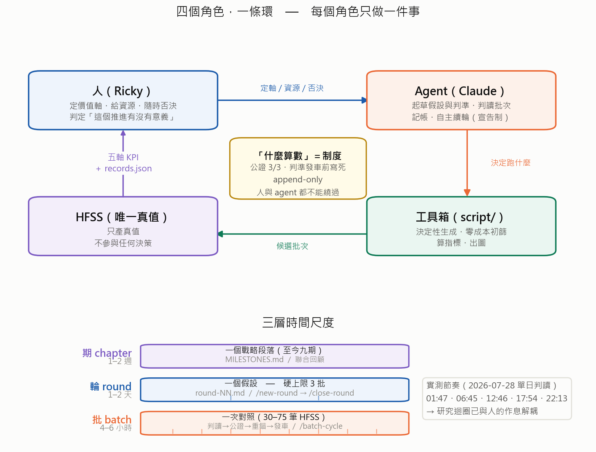
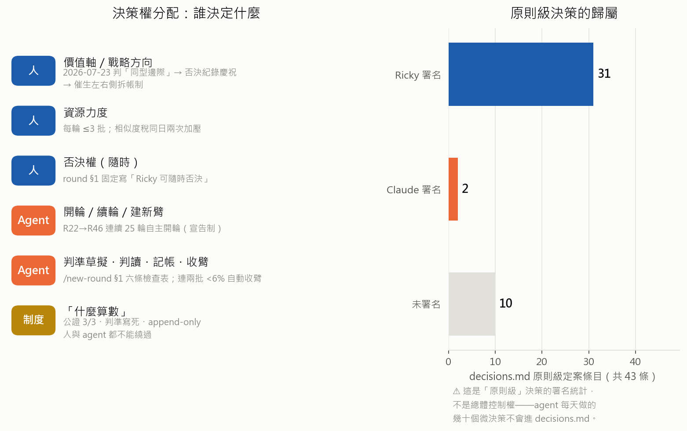

# 方法論：人機協作的研究作業系統

> **這份是什麼**：本專案「**怎麼運作**」的總覽——先講核心互動模式，再逐層拆到工具、推進節律、
> 資料分析、制度、工程。定位＝**碩論方法論章底稿**（章節對映見每節標題後的括號）。
>
> **這份不是什麼**：不是成果報告（去 `docs/report/`、`docs/進度報告/`）、不是時間軸
> （去 `docs/log/`）、不是操作手冊（去各目錄 `CLAUDE.md` 與 `.claude/skills/`）。
>
> **怎麼讀**：只有 15 分鐘 → 讀 §0。要理解某一塊 → 直接跳該節。要數字 → 一律去 §附錄 C 的真相源，
> **本文不複製會漂的數字**。
>
> **文件紀律**：本檔守「指向不複製」；引用的每個數字都標了出處或標了「單次／未公證」；
> 論述上有分歧的地方，選了哪一邊寫在原始碼註解 `<!-- 分歧 Dxx -->` 裡（見 `methodology-divergences.md`）。
> 快照日期 **2026-07-28**（R46 進行中）。

---

## §0　核心互動模式（一頁；對映 Ch.4.1）

### 0.1 四個角色，一條環



四個角色各自**只做一件事**，這是整套方法論的地基：

| 角色 | 只做 | 明確不做 |
|---|---|---|
| **人** | 定價值軸、給資源、隨時否決、判定「這個推進有沒有意義」 | 不逐批下指令、不手動挑候選 |
| **Agent** | 起草假設與判準、判讀批次、記帳、開下一輪 | **不定義什麼算數**（那是制度）、不繞過公證 |
| **工具箱** | 決定性生成候選、零成本初篩、算指標、出圖 | 不做判斷（判斷下沉在工具的「→ 行動」輸出裡，見 §2.4） |
| **HFSS** | 產真值 | 不參與任何決策 |

<!-- 分歧 D1：選「人定軸、機器跑（分層）」。理由＝有硬證據（decisions.md 43 條中 31 條署名 Ricky、
     MILESTONES 第八章「Ricky 四次定軸介入＝本章全部轉折的來源」）；覆蓋進度報告 v2 §1「都由 Agent 主導」
     的講法——後者對外好聽，但被追問時對不上帳。 -->

### 0.2 三層時間尺度

| 層 | 週期 | 單位 | 產物 | 入口 |
|---|---|---|---|---|
| **批** batch | 4–6 小時 | 一次對照實驗（30–75 筆 HFSS） | 判讀→公證→重錨→發車 | `/batch-cycle` |
| **輪** round | 1–2 天，**硬上限 3 批** | **一個假設** | `docs/log/round-NN-*.md` | `/new-round` → `/close-round` |
| **期** chapter | 1–2 週 | 一個戰略段落（至今九期） | `docs/log/MILESTONES.md` | 聯合回顧（Agent 起草＋人過帳） |

「批」的節奏是可觀察的：2026-07-28 一天內的判讀 commit 落在 01:47 / 06:45 / 12:46 / 17:54 / 22:13
——**沒有上下班時間**，這是把研究迴圈從人的作息解耦出來的直接後果。

「輪＝一個假設」是硬規則，不是慣例：第 3 批判讀完就必須收輪，**不拖第 4 批**
（`docs/log/CLAUDE.md`；理由＝輪是假設的生命週期，不是資料桶）。

### 0.3 決策權分配



| 決策類型 | 誰 | 這樣分的證據 |
|---|---|---|
| 價值軸／戰略方向 | **人** | 2026-07-23 判「8.97 是同型邊際推進、無可比性」→ 否決 agent 的紀錄慶祝 → 催生左右側拆帳制（[round-36](log/round-36-oob-wall.md)） |
| 資源力度 | **人** | 「每輪 ≤3 批」；相似度稅同日兩次加壓 0.35→0.20→0.12 |
| 否決權（隨時） | **人** | 每個 round 檔 §1 都固定寫「判準（發車前寫死；**Ricky 可隨時否決**）」 |
| 開輪／續輪／建新臂 | **Agent**（宣告制） | R22→R46 連續 25 輪自主開輪；自建 I/Q/H/L/S/K/V/N/U 等實驗臂 |
| 判準草擬・批內判讀・記帳・收臂 | **Agent** | `/new-round` §1 六條檢查表；R22 依「連兩批 <6%」自動收 Q/H 臂 |
| **「什麼算數」** | **制度** | 公證 3/3、判準發車前寫死、append-only——**人與 agent 都不能繞過** |

第三列是這套方法論的關鍵設計：把「什麼算數」從**任何一方的判斷**中拿走，交給制度。
人可以改價值軸，但不能宣布一個未公證的數字是紀錄；agent 可以自主開輪，但不能事後改判準。

### 0.4 協作的三種可觀察形態

這三種形態是「agent＋人」相對於「人用工具」的實質差異，且都可量化：

**① 人類直覺 → 量化實錘 → 常被細化或反轉。** 人給的是**方向與注意力**，不是結論；
機器把它變成可證偽的量。四個實例：

| 人的原話（日期） | 機器做出來的東西 | 結果 |
|---|---|---|
| 「N 塊 pattern 大小很不平均」（07-09） | analysis-02 組件尺寸 vs 三標 | **細化**成「金屬分配問題」 |
| 「組數階梯 3→5→7，合理的都試」（07-07） | R11 C 臂 | **兌現**：新王 c25（R11 最大結構突破） |
| 「φ90 很不平衡」（眼測，07-26） | 三筆左側合格解的偏斜量化 | **細化**成家族性偏斜（−2.66~−2.93） |
| 「想辦法減少對角線」（07-26） | 對角清潔階梯三批 | **反轉**：清潔全滅，對角反而是左側門票 |

**② 提案→兌現的週期可量化。** [round-37](log/round-37-left-colony.md) 記「Ricky 三提案一日全兌現」；
response 多樣性提案 **24 小時**從想法到轉正；R38 里程碑註記「**定軸 36hr**」——
從人判「同型邊際」（07-23 午）到左側合格解首例公證達陣（07-24）。

**③ judgement 保留給人的四類**：紀錄的「意義」判定、結論**適用範圍**修正、資源力度、模型上崗裁決。
其餘都可以下放。

### 0.5 這一節的限制

- 「31/43 署名」是**檔案署名統計**，不是決策次數統計——agent 每天做幾十個微決策不會進 decisions.md，
  所以這個比例衡量的是「原則級決策」的歸屬，不是總體控制權。
- 上表的「協作形態」是**回溯整理**出來的，不是事前設計的實驗；沒有對照組（沒有「純人」或「純 agent」
  跑同一段時間），所以只能當**形態描述**，不能當效果證明。
- 一天五次判讀的節奏來自 git 時間戳，只涵蓋有 commit 的活動；沒 commit 的判讀不在內。

---

## §1　工具箱：agent 手上有什麼（對映 Ch.4.3、Ch.7.4）

### 1.1 一個反直覺的比例

| 區 | 行數 | 是什麼 |
|---|---|---|
| `antenna/`（核心） | 9,553 | `G(spec) → pattern → SM/SIM → loss → 反傳` |
| `script/`（工具箱） | **16,994** | 生成／篩選／執行／判讀／記帳／出圖 |
| 其中 `script/dedust.py` | **6,855** | 批次驗證線本體（單檔就是核心的七成） |
| `tests/` | 4,445 | 326 項測試（29 檔） |

**工具箱比核心大 1.8 倍**——這不是意外，是這套方法論的形狀：核心演算法幾乎沒動
（見 §5），力氣全部投在「讓一個假設能被便宜、決定性、可稽核地驗證」的機具上。

<!-- 分歧 D8：選「兩面都寫」。dedust.py 6,855 行單檔違反 root CLAUDE.md 的北極星「核心精簡＋解耦」，
     列為已知技術債（§1.5）；但它同時是這條方法論唯一的載體。誠實優先。 -->

### 1.2 工具分類學

`script/dedust.py` 有 **62 個子命令**，按角色分三類：

| 類 | 數量 | 代表 | 做什麼 |
|---|---|---|---|
| **候選生成** | 52 個 `select-*` | `select-r46`（現役）、`select-scope`（顯微鏡窮舉）、`select-occlude`（承重圖）、`select-tolerance`（公差）、`select-ablate`（消融）、`select-repeat`（公證用） | 決定性產出一批候選＋manifest |
| **篩選防線** | 2 | `check-dup`（發車前必跑查重）、`sm-screen`（SM 零成本預篩） | 擋掉重複與明顯壞的 |
| **執行／派工／記帳** | 8 | `worker`（常駐資料工廠）、`jobs-add`／`jobs-ls`（NAS 佇列）、`run`、`watch`（收檔偵測）、`report`、`probe`、`chain`（爬山鏈 daemon） | 把候選變成真值 |

判讀在另一支：`script/analyze.py`（1,405 行、**13 個子命令**），其中 `analyze batch` 是
`/batch-cycle` 第一步的一鍵判讀——輸出完成度、臂別表、左右側拆帳、前瞻 ρ、影子模型盲測、
紀錄候選＋現成公證指令，最後給「**→ 行動**」行。

其他常用：`script/status.py`（掃 NAS 真相，**更新任何 run 狀態前必跑，不手動猜**）、
`script/sm_reanchor.py`（SM 重錨＋制度合訓）、`script/analyze.py gain`（性能期望三層帳）、
`script/figs/`（圖表產線，一律決定性可重跑，不手貼截圖）。

50 個實驗 config 走另一條軸：**一個 `configs/*.yaml` ＝一組實驗，且與其 baseline 只差「唯一變因」**，
全集索引在 `configs/README.md`（硬規則：改 config 必同步更新該表）。

### 1.3 三條並行的生產線（tier）

| tier | 內容 | 派工優先序 | 判讀去處 |
|---|---|---|---|
| **0** | 爬山鏈 `chain`（插隊層：錨點 d=1 純隨機包 → 判讀 → 換錨迴圈） | 1 | `docs/chains/*.jsonl` |
| **1** | 批次線（`select-rNN` → `jobs-add`） | 3（公證 2、填空池 9） | `analyze batch` |
| **2** | worker `--selfgen` 自產（佇列見底也不停，一有正式工作立即讓位） | 999 | `analyze tiers` |

tier 0 是「線上學習閉環的重生」——同樣是「跑一步、看結果、決定下一步」，
差別在它**不佔用 HFSS 做訓練**，判準在發鏈前寫死、鏈中不改。
tier 之間的資源配比有寫死的再平衡規則（tier 0 產出率壓過 tier 1 連兩輪 → 批量 75→50→25，
但 tier 1 **不歸零**，因為它是教材與凍結對照臂的唯一來源）。

<!-- 分歧 D2：選「工具箱一員／局部開採」＋tier0＝閉環重生。不採「線上學習走不通」的兇版講法
     （論點庫 A 區）——證據照用，措辭照 thesis_outline Ch.6 的表述紀律。 -->

### 1.4 agent 的操作層：把判斷下沉到程式碼

除了 `script/`，agent 還有一層「怎麼做事」的基礎設施：

| 元件 | 數量 | 作用 |
|---|---|---|
| `CLAUDE.md`（分層） | 7 份 | 專案憲法＋各目錄局部規範；每份 ≤66 行，守「指向不複製」 |
| `.claude/skills/` | 8 個 | 流程 runbook：`takeover`（接手定位）／`batch-cycle`（主入口）／`notarize`／`new-round`／`close-round`／`gain-check`／`stall-protocol`／`reconcile`（三方對帳） |
| PostToolUse hook | 1 | 改 `configs/*.yaml` 時自動回注「三處同步」提醒 |
| 自訂 subagent | 1 | `paper-reader`（精讀文獻 PDF 成永久筆記，每個宣稱附頁碼） |
| 記憶鏡像 | `docs/memory/` | harness 記憶的導出快照，讓「任何環境——新機器、別的 AI 工具、或直接人讀」都能接手 |

skill 之間的呼叫關係是固定的：

```
新 session ──▶ /takeover ──(內含)──▶ /reconcile
                  │
     批已收 ──────▶ /batch-cycle <R> <N>        ◀── 收檔通知自動觸發
                  ├─ 有紀錄候選 ──▶ /notarize
                  ├─ 連三批零推進 ──▶ /stall-protocol
                  ├─ 內含 ──▶ /gain-check
                  └─ 第 3 批判讀完 ──▶ /close-round ──▶ /new-round ──▶ 回 batch-cycle 發車
```

**設計原則是「弱模型化」**：`batch-cycle` 的 skill 文本明寫「設計給任何模型照做：
**判斷都在工具輸出的『→ 行動』行裡**，你的工作是照抄執行＋在分支點選對路」。
判斷邏輯下沉進 `analyze batch` 的程式碼，skill 只剩清單與分支表。

這是刻意的設計，不是妥協——它是「LLM agent 的可重現性」問題的答案：
**模型會換版、會漂移，但程式碼裡的判準不會。** 換一個模型接手，只要照 skill 跑，
判準、閾值、記帳順序都一樣。

<!-- 分歧 D7：選「工程成熟＋刻意設計」。反面講法是「這反證 agent 不必很聰明、自我拆台 novelty」——
     不採，因為 novelty 主張的是「調度」不是「聰明」；把判準固化反而是讓調度可被檢驗的前提。
     但這條張力在 §7.3 誠實記為侷限。 -->

### 1.5 這一節的限制

- **`dedust.py` 6,855 行單檔是明確的技術債**，違反 root `CLAUDE.md` 的北極星。52 個 `select-*` 裡
  大部分是歷史 round 專用、已不再呼叫（保留供重現）——「可稽核」與「死碼」是同一件事的兩面。
- 工具是**逐輪長出來的**，不是先設計好的。所以分類學是事後歸納，工具之間有隱性依賴
  （例如多個 `select-*` 依賴 `pattern_anatomy collect-pool` 產的快取），沒有依賴圖。
- 「弱模型化」只在批次線這條路徑成立。開輪的假設品質、判讀的洞察，仍然依賴模型本身。

---

## §2　推進節律：一個假設怎麼被回答（對映 Ch.4.2）

### 2.1 round 的七節結構

每個 round 檔用同一個模板（`docs/log/_TEMPLATE.md`），七節，**§1–§3 發車前填完**：

| 節 | 內容 | 時點 |
|---|---|---|
| 1 假設 | 問題／為何現在做／**預期結果與判準**／依據 | **發車前** |
| 2 實驗設計 | 臂×配額×判準表、唯一變因、對照 baseline | **發車前** |
| 3 執行紀錄 | 機器指令（含重啟指令）——斷電/接手時這是唯一真相 | **發車前** |
| 4 分析 | 五軸 KPI 面板＋數字表（`analyze batch` 產） | 收檔 |
| 5 結論 | 學到什麼／決策／促成或排除了哪個候選 | 收檔 |
| 6 後續決策 | 解鎖下一輪／新產生的待辦 | 收檔 |
| 7 歸檔指向 | README 索引＋1、ONGOING 移出、champions/memory 若有 | 收檔 |

### 2.2 假設從哪裡來：三級升格

```
docs/discuss/scratch.md         隨機觀察、半熟點子（agent 隨手記，不主動報）
        │  熟了
        ▼
configs/ONGOING.md 候選區（🔜 區）    一句 what ＋ why ＋ **觸發條件**
        │  觸發條件成立
        ▼
docs/log/round-NN-*.md          正式 round（假設→實驗→結論）
```

關鍵在**觸發條件**：候選區的條目必須寫明「什麼情況下才開這一輪」，
所以開輪不是靠靈感，是靠條件成立。回顧節奏也掛在邊界上——**每次開新 round 順手掃一遍 scratch**
（熟的升、死的標）。

已定案的原則進第三層 `docs/discuss/decisions.md`（43 條，agent 新增會主動告知）。

### 2.3 判準預註冊（鐵則一）

`/new-round` 的 §1 有六條檢查表，**缺一不發車**。發車後要修訂判準，
**只能在任何結果回來之前**，而且必須留修訂註記（日期＋理由＋「發生在結果前」聲明）。

配套是 **append-only**：收檔後不回改結論；發現錯誤用「★ 修正（日期）」原地補註，保留原文可追溯。
最完整的範例是 [round-10](log/round-10-refine-attribution.md) 的 w17 +0.48 修正
——原文與修正並存，讀者看得到我們當時信了什麼、後來為什麼不信。

為什麼要這麼嚴：**事後改判準等於把探索性分析包裝成確認性結論**。在一個
「同一個方法跑兩次的運氣差距大於方法之間的差距」的問題上（見 §3.2），這是最容易自欺的地方。

### 2.4 判讀：判斷在工具裡

一批收檔 → agent 主動觸發 `/batch-cycle`（不等人下指令）→ 七步：
判讀 → 公證 → 重錨 → 發車 → 補池 → 掛偵測 → 記帳。

第一步 `analyze batch` 直接輸出「→ 行動」①~⑤，agent 照做。
**任一步異常（exit 1／數字對不上／工具報 ⚠）＝停下回報，不硬走。**

### 2.5 停滯不是要忍受的狀態，是要診斷的症狀

主指標連三批零推進 → 觸發 `/stall-protocol` 四層：
①驗屍（是不是判準/工具問題）→ ②換分布（不是換參數）→ ③證天花板（窮舉）→ ④帶帳本升級給人。

兩條硬紀律寫在 skill 裡：**不靠慣性續燒批次**、**不降門檻製造假進度**
（`records.json` 只能因公證而動）。

另一支是 `/gain-check` 的**三層帳**——階梯命中率／學習曲線斜率／近王→紀錄轉換率，
三層各管各的不混算；且**不做尾巴外推**（小樣本極值理論＝偽精確禁區），
**不用長期指標否決零歷史的探索臂**。

### 2.6 探索型 vs 定向型介入：兩種判法

這是本專案最重要的方法論分流，2026-07-13 由人修正定案：

| 介入類型 | 例子 | 判法 |
|---|---|---|
| **定向型**（能指出「這批的好解就是這個介入直接挑出來的」） | SM 預篩、特定算子、單一臂 | 短視窗因果判決（連兩批 <6% 即收臂） |
| **擴散型**（改變的是分布，不是某一筆） | 根多樣性稅、de novo、新穎性紅利 | **不做單批因果判決**；用探索效率＋跨輪學習曲線斜率，**≥5 個 round 才比** |

觸發這條原則的是人的一句話：「甚至有沒有這因果關係？問題應該是探索效率，等 5 round 以上」
——直接推翻了 agent 原本「期待第 N 批打穿帶外牆」的評估框架。

### 2.7 這一節的限制

- **「效率 over 長 baseline」是繞過統計問題，不是解決它。** 擴散型介入的效果我們**至今沒有做出
  統計顯著的因果證據**，只有跨輪趨勢。這一點在 §3.2 會再談。
- 每輪 ≤3 批是排程紀律，不是統計設計；3 批的樣本量對多數判準來說偏小，判準因此設得粗
  （命中率門檻、連兩批規則），代價是靈敏度低。
- 三級升格的中間層（ONGOING 候選區）在實務上會積壓：目前候選區仍留著 R11–R19 時代的條目未清，
  而 scratch 規定的「否決標 ❌」**從未被執行過**（全檔 0 次）——死掉的想法實際上都埋在 round 檔的
  判決裡，沒有集中索引。

---

## §3　資料分析：怎麼把一批數字變成一個結論（對映 Ch.3.1–3.3、Ch.4.5）

### 3.1 一把尺，三個標準

全案所有比較走**同一把尺**，這是跨源可比（學長舊資料／我們線上 run／批次 store）的前提：

| 標準 | 指標 | 實作 | 定義 |
|---|---|---|---|
| 帶內 | **`worst_margin`**（dB） | `antenna/losses.py:661` | 帶內每個頻點對 S11 ≤ −10、Gain ≥ +4 兩條規格的餘裕，取**最差那點**。正＝全帶達標 |
| 方向圖 | `rad_window_margin` | `script/dedust.py:445` | 主波束 ±45° 窗內最低點對「峰值 −3 dB」門檻的餘裕；φ=0°/90° 兩切面取較差 |
| 帶外 | `oob_metrics` → `oob_bad` | `script/dedust.py:605` | 遠帶外（兩側各 4 點）最高增益 − 最深 S11，越低越乾淨；另拆 `_lo`／`_hi` 兩側獨立記帳 |

選批用單一標量 `sel_score`（`script/dedust.py:639`）把三者壓成字典序：
`sel = oob_bad + κ·(未過線的懲罰)`——**過線＋buffer 之後，帶內餘裕不再加分**。
這是價值軸的落地：三標＝硬閘門，收益軸＝帶外。

<!-- 分歧 D15：選「價值軸演進全寫」。三標→過線後帶內邊際≈0→帶外主鍵→左右側拆帳，四次改軸全寫出來。
     反面是「只寫最終版比較乾淨」——不採，因為改軸的理由本身就是方法論產物（軸相關枯竭原則的實例），
     而且藏起來會讓讀者以為目標從未動過。 -->

### 3.2 統計現實：這個問題的雜訊有多大

這是決定整套方法論形狀的一個量。我們用**歷史上 41 條同方法軌跡**在同一時間點切開，
量「此刻各軌跡最好成績」的分布：

| 預算（輪） | 存活軌跡 | 中位 (dB) | **跨軌跡標準差 (dB)** |
|---|---|---|---|
| 100 | 36 | −4.3 | 1.3 |
| 250 | 34 | −3.6 | 1.7 |
| 500 | 24 | −2.1 | 1.5 |

**同一套方法、同一預算，結果可以差 3–4 dB；而且跑得越久離散度沒有收斂。**

直接後果：在 σ≈1.5 dB 的雜訊下，要統計確認一個值 1 dB 的方法改良，每個對照組需要**三十多條
500 輪軌跡**；0.5 dB 的改良要上百條。一條 500 輪軌跡是一到兩天的機器時間——
**方法級的對照實驗在這個問題上貴到做不起**。

這不是實驗不夠仔細，是訊號本來就小於雜訊。整套方法論——批次線、決定性生成、公證制度、
效率評而非因果評——都是在回答「當方法級 A/B 做不起來時，還能怎麼做研究」。

**我們自己也沒有完全逃出這個問題。** 最清楚的例子是 [analysis-06](log/analysis-06-arch-bakeoff.md)：
臂 A 三尺全勝現任（凍結誤差 −56%），但那一臂同時換了**架構＋鏡射增強**兩件事，
混合貢獻至今未拆解（原檔已自標，後續的 MLP+aug 對照未做）。
我們的做法不是「我們比較嚴謹」，而是**把混淆寫在結論旁邊**。

<!-- 分歧 D14：選「進攻＋自陳反噬」。σ≈1.5 既是轉向批次線的理由，也同時說明我們自己的單批結論
     不可統計驗證。兩面都寫，因為口試一定會問。 -->
<!-- 分歧 D19：選「自曝自身數字的可稽核性」——見 §附錄 C 的「已知可稽核性缺口」。 -->

### 3.3 三級證據制：從相關到因果的閘門

`docs/design_priors.md` 把每一條設計規則標上證據等級，**只有 A 級才准載入生成器**：

| 級 | 定義 | 正例 | 反例 |
|---|---|---|---|
| **A** 因果級 | 做出可證偽預測 → 送 HFSS → 驗證通過 | 10-5-10 部分對稱化＝「救援算子」（救散亂、破壞已優化者，R10 X 臂 4/4 預測命中） | — |
| **B** 相關級 | 大樣本相關性，**未過因果關**，只當假設 | 「大主件、少組件、少細碎」 | 由它推出的「補洞幫 Gain」上因果台就死（R8 B 臂四筆全負）→ 補洞從算子清單除名 |
| **C** 單例級 | 個案觀察，待推廣 | 全連通 n_comp=1 三標率 0%——但樣本 38 筆且全在低金屬段，**標為「未探索區」不是「證實爛」** | — |

這個閘門的價值在**它會殺掉自己的規則**。B 級的統計特徵看起來很有說服力，
但轉成編輯算子就失效——如果沒有這道關，它會被當成設計準則寫進生成器。

### 3.4 五軸 KPI：一輪成功的定義

每輪收檔必貼五軸（2026-07-15 戰略換軸後），主 KPI 從「有沒有換王」改成「SM 準不準」：

| 軸 | 內容 | 來源 |
|---|---|---|
| ① **SM 準度（主）** | held-out 誤差＋前瞻 ρ＋對抗率——**輪的成功＝此軸有斜率** | `docs/kpi.csv`（12 欄）／`kpi_two.csv`（7 欄）／`kpi_shadow.csv`（9 欄），重錨時自動 append |
| ② 覆蓋 | 新血／近王／到王朝的距離 | `analyze batch` |
| ③ 整體水位 | wm 中位/P90＋帕累托前緣增量＋作戰區密度 | `analyze batch` |
| ④ 變現 | 三標／紀錄（**有就公證，零推進不焦慮**） | `docs/records.json` |
| ⑤ 健康 | error／機器／資訊臂 KPI | `script/status.py` |

`kpi.csv` 有兩個設計值得單獨講，它們是「防止模型看起來變好其實只是考卷變簡單」的機制：

- **分層 held-out**（`err_near`／`err_mid`／`err_far`）：按樣本到王朝表型的距離分三帶各報中位。
  「遠域誤差沒降＝馬太效應在贏」直接可讀。
- **凍結基準集**（`frozen_med`／`frozen_far`）：首跑時把當下 held-out 凍結存檔，跨版本可比。
  沒有它，每次重錨換一份 held-out，數字會因為「考卷變了」而漂。

### 3.5 歸因方法

| 方法 | 做法 | 產出 |
|---|---|---|
| **承重圖**（occlusion） | pattern 切 5×5 共 25 塊，每塊輪流遮掉送 HFSS，記 `worst_margin` 掉多少 | 這一張 pattern 的空間重要度圖。⚠ **跟著設計走，換一款就要重量一張** |
| **消融／尺寸掃描** | 組件級去除／±N 圈形態學縮放 | 每個組件的貢獻量、尺寸敏感度 |
| **雙向因果** | 拔除（`occlude`）＋搭橋（`add_bridge`）成對做 | 例：R11 對懸浮件雙向驗證（見 §5.4） |
| **血統鏈** | 每筆候選的 manifest 記親代＋改造步驟＋seed | 任何一個冠軍都能回溯到起點。鏈線的逐包帳走 `docs/chains/*.jsonl`（append-only） |
| **公差工程** | erode／dilate／邊緣隨機缺陷掃描 | 缺陷存活率——「margin 相近時，穩健性才是製造判準」 |

### 3.6 這一節的限制

- **承重圖不可跨設計套用**，這使它的價值在「工具」不在「結論」；跨家族普適性只驗過兩個家族。
- 三級證據制的 A 級判定用的是**單批預測命中**（如 4/4），在 §3.2 的雜訊水位下，
  這種小樣本命中本身就有偽陽性風險——制度上靠「重複出現才升級」補，但沒有形式化的統計門檻。
- 五軸 KPI 的①是可跨版本比的（有凍結基準），②③④⑤ 都是**當期口徑**，跨期比較會受
  資料分布變化污染。
- 我們的設計先驗有**採樣偏差**：「大主件少組件是好結構」可能只反映了我們在那裡挖得最深
  （`design_priors.md` 侷限節已自陳）。

---

## §4　制度與護欄：為什麼可以相信這些數字（對映 Ch.3.4–3.5）

一個由 agent 全時運轉、人只在關鍵點介入的系統，最大的風險不是跑得慢，是**產出看起來很好的假數字**。
本節的六道防線就是為此而存在。

### 4.1 鐵則一：判準發車前寫死

見 §2.3。

### 4.2 鐵則二：紀錄級宣稱一律公證 3/3

任何換王／破紀錄／榜首宣稱，都要把該設計用**相同配方**送 HFSS **重測兩次**，
「原測＋兩次重測三次一致（挑戰指標差 ≤0.03 dB）」才認證。未公證數字一律標「單次」、
不進結論粗體。

**這道關已經攔下四個假象**：

| 候選 | 單次宣稱 | 公證結果 | 差 |
|---|---|---|---|
| w17_k8 | +0.48 | 8/8 給 **−0.06**（病根＝萃取時的頻點對位 bug） | 0.54 |
| b20_k4 | +0.32 | 3/3 **−0.19** | 0.51 |
| o26b3_022 | +0.53 | 重測 ×2 定 **+0.44**（雙穩態） | 0.09 |
| h6_010 | +0.43 | **+0.35** | 0.08 |

前兩個如果沒有這道關，會直接以紀錄身分寫進報告。

**公證能成立的物理前提**是 §4.4 的決定性——如果生成或量測本身有隨機性，重測就沒有意義。

### 4.3 單一真相源

`docs/records.json` 是紀錄與門檻的**機器真相源**，七個軸（`wm`／`rad`／`oob`／`usable_oob`／
`usable_lo`／`usable_hi`／`inband`），每軸含 `{id, value, certified}`，外加 append-only 的 `history`。

規則：**換王先改 `records.json`**，然後才是對比圖 → `champions.md` → round §4 → memory。
所有工具（`analyze gain`／`analyze batch`）的門檻**一律讀這個檔，不憑記憶、不人肉抄**。

為什麼要指定機器可讀的那一份當真相源：`champions.md`（散文版）目前停在 2026-07-24 的
margin 王 +0.56，而 `records.json` 已是 +0.73——**散文版一定會漂，這就是要指定真相源的理由**。

### 4.4 決定性生成：四層防線

| 層 | 機制 |
|---|---|
| 規範 | `script/CLAUDE.md` 鐵則：select 內不用未 seed 的隨機；同 seed 同輸出 |
| API | 一律 `np.random.default_rng(seed)`。**禁用 python `hash()`**——它有進程鹽，跨進程不可重現（2026-07-25 修） |
| seed 域隔離 | 各 `select-*` 的 seed 域不重疊 |
| 落檔 | **seed 進 manifest**，每筆候選的生成參數隨資料落 NAS |

外加一層外部驗證：**跨機器 bit 級一致**、雜訊地板已公證 ≈0。
結果是「丟掉的產物多半可重跑補齊，不是不可逆」——這是 `/reconcile` 的復原原則之一。

### 4.5 查重：`check-dup`

發車前必跑，批內＋**全歷史輸入夾交叉**比對；`repeat`／`notarize`（蓄意重測）豁免；
**exit 1 就別發車**。後端還有一道健檢：`analyze data` 會分類跨店碰撞，
把「非蓄意的重複」單獨報成洩漏警報。

### 4.6 對帳：`/reconcile`

接手時、切模型後、長自動跑後、**宣稱換王前**、直覺不對時跑。四塊交叉驗證：
git ／ NAS ／ records↔champions↔round ／ 資料健檢。原則是「**不信工具回報，信 ground truth**」，
任一項紅就停下先修。

這條制度來自 2026-07-13 的一次持久化事件——關鍵操作後沒驗證落地，就在未落地的狀態上繼續蓋。

### 4.7 程式碼層的安全網

| 機制 | 內容 |
|---|---|
| golden 保真 | 三個 approval 基準檔（`golden.json`／`golden_loop.json`／`golden_loop_dual.json`）；任何結構性改動必須 `pytest tests/ -q` 全綠、**golden 零漂移** |
| 雙容差 | 本機絕對 1e-4 精檢／CI 相對 1%（SC loss 走特徵值分解，對 torch 版本與 CPU 極敏感） |
| 測試量 | **326 項測試**（29 個檔案，`pytest tests/ -q` 全綠）；CI 另掛 pyflakes 擋 undefined name |
| 缺陷回歸 | 每修一個 bug 補一條回歸測試，測試名對應 bug 情境 |

### 4.8 這一節的限制

- 公證只驗**重複性**，不驗**正確性**。如果萃取管線有系統性偏差，三次重測會一致地錯
  ——w17 +0.48 的病根正是萃取對位 bug，是靠 8 次重測的一致性**反過來**暴露的，不是靠公證直接抓到。
- 七個紀錄軸中 `usable_hi −5.92` 是**單次量測**的基線（`records.json` 已誠實標註），
  尚未補公證。
- 決定性只涵蓋**我們這一端**（生成、seed、查重）。HFSS 本身的決定性是實測結論（跨機 bit 級一致），
  不是保證——換版本或換設定就要重驗。
- 對帳制度是事件驅動的（接手／切模型／宣稱前），不是持續性的；兩次事件之間的漂移靠人的直覺發現。

---

## §5　工程優化：從一個腳本到一套系統（對映 Ch.2.3、Ch.8.2）

### 5.1 先講一件反直覺的事：核心演算法我們幾乎沒動

前一代（吳維文碩論）的三個核心機制，**我們都還在跑**：

| 機制 | 是什麼 | 我們的落點 |
|---|---|---|
| **ACP**（自適應循環策略） | 排程器：主動式高原偵測＋自適應重啟＋學習率與二值化溫度的雙耦合退火 | `antenna/optim/scheduler.py:19` |
| **SC Loss**（圖譜連通度損失） | 以圖拉普拉斯代數連通度（Fiedler 值）的倒數當可微連通性懲罰 | `antenna/losses.py:62` |
| **DLF**（動態損失過濾） | 樣本全收進緩衝，每次重訓時用累計均值**重新過濾整個緩衝**取菁英子集 | `antenna/training.py:485`（`sm_train.mode: dlf_fit`） |

我們改的是**它們周圍的一切**。反過來說，我們比論文**少**了一樣：
**回滾（rollback）已於 2026-06-28 移除**（三條理由記在 `antenna/training.py:813`：
貪婪規則卡在第一個山頭／退回舊生成器卻配當下變動的代理模型本質矛盾／原實作有兩個 bug 實際近乎無作用）。

> **一個必要的說明**：本節不引用前一代論文的量化結果。原因是**尺不同**——
> 論文的分數是 Response Loss，我們是 `worst_margin`（dB），兩者不可換算，
> 放在一起比較不成立。要對照只能用**我們自己的尺重測他的設計**（見 §6.2）。

<!-- 分歧 D3：選「兩層都講」——機制層繼承、調度層轉向。這是最誠實的講法，也讓「工程優化」的定位
     從「取代」變成「使能」。 -->

### 5.2 改造對照

| 群 | 原狀 | 我們 | 落地 |
|---|---|---|---|
| **架構** | 單體訓練腳本，改實驗＝改原始碼 | 層級單向（`antenna/` 核心零 legacy 依賴）；50 個 config「唯一變因」樹；模型用名字選 | `antenna/zoo.py`（6 個生成器＋4 個代理）、`configs/README.md` |
| **資料層** | 整個資料集一個 pickle，append 要全量重寫（NAS 上是 O(n²)） | `SampleStore`：一筆一檔、**檔名＝內容雜湊即去重**、原子搬移；`RunState`：`metrics.csv` 一 epoch append 一行＋`patterns/` 快取 | `antenna/utils/store.py`、`runstate.py` |
| **品保** | 無測試 | 316 tests、3 個 golden、雙容差 CI、pyflakes | `tests/`、`.github/workflows/tests.yml` |
| **產能** | 線上迴圈每 epoch 只產**一筆**資料，卻有近四成機器時間在把這一筆過擬合訓到收斂 | HFSS **只產資料**、代理模型改事後批次重錨；NAS 佇列＋原子鎖＋自產填空 | `script/dedust.py`、`sm_reanchor.py` |
| **判準** | S11／Gain（帶外本來就在其規格內） | ＋方向圖：`beam_coverage_loss` ±45°/3 dB 雙切面，升格為硬閘門；＋`worst_margin` 跨源同尺 | `antenna/losses.py:516,661` |
| **誠信** | 無公證制度 | 公證 3/3、跨機 bit 級、seed 進 manifest、查重 | §4 |
| **容錯** | 單層重跑 | 三層：單筆 900 秒看門狗 → 連敗熔斷／冷卻 → 判死後**別台機器自動接管**；批尾自動補測 | `script/dedust.py worker` |

**產能那一列是質變不是量變**：關鍵不是機器變快，是**把資料生成與代理訓練解耦**
——原本 HFSS 有近四成時間在陪跑單一樣本的過擬合訓練，解耦後 100% 都在產資料
（線上線終值 37 筆真值/天 → 批次線單機約 540 筆/天）。

容錯那一列有一個可展示的實測：R28 期間某台機器熔斷三次，最終判死後由另一台自動接管重跑，
**全程零人工**。

<!-- 分歧 D22：選「講解耦不講倍率」。倍率（15×）口徑會被質疑（278s 是 profiling 快照、39 分是 R5
     實際運行終值，兩者情境不同），解耦這個機制陳述則不受口徑影響。 -->
<!-- 分歧 D21：選「算貢獻，但寫成使能條件而非主貢獻」。 -->

### 5.3 我們執行了前一代的未來展望

前一代論文 §5.2 列了三項未來工作，我們的狀態：

| # | 未來展望 | 我們 |
|---|---|---|
| ① | PCB 製造＋隔離室遠場量測＋蒙地卡羅容差分析 | **部分**：容差做了模擬版（erode/dilate/缺陷掃描、缺陷存活率），**實體製造與量測未做** |
| ② | **把輻射場型納入損失函數** | **已做**，且升格為硬判準（±45°/3dB 雙切面）；代理模型加了平滑基底的 rad head。⚠ 冷啟動離線資料（Stage 3）仍未做 |
| ③ | 六邊形像素網格 | 未做 |

### 5.4 一個實質的物理發現：孤島抑制的適用範圍

前一代的 SC Loss 整章建立在「巨觀斷裂結構應被消除」上。
論文結論自己就寫了一個例外——SC Loss「從根本上消除巨觀斷裂結構之生成，
**且不破壞對電磁性能具實質貢獻之獨立金屬集群**」。

**我們把這個例外量化了。** R11 的搭橋實驗（`add_bridge`：把非饋電組件用 1px L 形橋接到主件，
材料只增不減）做的是**雙向因果**——先前 R7 的除塵實驗證明「拔掉小碎片會崩」（5 個家族中 4 個崩 5–17 dB），
R11 反過來證明「把它接上去也會壞」。兩個方向都指向同一件事：

> **小懸浮件不是雜訊，是分散式共振的一部分。** 尺度不同、結論不同：
> 巨觀斷裂該消除（SC Loss 的射程），小懸浮件是功能（我們量出來的例外）。

工程後果很具體：**可製造性必須內建在生成端，不能事後清潔**。
`perturb_repair`／`symmetrize` 都自帶無粉塵修復；「先找好解再清乾淨」這條路
在 2026-07-25~26 又被三個獨立實驗一致否決（見 §附錄 D）。

<!-- 分歧：孤島＝「適用範圍」框法（人 2026-07-28 拍板）。不寫成反駁——因為論文結論自己留了這個例外，
     我們做的是把例外量化。 -->

### 5.5 這一節的限制

- 「產能提升」的原始 profiling 數字（每 epoch 278 秒、HFSS 佔 61%）目前**只硬編碼在圖表腳本裡，
  沒有留存原始輸出**，無法從 repo 重建。批次線的 160 秒/筆則有 n=2123 的實測中位數支撐。
- 三層容錯的第三層（真實復原行為）只在事故中被動驗證過，**沒有主動的故障注入測試**。
- 我們**沒有驗證跨規格泛用性**。前一代論文做了「同一框架不調參移植到雙埠濾波器」的實驗；
  我們專注單一 spec（n257 單埠）深掘，泛用性是未驗項不是已知優勢。
- 方向圖只做了單埠；θ 解析度仍是 2°；`radiation.offline_dataset` 這個 config 鍵尚未實作。

---

## §6　定位與限制（對映 Ch.2、Ch.8.3）

### 6.1 實驗室血脈

本工作是同一條線的第四代：
**陳廷茂**（可微代理的線上學習框架）→ **錢鵬予**（雙尺度正規化＋二階段變異）→
**吳維文**（ACP／SC Loss／DLF）→ **本工作**（調度層與量測誠信體系）。

前三代的貢獻都在**演算法層**；本工作的貢獻在**調度層與制度層**——這是定位差異，不是高下。

### 6.2 我們用自己的尺重測前一代的成果

這是兩代之間唯一成立的量化橋樑（同一把 `worst_margin` 尺、同一套現行 HFSS 設定）：

| 對象 | 池值 | **現行 HFSS 重測** | 可製造 |
|---|---|---|---|
| 前一代論文的展示成果（圖 4-4） | +0.09 | **+0.35（帶內達標）** | ❌ 含 13 個 <4px 粉塵碎片 |
| 前一代歷史池最佳 | +0.38 | **+0.44（帶內達標）** | ❌ 碎片型 |

結論很明確：**前一代的方法本身能產生完全合規的設計，問題不在電性。**
差別在**可製造性**（含粉塵碎片）與**可系統化衍生**（碎片承重，動一下就崩）。
本工作的貢獻是在同一套規格下，把合規的好電性變成**可製造、可微擾演化**的設計。

（歷史池中 18 筆帶內達標解經我們嚴格重測後存活 8 筆；方向圖這一關 0 筆通過
——但方向圖不在當年的優化目標裡，這是我們後來升格的判準，不構成對前一代的評價。）

<!-- 分歧 D25：選「公允版」。docs/senior_reference_patterns.md 已定「別把學長講差」，本節照辦。 -->
<!-- 分歧 D24：論文內部的數字不一致（表 4-2 vs 表 4-4 的 Base R_feed、帶外 spec 與其 code 不符）
     不寫進正文——因為 §5.1 已決定不引用其量化值，不引用就沒有勘誤的必要。備註留在 divergences 台帳。 -->

### 6.3 與外部文獻的定位

指標性的對照是 Sengupta 團隊的系列工作（`docs/reference/`，三篇筆記在 `notes/`）——
它們是「像素化逆設計」這條路的智識母本（同樣的 25×25 像素、CNN 正向代理、搜尋的世界觀）。

**核心差異是資料量假設**：

| | 他們 | 我們 |
|---|---|---|
| 範式 | **離線攤提的模型驅動**：一次付清 10⁵–10⁶ 次模擬（HPC 天級）把代理／策略訓到全域準，之後每個新設計分鐘級攤提 | **少樣本、真值在迴圈**：既有池當起點分布＋HFSS 在迴圈當真值＋結構規則＋agent 與人 |
| agent | **RL agent**（MDP 上的策略網路） | **LLM 編排**（調度工具） |
| human-in-the-loop | **事前約束＋事後挑選**（constrain-then-select） | **迭代迴圈內共同調度** |

三條要誠實劃清的界線：
1. 他們的 "agent" 與我們的 agent **是兩種東西**，不可混同。
2. 他們的 human-in-the-loop 比我們主張的更淺；但 2026 年的回顧文章已把 human-in-the-loop
   明列為官方終局（"AI is a collaborator, not merely a brute-force optimizer"）——我們的位置是往那個終局再走一步。
3. 他們反而**背書**了我們的「碎片雲」設計：ISSCC 的晶片實測證明同一規格下像素化結構與傳統結構
   性能等價，因為 spec→幾何是嚴重欠定的一對多——「長得怪」不代表次優。

**novelty 主張與其邊界**：「agent＋人在迭代迴圈中共同調度工具箱」在文獻上沒有現成先例，
這是可以主張的空間。**邊界**：這是**方法論與工作流的貢獻**，不是演算法貢獻；
而且下面 6.4 的可重現性問題必須一起講。

<!-- 分歧 D28：選「文獻定位放回來」。七月進度報告 v1 §10 有這一節、v2 精簡時被拿掉；
     碩論方法論章需要學術定位，所以放回。 -->
<!-- 分歧 D26：選「主張＋誠實邊界」。 -->

### 6.4 可重現性：兩句都要講

- **流程可重現**：判準、閾值、記帳順序、生成 seed 都在程式碼與 skill 文本裡；
  記憶鏡像（`docs/memory/`）讓「新機器、別的 AI 工具、或直接人讀」都能接手完整脈絡。
  換一個模型照 skill 跑，會得到同一組判準與同一份帳。
- **不可 bit 級重現**：模型會換版、行為會漂移；「假設從哪裡來」「判讀時注意到什麼」
  這兩件事**不可重現**。這是這類方法論的固有侷限，不是可以工程掉的東西。

誠實的說法是：**這套方法論保證的是「結論的可稽核性」，不是「過程的可複製性」。**

<!-- 分歧 D27：選「兩句都寫」。 -->

### 6.5 全案侷限

| # | 侷限 |
|---|---|
| 1 | **模擬 ≠ 量測**。全部結論建立在現行 HFSS 設定上；真正的 ground truth 是實體製造與量測，**尚未進行**。 |
| 2 | **單一規格**（n257 單埠 28 GHz、RO4003C、25×25 像素）。跨規格泛用性未驗。 |
| 3 | **族群侷限**。多數合格解集中在少數幾個結構家族；全史約八成落在同一種「王朝」結構裡。 |
| 4 | **方法級對照做不起來**（§3.2）。擴散型介入用效率評是繞過，不是解決。 |
| 5 | **工具箱有技術債**（§1.5）；`thesis_outline.md` 等衍生文件會落後於 `records.json`。 |
| 6 | 已知架構落差 18 條、內容未定案 22 條，清單見 `methodology-divergences.md`。 |

---

## 附錄

### A. 術語對照（論文 ↔ 程式碼）

三個命名陷阱**必背**：

| 論文用語 | 實際是什麼 | 我們的程式碼 |
|---|---|---|
| **GEN**（Gradient Estimation Network） | **代理模型 SM**——「梯度估計」指它當不可微 HFSS 的可微替身。**不是生成器！** | `MLPSurrogate`／`HFSSNet`（`antenna/models/surrogates.py`） |
| 程式碼的 `SigmoidGenerator` | **生成器 G**。名字裡的 GEN 只是 Generator 縮寫，與論文 GEN **同名異義、角色相反**（2026-06-11 改名根除撞名） | `antenna/models/generators.py:47` |
| **ACP** | **排程器**，只含高原偵測＋自適應重啟＋lr/tau 雙耦合退火，**不含 rollback** | `antenna/optim/scheduler.py:19` |

完整 25 條對照（含 DLF 的三方拆解、張量狀態符號 `P̃`/`P_soft`/`P_hard`/`P_full`）見
`docs/memory/reference_paper_terminology.md`。

### B. 工具索引

| 要做什麼 | 用什麼 |
|---|---|
| 接手一個 session | `/takeover` |
| 一批收檔了 | `/batch-cycle <round> <batch>` |
| 產候選 | `python -m script.dedust select-rNN` |
| 發車前查重 | `python -m script.dedust check-dup --input X_input`（exit 1 就別發車） |
| 派工／看佇列／等收檔 | `dedust jobs-add` ／ `jobs-ls` ／ `watch` |
| 判讀一批 | `python -m script.analyze batch` |
| 看機器真相 | `python -m script.status --factory` |
| SM 重錨 | `python -m script.sm_reanchor train --add "<stores>" --out sm_reanchorNN.pth` |
| 公證一個候選 | `/notarize <候選id> <公證store名>` |
| 對帳 | `/reconcile` |
| 出圖 | `script/figs/*.py`（索引在 `script/figs/README.md`） |

### C. 真相源地圖（引用數字只准來自這裡）

| 要什麼 | 去哪讀 |
|---|---|
| 紀錄王榜＋門檻 | **`docs/records.json`**（機器真相源；`champions.md` 是散文版，會落後） |
| 各 round 的數字 | `docs/log/round-NN-*.md` §3/§4（未公證一律標「單次」） |
| 鏈線逐包帳 | `docs/chains/*.jsonl` |
| SM 準度時序 | `docs/kpi.csv`／`kpi_two.csv`／`kpi_shadow.csv` |
| 資料量 | `python -m script.status`（現場掃 NAS；**不要抄快照**） |
| 實驗 config 全集 | `configs/README.md` |
| 現在在跑什麼 | `configs/ONGOING.md`（更新前先跑 `script.status`） |

**已知可稽核性缺口**（本文引用時已標，此處集中列出）：

| 數字 | 缺口 |
|---|---|
| 每 epoch 278 秒／HFSS 佔 61% | 只硬編碼在圖表腳本，無原始 profiling 留存，無法從 repo 重建 |
| 「新資料集 9,882 筆／達標 21.1%」 | 由現場掃 NAS 產生，**無固定快照**；不同時間點的版本會不同（另有 1,583 與 1,547 兩個雙過筆數版本） |
| `usable_hi −5.92` | 七個紀錄軸中唯一的**單次量測**基線，未公證 |
| analysis-06 臂 A 的 −56% | 「架構＋鏡射增強」混合貢獻，**未拆解** |

### D. 誠實負結果（節選；完整 48 條見 `methodology-divergences.md`）

負結果在本方法論中是**一等產物**——判準預註冊的目的之一就是讓「沒過」也能被記帳。

| 期 | 代表性負結果 |
|---|---|
| 線上線 R1–R5 | 「SM 訓練量是瓶頸」被自家資料連續否證三次；R4 破紀錄時主假設的機制**根本沒啟動**（紀錄是探索撞到的）；R5「SM 變好 ≠ 找到更好解」 |
| R6–R9 | 除塵主假設否決 4/5（**粉塵是共振的一部分**）；補洞非因果（四筆全負）→ 從算子清單除名 |
| R10–R18 | 搭橋崩＝懸浮件是功能；第二山頭否決（非主家族深掘全敗）；理論模板全滅 |
| R19–R28 | 模型線門檻未過（ρ 差 0.007）；碎片族三代 0/85；配額股息機制「未動席位」＝形同虛設（誠實記） |
| R29–R33 | 深淵據點判死；幾何可填但電性不可雜交（連兩批 0）；rad↔lo 梯度不可兼得（後修正為經驗律） |
| R34–R40 | 冠軍鄰域梯度＝王鄰域特權（0/24 三試定論）；CNN 單 rank 離線全勝但實戰選拔 1/6 → 催生「考試制」 |
| R41–R46 | **可製造化三連負**（清潔階梯全滅／收復鏈補不回／組保持合規版 7 筆全掉線）→ 事後清潔在該家族是死路；刀鋒解實錘（16 微擾合格保持 0）；組文法 v1 未勝舊文法 |

<!-- 分歧 D12：選「負結果當招牌」。碩論讀者吃這套，且它是判準預註冊制度有在運作的唯一外部證據。 -->

### E. 相關文件

| 想看 | 去 |
|---|---|
| 為什麼這樣設計（固定） | `docs/`：`architecture.html`／`development.md`／`training.md`／`design_priors.md` |
| 時間軸歷史（append-only） | `docs/log/`：`README.md`（round 索引）／`MILESTONES.md`（期）／`_TEMPLATE.md` |
| 現在在跑什麼（live） | `configs/ONGOING.md` |
| config 全集 | `configs/README.md` |
| 討論記憶兩層 | `docs/discuss/scratch.md`（半熟）／`decisions.md`（定案，43 條） |
| 本文件的論述選擇與未定案 | `docs/methodology-divergences.md` |
| 外部文獻 | `docs/reference/README.md` |
