# 天線 Pattern 反向設計：R1–R10 研究成果報告

**鄒穎麒 ｜ 2026-07-07 ｜ 資料截止：Round 10 收檔（Round 5 / Round 11 進行中，數字為當日快照）**

---

## 0. Scope 與 Limitations（先講清楚）

本報告整理 2026-06-28 至 2026-07-07 共十輪「假設→實驗→結論」研究（R1–R10）與一個離線分析（analysis-01）。閱讀前先知道邊界：

- **模擬 ≠ 量測**：所有 margin 都在現行 HFSS 設定內成立（掃頻/網格/邊界條件固定）；真 ground truth 是實作量測，尚未做。
- **單一規格**：帶內 26.5–29.5 GHz、S11 ≤ −10 dB、Gain ≥ +4 dB、輻射 ±45°/3dB 雙切面；結論不自動外推到其他 spec。
- **冠軍同族**：八個達標解都在同一構型高原（w17 家族），多樣性是已知取捨；第二座山頭留待後續。
- **進行中**：R5（線上滑動視窗）與 R11（公差穩健化）還在跑，相關數字是快照不是結論。

> **▍一句話總結**：一週之內，可製造 pattern 的紀錄從 **−2.68 dB 推進到 +0.20 dB**（八個「三標全過」的達標解，全部經多維公證），方法不是更大的模型，而是**批次假設迴圈**——每一批 HFSS 都同時做搜尋與做實驗。

---

## 1. 總覽與記分板

三條線同時推進，各自有客觀的尺：

| 格 | 尺 | 起點（R6 前） | 現況（R10 收檔） |
|---|---|---|---|
| **產品** | 可製造紀錄 worst-margin | −2.68（含粉塵解修不出來） | **+0.20**（c21，八冠軍 certified） |
| **能力** | SM 導航儀誤差 | 池外盲區 4–5.5 dB | **作戰區中位 0.36 dB**（分區有效性量化） |
| **知識** | 設計規則目錄 | 0 條 | **10 條**（三級證據制，因果過關才升級） |

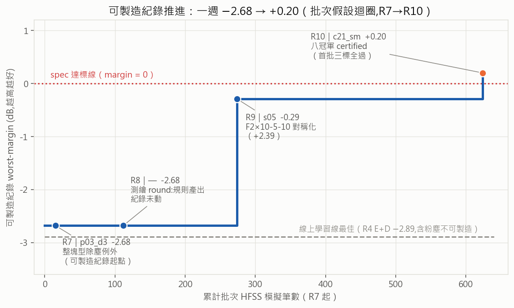

**圖 1**：批次驗證線（R7→R10）約 620 筆 HFSS 就把可製造紀錄推過 spec 線；灰虛線是線上學習線五輪的天花板（−2.89，且含粉塵不可製造）。兩種範式的效率差是本報告的主線故事。

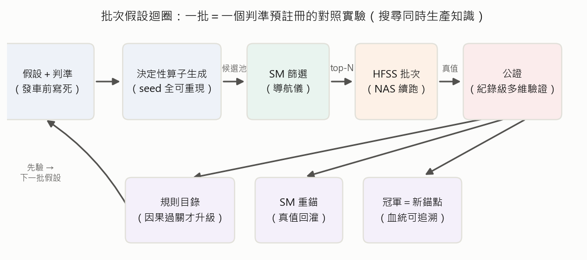

**圖 2**：方法骨架。每一批＝一個判準預註冊的對照實驗：決定性算子生成（seed 全可重現）→ SM 篩選 → HFSS 批次（NAS 可中斷續跑）→ 公證；真值回灌 SM、規則過因果關才升級、冠軍變下一批錨點。

> **▍一句話重點**：搜尋與知識生產是同一件事——每批夾帶「規則檢驗臂」，批批有 verdict。

---

## 2. 問題定式與量測誠信體系

**指標（全篇同一把尺）**：`worst-margin` ＝ 帶內各規格餘裕的最小值（木桶原則；正＝達標、值即餘裕）。三標＝帶內 S11＋Gain（wm）、輻射 ±45° 窗（rad margin）、可製造（全組件 ≥4px、零粉塵、feed pad）。

量測體系是本研究刻意建立的地基，因為**紀錄級結論曾經被量測假象騙過一次**：

1. **雜訊地板 ≈ 0**：同一 pattern 重跑 41 次（含跨機）**bit 級一致**——HFSS 在此設定下是決定性的，任何 ≥0.01 dB 的差異都是真效果，不需要誤差棒。
2. **掃頻法交叉驗證**：Interpolating 與 Discrete 逐點硬解 9/9 逐位相同——快速掃頻無罪。
3. **+0.48 假象案例（圖 16，詳見 §8）**：前任紀錄 w17 曾以單次量測 +0.48 被封「首位三標全過」；公證重測 8/8 全是 −0.06。根因是萃取程式在特定條件下跳過頻率對位（曲線整條偏 0.5 GHz）＋跨批次 CSV 殘留。修復（`align_curve`）＋回歸測試＋**鐵則：紀錄級結論一律多維公證**（重複×掃頻法×跨機）。
4. **歷史資料校正**：學長 24k 池的記錄值與現行設定有家族依賴的系統差，實測擬合 `現行 = −0.26 + 1.13·池值`（σ 0.77）；頂帶 ±0.4 可信——舊資料折價可用，不能直接信。

> **▍一句話重點**：先把尺公證好，才有資格談紀錄——+0.48 假象讓「量測誠信」從口號變成制度。

---

## 3. 線上學習線 R1–R5：五輪診斷史（壓縮）

本專案的起點是學長的線上系統：生成器 G ⇄ 代理模型 SM ＋ 真 HFSS 做 online learning。R1–R5 是對它的系統性診斷，每輪修一個瓶頸假設：

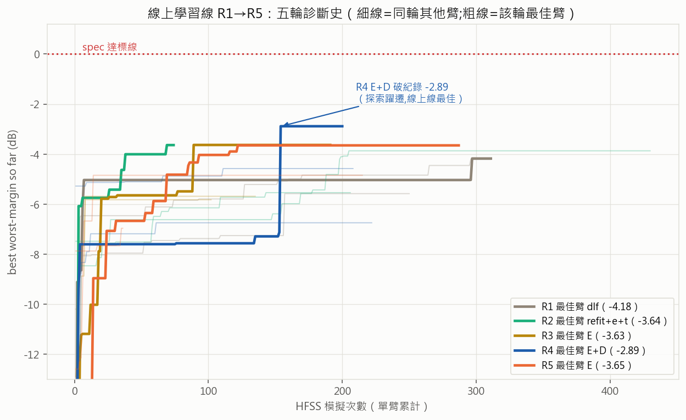

| Round | 假設 | 最佳臂（best wm） | 診斷結論 |
|---|---|---|---|
| R1 | SM 訓練量不足？ | dlf −4.18@297 | **訓練量非瓶頸**（訓飽的 dlf_fit 反而最差 −5.58） |
| R2 | 文獻治本（ensemble＋trust）？ | refit+e+t −3.64 | 微幅、未決定性；trust 卡低不利用 |
| R3 | 探索(lr↑) × DIP 連通先驗？ | E −3.63@89 | E 有效；三臂被共同上游瓶頸汙染 → 確診 **SM 欠訓** |
| R4 | 自適應 SM 訓練量 | **E+D −2.89@154（線上線紀錄）** | 破紀錄靠探索躍遷，主假設未驗證（探測自鎖） |
| R5 | 滑動視窗訓練量（進行中） | E −3.65@287（快照） | SM 真的訓起來了（fit_loss 8-11 → 0.45）；wm 未跟上 |

> **▍一句話重點**：五輪修了五個瓶頸，SM 從欠訓修到訓好，但 best-wm 天花板停在 −2.89——問題不在訓練，在**範式**。這是 R6 轉向的動機。

---

## 4. R6 期望邊界：轉向的證據（離線、零 HFSS）

把「每跑一筆 HFSS 期望拿到多少」變成可計算的問題：我們 16 個 run、學長 41 個 run、學長 24k 樣本池，margin 全部用現行 targets 重算後放同一把尺。

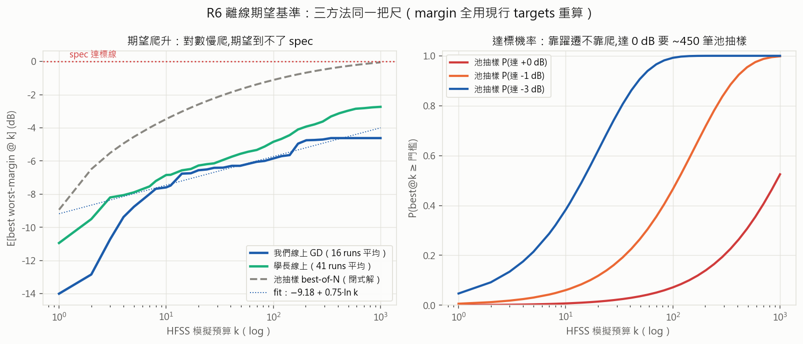

- **期望爬升是對數慢爬**：`E[best@k] ≈ −9.18 + 0.75·ln k`——照這個斜率，期望上永遠到不了 spec；實際進步 46% 來自躍遷（單步 >1dB），不是爬。
- **達標 pattern 已經在池子裡**（oracle +0.38）：問題不是「找不找得到」，是「用什麼順序找」。
- 學長同預算贏我們 1–2 dB；池抽樣把我們線上搜尋的等效預算放大 200–450×。

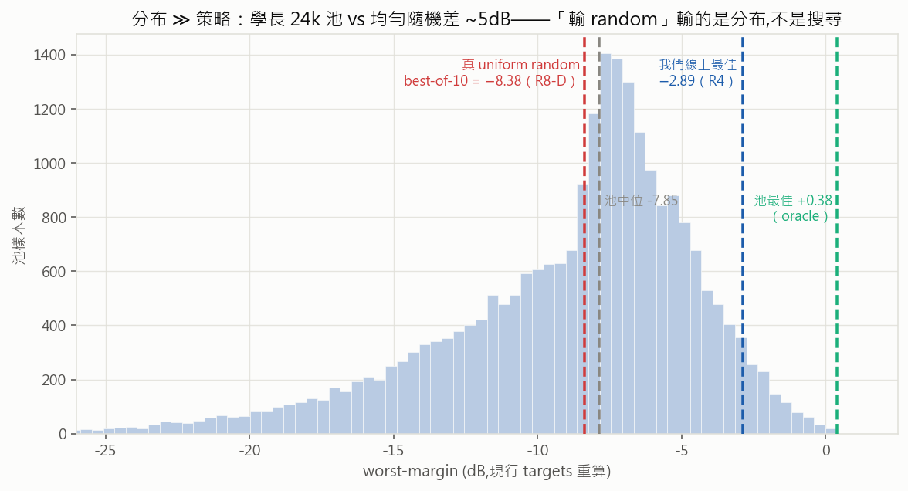

- **分布 ≫ 策略**：真 uniform random best-of-10 只有 −8.38，輸池抽樣 ~5 dB（R8-D 臂實錘）。過去說「學習式搜尋輸 random」——輸的其實是**學長池的分布**，不是隨機性本身。

> **▍一句話重點**：策略優化的邊際報酬遠小於「站在對的分布上」→ 戰略轉向：**池頂端 warm-start ＋ 批次驗證**。

---

## 5. R7 ＋ analysis-01：粉塵承重與結構歸因

池頂端的達標解幾乎都「不可製造」（帶 1–3px 粉塵碎片）。直覺的修法：拔掉粉塵再驗證。R7 用 15 筆 HFSS 檢驗這個直覺：

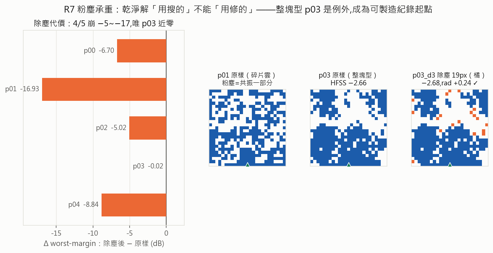

- **4/5 崩潰**（Δ −5 ~ −17 dB）：粉塵不是雜質，是**共振結構的一部分**——「修復式」路線關閉，乾淨解要**用構造的，不能用修的**。
- 例外 p03（整塊型構型）：除塵 19px 近零代價（−2.68，rad +0.24）→ **可製造紀錄的起點**，也是「構型決定可修性」的第一個提示。
- 順帶：oracle 重驗為真（p00 原樣 +0.44）、rad 是與 S11/Gain 獨立的第三關。

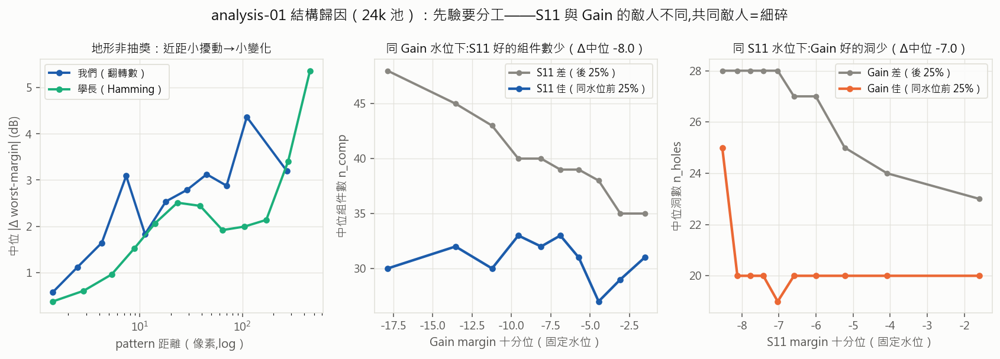

analysis-01（離線解剖 24k 池）補上結構層的因果假設來源：**地形不是抽獎**（小擾動→小變化，有效半徑數十次翻轉）；配對分析顯示 **S11 的敵人是多組件、Gain 的敵人是洞**（同水位配對 Δ 中位約 −8 ~ −9.5 組件／−5 ~ −7 洞，方向一致）——先驗要分工，不能混著用。

> **▍一句話重點**：可製造性不是後處理，是搜尋目標本身的一部分；而 S11/Gain 各有結構敵人＝設計規則的第一批假設。

---

## 6. R8 乾淨子空間測繪：四臂對照，批批有 verdict

97 筆 HFSS 分四臂，每臂發車前判準寫死：

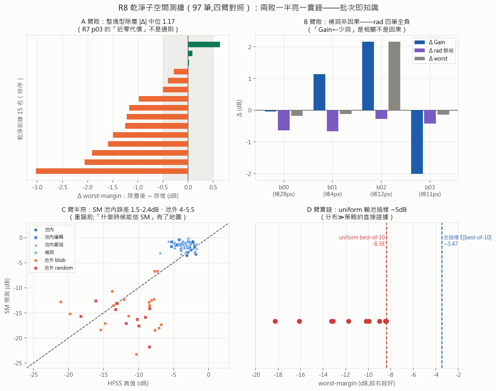

| 臂 | 檢驗 | verdict |
|---|---|---|
| A | 「整塊型除塵近零代價」是通則？ | **崩**：\|Δ\| 中位 1.17，通則不成立（p03 是例外不是規律） |
| B | 「Gain←少洞」是因果？（補洞編輯對） | **敗**：rad 四筆全負——相關不是因果，補洞死刑 |
| C | SM 在乾淨區的校準 | **半亮**：池內誤差 1.5–2.4 dB、池外 4–5.5——「什麼時候能信 SM」第一次有地圖 |
| D | 真 uniform random 基線 | **實錘**：best-of-10 = −8.38，輸池抽樣 ~5 dB |

> **▍一句話重點**：兩敗一半亮一實錘——負結果也是產出：B 臂處死了一條看似合理的規則，C 臂的分區地圖直接催生了後來的 SM 重錨。

---

## 7. R9 池頂重驗＋跨家族探索：對稱化首勝

R8 發現池值有漂移警訊 → R9 過夜 162 筆做兩件事：把池頂端的「帳面達標」重新公證、把探索錨點從單一家族擴到全池。

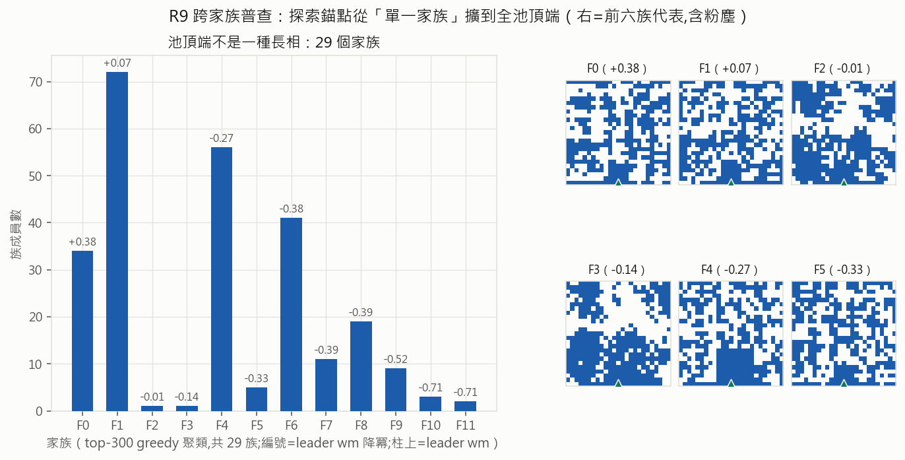
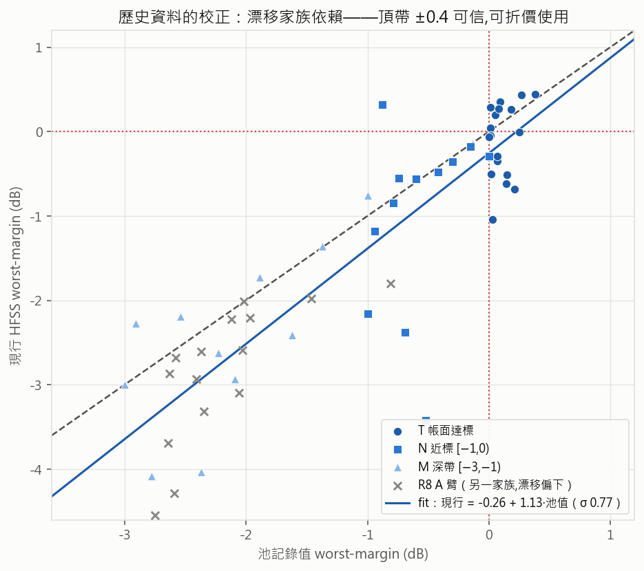

- **oracle 活著**：帳面達標 18 筆重驗 8 筆仍達標（t00 +0.44）；漂移是家族依賴的，頂帶 ±0.4 可信（校正 fit 見 §2）。
- **池頂端有 29 個家族**：不是一種長相——單一家族的探索會漏掉整片大陸。

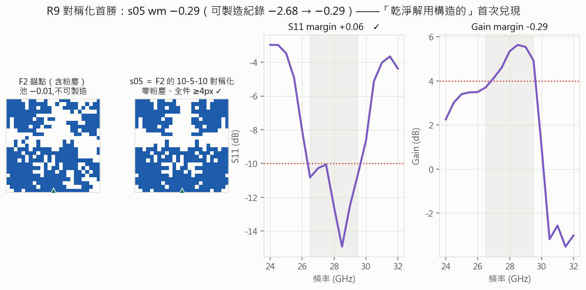

- **對稱化首勝**：F2 錨點（碎片雲、池 −0.01、不可製造）套 10-5-10 部分鏡射對稱 → **s05，wm −0.29、零粉塵**，可製造紀錄 −2.68 → −0.29 一夜推進 2.39 dB。「乾淨解用構造的」首次兌現成算子。
- SM 在分布外仍有排序訊號（SM 導引臂平均贏鄰域臂 2.4 dB）→ 值得重錨後當導航儀。

> **▍一句話重點**：R9 把「構造式編輯」從想法變成戰績——對稱化是第一個過因果關的算子。

---

## 8. R10 精修攻堅：八冠軍與它們的地圖

R10 是收割輪（約 350 筆）：s05 精修、物理歸因、SM 重錨、以及量測誠信的大考。

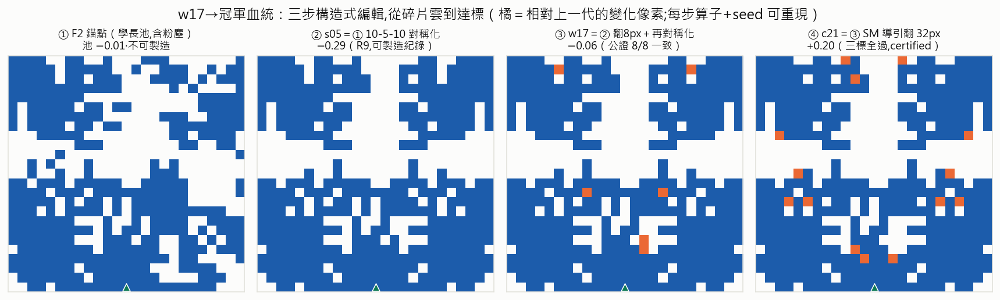

**血統**：F2 →（對稱化）s05 →（翻 8px＋再對稱化）w17 →（三臂並發精修）八冠軍。每步算子＋seed 記錄在案，任何冠軍可一行指令重現。

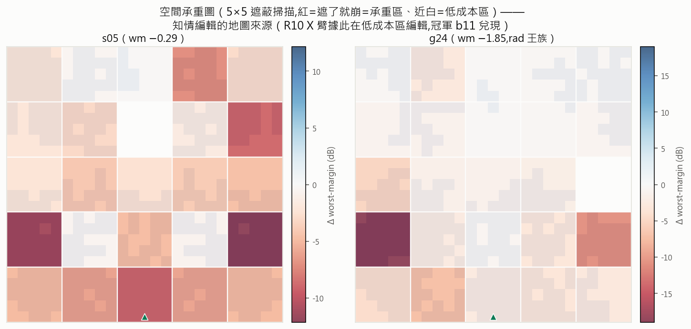

**物理歸因**：5×5 遮蔽掃描給出空間承重圖——底排承重（遮了就崩）、上半多為低成本區。這張地圖直接變成「知情編輯」算子的輸入：R10 X 臂只在低成本區編輯，冠軍 b11 就是這條路的兌現。同輪並確認「對稱化救爛毀好」規則過因果關（4/4 預測命中）。

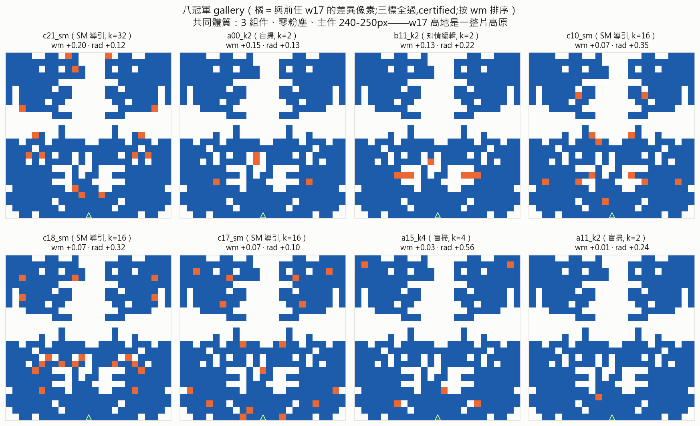
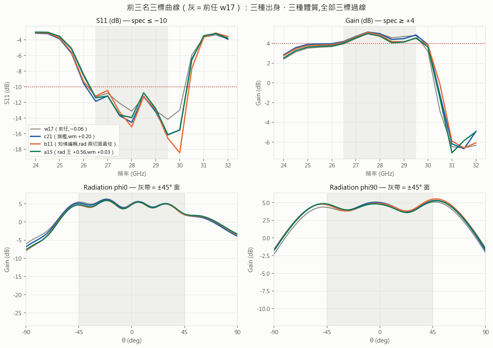

**八冠軍（全部 certified）**：三種出身都上榜——盲掃 3 席、知情編輯 1 席、SM 導引 4 席。SM 導引佔一半＝重錨後導航儀的直接戰績（敢挑 k=16–32 的遠鄰居而且挑得準；重錨後作戰區中位誤差 0.36 dB、爛區 5.75——分區有效性成為「什麼時候信它」的誠實答案）。旗艦 c21 wm +0.20（S11 餘裕 +1.18 全場最寬）；b11 rad 兩切面最佳（知情編輯的設計意圖兌現）；a15 是 rad 王（+0.56）。

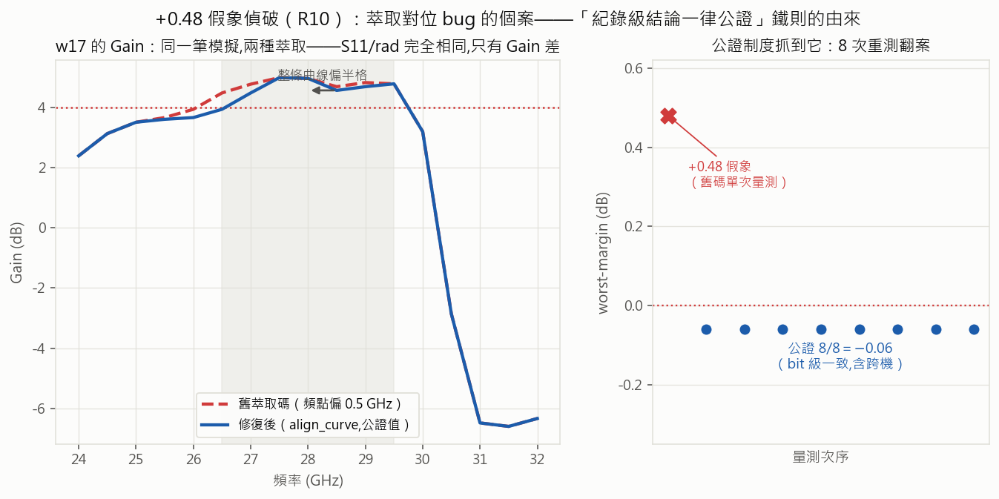

**大考**：前任 w17 的 +0.48 是萃取 bug 造出的假象（§2）；公證制度抓到它、修復它、並把教訓制度化。八冠軍正是在修復後的體系下驗證的——這個誠實敘事是整個成果的可信度錨點。

> **▍一句話重點**：產品（八冠軍）、能力（SM 作戰區 0.36dB）、知識（承重圖＋對稱化因果）在同一輪同時交付——批次假設迴圈的完整示範。

---

## 9. 設計規則目錄（節錄）

規則管線：相關性觀察 → 可證偽預測 → 因果批次檢驗 → 過關才升級為算子/先驗（不過就淘汰）。「**先驗是被審判的，不是被相信的**」。完整目錄見 `docs/design_priors.md`（10 條、三級證據制）。

| 級 | 規則 | 證據 |
|---|---|---|
| 🥇 因果 | 對稱化救爛毀好（爛解對稱化→大幅變好；好解再對稱化→毀） | R10 X 臂 4/4 命中 |
| 🥇 因果 | 粉塵承重：碎片雲的粉塵是共振一部分，拔除即崩 | R7 4/5＋R8-A 中位 1.17 |
| 🥇 因果 | 空間承重圖：底排承重、上半低成本（家族內成立） | R10 遮蔽掃描 ×2 |
| 🥇 因果（反例） | 補洞改善 Gain——**死刑** | R8-B rad 全負 |
| 🥈 相關 | S11←少組件、Gain←少洞、共同敵人=細碎 | analysis-01 配對 |
| 🥈 相關 | 大主件（240–250px）＋雙翼是可製造沃土 | R9/R10 冠軍統計 |

> **▍一句話重點**：規則目錄是「規則→generator 載入」的原料——下一階段把它們變成生成器的結構先驗。

---

## 10. 進行中與下一步

- **R11（跑步中）**：冠軍公差穩健化 × 規則普適性。早期訊號：整面 erode/dilate 1px 對 c21 致命（−11.9/−16.8）；**局部邊緣缺陷 k1/k2 存活 7/9**（最壞 −0.11）→「穩健」的定義以局部缺陷存活率為主。判準已寫死：三態（原樣＋erode1＋dilate1）皆三標＝穩健冠軍。
- **帶外選擇性（已定案入判準）**：帶內＋rad＋可製造＝硬約束；帶外（S11 貼 0、Gain 壓低）＝加分 tiebreak，永不拿來換帶內。現況：八冠軍帶外惡度 9.0–11.5，低頻裙擺（24–25.5 GHz）是主破口，選擇性榜與 wm 榜幾乎反序——ref3 批次將做第一次多目標拉鋸。
- **組數階梯探索（候選）**：冠軍全是 3 塊構型；4 塊（上3下1／2+2）、5 塊未探——多塊＝多共振器＝選擇性潛力，`add_block` 算子已備。
- **規則→generator（R12 前置工程）**：把規則目錄載入生成器（logit map／修復算子／結構先驗），回到線上系統驗證「知識回灌」的價值。
- **實作量測**：挑穩健冠軍出實體，關掉「模擬≠量測」這個最大的 limitation。

---

## 附錄 A：全 round 一句話結論

| Round | 主題 | 一句話結論 |
|---|---|---|
| R1 | SM 訓練量 A/B | 訓練量非瓶頸；dlf≈refit>dlf_fit，皆差 spec ~4dB |
| R2 | ensemble＋trust | 治本微幅未決定性；trust 卡低 |
| R3 | 探索×DIP factorial | E(lr↑)最佳 −3.63；三臂被 SM 欠訓汙染 |
| R4 | 自適應 SM 訓練量 | E+D 破紀錄 −2.89（探索躍遷）；主假設未驗證 |
| R5 | 滑動視窗 SM（進行中） | SM 訓起來了（fit_loss→0.45）；wm 未跟上 |
| R6 | 離線期望基準 | 期望爬升到不了 spec；oracle 在池內；分布≫策略 |
| R7 | 除塵驗證 | 粉塵=共振一部分（4/5 崩）；p03 例外＝紀錄起點 |
| a-01 | pattern 解剖 | 地形非抽獎；S11←少組、Gain←少洞 |
| R8 | 乾淨子空間測繪 | A崩/B敗/C半亮/D實錘；補洞死刑、SM 分區地圖 |
| R9 | 池頂重驗＋跨家族 | oracle 活著 8/18；29 家族；**s05 −0.29 對稱化首勝** |
| R10 | 精修×物理歸因 | **八冠軍 certified（c21 +0.20）**；承重圖；+0.48 假象偵破 |

## 附錄 B：八冠軍配方（全部從 w17 錨點一行重現）

| # | id | wm | rad | 出身 | 配方 |
|---|---|---|---|---|---|
| 🥇 | c21_sm | +0.20 | +0.12 | SM 導引 | 翻 32px（seed 7489）＋再對稱化 |
| 🥈 | a00_k2 | +0.15 | +0.13 | 盲掃 | 翻 2px（seed 6000）＋再對稱化 |
| 🥉 | b11_k2 | +0.13 | +0.22 | 知情編輯 | 承重圖低成本區翻 2px（seed 6059） |
| 4 | c10_sm | +0.07 | +0.35 | SM 導引 | 翻 16px（seed 7344） |
| 5 | c18_sm | +0.07 | +0.32 | SM 導引 | 翻 16px（seed 7430） |
| 6 | c17_sm | +0.07 | +0.10 | SM 導引 | 翻 16px（seed 7375） |
| 7 | a15_k4 | +0.03 | **+0.56** | 盲掃 | 翻 4px（seed 6015）——rad 王 |
| 8 | a11_k2 | +0.01 | +0.24 | 盲掃 | 翻 2px（seed 6011） |

驗證譜系（每筆都走完）：ref2 批次 → ref2v 修復版萃取重驗（逐位同）→ Discrete 掃頻硬解跨機 8/8 逐位同。pattern 本體：`docs/log/assets/round-10/champions8_patterns.txt`。

## 附錄 C：術語對照與資料出處

- **worst-margin (wm)**：帶內規格餘裕最小值（dB，正=達標）；**三標**：wm＋rad±45°＋可製造。
- **池**：學長歷史 24,189 筆（harvest_single）；**F0-F5**：池 top-300 聚類的前六家族。
- **公證**：紀錄級結論的多維驗證（重複×掃頻法×跨機）。
- 各 round 完整檔案：`docs/log/round-NN-*.md`；live 進度：`configs/ONGOING.md`；冠軍名鑑：`docs/champions.md`；規則目錄：`docs/design_priors.md`；碩論大綱：`docs/thesis_outline.md`。
- 本報告圖表腳本：`script/figs/report_r1r10_{online,batch,champs}.py`（資料來自 NAS stores 與本機快取，決定性可重跑）。
