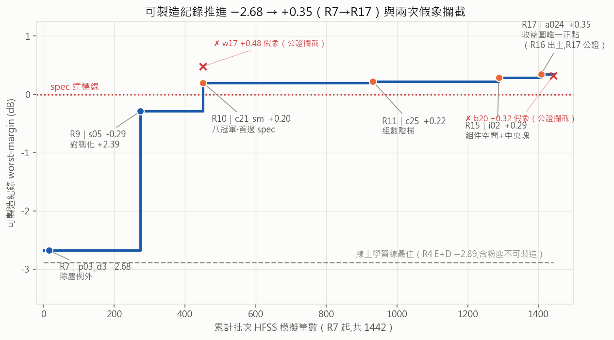
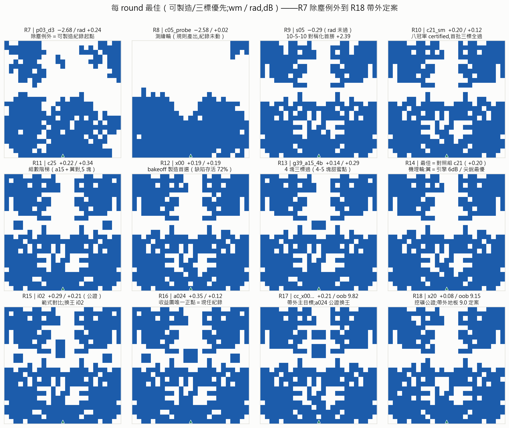
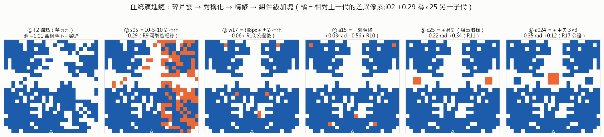
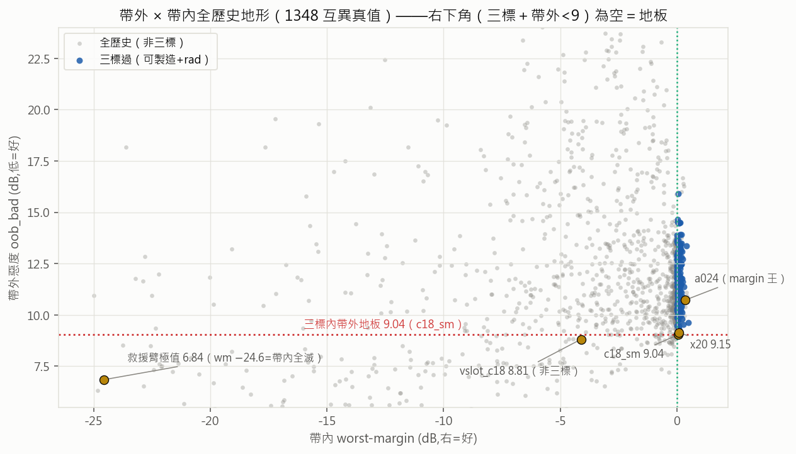
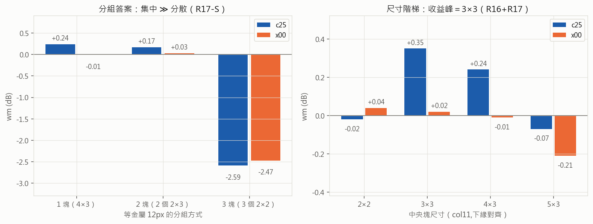
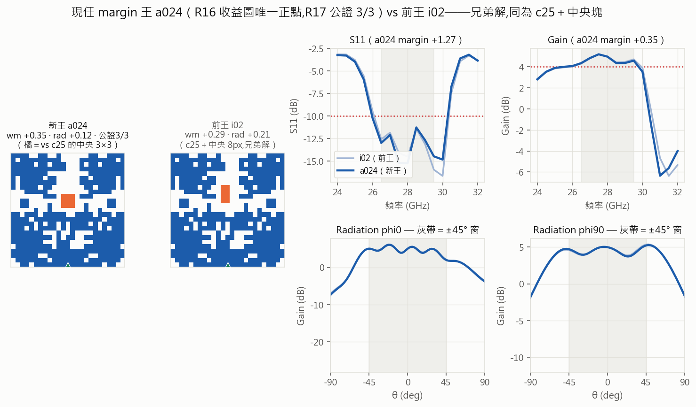

# 天線 Pattern 反向設計：R1–R18 總進度報告（演進版）

**鄒穎麒 ｜ 2026-07-09 ｜ 資料截止：R18 收檔（帶外戰役定案；R1–R18 全數歸檔）**

---

## 0. Scope 與 Limitations

本篇是 R1–R18 的**總覽版**：以「每 round 的最佳 pattern」串出演進主線，重點在 R11–R18（R1–R10 細節見
`progress-r1-r10.pdf`，R11–R14 分數詳表見 `progress-r11-r14.pdf`，本篇不重複）。
邊界照舊：全部結論在現行 HFSS 模擬設定內（模擬 ≠ 量測，x00 為送測首選）；單一 spec
（26.5–29.5 GHz，S11≤−10／Gain≥+4／rad ±45°／可製造）；冠軍全數 w17 家族（其特殊性已被 R12 實驗證明，
非搜尋疏漏）。凡標「單次」即未經公證，不作紀錄宣稱。

> **▍一句話總結**：十八輪把一個問題從「怎麼跑訓練」推進到「怎麼設計天線」——可製造紀錄
> **−2.68 → +0.35**（1442 筆批次 HFSS）、三標解累計 180+、帶外地板 **9.0 定案**（低側雙判死）、
> 設計語言完成參數化（底座＋雙雲＋中央塊；集中 ≫ 分散、尺寸峰 3×3）、
> 量測誠信體系兩度攔截假象（w17 +0.48、b20 +0.32）。下一棒：模型線（SM v5＋GA，觸發已成立）。

---

## 1. 記分板

| 格 | R10 收檔 | R14 收檔 | **R18 收檔（現況）** |
|---|---|---|---|
| 產品：可製造紀錄 | +0.20（c21） | +0.22（c25）；製造首選 x00（72%） | **+0.35（a024，公證 3/3）**；帶外榜 9.04–9.54 四筆公證 |
| 能力：量測/搜尋 | SM 作戰區 0.36dB | 組件級算子庫 | 手術算子庫（slot/cut）＋查重制度＋**帶外拆側儀表**；SM v4 oob 排序 ρ+0.31 |
| 知識：機理 | 規則 10 條 | 張力機理（翼）＋組件語言 | **帶外地板 9.0＋低側雙判死＋分組/尺寸定律＋hslot=rad 旋鈕＋配對正交互** |

**圖 1**：可製造紀錄七步推進 −2.68 → +0.35。兩個紅 ✗ 是被公證制度攔下的假象（單次高值重測不成立）——
紀錄曲線上每一個點都是重複量測過的。灰虛線是線上學習線五輪的天花板（−2.89，含粉塵不可製造），
兩範式的效率差是 R1–R10 報告的主線，本篇不再展開。

---

## 2. 演進總覽（本報告主圖）

**圖 2**：R7–R18 每輪最佳（可製造/三標優先）。可以直接看到演進的三個階段：
**碎片雲期**（R7–R8：整塊底座＋雜亂上雲，margin 深負）→ **對稱化期**（R9–R10：10-5-10 對稱先驗進場，
外形收斂成「下底座＋上雙雲」，margin 進入 ±0.3）→ **組件微雕期**（R11–R18：外形幾乎不再變，
變化全在中央帶小塊與幾個像素——margin 從 +0.20 推到 +0.35，帶外/rad/穩健各自立榜）。
「後期圖看起來都一樣」是空間的真實形狀：R12 已證 w17 家族是 24k 池內唯一可製造達標區，
且視覺相似 ≠ 電磁相似（x00 與 c21 差 2px，缺陷存活率 72% vs 28%）。

**圖 3**：現任 margin 王 a024 的完整血統（橘＝相對上一代的差異像素）。六步、每步都是一個 round 的產物：
學長池撈出 F2 碎片雲 → 對稱化救援（R9 破紀錄）→ 翻 8px 再對稱化（R10）→ 三臂精修（R10 八冠軍）→
加翼對（R11 組數階梯，使用者提議）→ 加中央 3×3（R16 添加收益圖的唯一正點）。
**前三步是「找形」，後三步是「組件級加法」**——這條鏈本身就是方法論的演進史。

### 每 round 一行（R1–R18 全表）

| Round | 主題 | 該輪最佳 / 關鍵數字 | 一句話結論 |
|---|---|---|---|
| R1 | 線上線：訓練量 | — | 訓練量加倍非瓶頸 |
| R2 | 快照/回滾治本 | — | 治本微幅，瓶頸在 SM |
| R3 | 三臂隔離 | — | SM 欠訓確診（gap 3–4.5dB） |
| R4 | 自適應 SM | E+D **−2.89**（線上紀錄） | 破紀錄靠探索躍遷；探測自鎖 |
| R5 | 滑動視窗訓練量 | E 臂 gap **1.24**（史上最低） | 訓練量修好了，泛化到頂 |
| R6 | 期望邊界（離線） | 期望爬升 −9.18+0.75·ln k | 到不了 spec；oracle 已在池內＝分布≫策略 |
| R7 | 除塵驗證 | p03_d3 **−2.68**（可製造起點） | 粉塵＝共振一部分（4/5 崩）；乾淨解要構造不能修 |
| R8 | 乾淨子空間測繪 | c05_probe −2.58 | A崩/B敗/C半亮/D實錘：random 輸池抽樣 5dB |
| R9 | 池頂重驗＋對稱化 | s05 **−0.29**（+2.39） | 10-5-10 對稱化首勝；家族普查 |
| R10 | 精修攻堅 | c21_sm **+0.20**（八冠軍） | 首批三標全過；w17 +0.48 假象→公證鐵則誕生 |
| R11 | 公差×規則普適 | c25 **+0.22**（組數階梯） | 底排承重跨家族 ρ+0.53–0.72；整面蝕刻全滅 |
| R12 | 收斂×破單一化 | x00 缺陷存活 **72%**（製造首選） | crown 零假象；family2 全敗＝w17 特殊性 |
| R13 | 組數階梯 | g39_a15_4b +0.14（4 塊） | 4–5 塊甜蜜點；6 塊遞減（後被 R15 部分翻案） |
| R14 | 組件級軸（消融/縮放） | 最佳＝對照組 | 翼＝帶內引擎 6dB 兼 rad/帶外殺手；尖銳最優；像素級退役 |
| R15 | push-button vs 工具箱 | i02 **+0.29**（換王,公證） | GA 至少打平＝**空間即知識載體**；g14 +0.40 帶內紀錄（rad 未過） |
| R16 | 添加收益圖 | a024 **+0.35**（出土） | 單塊近全負（空間飽和）；唯一正點 r9c11×3×3；配對正交互；g14 rad 兇手＝g3 |
| R17 | 帶外主目標一批 | cc_x00 +0.21/oob 9.82；**a024 公證換王** | 低側物理可動（hslot）但買不起＝張力；分組=集中≫分散；hslot=rad 旋鈕 +1.7 |
| R18 | 帶外二批（挖礦落地） | x20 +0.08/oob **9.15**（公證） | 低側救援 0/20＝粉塵本體定案；b20 假象攔截；**帶外地板 9.0 定案** |

---

## 3. 兩條研究線怎麼走到這裡（壓縮敘事）

**線上學習線（R1–R5）**是一部診斷史：五輪各修一個瓶頸（訓練量→回滾→欠訓確診→自適應→滑動視窗），
把 SM 從「系統性低估 3–4.5dB」修到「gap 1.24」，但 best-wm 天花板停在 −2.89 且含粉塵。
它的遺產不是紀錄，是**工具**：SM 代理、ACP 排程、誠實的失敗歸因——以及「範式該換」的證據。

**批次假設迴圈（R6 起）**接棒：R6 用學長 rollout 算出「期望爬升到不了 spec、oracle 已在池內」＝
分布 ≫ 策略，於是把 HFSS 預算從「訓練」改投「假設驗證」——每輪一個假設、判準發車前寫死、
紀錄級一律重複量測。十二輪 1442 筆模擬的效率全表看圖 1。

---

## 4. R11–R14：把冠軍變成「工程對象」（詳表見 progress-r11-r14.pdf）

四輪回答四個工程問題：**扛不扛得住製造誤差**（R11/R12 bakeoff：整面蝕刻全滅＝margin 要吃公差；
局部缺陷存活＝margin×位置；margin 相近時穩健性才是製造判準——x00 72% 對 c21 28%，兩者只差 2px）、
**規則是不是普適**（R11 occl2：底排承重跨家族 ρ+0.53–0.72）、**這家族是不是唯一**（R12 family2：
非 w17 家族深掘全敗＝特殊性確立）、**pattern 由什麼組成**（R13/R14：組數 4–5 塊甜蜜；
翼＝帶內引擎 6dB、同時付 rad＋帶外＝三標張力的物理載體；冠軍在尖銳最優點上，±1 圈是懸崖）。
R14 收檔時像素級操作正式退役，設計語言轉為組件參數化。

---

## 5. R15–R16：範式對比與知識遷移邊界

R15 是方法論的對照實驗：同一個組件空間裡，**push-button GA（全 SM fitness 盲搜）對上知情分層對上
空間隨機**，同額 HFSS 預算。判決：GA 至少打平（三標過數還贏），知情挑選 ≈ 隨機——
正確結論是「**空間即知識載體**」：R7–R14 的知識已經燒進空間定義（錨點=冠軍/尺寸=甜蜜點/對稱化），
之後盲搜就夠。工具箱的價值在建構空間，不在最後挑選。副產品：換王 i02（+0.29 公證）、
g14 +0.40 帶內紀錄（rad −0.39 未過＝三標張力的實測上界）。

R16 補上被 R15 戳破的知識缺口（移除成本圖 ≠ 添加收益圖）：四錨點單塊全掃的結果是
**收益圖近全負＝空間已飽和**，唯一正點是「r9c11 × 3×3」——同一位置 2×2 是負的，
位置×尺寸交互極強（使用者對 2×2 探針的質疑被數據證實）。更重要的是**配對正交互**：
兩個各自為負的塊放在一起可以翻正（c07 +0.25 > 錨點 +0.19）——加塊優化不能貪心，組合有紅利。
塊歸因鎖定 g14 的 rad 兇手＝g3（移除即三標過）。a024 在本輪出土。

---

## 6. R17–R18：帶外戰役（主目標兩輪，正反都定案）

背景：使用者定調「帶外當主目標探索幾輪」。拆側儀表（lo/hi 分側追蹤）先破案——
**低側（24–25.5 GHz）是全家族鎖死的地板**（Gain 3.3–4.0、滾降 ≈0.3，單側貢獻 ≈9.2），
高側旋鈕（中央塊）其實早已在手，只是被 `oob_bad=max(兩側)` 遮住。兩輪 79 筆分頭進攻：

- **R17 手術批**（slot/cut 切削改諧振）：hslot 給出乾淨的低側劑量反應（3.74→2.59）＝**低側物理可動**，
  但每壓 0.3 付 ~1dB 帶內＝**三標內買不起**。意外收穫：hslot 同時是史上最大的 rad 旋鈕（+1.0～+1.7）。
- **R18 救援批**（池頂低側家族×{對稱化,除塵}）：**0/20 全滅**，且互斥形態完整——對稱化保低側
  （lo 到 −9.2、帶外極值 6.84）殺帶內（wm −16～−24）；除塵保結構殺低側（優勢蒸發到 +1～+2.4）。
  **「低側乾淨＝粉塵諧振本體」定案**（R7 定律的帶外版）。

**圖 4**：1348 筆互異真值的帶外×帶內全地形。右下角（帶內達標且帶外 <9）是空的——這就是「地板」的
視覺定義；左下角的救援臂樣本證明帶外 6.84 存在、但代價是帶內全滅。三標內紀錄由 c18_sm 9.04 持旗
（跨店雙響應公證），x20 9.15、vb43 9.24、vpd2 9.54 本輪公證入榜。

**圖 5**：R17-S 臂順帶回答了使用者的分組問題：等金屬 12px，集中一大塊（+0.24）≫ 拆兩塊（+0.17）≫
拆三小塊（**−2.59，災難級**）；中央塊尺寸峰在 3×3（+0.35），大了單調衰減。
**中央帶金屬要集中、要 3×3**——這兩條直接進 generator 先驗。

---

## 7. 現任冠軍榜（全公證；詳見 docs/champions.md）

| 頭銜 | id | 數字 | 出身 |
|---|---|---|---|
| 👑 margin 王 | **a024** | **+0.35**／rad +0.12／oob 10.72（3/3） | R16 收益圖唯一正點 |
| 🏭 製造首選 | x00 | +0.19／+0.19（缺陷存活 **72%**） | R11 wide；R12 bakeoff 定案 |
| 🌊 帶外王 | c18_sm | oob **9.04**（+0.07／+0.32） | R10 SM 導引；跨店雙響應 |
| 📡 rad 王 | a15_k4 | rad **+0.56**（+0.03） | R10 盲掃 |
| ⚖ 平衡王 | g16 | +0.21／rad +0.49 | R15 GA 臂 |
| 🎯 帶內紀錄 | g14 | **+0.40**（rad −0.39＝非三標） | R15；rad 兇手已鎖定（g3） |

另有三筆**單次**紀錄級待公證（R19 搭載）：cc_c25_r6s2_r9s3 wm +0.36（rad −0.22）、
cc_x00_r5s2_r8s3 +0.21/oob 9.82（三標內帶外次佳平衡）、cc_c25_r6s2_r9s2 rad +0.62（rad 王挑戰者）。

**圖 6**：新王 a024 對前王 i02——兄弟解（同為 c25 子代），差別只在中央塊的形狀（3×3 對 2×4），
margin +0.35 對 +0.29。中央帶幾個像素的形狀差 0.06dB margin＝這個空間後期優化的解析度。

---

## 8. 量測誠信體系（本專案的地基）

- **公證鐵則**（紀錄級一律重複量測）：R10 起累計攔截兩次假象——w17「+0.48」（實為 −0.06）、
  b20「+0.32」（實為 −0.19，R18）。反向亦然：R12 crown 起 20+ 候選公證**零假象**，
  且全部重複 bit 級一致＝制度成熟、模擬決定性成立。
- **查重制度**（check-dup，2026-07-07 起）：批內＋全歷史（27 個輸入夾）交叉，發車前必跑；
  蓄意重複（公證）豁免。R17 起零重複發車。
- **雜訊地板 ≈0**：s05×41 次跨機重複 bit 級一致；掃頻交叉驗證 9/9。
- **誠實記錄反例**：SM v4 作戰區飽和（資料翻倍不動）、知情臂輸隨機、低側救援全滅——
  negative result 一律照判準收檔，不救不藏。

---

## 9. 下一步：模型線（觸發已成立）

使用者預註冊的觸發條件（R17/R18 收檔判死低側）已命中。路線：
① **SM v5 重錨**——CLEAN_STORES 補進 R17/R18 全部 79 筆（低側 Pareto 全譜＝模型最缺的新區域覆蓋），
held-out 專驗新區域的 oob/lo 排序；② **rad head 盤點**——張力拓撲是 (wm＋低側)↔rad，
模型線最缺的是 rad 預測器；③ **GA over 組件-算子空間**（非像素）——基因＝錨點×算子序列，
fitness＝字典序（wm/rad 硬約束＋帶外目標），R15 的 GA 架子直接改。
理由：R16 的配對正交互證明這個空間的非線性耦合正是手工先驗抓不到、模型抓得到的部分。

---

*製圖：`script/figs/report_r1r18.py`（決定性可重跑）；數字全數對 `docs/log/round-*.md` 與公證紀錄核對。*
*本篇 PDF 由 `docs/report/build_pdf.py progress-r1-r18` 產生。*
