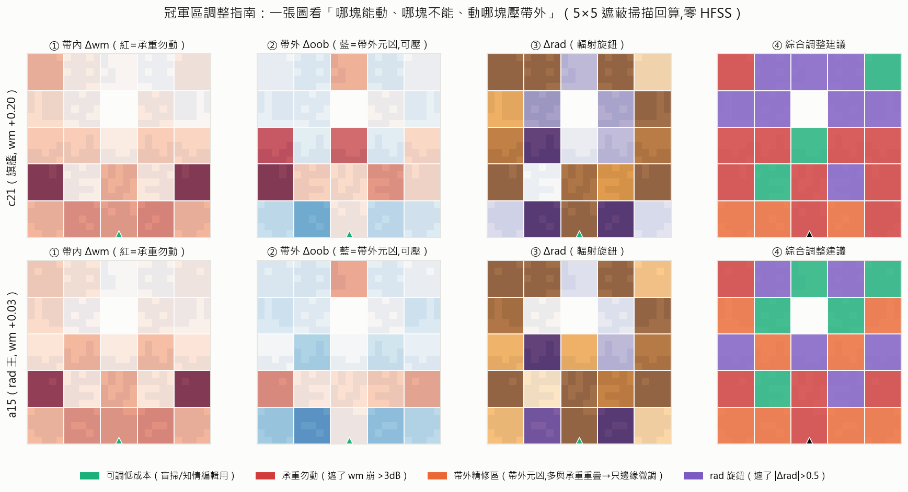

# 現況報告 — 2026-07-08（R11 進行中）

**接續 R1–R10 主報告（`progress-r1-r10.md`）。本份＝R11 期中快照＋區調整指南。**
資料截止：37 probes 41/56、218 wide 127/160（皆進行中，數字為快照）。

---

## 0. 一頁摘要

> **R11 三條線都有貨**：①產品——ref3 冒出**新王候選 c25（wm +0.22／rad +0.34，5 塊翼對，帳面雙贏 c21）**，公證進行中；②知識——兩個因果探針同時命中：**「對稱度＝輻射旋鈕」**（全對稱冠軍 rad 全數變好）與**「懸浮件是功能不是缺陷」**（搭橋串接反而崩 −5.4dB，直接反駁學長的孤島抑制論點）；③工具——把承重圖升級成一張可操作的**區調整指南**（下圖），一眼看出每塊「能不能動、動了會怎樣」。

---

## 1. 機器現況

| 機 | 批 | 進度 | 亮點 |
|---|---|---|---|
| 37 | probes（56 筆） | 41/56，2 error | c25 公證 5/5 一致；搭橋崩、全對稱買 rad |
| 218 | wide（160 筆） | 127/160，5 error | X 臂「破對稱也活」11 筆；W 臂高原外 0 筆 |

兩批都健康推進，收檔後同指令各補一次 COM 例外（success skip／error retry）。probes ≈ 收尾中、wide ≈ 再 1.5 小時。

---

## 2. 區調整指南（本份主圖，你要的那張的升級版）

把 5×5 遮蔽掃描（零 HFSS，曲線回算）整理成**每塊的操作建議**。讀法：

- **① 帶內 Δwm**：深紅＝遮了 wm 崩 >3dB＝**承重勿動**（主件底排＋底角）；淡色＝低成本。
- **② 帶外 Δoob**：深藍＝遮了帶外反而更乾淨＝**帶外元凶**（集中在主件底緣）。
- **③ Δrad**：紫／橘＝遮了輻射明顯變動＝**rad 旋鈕**（上緣與側翼）。
- **④ 綜合建議**：四色一圖——🟩可調低成本（盲掃／知情編輯落點）、🟥承重勿動、🟧帶外精修區、🟪rad旋鈕。

**最關鍵的一眼**：④裡橘色（帶外精修區）幾乎全部壓在底排，而底排同時是紅色承重區——**帶外元凶與帶內承重高度重疊**。這就是為什麼「壓帶外」不能整塊移除、只能對這些塊做 **1–2px 邊緣精修**（微調輪廓換選擇性，不動承重）。P4 底緣精修臂正是在測這條路。

---

## 3. 兩個因果探針（本輪最有份量的科學產出）

### 3.1 「對稱度＝輻射旋鈕」——過因果關

八冠軍強制完全對稱（`symmetrize(12)`）後：

| 指標 | 結果 | 判定 |
|---|---|---|
| rad margin | **8/8 變好**（平均 +0.19，最高 a00 +0.42／a11 +0.37） | ✅ 對稱買 rad |
| 帶內 wm | 7/8 變差（平均 −0.4） | 對稱付帶內 |
| 例外 **c18_full** | wm **+0.09**（仍三標過）、rad +0.53、oob 9.31（全場最乾淨） | 🎁 全對稱三標解 |

因果結論：**中央 5 欄自由帶是帶內匹配旋鈕、對稱度是 rad／帶外旋鈕**——R9 錨點級觀察在冠軍級確認。設計先驗加一條，且 c18_full 直接是「rad 規格收緊時的保單」候選。

### 3.2 「懸浮件是功能不是缺陷」——反駁孤島抑制論點

把冠軍的懸浮翼用 1px 金屬**搭橋串接**到主件（材料只增不減）：

| 錨點 | 原樣 wm | 搭橋後 wm | Δ |
|---|---|---|---|
| c21 | +0.20 | **−5.45 / −5.94** | 崩 ~5.6dB |
| b11 | +0.13 | **−5.47 / −5.64** | 崩 ~5.6dB |

**加金屬把它做「更連通」反而毀掉性能**——懸浮翼是有電磁功能的**寄生元件**，不是要被消滅的孤島。這與 R7（拔除粉塵→崩）是同一結論的兩個方向：R7 證明「不能拿掉」，搭橋證明「不能連起來」，雙向因果夾住。

> **碩論用**：學長論文 4.3 節的「孤島抑制（SC Loss）」是把連通性當目標，等於把寄生耦合這個有功能的自由度一起禁掉了。我們的證據鏈（R7 拔除＋搭橋串接＋八冠軍本身＝主件＋雙懸浮翼）支持一個更精確的定式：**敵人是細碎與製造公差，不是不連通**——約束該放在「≥4px、零微塵、feed pad」，允許懸浮件。

---

## 4. wide 批的兩個邊界（218）

- **對稱是鷹架不是成品**：X 臂小 k 擾動**不再對稱化**，11/44 仍三標過（best +0.19）——冠軍破一點對稱照樣活。對稱化是「把爛解拉上高原」的建構手段，不是成品的必要結構。
- **高原半徑 ≲ k32**：W 臂遠距 k48–128 共 63 筆**0 筆過線**（best −0.47）——遠距沒撞到新高地，與 R6「躍遷稀有」一致。冠軍高原是個有限半徑的丘，不是無邊高原。

---

## 5. ref3 收檔回顧（37，159/159）

- 三標全過 **27 筆**（R10 全輪才 8）。**新王候選 c25_a15w10_2_22：wm +0.22／rad +0.34**（5 塊翼對拓撲），帳面雙指標贏 c21——公證中。
- **組數階梯成功**（你的提議）：5 塊翼對 6/17 過、4 塊上3下1 5/16 過；「加塊不毀三標、還買 rad／選擇性」成立 → R12 組數系統對比有出發點。
- SM 帶外排序訊號偏弱（ρ +0.21）→ 底緣精修臂不上 SM 預篩、直接 HFSS 對答案。

---

## 6. 下一步

1. **probes／wide 收檔** → R11 §5 結論歸檔；若 c25 公證過，champions.md 換王（+0.22）。
2. **c18_full 若確認三標**（全對稱、rad +0.53）→ 收進名鑑當「rad 保單」。
3. **底緣精修判讀**：P4 完成後看 `rolloff_lo` 到底能不能被底緣專屬地拉起（目前 edgelo 與 edgeglob 打平，弱訊號）。
4. **R12 候選**：組數階梯系統對比（3/4/5/6 塊）＋規則→generator 載入。

---

*圖表腳本：`script/figs/report_region_guide.py`（區調整指南，決定性可重跑）。證據索引：`docs/log/round-11-robustness.md`、`docs/champions.md`。*
