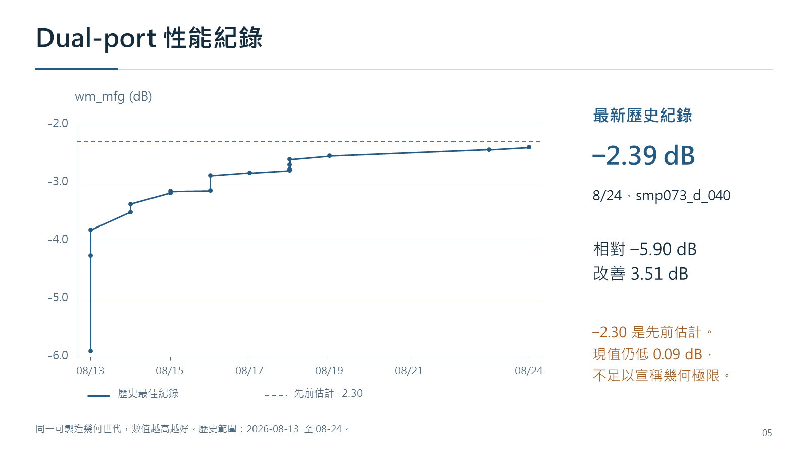
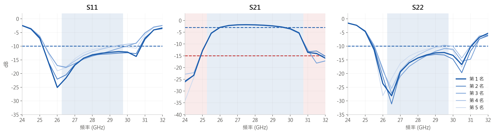
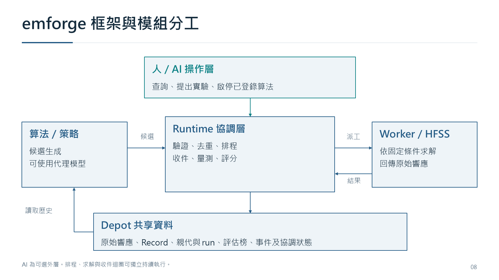
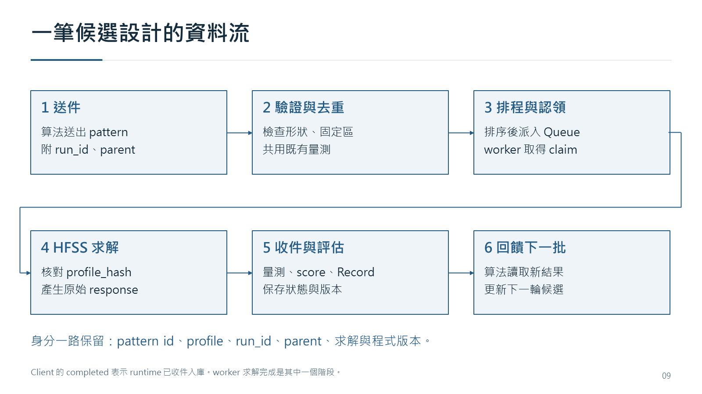
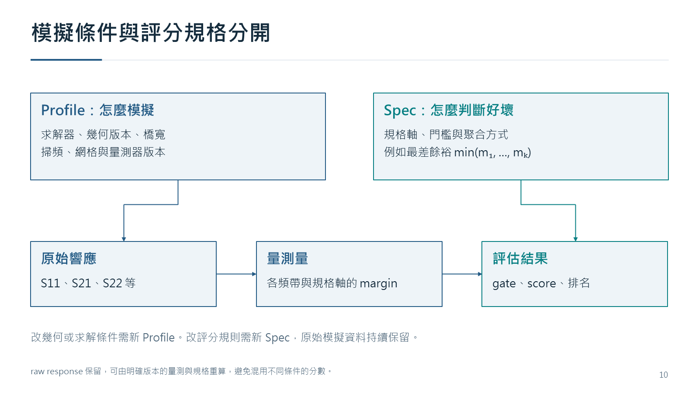
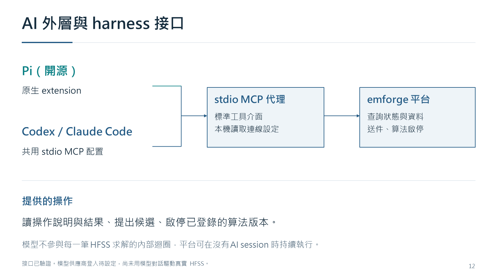
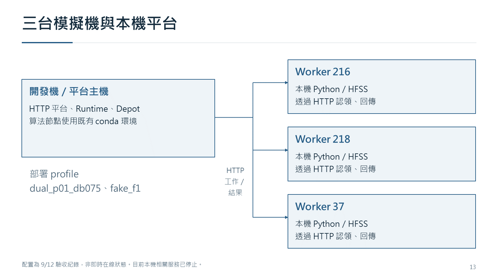
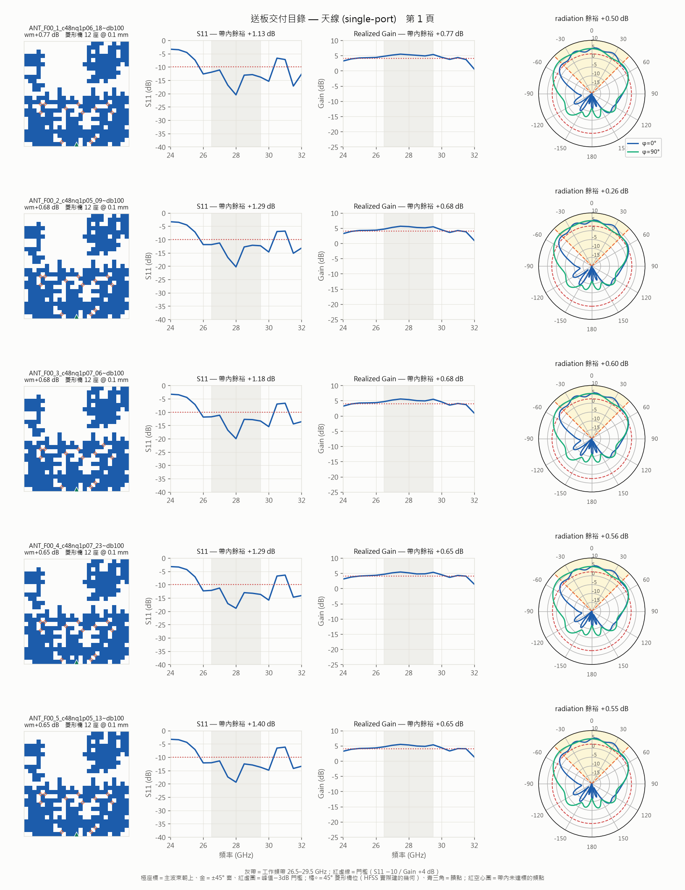
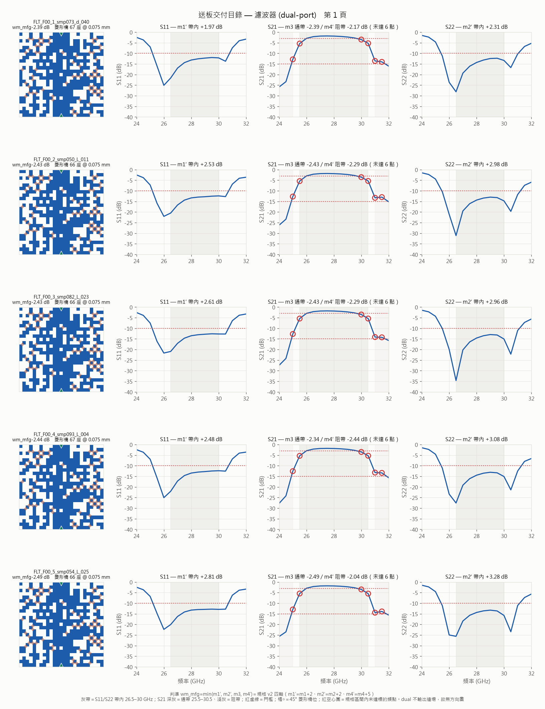

# 天線反向設計：九月份進度報告

> 作者：鄒穎麒  
> 日期：2026-09-13  
> 範圍：承接八月底設計交付，說明 emforge 框架與截至 9/12 的驗證結果。

## 1. 九月工作範圍

本期工作分為設計交付與搜尋平台實作。8/31 已將 25 個天線、14 個濾波器設計匯出為 HFSS 檔，等待製造與實體量測。軟體方面，把既有研究中反覆使用的候選生成、派工、收件及評估流程整理成獨立的 emforge 平台，並完成三台 HFSS 的初步驗收。

本報告區分兩個版本範圍：三台模擬機的初步驗收結果，以及 9/12 程式審查後的本機修正版。後者通過 640 項測試，但尚未切換遠端。9/12 收工時，本機平台、測試 runtime、算法執行端與架構網站均已停止。

## 2. 送板資料與幾何條件

8/31 應鄭國宏學長安排，將兩條研究線的候選設計交付製造驗證。天線取合格解中各款式的代表，濾波器取距當時最佳值 1 dB 內的設計。幾何皆加入 45° 菱形對角橋。

| 設計類別 | 數量 | 選取內容 | 菱形橋寬 |
|---|---:|---|---|
| 天線款式代表 | 21 | 7 個款式的合格代表 | 0.1 mm |
| 天線歷史頂尖設計 | 4 | 學長資料池候選 | 0.05／0.075 mm |
| 濾波器 | 14 | 距當時最佳值 1 dB 內 | 0.075 mm |
| 合計 | **39** | 39 個 .aedt 與 2 份目錄 PDF | 45° 對角橋 |

交付檔包含模型與求解設定，目錄以設計名稱對應 .aedt。掃頻 24–32 GHz，共 17 點，中心 28 GHz。依既有交付紀錄，輕量包約 5 MB，含場解完整版約 7.5 GB，後者保留於 NAS；本次沒有重新核對 NAS 容量。

濾波器交付集仍有規格餘裕為負的候選，交付目的包含製造與實測驗證，不能把「接近最佳值」當成「所有規格皆合格」。

### 交付前重測

| 檢查 | 結果 | 解讀 |
|---|---|---|
| HFSS 重新求解 | 39／39 完成 | 交付集皆有重測結果 |
| 與原量測比較 | 37 筆位元級一致 | 其餘 2 筆差異 ≤ 0.08 dB |
| 交付目錄 | 使用這次重測數值 | 第一張天線餘裕為 +0.77 dB |

以上為 8/31 的歷史重測結果，本次製作報告沒有重新執行 HFSS。實體量測仍需逐項對照 S 參數、增益與方向圖。

### 橋寬與統計範圍

18 個設計的橋寬低於 0.1 mm，包含 4 個天線與全部 14 個濾波器；實際製程可行性需向板廠確認。其餘 21 個天線代表採固定 0.1 mm。

歷史 13 張有多橋寬量測的 pattern，在四種橋寬中取最好值，相對固定 0.1 mm 的差異中位數為 +0.27 dB，最大 +0.65 dB。這描述該歷史樣本的選擇偏差，不能當成本次固定 0.1 mm 交付代表的平均加成。

## 3. 兩條研究線的性能紀錄

### Dual-port 濾波器



同一可製造幾何世代中，wm_mfg 從 8/13 的 −5.90 dB 改善到 8/24 的 −2.39 dB，共改善 3.51 dB。`records_dual.json` 保存 17 筆該指標的歷史最佳紀錄。最新設計為 `smp073_d_040`，最後兩次最佳紀錄由純腳本迴圈產生。

−2.43、−2.39 刷新的是當時最佳紀錄，兩者都仍低於 −2.30。後者來自先前有限樣本分析的估計，尚無理論上界保證。最新值與該估計相差 0.09 dB，不能據此宣稱 25×25 幾何已達極限。



八月前五名的曲線接近，主要限制仍在 S21 的通帶邊緣與阻帶起點。規格要求 S11／S22 帶內不高於 −10 dB，S21 通帶不低於 −3 dB、阻帶不高於 −15 dB。上圖保留八月歷史比較的完整軸線與圖例，九月交付目錄另列於附錄。

### Single-port 天線

歷史最佳紀錄為 +0.79 dB（7/31，公證 3/3），8 月起無新批次。此值與交付前第一張重測的 +0.77 dB 屬不同量測批次，報告保留兩者的來源與意義。性能搜尋暫告一段落，暫不推進 50×50 幾何升級與規格協調。

## 4. 既有實驗對框架的要求

| 實驗觀察 | 量化結果 | 對平台設計的要求 |
|---|---|---|
| R71 dual：由既有量測資料挑起點 | 相對該輪隨機 harvest 加標準橋，高 3.63 dB | 可查詢歷史結果、親代與家族 |
| R71 dual：A_11 起點的鄰域開採 | 改善 2.08 dB | 算法可獨立替換與重複比較 |
| 當時主 SM：未見資料域選批 | 勝過隨機機率 21–26% | 保留對照、預測誤差與實際成本 |

R71 的 hc 對照為 15 筆。SM 結論限當時模型在 K=30／60 的評估。這些數字不能相加，也不足以建立所有任務共用的方法排名。

既有最佳濾波器由不含 LLM 的固定腳本迴圈產出。因此 emforge 將持續搜尋流程寫成可獨立執行的 runtime，AI 放在實驗分析與操作的外層。

換機遷移於 8/28–8/31 完成。舊專案的歷史驗證為 482 項測試通過、NAS 量測備份 37.7 GB 對帳完成。這與 emforge 的 640 項測試屬不同專案與驗證批次。

## 5. emforge 框架

### 模組分工



| 模組 | 負責工作 | 主要輸入／輸出 |
|---|---|---|
| 人／AI 操作層 | 查詢狀態、提出實驗、啟停已登錄算法 | 平台工具呼叫與分析結果 |
| 算法／策略 | 依歷史資料挑起點、生成候選、更新搜尋狀態 | pattern、parent、run_id、預測與附註 |
| Runtime | 驗證、去重、排程、收件、量測、評分與公證觸發 | 批次、結果、Record、狀態及待審資料 |
| Worker／HFSS | 按固定模擬條件求解 | pattern 與 Profile，原始 response |
| Depot | 共享資料與協調狀態的存取介面 | 結果、佇列、執行歷程、事件與鎖 |

Runtime 一個實例綁定一個模擬 Profile。策略可透過 `propose(ctx)` 接入，也可以作為獨立算法行程，使用 `Client` 送件與取回結果。平台統一處理身分、去重與排程，算法不必自行管理 HFSS 機隊。

Depot 將儲存與協調原語封裝起來，現有實作包含 FileDepot、HttpDepot 與測試用 MemoryDepot。本次部署由本機 HTTP 平台協調三台遠端 worker。原始響應與各次評估可保留追溯資料，優秀候選的重測與正式榜單更新分開處理。

### 一筆候選設計的資料流



1. 算法送出 pattern，附上 run、親代等身分。
2. 平台驗證形狀、固定區與條件，檢查是否可以共用既有量測。
3. Runtime 排程，Queue 保存待執行工作，worker 取得認領權。
4. Worker 核對 `profile_hash`，執行 HFSS 並回傳原始 response。
5. Runtime 收件，執行量測與評分，將 Record 與歷程入庫。
6. 算法取得結果，決定下一批候選。

`Client.wait(..., until="completed")` 等待 runtime 完成收件入庫。worker 的求解完成只是其中一個階段。相同 pattern 的共用量測仍保留與各次送件的關係，不會因去重而失去實驗身分。

候選可指定 urgent／normal／background 優先級。同級算法與 run 輪替，背景候選在佇列有空間時填入。排程以候選工作為界，不以任意中斷正在求解的單筆工作來搶占資源。

### 模擬條件與評分規格



**Profile** 定義求解器、幾何版本、橋寬、掃頻、網格及量測器等條件。變更條件需使用新的 Profile，避免把不同儀器定義下的結果混為一談。

**Spec** 定義如何從量測量判斷好壞，包括門檻、規格軸與聚合方式，例如最差餘裕 `min(m1, ..., mk)`。同一量測定義下，可以保留原始響應並用新的 Spec 重評；既有 run 保存自己的 `spec_snapshot`，不因後續修改規格而悄悄改變歷史分數。

### 算法 API 節錄

以下示範算法端的責任邊界。`endpoint`、`patterns` 與連線認證由執行環境提供，這不是自動執行的部署腳本。

```python
from emforge.client import Client

c = Client(endpoint, "dual_p01_db075", "anneal", run_id="trial_a")
sid = c.submit(patterns, request_id="round_0")
c.wait(sid, timeout_s=600)
records = c.results(sid)
```

同一 run 的相同 `request_id` 與內容可冪等重送。Hosted 算法使用固定版本的程式包，記錄節點、環境、seed 與參數，並保留 stdout 與 checkpoint。`budget` 計新增 sample 候選，重試與公證另計，不是 HFSS 總呼叫次數的硬上限。

## 6. AI 外層與 harness 接口



Pi 以開源 harness 的原生 extension 接入，Codex 與 Claude Code 使用共用 stdio MCP 配置。三者都透過同一個 Python MCP 代理呼叫 emforge HTTP 平台，沿用相同送件、身分與預算邏輯。

平台工具提供操作說明、唯讀查詢、候選送件，以及已登錄算法版本的啟停。MCP 工具本身不提供直接修改榜單、任意登錄程式碼或解除急停。AI session 關閉後，已啟動的搜尋與模擬內圈仍可獨立執行。

目前已完成接口驗證，模型供應商與登入尚待設定。尚未使用模型對話驅動真實 HFSS，也沒有由這次接口驗收推論 AI 策略優於現有算法。

## 7. 本機平台與三台模擬機



開發機提供 HTTP 平台、Runtime、Depot 與算法節點。216、218、37 三台機器以本機 Python／HFSS 環境認領工作並回傳結果。本次平台驗收包含 `dual_p01_db075` 與 `fake_f1`。

此圖呈現 9/12 驗收配置，並非即時在線狀態。9/12 收工時，本機相關服務已正常停止，沒有啟動新的 HFSS 或 AI 工作。

## 8. 故障恢復與驗證範圍

### 9/12 修正版

| 故障情境 | 修正後行為 | 驗證方式 |
|---|---|---|
| 同工作目錄重複啟動 | 先取 PID／出生識別鎖，再清理工作目錄 | 兩個真 Python 行程 |
| 求解完成但回傳斷線 | 原始結果先存本機 outbox，重啟補傳 | 真 HTTP 斷線與回覆遺失 |
| 平台子行程死亡 | 只釋放該 owner 的殘留鎖 | 終止、重啟與歸屬檢查 |
| 後處理失敗 | 依入庫狀態計入錯誤率，觸發 Profile 暫停 | 增量收件與重啟回歸 |

同輪亦修正發布包漏收 launcher、requeue 與 pick 交錯，以及 run 名稱與內部鎖撞名。短暫斷線後可從本機待傳區補送已完成結果，但長時間失聯後別台接管，仍可能額外求解，並不保證跨機全域只執行一次。

### 已完成的驗證

| 範圍 | 已完成 | 尚待確認 |
|---|---|---|
| 三機初步驗收 | 12 筆 fake、10 筆真實 HFSS，均單次成功 | 客戶環境持續運行 |
| 同圖跨機一致性 | 原始 response 最大差約 1.91 × 10⁻⁶ dB，measure 與 score 相同 | 實體製造與量測對照 |
| Hosted 算法 | fake 與 HFSS 各完成 3 輪回饋 | 更多算法與實驗條件 |
| 程式修正版 | 工作樹與隔離發布包各 640 項測試通過，pyflakes 與啟動探測通過 | 遠端切換與故障演練 |
| AI 接口 | Pi 整合、TypeScript 與共用 MCP 接口驗證 | 模型登入與對話實驗 |

各列驗證回答不同問題。自動測試與跨機數值一致性是軟體與重現性證據，算法性能增益則需另以相同條件與對照組實驗判斷。9/12 修正版尚未更新到遠端，這份報告不將其隔離測試寫成現場故障演練已完成。

## 9. 現況與後續實驗

| 項目 | 目前狀態 | 後續工作 |
|---|---|---|
| 實體驗證 | 39 個設計已交付 | 比對 S 參數、增益與方向圖 |
| 搜尋結果 | single +0.79 dB、dual −2.39 dB | 保留歷史最佳與各次重測 |
| 平台 | 三機初驗完成，修正版僅本機驗證 | 更新遠端，演練斷線與重啟 |
| AI 輔助實驗 | 接口完成、模型未登入 | 選定模型後做受控比較 |

後續比較應固定 Profile／Spec、候選預算與對照組，分開記錄提出數、共用數、新增量測數、失敗率與已保存的求解耗時。暫不推進 50×50 幾何升級，先完成已交付設計的實測對照與平台現場驗證。

## 附錄：交付目錄

### 天線目錄第 1 頁



### 濾波器目錄第 1 頁



## 附錄：七、八月成果回顧（討論用）

| 月份 | 已完成成果 | 量化紀錄 |
|---|---|---|
| 七月 | 將 Agent 決策、HFSS 真值模擬與分析工具拆開，建立可追溯的批次驗證流程；紀錄級結果以同圖三次 HFSS 重測確認。 | 解耦訓練與模擬後，線上迴圈 278 秒／輪改為批次驗證中位 160 秒／筆。 |
| 八月 | 建立 38,972 筆模擬資料的離線唯讀瀏覽器，並啟動 dual-port 濾波器研究線。 | 8/11–8/24 累積 R57–R79 共 23 輪；可製造最差餘裕由 −5.90 改善至 −2.39 dB，共改善 3.51 dB、17 次破紀錄。 |

以上為各月報告當時的成果口徑，供實體討論快速回顧；九月最新狀態與限制仍以前文為準。

## 來源

- 交付、橋寬與歷史重測：Antenna `docs/discuss/scratch.md` 的 2026-08-31 紀錄，以及九月原始報告。
- 性能歷史：Antenna `docs/records_dual.json` 與 `docs/records_single.json`。本報告的 dual 曲線數據另附 `dual_wm_mfg_history.csv`。
- 方法比較：Antenna `docs/log/round-71-dual-dynasty-mining.md`、`docs/log/analysis-10-sm-vs-physics.md` §5。
- 框架與實作：emforge `docs/implementation.md`、`docs/priority-scheduling.md`、`docs/agent-harness.md`。
- 平台與修正版驗證：emforge `docs/delivery-readiness-2026-09-12.md`、`docs/reliability-2026-09-12.md`，修正版 commit `998ad35`。
- 版面與敘事參考：七月與八月進度簡報。歷史圖保留來源月份與數據口徑。
- 七、八月成果回顧：Antenna `docs/進度報告/07月/進度報告_2026-07.md` 與 `docs/進度報告/08月/八月份進度報告.md`。
