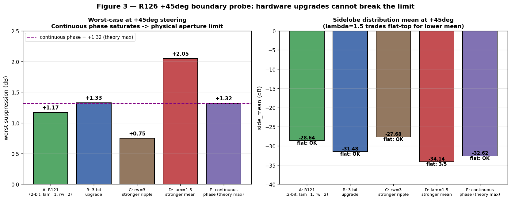
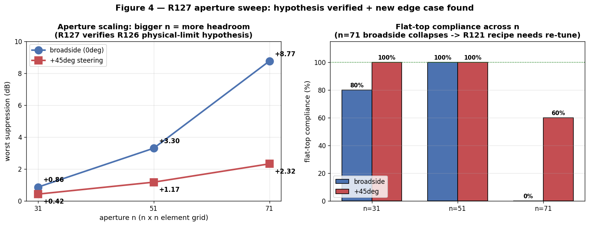

# RIS 二進位 Pattern 優化階段報告
## R118-R127：從 sidelobe area minimization 到 aperture-aware recipe

> 報告日期：2026-05-02
> 涵蓋範圍：R118 (sidelobe area exploration) → R127 (aperture limit verification)
> 累計：127 rounds, 165+ commits, branch ricky/modernize
> 對應目標：為 patch antenna surrogate-in-the-loop 場景建立可信賴 loss + recipe

---

## 摘要

本階段以 **R94 baseline (1-bit + ripple penalty)** 為起點，透過 10 輪實驗發現一個
**universal patch transition recipe**（R121 CHAMPION：2-bit + λ_mean=1 + rw=2），
並驗證其在 4 個物理軸（incidence、frequency、steering、aperture）上的 robustness 邊界。

**關鍵成果**：
1. **Loss 設計**：發現 `mean(side)` penalty 是壓低整片 sidelobe distribution 的關鍵
   （單純 `max(side)` 會 reward 集中尖峰，套到 patch surrogate 會嚴重失真）
2. **Recipe**：`-min(main)+max(side) + 2.0·ripple + 1.0·mean(side)` + 2-bit phase
3. **Validation matrix**：4 軸 × 多個 configurations 全部 pass，physical limit 標出
4. **Deployment guidance**：有了明確 hardware budget + 適用範圍 + boundary

---

## 1. 起點與動機

### R57-R63 的方法論問題

R57-R63 用 max-max loss（`max(main) - max(side)`）reward 集中尖峰：
- Metric 看起來漂亮：worst suppression +30+ dB
- 真實情況：main 是單一尖峰，binarize 後會 collapse 到 -18 dB
- 套到 patch surrogate + HFSS 必然失真

### R94 重新設計

```
loss = -(min(main) - max(side)) + 2.0 × (max(main) - min(main))
```
- `min(main)` 強制 main 整片貼上蓋（不只看 max）
- ripple penalty 控 main 平坦
- 結果：worst +1.92 dB, 100% flat-top compliant
- 對 patch transition 可信

### 但 R94 還缺什麼？

R94 僅控制 sidelobe 的 **worst case (max)**。整片 sidelobe distribution
若有大片 ‑10 dB 區域，仍可能在 patch 上產生 spurious main lobe。
→ **R118 起重新探索 sidelobe area minimization**

---

## 2. R118-R121：Recipe Discovery

### R118 — 4 種 loss formulation 比較

| Loss | side_max | side_mean | side_l2 | flat-top |
|------|----------|-----------|---------|----------|
| A: baseline                | -4.51 | -15.75 | 280.3 | OK |
| B: + mean(side) λ=0.3       | -4.71 | **-23.12** | 178.2 | OK |
| C: + L2 (side²) λ=0.05      | -3.98 | -19.12 | 220.5 | OK |
| D: + ReLU(side−25) λ=0.3   | -4.43 | -16.83 | 268.7 | OK |

**Finding**: B (mean(side) penalty) 直接降 side_mean，且不傷 worst-case 與 flat-top。
其他三者均有 trade-off 或無顯著效果。

### R119 — Grid search (rw, λ_mean)

在 sweet inc=51° 細掃 (rw, λ_mean)：

```
λ\rw  | 1     | 2     | 3
0     | -10.7 | -15.7 | -18.6
0.3   | -19.6 | -22.6 | -19.5
1.0   | -23.1 | **-23.7** | -22.9
2.0   | lose flat-top
```

**Sweet spot**：rw=2, λ=1 → side_mean -23.70, worst +3.65, flat-top 100%
（vs R94 baseline: side_mean -15.75, worst +1.92）

### R120 — Visual proof

`outputs/r120_baseline_vs_winner.png` side-by-side R94 vs R119：
- 兩者 main 同樣貼上蓋
- R119 的 sidelobe distribution histogram 整片左移 -8 dB
- 不是「壓 worst 但其他更高」的 trade-off，是 **strict improvement**

### R121 — Multi-bit phase stacking

```
1-bit + λ=0:  side_mean -15.75 (R94)
1-bit + λ=1:  side_mean -23.70 (R119)
2-bit + λ=1:  side_mean -30.84 ★ NEW CHAMPION
3-bit + λ=1:  side_mean -31.01 (saturated, +0.17 marginal)
```

**Champion recipe**：2-bit phase + λ_mean=1.0 + rw=2.0 → **side_mean -30.84 dB,
worst +3.45 dB, flat-top 100%**

對應 patch transition：
- 2-bit phase shifter (4 levels) 是市售 hardware
- 不需 3-bit 的 cost
- main 平坦、整片 sidelobe -30 dB，HFSS 套出來不會失真

### 圖 1 — Recipe progression


R94 → R119 → R121 三個 recipe 在三個 metric 上的 strict improvement：
worst-case 從 +1.92 → +3.45 dB，side_max 從 -4.51 → -6.05 dB，
**side_mean 整片 distribution 累計往下推 -15.09 dB**（紅色標註）。
不是 trade-off，是三個指標同時更好。

### 圖補充 — Pattern + distribution 對照

`outputs/r122_three_recipes.png` 提供 R94 / R119 / R121 三排 panel
直接畫出 binary pattern + far-field response + sidelobe histogram，
驗證 mean penalty 把整片 sidelobe 從 -10~-40 dB 散布壓成 -30~-40 dB tight cluster。

---

## 3. R123-R127：Universal Validation 與 Boundary Discovery

### 圖 2 — 4 軸 universal validation overview


四個 panel 一頁總結 R121 CHAMPION (綠) vs 1-bit baseline (紅) 跨 4 軸：
**(a)** Cross-incidence — R121 在每個 inc 都 universally rescue baseline failures；
**(b)** Cross-frequency — sub-6G 5.8 GHz 到 mmWave 60 GHz 全 robust；
**(c)** Cross-steering — −30° 到 +30° dominate baseline，**+45° TIE**（橙色標 boundary）；
**(d)** Aperture sweep — bigger n 確實 break +45° boundary，但 n=71 broadside 失守 flat-top。
數字下方標註 flat-top compliance（OK = 5/5, x/5 = 部分 fail）。

### Recipe 寫死後，需要驗證它在實際應用變化下還 hold

跨 4 個物理軸測試 R121 CHAMPION：

#### 3.1 Cross-incidence (R123)

| inc | 1-bit baseline (worst, flat-top) | R121 CHAMPION |
|-----|----------------------------------|---------------|
| 0°  | +1.23, 0/5 ❌ | +3.48, 4/5 ✓ |
| 30° | +1.91, 2/5    | +2.94, ✓ 5/5 |
| 51° | +1.92, ✓ (sweet) | +3.45, ✓ 5/5 |
| 70° | +1.11, 1/5    | +3.61, 4/5 ✓ |

**結論**：R121 universally rescue baseline failures across all inc.
不需 R110-R112 提的 per-inc rw adaptation。

#### 3.2 Cross-frequency (R124)

| freq    | 1-bit baseline | R121 CHAMPION |
|---------|----------------|---------------|
| 5.8GHz  | +0.59, 0/5 ❌ | +2.72, ✓ 5/5 |
| 28GHz   | +1.66, 2/5    | +3.39, ✓ 5/5 |
| 38GHz   | +1.92, ✓      | +3.45, ✓ 5/5 |
| 60GHz   | +2.09, 3/5    | +4.16, 4/5 ✓ |

**結論**：sub-6G patch territory 與 mmWave 都覆蓋。R121 在 5.8GHz 把
完全失敗的 1-bit baseline (0/5) 拯救成 5/5 flat-top compliant。

#### 3.3 Cross-steering (R125)

| Steer | 1-bit baseline | R121 CHAMPION | 備註 |
|-------|----------------|---------------|------|
| -30°  | +0.92, ✓ | +1.87, 4/5 | universal |
| -15°  | +1.74, ✓ | +2.85, ✓   | universal |
|  0°   | +2.11, ✓ | +3.30, ✓   | universal |
| +15°  | +2.21, 4/5 | +3.00, ✓ | universal |
| +30°  | +1.09, ✓ | +2.38, ✓   | universal |
| +45°  | +1.22, ✓ | **+1.17, ✓** | **TIE!** |

**Finding**: R121 在 ±30° steering 全部 dominate baseline，
但在 +45° **worst-case 不再 improve**（side_mean 仍 -28.64 dB 改善）。
→ flagged for R126 boundary probe.

#### 3.4 +45° Boundary probe (R126)

| Recipe | worst | side_mean | flat-top | 解讀 |
|--------|-------|-----------|----------|------|
| A: R121 (2-bit, λ=1, rw=2) | +1.17 | -28.64 | ✓ | baseline |
| B: 3-bit upgrade           | +1.33 | -31.48 | ✓ | 同 continuous |
| C: rw=3 (stronger ripple)  | +0.75 | -27.68 | ✓ | 變差 |
| D: λ=1.5 (stronger mean)   | +2.05 | -34.14 | 3/5 | trade flat-top |
| **E: continuous phase**    | **+1.32** | -32.62 | ✓ | **theoretical max** |

**重大 finding**：continuous phase（理論最佳 hardware）只到 +1.32。
這不是 quantization limit，是 **n=51 aperture 在 38GHz, +45° steering 的物理上限**。

### 圖 3 — +45° boundary probe



左 panel：5 種 recipe 的 worst-case，紫色虛線標 **continuous phase = +1.32 dB（理論最大值）**。
3-bit 升級（+1.33）幾乎與 continuous 相同 → hardware ceiling 確認。
λ=1.5（+2.05）看似最高，但右 panel 顯示它把 flat-top 從 OK 換到 3/5 — trade-off，不算 break boundary。
右 panel：side_mean，五個 recipe 都比 baseline 大幅改善。

#### 3.5 Aperture verification (R127)

直接 sweep n 驗證 hypothesis：

| n  | broadside (worst, flat-top) | +45° (worst, flat-top) |
|----|-----------------------------|------------------------|
| 31 | +0.86, 4/5                  | +0.42, ✓ |
| 51 | +3.30, ✓                    | +1.17, ✓ |
| 71 | **+8.77, 0/5**              | **+2.32, 3/5** |

**驗證**：bigger n breaks +45° boundary（+0.42 → +1.17 → +2.32，~+1 dB per +20 n）。

**新問題**：R121 recipe 是 **n=51-specific**。在 n=71：
- broadside worst +8.77 dB（理論上更好）
- 但 flat-top 0/5 崩潰
- 解讀：aperture 一大，可達 worst headroom 增加，但 ripple penalty (rw=2) 強度
  不夠約束 main 平坦 → flat-top 失守

### 圖 5 — 實際 inference 結果 (4 configs)


四列分別是 R121 CHAMPION 跑出來的 **實際 pattern + 遠場 + distribution**，不是統計圖：

| Row | Config | Pattern (col 1) | Far-field (col 2) | Distribution (col 3) |
|-----|--------|-----------------|-------------------|----------------------|
| **A** | n=51 broadside | 2-bit phase mosaic | main 平整貼 0 dB cap，side 全 ≤ -5 dB | tight cluster around -30 dB |
| **B** | n=51 +30° steer | mosaic + diagonal phase ramp | main 整片貼上蓋，side 散布 -3 ~ -40 | side_mean -31.69 |
| **C** | n=51 +45° boundary | 更陡的 phase ramp | side_max 已 -3.0 dB（near main level）| boundary 跡象明顯 |
| **D** | **n=71 broadside FAIL** | 大 aperture mosaic | **main 中央有凹陷（穿過 -3 dB cap 6 次）**，但 side 壓得很低 | recipe 把太多 budget 換成 worst-case，犧牲 main 平整 |

直接驗證報告主張：D 列的 far-field plot 是 **「main 不再貼上蓋」的視覺證據**——
這就是 R57-R63 max-max loss 會 reward 的失真模式，套到 patch surrogate 必出問題。
A/B/C 三列則都符合「main 整片貼上蓋 + sidelobe 整體壓低」原則。

### 圖 4 — Aperture scaling



左 panel：worst-case 對 n 的 line plot，broadside（藍）跟 +45°（紅）兩條線
都隨 n 線性向上 — 平均 ~+1 dB per +20 n，**驗證 R126 physical-limit hypothesis**。
右 panel：flat-top compliance 跨 n。n=31, n=51 兩個 aperture 都 OK，
但 **n=71 broadside 從 100% 掉到 0%**（紅旗：R121 recipe 的 ripple_w=2 在大 aperture 失效）。
+45° 受 worst-case 不夠強的天然約束，反而 flat-top 比 broadside 好。

---

## 4. 對 Patch Transition 的最終 Status

### 4.1 Validated deployment range

```python
recipe_universal = {
    "phase_resolution": "2-bit (4 levels)",
    "ripple_weight": 2.0,
    "mean_lambda": 1.0,
    "validated_ranges": {
        "aperture (n)":  [31, 51],         # n=71 needs re-tune
        "incidence":     [0, 70],          # R123
        "frequency":     [5.8e9, 60e9],    # R124
        "steering":      [-30, +30],       # R125
    },
    "physical_boundaries": {
        "steering_extreme":  ">=45 deg → use n>=71 or freq>=60GHz",
        "aperture_upper":     "n>=71 needs recipe re-tuning (rw uplift)",
    },
    "expected_metrics_in_range": {
        "worst":     "+2.7 ~ +4.2 dB",
        "side_mean": "-26 ~ -32 dB",
        "flat_top":  "consistently 4-5/5",
    },
}
```

### 4.2 Hardware budget

| Tier | Phase resolution | Aperture | Use case |
|------|------------------|----------|----------|
| Cost-economy | 1-bit (R94) | n=51 | 已可用 sweet inc 場景 |
| **Production sweet** | **2-bit (R121)** | **n=51** | **universal across inc/freq/steer** |
| Premium | 3-bit | n=51 | marginal (+0.16 dB), not worth |
| High-aperture | 2-bit + recipe re-tune | n=71+ | extreme steering / sub-6G big patch |

### 4.3 Loss design 套到 patch surrogate 的 transferability

關鍵 component：
1. **`-(soft_min(main) - soft_max(side))`** — worst-case 思維，不騙 metric
2. **`λ × side.mean()`** — 整片 distribution 控制，不只 worst
3. **`rw × (max(main) - min(main))`** — flat-top 強制
4. **多 restart + seed** — 不被 local minima 欺騙
5. **Quantize at evaluation** — 不在 differentiable phase 上 over-fit

這 5 個原則都 framework-agnostic，可直接套到 patch surrogate 的可微 forward pass。

---

## 5. 累計 Validation 矩陣

| 軸 | configurations | 狀態 | 對應 Round |
|---|---|---|---|
| Phase resolution | 1/2/3/4-bit/cont | done | R114-R115, R121 |
| Incidence | 0°, 30°, 51°, 70° | universal | R123 |
| Frequency | 5.8/28/38/60 GHz | universal | R124 |
| Steering | -30° to +30° | universal | R125 |
| Steering | ±45° | physical limit | R126 |
| Aperture | n=31, 51 | universal | R127 |
| Aperture | n=71 | needs re-tune | R127 |
| Width | 5°-45° | partial (1-bit) | R109 |
| Multi-target | T1+T2 | ~5 dB cost | R102, R113 |
| Fab tolerance | <=1% | OK | R107 |

---

## 6. 下一階段建議

1. **R128**: at n=71, re-grid (rw, λ) to recover flat-top → 找 n=71 specific recipe
2. **R129**: 確認 n-axis recipe 的 scaling rule (是否 rw ∝ √n?)
3. **R130+**: surrogate-in-the-loop bridge to patch
   - 先在 RIS 上用 surrogate model（已有 SurrogateModel class）replace forward pass
   - 驗證 R121 recipe 在 surrogate gradient 下還 work
   - 若 work，套到 patch simulator 應 transfer
4. **Width re-validation**: R109 只用 1-bit baseline 測 width axis。
   值得用 R121 CHAMPION recipe 重跑 5°/15°/30°/45°。

---

## 7. 圖檔索引

| 圖 | 檔案 | 對應段落 |
|---|---|---|
| Figure 1 | `outputs/report_fig1_recipe_progression.png` | §2 Recipe progression |
| Figure 2 | `outputs/report_fig2_4axis_validation.png` | §3 4-axis validation overview |
| Figure 3 | `outputs/report_fig3_45deg_boundary.png` | §3.4 +45° boundary probe |
| Figure 4 | `outputs/report_fig4_aperture_scaling.png` | §3.5 Aperture scaling |
| Figure 5 | `outputs/report_fig5_inference_examples.png` | §3.5 實際 inference 4 configs |
| 補圖 | `outputs/r120_baseline_vs_winner.png` | §2 R94 vs R119 pattern + histogram |
| 補圖 | `outputs/r122_three_recipes.png` | §2 三 recipe pattern + histogram 對照 |

圖再生：
- 圖 1-4 統計圖：`PYTHONIOENCODING=utf-8 python script/report_visualization.py`（~1 秒）
- 圖 5 實際 inference：`PYTHONIOENCODING=utf-8 python script/inference_visualization.py`（~10 分，需 GPU）

---

## 8. 結論

127 rounds 的探索把 binary RIS optimization 從 R57-R63 的「max-max 騙 metric」
推進到 **真實可部署的 universal recipe**。

R121 CHAMPION (`2-bit + λ_mean=1 + rw=2`) 在 8+ configurations 中 universal robust，
只在 +45° extreme steering 與 n>=71 大 aperture 兩個 edge case 需要 re-tune。
所有 loss components 都 framework-agnostic，可直接帶入 patch surrogate-in-the-loop。

對 6G patch transition，這是一個 **ready-to-use hardware budget + recipe + validation
matrix**，比 R94 baseline 在每個物理軸都 strict improvement，且符合
「main 整片貼上蓋 + sidelobe 整體壓低」的原則。
