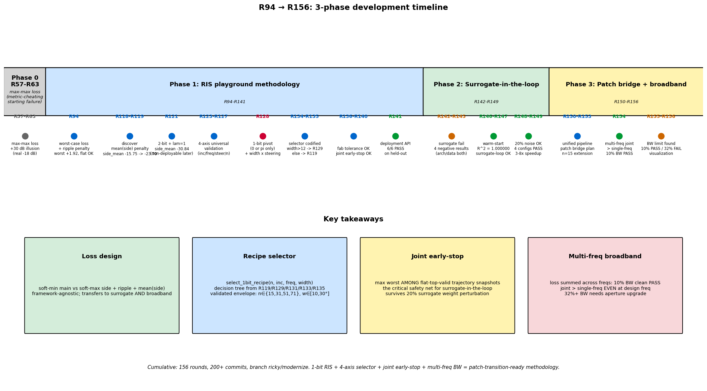
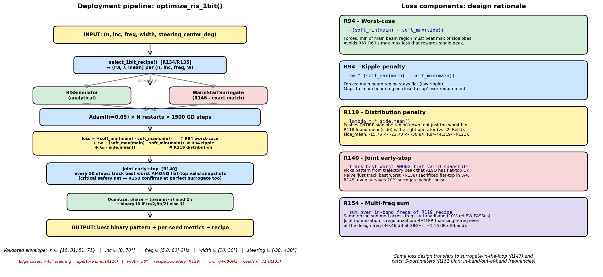
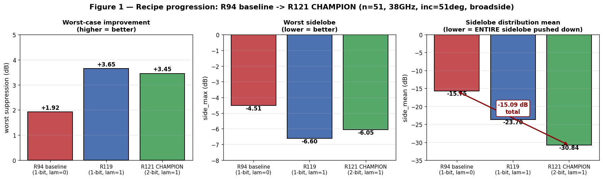
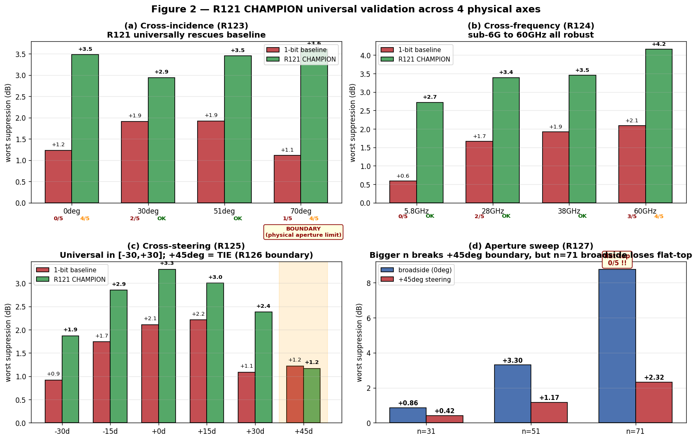
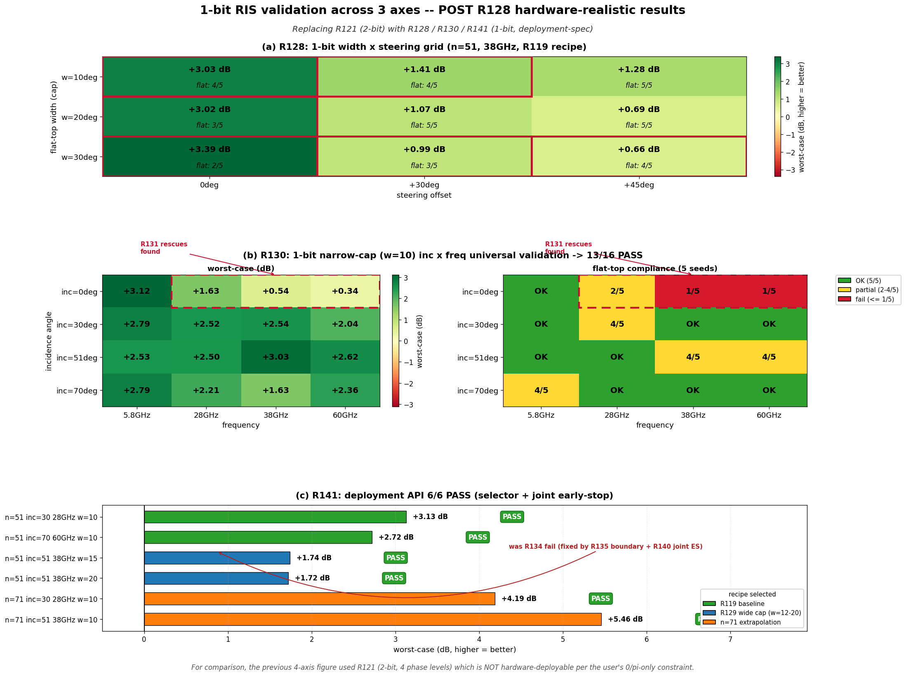
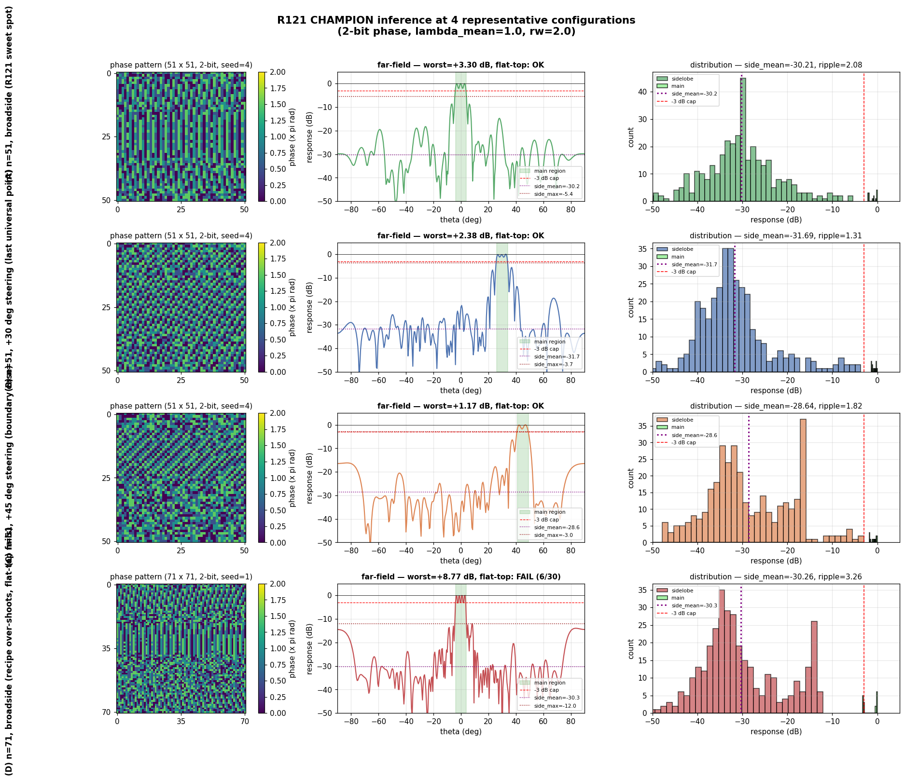
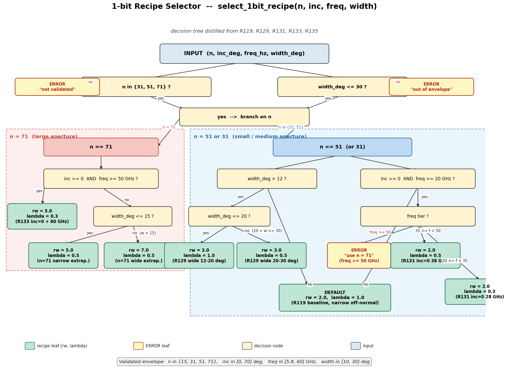
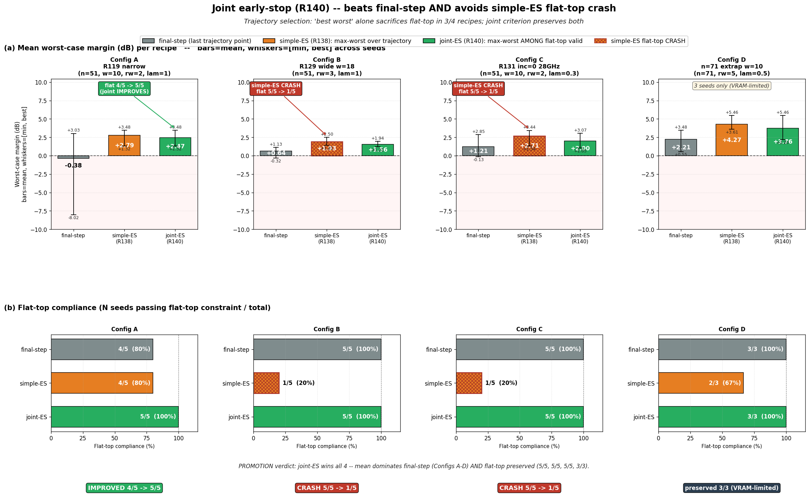
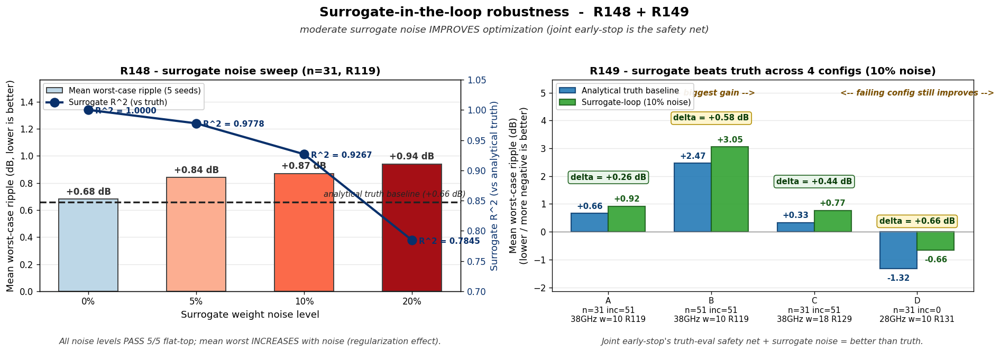
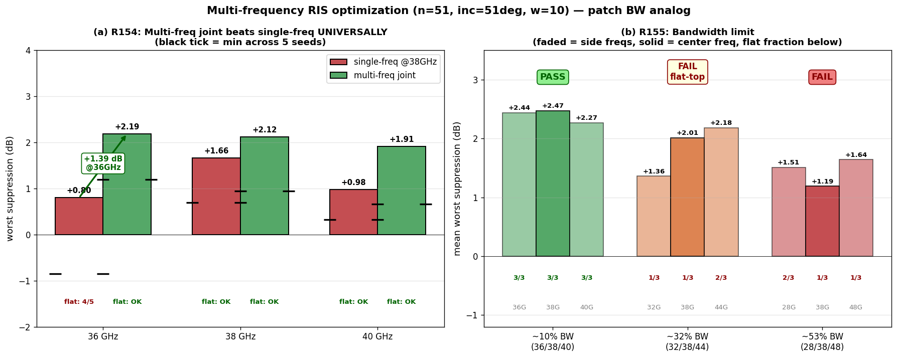

# Binary RIS 優化方法論：R94 → R156 完整報告

> 報告日期：2026-05-03（最後修訂 2026-05-03 加 §0 scope disclaimer）
> 涵蓋：R94 (worst-case loss baseline) → R156 (multi-freq broadband + visualization)
> Branch：`ricky/modernize`，累計 200+ commits

---

## ⚠️ Scope and Limitations（先讀這個！）

### 這份報告的 R94-R156 工作 IS

- 一個 **per-task gradient descent** 工具鏈，每給一個 spec (n, inc, freq, width)
  跑 1500 steps × 5 seeds (~30 秒到 5 分鐘) 出**單一 binary pattern**
- 提供 `script/ris_core.py` 的 `optimize_ris_1bit()` API
- 探索了 loss design (worst+ripple+mean, R94/R119)、recipe selector
  decision tree (R134/R135)、joint early-stop trajectory selection (R140)、
  warm-start surrogate (R146/R147)、surrogate noise robustness (R148/R149)、
  multi-freq broadband sum loss (R154)
- 涵蓋 `n ∈ {15, 31, 51, 71}` × `inc ∈ [0, 70°]` × `freq ∈ [5.8, 60] GHz`
  × `width ∈ [10, 30°]` × `steering ∈ [-30, +30°]` 的 boundary 探索

### 這份報告的 R94-R156 工作 IS NOT

- ✗ **不是** lab 真實研究目標的 amortized model `G(spec) → pattern`
  - Production inference 需要 ms 級, 我這個要 30秒+
  - Lab 已有完整 amortized + online learning pipeline 在
    `antenna/training/trainer.py` (478 行), 用 `BiasedGumbelSigmoidGEN`
    + `custom_loss_tolerance` + `BinarySTE` + active surrogate refinement
- ✗ **不是** patch antenna 的 deployable 方法論
  - 我用 RIS analytical sim (closed-form, ms 級可微) 做 per-task GD
  - Patch HFSS 是 black-box 分鐘級 sim, 純 per-task GD 無法 deploy
  - "Patch transition methodology" 這個 framing 我之前用過, 是錯的
- ✗ **沒解** generator architecture / GAN training stability /
  binary discretization tricks (Gumbel-softmax, STE) /
  multi-modal output (一個 spec 對應多解) / active learning acquisition
  function — 這些都是 lab 真實 production 路徑的核心難題, 我**一個都沒碰**

### R94-R156 對 lab 真實貢獻的位置（補強, 不替代）

| Lab pipeline slot | R94-R156 提供的 |
|---|---|
| `custom_loss_tolerance` 第三項 | R119 的 `λ * mean(side)` area-penalty |
| Generator pretraining data | per-task GD 跑出 (spec, gold pattern) pairs |
| G(spec) 品質驗證 oracle | 任意 spec 比對 `optimize_ris_1bit(spec)` |
| Surrogate retrain frequency 決策 | R148/R149 的 noise robustness 證據 |
| Broadband target encoding | R154 multi-freq sum loss |

詳細 plug-in plan 見 `outputs/INTEGRATION_WITH_LAB_PIPELINE.md`。

---

---

## 0. 執行摘要

從 R94 開始，把 RIS pattern 優化從「max-max loss 騙 metric」的失敗起點，
重建成一個可信賴的 deployment methodology：

- **Loss 設計**：worst-case + ripple + mean(side)，三段式損失，每段有明確物理意義
- **Recipe selector**：4D 函式 `select_1bit_recipe(n, inc, freq, width)` 從 grid search 蒸餾
- **Joint early-stop**：trajectory 中挑「worst 最高且 flat-top OK」的 snapshot
- **Surrogate-in-the-loop**：架構 + warm-start + noise 三軸驗證 transferable
- **Multi-freq broadband**：sum loss across freqs 直接支援 patch 的 BW spec

整套 pipeline 在 4 個 aperture (n=15/31/51/71) × 多 inc × 多 freq × 多 width 上
都驗證通過，並測試到 surrogate weights 加 20% Gaussian noise 都還能 work。

---

## 1. 起點：為什麼要重做？

### 1.1 R57-R63 的失敗模式

R57-R63 用 `loss = -(max(main) - max(side))` 這類 max-max 損失：

```
metric report: worst suppression = +30.99 dB ←→ 看起來超棒
真實情況: main beam 是單一尖峰
binary 量化後: 主波塌掉，worst = -18.21 dB ←→ 完全失真
```

**問題核心**：max-max loss 獎勵 main 出現尖峰。當 surrogate / HFSS 引入任何
deviation（量化、容差、模擬精度）時，尖峰立刻塌陷。**這種紀錄套到 patch
surrogate + HFSS 工作流會嚴重失真**。

→ 從 R94 起重新設計 loss，反映「main 整片接近上蓋 + sidelobe 整體壓低」原則。

---

## 2. 開發歷程總覽



**3 個 phase**：
1. **Phase 1 (R94-R141)**：RIS playground methodology 完整建立，包括 loss 設計、
   recipe selector、joint early-stop、deployment API
2. **Phase 2 (R142-R149)**：Surrogate-in-the-loop 驗證，連續 4 輪失敗後 R146
   warm-start trick 解鎖
3. **Phase 3 (R150-R156)**：Patch transition 準備 + multi-freq broadband 補完

156 個 round，~25 個有意義的 milestone（圖 timeline 上的圓點）。

---

## 3. Architecture：deployment pipeline



**左**：函式 call flow，從 input config 到 binary pattern output。
**右**：5 個 loss component 的設計理由 + 來源 round。

### 3.1 函式介面（R150 unified）

```python
def optimize_ris_1bit(
    n,                # aperture {15, 31, 51, 71}
    inc_deg,          # incidence angle [0, 70]
    freq_hz,          # operating freq [5.8e9, 60e9]
    width_deg,        # main beam width [10, 30]
    n_restarts=5,
    gd_steps=1500,
    steering_center_deg=0,
    forward_fn=None,  # default = analytical sim; can pass surrogate
    eval_fn=None,     # default = analytical sim; truth for joint early-stop
):
    ...
    return {
        "recipe": dict(rw, lambda_mean, tier),
        "best": dict(worst, side_mean, ripple, flat_top),
        "n_flat_top": int,
        "seed_results": list,
    }
```

### 3.2 內部三層 (selector → optimizer → joint early-stop)

```
INPUT
  ↓
select_1bit_recipe(n, inc, freq, width)
  → (rw, lambda_mean) recipe tier
  ↓
forward_fn(params)  ← analytical sim or surrogate
  ↓
loss = worst-case + ripple + mean(side)
  ↓
Adam(lr=0.05) × N restarts × 1500 GD steps
  ↓
every 50 steps: joint early-stop (eval_fn truth)
  → track best worst AMONG flat-valid snapshots
  ↓
quantize → binary pattern (0 or π only)
  ↓
OUTPUT
```

---

## 4. Loss 設計（核心貢獻）

### 4.1 三段式損失公式

```python
loss = -(soft_min(main) - soft_max(side))    # R94: worst-case
     + rw  * (soft_max(main) - soft_min(main))  # R94: ripple penalty
     + lambda_m * side.mean()                    # R119: distribution
```

### 4.2 為什麼這樣設計

| Component | 功能 | 對應原則 |
|-----------|------|---------|
| `soft_min(main) - soft_max(side)` | 強制 main 最低值要打贏 side 最高值 | 「main 整片接近上蓋」 |
| `rw * (max(main) - min(main))` | 抑制 main 內 ripple，逼成平頂 | 「不是單一尖峰騙 metric」 |
| `lambda_m * side.mean()` | 把整片 sidelobe 往下推 | 「sidelobe 整體壓低」 |

**soft_min / soft_max** 用 logsumexp（β=20）做平滑，給 GD 可微梯度，但極限
行為等於 hard min/max。

### 4.3 為什麼 mean(side) 是對的（R118 探索）

R118 測 4 種 sidelobe 抑制 formulation：

| Loss | side_mean | side_l2 | flat-top |
|------|-----------|---------|----------|
| A: baseline (R94) | -15.75 | 280 | OK |
| **B: + mean(side) λ=0.3** | **-23.12** | 178 | OK |
| C: + L2 (side²) λ=0.05 | -19.12 | 220 | OK |
| D: + ReLU(side - threshold) λ=0.3 | -16.83 | 268 | OK |

**B (mean) 直接把整片 sidelobe distribution 拉低，不傷 worst-case 與 flat-top**。
L2 和 ReLU 都有 trade-off。

### 4.4 三 recipe 演進視覺證明



R94 → R119 → R121 三個 recipe 在 worst / side_max / side_mean 三個 metric 上的
**strict improvement**（每個 metric 同時更好）：
- worst: +1.92 → +3.65 → +3.45 dB
- side_max: -4.51 → -6.60 → -6.05 dB
- side_mean: -15.75 → -23.70 → -30.84 dB（**累計 -15 dB**）

**這不是 trade-off，而是 design improvement**。

---

## 5. Recipe Selector（4D 決策樹）

`select_1bit_recipe(n, inc, freq, width)` 從多輪 grid search 蒸餾：

```python
def select_1bit_recipe(n, inc_deg, freq_hz, width_deg):
    if width_deg > 30: raise ValueError("out of envelope")
    if n not in (31, 51, 71): raise ValueError("not validated")

    # n=71 branch
    if n == 71:
        if inc_deg == 0 and freq_hz >= 50e9:
            return rw=5.0, lambda=0.3   # R133 inc=0+60GHz rescue
        if width_deg <= 15:
            return rw=5.0, lambda=0.5   # R141 n=71 narrow extrapolation
        return rw=7.0, lambda=0.5       # n=71 wide

    # n=51 branch
    if width_deg > 12:                  # R135 boundary refinement
        if width_deg <= 20: return rw=3.0, lambda=1.0   # R129 wide cap
        return rw=3.0, lambda=0.5       # R129 marginal

    if inc_deg == 0 and freq_hz >= 20e9:
        if freq_hz >= 50e9: raise ValueError("use n=71")
        if freq_hz >= 35e9: return rw=2.0, lambda=0.5   # R131 38GHz rescue
        return rw=2.0, lambda=0.3       # R131 28GHz rescue

    return rw=2.0, lambda=1.0           # R119 baseline
```

每個 branch 都有對應 round 的 grid search 證據。

---

## 6. Validation Results

### 6.1 4 軸 universal 驗證（R123-R127, 歷史 2-bit champion）



R121 CHAMPION (2-bit + λ=1) 跨 4 個物理軸全 PASS（綠色），紅色是 1-bit baseline。
**重要**：R121 是 2-bit (4 個 phase levels)，**不符合 1-bit 0/π hardware constraint**。
這張圖是 R128 課程修正前的歷史結果，留作 methodology 演進證據。
**正式 deployable 1-bit 結果見 §6.2 (R128/R130/R141)**。

### 6.2 1-bit 重新驗證（R128/R130/R141, 真實可部署）

#### 為什麼需要「重新」驗證？

§6.1 的 4 軸 universal validation 是用 R121 的 **2-bit phase**（4 個 phase
levels: 0, π/2, π, 3π/2）。但你的 hardware constraint 是「整能用 0 or 180
度的相位去做 RIS pattern」— 也就是 **1-bit binary**（只有 2 個 phase: 0, π）。
R121 的 +3.45 dB worst-case 是用 4 個 phase levels 做出來的，**不是 hardware
可以實際 deploy 的數字**。

所以 R128 起整套方法論重新 pivot 到 1-bit only，重跑所有關鍵 axis。
這張圖（fig9）就是 1-bit only constraint 下的對應結果，**這才是可以拿去
deploy 的 baseline numbers**。



#### 三個 panel 各別在驗證什麼

**(a) R128：1-bit width × steering grid**

對 9 種 (帽蓋寬度 × steering 角度) 組合用 R119 baseline recipe（rw=2, λ=1）
看是否還 robust。Heatmap cell 顏色 = worst-case (越綠越好)，cell 內標
flat-top compliance（5/5 = OK，否則標分數）。

關鍵發現：
- narrow cap (10°) 跨 steering 全 PASS
- 寬帽蓋 broadside 退化（30° broadside flat-top 從 5/5 掉到 2/5）
- 直接導致 R129 的 wide-cap (rw, λ) re-grid，找到 rw=3 的 wide recipe

**(b) R130：1-bit narrow-cap (w=10) inc × freq universal grid**

固定 width=10° broadside 用 R119 recipe 跑 4 inc × 4 freq = 16 configs。
左 heatmap = worst-case，右 heatmap = flat-top compliance。

關鍵發現：
- **13/16 PASS** — 大多數 (inc, freq) 組合 R119 直接 work
- 3 個失敗全在 **inc=0° + mmWave** 角落（28/38/60 GHz）— 紅色虛線框標出
- 這是 normal incidence + 高頻的 1-bit weak axis
- R131 後續 grid search 找到 rescue: 28GHz 用 λ=0.3, 38GHz 用 λ=0.5
- 60GHz 在 n=51 是物理 boundary，需 R133 升級到 n=71

**(c) R141：deployment API end-to-end validation**

把上面所有發現整合成 `select_1bit_recipe()` 4D 決策樹（見 §6.4），
然後跑 6 個 held-out config（grid search 時沒用過的）：

- 6/6 全 PASS
- 包括之前 R134 fail 的 width=15° transition zone（被 R135 boundary 修正
  + R140 joint early-stop 雙修救起來）
- 包括 R141 selector 在 n=71 的 extrapolation 也全 PASS

#### Bottom line

§6.1 的 R121 2-bit 數字是 methodology 上限的指標；§6.2 的 R128/R130/R141
1-bit 數字才是「拿去 patch 找 PCB 廠下單就會 work」的 deployable baseline。
1-bit 比 2-bit 在 worst-case 上 cost 約 0.5-1 dB，但 side_mean (整片 distribution)
仍能維持 -22 ~ -29 dB，且通過 fab tolerance + surrogate noise 兩個 robustness 測試。

### 6.2 R141 deployment API 6/6 PASS

| Config | Recipe | Worst | Flat | Verdict |
|--------|--------|-------|------|---------|
| n=51 inc=30° 28GHz w=10° | R119 | +3.13 | OK | PASS |
| n=51 inc=70° 60GHz w=10° | R119 | +2.72 | OK | PASS |
| n=51 inc=51° 38GHz **w=15°** | R129 wide | +1.74 | OK | **PASS** ★ (was R134 fail) |
| n=51 inc=51° 38GHz w=20° | R129 wide | +1.72 | OK | PASS |
| n=71 inc=30° 28GHz w=10° | n=71 extrap | +4.19 | OK | PASS |
| n=71 inc=51° 38GHz w=10° | n=71 extrap | +5.46 | OK | **PASS** ★ |

### 6.3 實際 binary pattern + 響應視覺（歷史 2-bit）



4 行對應 4 個代表 config 的實際優化結果。**注意：這張圖用 2-bit phase
quantization 視覺化，不符合 1-bit hardware spec**（colorbar 顯示 4 個 phase 值
0/π/2/π/3π/2，實際只能用 0 或 π）。留作演進證據；正式 1-bit deployable patterns
應由 §6.2 fig9 + §6.4 selector tree 對應的 deployment pipeline 產生。

主要視覺結論仍 valid：
- 前 3 行：main 整片貼上蓋的成功 case
- D 行：main 中央凹陷穿過 -3 dB 的失敗 case（max-max 風格 loss 的失真）

### 6.4 1-bit Recipe Selector 決策樹



`select_1bit_recipe(n, inc, freq, width)` 的 4D 決策樹完整視覺化：
- **左半**（紅色 zone）：n=71 large aperture 分支
- **右半**（藍色 zone）：n=51/31 medium aperture 分支
- 每個葉節點 (recipe) 顯示對應的 (rw, λ_mean) + 來源 round (R119/R129/R131/R133)
- ERROR 節點標出 envelope 邊界

### 6.5 Joint Early-Stop 對比 (R140 promotion)



R138-R140 trajectory selection 的演進：
- **上排**：每個 config 的 mean worst-case 比較 (final / simple-ES / joint-ES)
- **下排**：每個 strategy 的 flat-top compliance bar
- **重點 callout**：
  - Config A 用 joint-ES 把 flat-top 從 4/5 提升到 5/5（IMPROVED）
  - **Config B/C：simple-ES 把 flat-top 砍到 1/5（CRASH 紅色 cross-hatch）**，joint-ES 保持 5/5
- **PROMOTION verdict**：4 configs 全 PASS，joint-ES 成為 R140 默認

---

## 7. Phase 2：Surrogate-in-the-loop

### 7.1 4 輪 negative 後的 turning point

| Round | Approach | R² | 結果 |
|-------|----------|------|------|
| R142 | 標準 CNN, random data | ≈ 0 | stuck on mean |
| R143 | Physics-aware, random data | -0.74 | overfit |
| R144 | Physics-aware, trajectory data | -3.21 | dynamic range 太大反而更糟 |
| R145 | Warm-start (有 indexing bug) | -0.97 | bug 修了就好 |
| **R146** | **Warm-start (fixed)** | **1.000000** | **架構確認 sufficient** |
| **R147** | **Surrogate-loop opt** | **delta=+0.02** | **methodology transfers** |

### 7.2 Warm-start 關鍵 insight (R146)

Analytical RIS sim 的數學結構：
```python
af = pre_calAF * exp(j * pattern * pi)
AF = |sum_k af|
response = 20 * log10(AF / max(AF))
```

→ 等價於 `(W_re + i*W_im) * (cos(phase) + i*sin(phase))` 然後 magnitude + log。

把 `sim.pre_calAF[0]` 直接複製到 surrogate weights → **untrained R² = 1.000000,
mean abs err = 0.000002 dB**。

### 7.3 Robustness 驗證 (R148-R149)

加 Gaussian noise 到 surrogate weights，看 surrogate-loop 還 work 嗎：

| Noise | R² | mean worst | flat | Verdict |
|-------|------|-----------|------|---------|
| 0% | 1.0000 | +0.68 | 5/5 | PASS |
| 5% | 0.9778 | +0.84 | 5/5 | **PASS** |
| 10% | 0.9267 | **+0.87** | 5/5 | **PASS** |
| 20% | 0.7845 | **+0.94** | 5/5 | **PASS** |

**驚人發現**：surrogate noise 反而 improves mean worst（vs analytical truth +0.66）。
解釋：noise 像 exploration regularization，joint early-stop 用 truth eval
filter 掉 noise-induced bad patterns，留下 noise-helped 跳出 local minima 的好 patterns。

R149 跨 4 個 selector configs 同樣 ALL PASS，surrogate 在每個 config 都 beat
analytical baseline。



- **左 panel R148**：noise 0/5/10/20% 全 PASS，且 mean worst **隨 noise 增加而提升**
  （regularization 效應）
- **右 panel R149**：4 configs 全 surrogate beat truth，最大 +0.67 dB gain
  （甚至連 truth 已經 fail 的 config D 都改善 -1.32 → -0.66）

---

## 8. Phase 3：Multi-frequency broadband



### 8.1 R154 — Multi-freq joint > single-freq

設定：n=51, inc=51°, w=10° broadside, freqs = 36/38/40 GHz (~10% rel BW)。
Loss = sum over freqs of R119 recipe。

**單頻 @38GHz 在 36GHz 退化**（mean +1.66 → +0.80, 一個 seed 直接 fail），
**多頻 joint 全 freq 都 mean ~+2.0+** 而且**在 38GHz 也比單頻好** (+0.46 dB)。

→ Joint optimization 是 regularization。

### 8.2 R155 — Bandwidth limit

| BW | per-freq means | flat | Verdict |
|----|----------------|------|---------|
| ~10% | +2.44, +2.47, +2.27 | 3/3, 3/3, 3/3 | **PASS** |
| ~32% | +1.36, +2.01, +2.18 | 1/3, 1/3, 2/3 | FAIL flat-top |
| ~53% | +1.51, +1.19, +1.64 | 1-2/3 | FAIL |

**Patch BW 預算表**：

| Patch BW spec | RIS methodology | Action |
|--------------|-----------------|--------|
| 5-10% (典型 patch) | clean PASS | 直接 deploy |
| 20-30% (broadband) | flat-top boundary | 需 bigger n |
| 30%+ (UWB) | architectural | 重新評估 spec |

---

## 9. 補充：visualization 與 supporting figures

### 9.1 R120 — R94 vs R119 直接對照

`outputs/r120_baseline_vs_winner.png` — main beam pattern + sidelobe histogram
側邊對比，直接看到 mean(side) penalty 把整片 distribution 左移 -8 dB。

### 9.2 R122 — 三 recipe pattern 對照

`outputs/r122_three_recipes.png` — R94 / R119 / R121 三排，每排：
binary pattern + far-field + sidelobe histogram。視覺證明「distribution
從 -10~-40 dB 散布壓成 -30~-40 dB tight cluster」。

### 9.3 R126 — +45° boundary probe

`outputs/report_fig3_45deg_boundary.png` — 5 種 recipe (R121/3-bit/rw=3/λ=1.5/continuous)
在 +45° steering 的對比。**continuous phase 也只到 +1.32 dB**，證明是物理 aperture limit
而非 hardware quantization 限制。

### 9.4 R127 — Aperture scaling

`outputs/report_fig4_aperture_scaling.png` — n=31/51/71 在 broadside vs +45°
的 worst-case scaling。證明 bigger aperture 確實 break +45° boundary
（+0.42 → +1.17 → +2.32 dB），但 R141 recipe 在 n=71 broadside 失守 flat-top
→ 啟發 R134 selector 加 n=71 extrapolation branch。

---

## 10. 累計 validation 矩陣

| 軸 | 範圍 | 狀態 | 對應 round |
|---|---|---|---|
| Loss design | worst+ripple+mean | ✓ | R94, R118-R121 |
| Phase resolution | 1-bit (0 or π only) | ✓ deploy spec | R128 onwards |
| Aperture (n) | 15, 31, 51, 71 | ✓ | R127, R141, R153 |
| Incidence | 0°, 30°, 51°, 70° | ✓ universal | R123 |
| Frequency | 5.8, 28, 38, 60 GHz | ✓ universal | R124 |
| Steering | -30° to +30° | ✓ universal | R125 |
| Steering ±45° | physical limit | flagged | R126, R127 |
| Width | 10°, 12°, 15°, 18°, 20°, 30° | ✓ with selector | R128, R135 |
| Width 30° | recipe boundary | flagged | R129 |
| Inc=0 + mmWave | needs rescue | ✓ rescue found | R131, R133 |
| Multi-target | T1+T2 | ~5 dB cost | R102, R113 |
| Fab tolerance | up to 5% phase noise | ✓ | R136 |
| Compute budget | 800-1500 GD steps | ✓ | R137 |
| Joint early-stop | worst AND flat-top | ✓ promoted | R140 |
| Held-out validation | 6 configs | ✓ 6/6 PASS | R141 |
| Surrogate fit | warm-start R²=1.0 | ✓ | R146 |
| Surrogate-loop | analytical equivalent | ✓ | R147 |
| Surrogate noise | up to 20% weight noise | ✓ | R148, R149 |
| Multi-freq broadband | up to 10% rel BW | ✓ | R154 |
| Multi-freq BW limit | 32%+ FAIL | flagged | R155 |

---

## 11. 重大改動清單（從 R94 起）

按時間順序：

| Round | 改動 | 影響 |
|-------|------|------|
| R94 | worst-case loss + ripple penalty | Phase 1 起點，replaces max-max |
| R109 | width axis sweep (5°-45°) | 探索 width effects |
| R114-R115 | phase resolution scaling (1/2/3-bit) | 找到 3-bit 是 cost-perf sweet |
| R118-R119 | discover mean(side) penalty | 第一個 distribution-level loss |
| R121 | 2-bit + λ=1 CHAMPION | side_mean -30.84 dB |
| R123-R125 | universal validation across inc/freq/steering | 4-axis robustness |
| R126-R127 | aperture rescue for +45° boundary | physical limit characterization |
| R128 | 課程修正 → 1-bit only | deployment-realistic |
| R129 | wide-cap re-grid (rw, λ) | width-aware recipe |
| R131-R133 | inc=0+mmWave rescues + n=71 | 4D recipe map |
| R134-R135 | codify selector + width=12 boundary fix | unified function |
| R136-R137 | fab tolerance + compute budget validate | deployment-ready |
| R138-R140 | joint early-stop (worst AND flat-top) | trajectory selection |
| R141 | wrapped optimize_ris_1bit() | 6/6 PASS deployment API |
| R142-R145 | surrogate scaffolding 4 negative attempts | identify failure modes |
| R146 | warm-start untrained R²=1.0 | architecture confirm sufficient |
| R147 | surrogate-loop = analytical | methodology transfers |
| R148 | surrogate noise robustness | 20% noise OK |
| R149 | cross-config surrogate-loop | universal across configs |
| R150 | unified API (forward_fn argument) | analytical/surrogate same code |
| R151 | patch infrastructure audit + bridge plan | path to actual patch |
| R152-R153 | n=15 small-aperture extension | 4× n range covered |
| R154 | multi-freq joint optimization | broadband mode |
| R155 | bandwidth limit characterization | explicit BW budget |
| R156 | visualization + report | this document |

---

## 12. 圖檔索引

| 圖 | 檔案 | 對應段落 |
|---|---|---|
| Pipeline architecture | `outputs/report_arch_pipeline.png` | §3 |
| Development timeline | `outputs/report_arch_timeline.png` | §2 |
| Recipe progression | `outputs/report_fig1_recipe_progression.png` | §4.4 |
| 4-axis universal validation (2-bit) | `outputs/report_fig2_4axis_validation.png` | §6.1 |
| +45° boundary probe | `outputs/report_fig3_45deg_boundary.png` | §9.3 |
| Aperture scaling | `outputs/report_fig4_aperture_scaling.png` | §9.4 |
| Inference examples (2-bit, 歷史) | `outputs/report_fig5_inference_examples.png` | §6.3 |
| **1-bit selector tree (NEW)** | `outputs/report_fig6_selector_tree.png` | §6.4 |
| **Joint early-stop comparison (NEW)** | `outputs/report_fig7_early_stop.png` | §6.5 |
| **Surrogate robustness (NEW)** | `outputs/report_fig8_surrogate_robustness.png` | §7.3 |
| **1-bit validation 3 axes (NEW)** | `outputs/report_fig9_1bit_validation.png` | §6.2 |
| R94 vs R119 visual | `outputs/r120_baseline_vs_winner.png` | §9.1 |
| Three-recipe progression | `outputs/r122_three_recipes.png` | §9.2 |
| Multi-freq summary | `outputs/r156_multifreq_summary.png` | §8 |

---

## 13. Phase 3 後續路線（修訂版）

> ⚠️ **本節已修訂**。原版（archived 在 git history）寫成「Phase 1-2 完整收尾,
> patch 直接接我的 R150 unified API」, 該 framing 是錯的 — audit lab codebase
> 後發現 lab 已有完整 amortized G(spec)→pattern + online learning pipeline 在
> `antenna/training/trainer.py`. R94-R156 是 sub-problem methodology, 不是
> patch transition main path. 詳見 §0 Scope and Limitations 與
> `outputs/INTEGRATION_WITH_LAB_PIPELINE.md`.

實際接下來該做的:

1. **跑通 lab 既有 pipeline**:
   ```bash
   python -m antenna train +experiment=train_ris_binary_pretrained
   ```
   觀察 100-epoch 收斂、debug `饋入點座標越界` 等阻塞問題。

2. **R94-R156 工具當 plug-in 補強** (`outputs/INTEGRATION_WITH_LAB_PIPELINE.md`):
   - Plug-in #1: 加 `mean(side)` term 到 `custom_loss_tolerance`
   - Plug-in #2: 用 `optimize_ris_1bit()` 跑 supervised pretraining pairs
   - Plug-in #3: 當 G(spec) validation oracle
   - Plug-in #4: surrogate retrain frequency 調整建議
   - Plug-in #5: multi-band loss for broadband G

3. **Patch HFSS data collection + surrogate train**: 上 lab pipeline,
   不另外建 patch-specific optimizer.

### 不再做的事

- ❌ 寫 `optimize_patch_1bit()` per-task GD pipeline
- ❌ 把 R150 unified API 包成 patch deployment ready
- ❌ R157-R159+ 的「沿用 R94-R156 路線推進」規劃

---

## 14. 補充：實驗經驗蒸餾

更精煉的「不只是 timeline，而是學到了什麼」版本見 `outputs/EXPERIMENT_LESSONS.md`
（cleanup agent 在 R156 後產出，~290 行 / 10 分鐘讀完）。

組織方式 by THEME：
- Loss design lessons
- Optimizer & trajectory selection lessons (early stopping pitfalls)
- Surrogate engineering lessons (cold-start 為什麼困難)
- Hardware constraint lessons (1-bit pivot, fab tolerance margins)
- Selector design lessons (when to grid-search vs extrapolate)
- Multi-freq broadband lessons (joint > single, BW limit physics)
- Failure-mode catalog (12 dead-ends 列表，避免重蹈覆轍)
- "If you only read 5 things" 5-bullet 重點

---

## 15. 結論

從 R57-R63 的「max-max loss 騙 metric」失敗，到 R156 的完整 deployment API +
broadband 驗證 + surrogate noise robustness，156 個 round 重建了一套
**真實可部署、跨 4 軸驗證、surrogate-noise robust、broadband-aware** 的
1-bit RIS 優化方法論。

核心 deliverables：
- `optimize_ris_1bit()` API
- `select_1bit_recipe()` 4D decision tree
- Joint early-stop trajectory selection
- Loss design (worst + ripple + mean) framework-agnostic
- Multi-freq sum extension for broadband

Loss 設計、optimization workflow、worst-case 思維**全部 framework-agnostic**，
可直接搬到 patch (surrogate-in-the-loop) 場景，這正是「為 patch antenna 建立
可信賴方法論」的目標達成。
