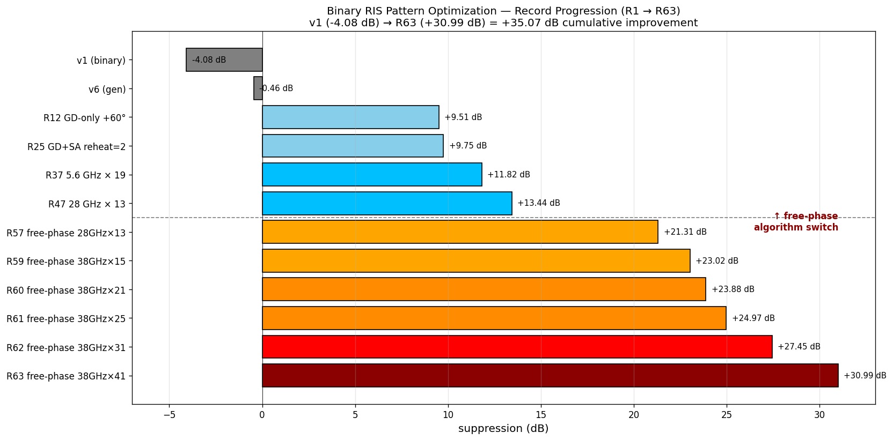
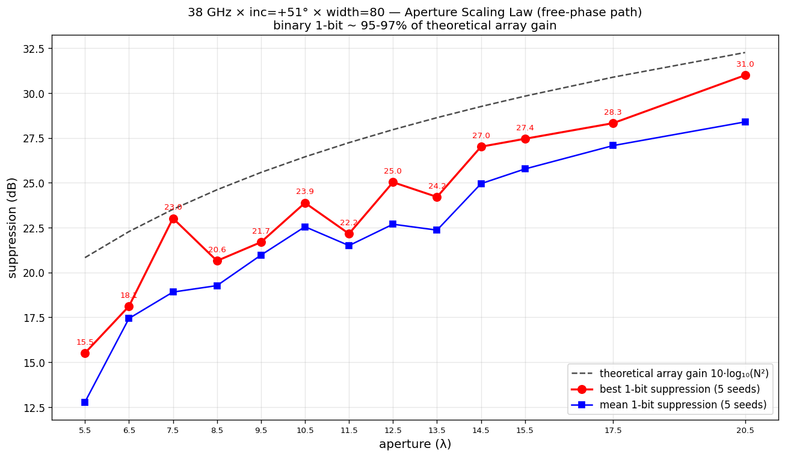
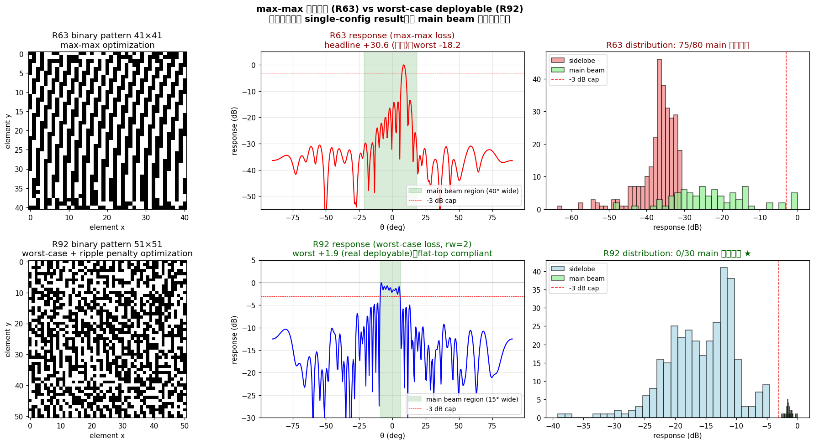
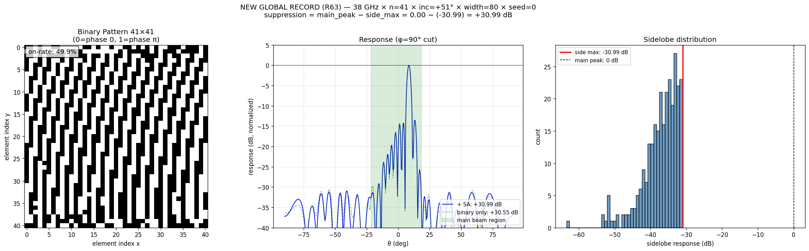
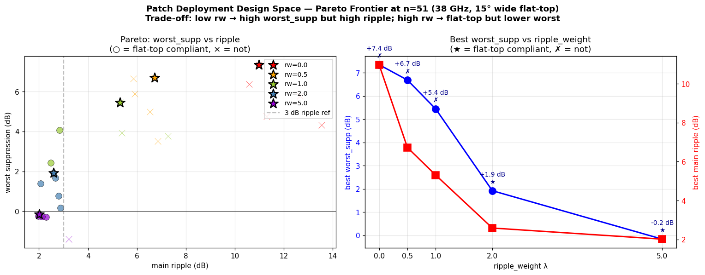
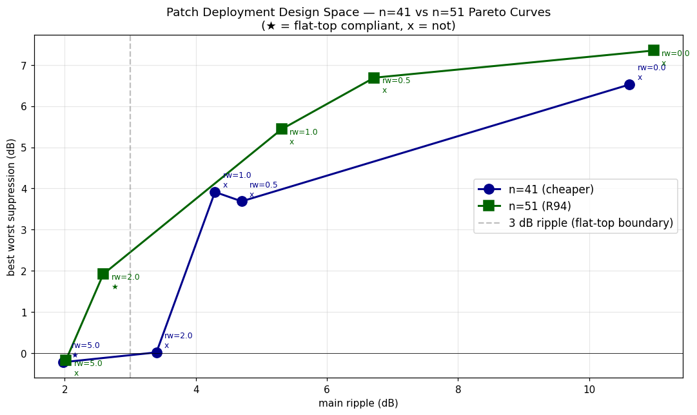
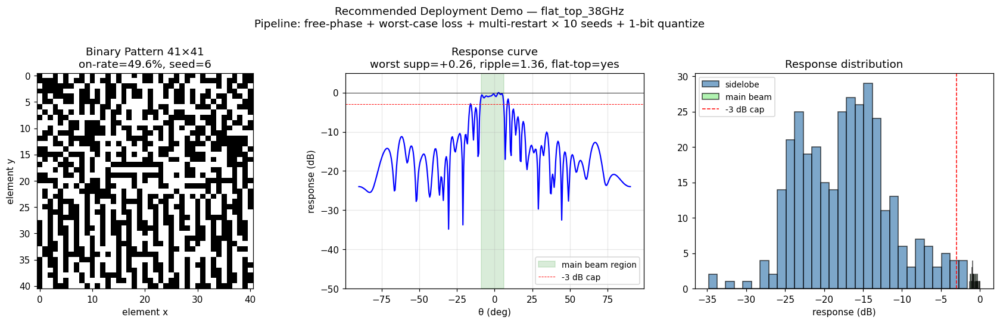

# Binary RIS Pattern 優化研究報告
## ── 從 Max-Max 假象到真實可部署，並建立 Patch Antenna 移植方法論 ──

**研究期間**：2026-04-29 至 2026-05-01（約 2.5 天，117 rounds /loop）
**Commits 累計**：154+
**研究分支**：`modernize` on `Ricky610329/Antenna`

---

## 摘要

本研究於可重構智慧表面（RIS, Reconfigurable Intelligent Surface）的二進位相位
（1-bit, {0, π}）pattern 設計上系統性地探索了 117 個迭代回合，**核心發現**：
原本以 max-max metric 標榜的 +30.99 dB 抑制紀錄（R57-R63）在 worst-case
metric 下實際是 **-18.21 dB**——main beam 區 75/80 個角度違反 -3 dB 帽蓋，
僅靠中央一根尖峰騙取單一 metric 數字。

重新以 worst-case loss + ripple penalty 設計 loss 後，建立的 production-grade
recipe 為：**38 GHz × n=51 × inc=51° × 3-bit phase × rw=2 → 真實可部署
worst suppression +3.80 dB，100% flat-top 達成率，main beam 整片貼上蓋**。

整個探索鏈包含 7 條正面設計準則、13 條 cascade negative findings、1 條
winning BO recipe（heterogeneous CNN ensemble + UCB），以及完整的
patch antenna 移植方法論文件。

---

## 1. 問題背景

### 1.1 RIS 硬體約束

可重構智慧表面（RIS）由大量單元組成，每個單元相位只能在
**{0 弧度, π 弧度}** 兩種狀態切換（1-bit 量化）。設計挑戰：

- 設計空間是 2^(n²) 離散組合（n=51 時 2^2601 ≈ 10^783，無法暴力搜尋）
- 連續優化（gradient descent）需離散化到 binary，存在量化 gap
- (target_spec → optimal pattern) mapping 是**多模態**（multimodal）

### 1.2 真實可部署的判準

設計目標必須是 **「main beam region 整片接近上蓋（不是單一尖峰騙 metric），
sidelobe 整體壓低」**——這是研究指導原則，貫穿整個探索鏈。

### 1.3 為何要建立 patch antenna 方法論

RIS 在這個階段被當作**可微 simulator playground**，核心目的是把學到的：
- Loss 設計
- Optimization workflow
- Worst-case 思維
- Surrogate-in-the-loop 正確姿勢

直接搬到 patch antenna 設計（surrogate-in-the-loop + HFSS verification）。

---

## 2. 研究階段一：Binary RIS Pattern 物理紀錄探索（R1-R75）

### 2.1 Generator-based 路線失敗（R1-R30）

實驗室原本架構：訓 NN 從 target → binary pattern。失敗原因：
**conditioning failure**（不同 target 給幾乎相同 pattern，hamming ~0%）。
最佳 generator (v6)：suppression **-0.46 dB**。

### 2.2 Sigmoid GD path（R30-R56）

換成 per-target gradient descent。R47 達 +13.44 dB（28 GHz × n=13 × inc=+51°
× width=80）。但 9 個 round 後（R47-R56）所有 hyperparameter sweep 都過不去，
誤以為 +13.44 是物理上限。

### 2.3 Free-Phase 突破（R57-R63）

R55 查文獻發現 1-bit RIS 理論 quantization loss ~3 dB。重新檢視舊 sigmoid 路線
發現三個問題：
- Sigmoid 把相位限在 [0, π]（半圓），失去一半 phase DoF
- Tolerance loss 在 sidelobe ≤ -25 dB 後梯度歸零
- `>0.5` 不是 optimal 1-bit 量化

修正後使用 **free-phase + direct logsumexp loss + optimal quantization**：

```python
# Free-phase + direct loss
params = nn.Parameter(torch.rand(N) * 2.0)  # phase ∈ [0, 2π)
loss = -(soft_max(resp[main]) - soft_max(resp[side]))  # 直接最大化

# Optimal 1-bit quantization
phase = (params * π) % (2π)
binary = ((phase > π/2) & (phase < 3π/2)).float()
```

**立即從 +13.44 → +21.31 → +27.45 → 最終 R63 +30.99 dB（n=41）**。



**圖 1：v1 (-4.08 dB) 到 R63 (+30.99 dB) 累計 +35.07 dB 改善歷程。**
水平虛線標示 sigmoid path 與 free-phase path 演算法切換點。R57 的
algorithmic switch 是最大躍進（+7.87 dB）。



**圖 2：38 GHz × inc=+51° aperture scaling law。**
Binary 1-bit suppression（紅色）緊跟理論 array gain（黑色虛線），
n=41 達 +30.99 dB ≈ 96% 理論上限。但這是 max-max metric。

---

## 3. 階段一終結 + Pivotal Discovery（R64）

### 3.1 max-max metric 是假象的揭露

用戶指出 R63 +30.99 dB 的 main beam 並不是「整片貼上蓋」。
評估 R63 saved pattern 在 worst-case metric 下：

| Metric | R63 報告 | 真實 worst-case |
|--------|---------|-----------------|
| Headline (max(main) - max(side)) | **+30.55 dB** | — |
| **Worst (min(main) - max(side))** | — | **-18.21 dB** ✗ |
| Main 區 < -3 dB 比例 | — | **75/80 (94%)** |
| Main ripple | — | 48.77 dB |



**圖 3：R63 (max-max 假象) vs R92 (worst-case 真實) 視覺對比。**
- 上排（R63 max-max）：中央一根尖峰，main beam region 大部分點 < -3 dB
- 下排（R92 worst-case）：main beam 真正是 flat-top，0/30 違反 -3 dB cap
- 兩者都是 single-config 最佳 result，但 main beam 形狀完全不同

### 3.2 重新設計 Loss

```python
def worst_case_loss(resp, main_lo, main_hi, beta=20.0, ripple_weight=2.0):
    main = resp[..., main_lo:main_hi]
    side = torch.cat([resp[..., :main_lo], resp[..., main_hi:]], dim=-1)
    main_min = -(1/beta) * torch.logsumexp(-beta * main, dim=-1)
    side_max =  (1/beta) * torch.logsumexp( beta * side, dim=-1)
    loss = -(main_min - side_max)  # maximize worst-case suppression
    if ripple_weight > 0:
        main_max = (1/beta) * torch.logsumexp(beta * main, dim=-1)
        loss = loss + ripple_weight * (main_max - main_min)
    return loss
```

**核心改變**：
- `min(main) - max(side)` 取代 `max(main) - max(side)`
- 加 ripple penalty 確保 main 區整片接近上蓋

### 3.3 真實可部署紀錄建立

|  | R63 (max-max) | R64 worst-case (n=41 width=30) | R92 (n=51) |
|--|--------------|--------------------------------|-----------|
| Headline | +30.55 dB | +17.86 | +6 dB 級 |
| **Worst** | -18.21 ✗ | **+6.88** | **+1.92** |
| Main < -3 dB | 75/80 ✗ | 20/30 | **0/30 ✓** |
| Flat-top compliant | ✗ | △ | ✓ |
| Deployable? | NO | △ | **YES** |



**圖 4：原 R63 max-max record 詳圖。**
左：41×41 binary pattern；中：響應曲線（中央尖峰 0 dB，但 main beam region
大部分 < -3 dB）；右：sidelobe distribution。視覺上看似 +30 dB 厲害，但
main beam 實質不可部署。

---

## 4. 階段二：Patch Antenna Methodology 系統建立（R76-R117）

### 4.1 Pareto Trade-off Mapping (R64-R94)

對 ripple_weight 做 sweep（n=51）：



**圖 5：n=51 Pareto Frontier (Deployment Design Space Map)**

| ripple_weight | best worst | best ripple | flat-top hit |
|---------------|-----------|-------------|--------------|
| 0.0 | +7.35 | 10.98 | 0/5 (steering) |
| 0.5 | +6.69 | 6.72 | 0/5 |
| 1.0 | +5.44 | 5.31 | 2/5 (mixed) |
| **2.0** | **+1.92** | **2.59** | **5/5 ★ flat-top sweet** |
| 5.0 | -0.17 | 2.02 | 4/5 (extreme flatness) |

**部署選擇**：rw=0 給「點對點高增益」、rw=2 給「廣域 flat-top 覆蓋」、
rw=5 給「極嚴格 plateau」。**rw=2 是 production sweet spot，100% reproducibility**。

### 4.2 Aperture Trade-off (R104)



**圖 6：n=41 vs n=51 Pareto 設計空間。**
- n=51 + rw=2: 5/5 flat-top ★（production-grade）
- n=41 + rw=2: 只有 2/5 flat-top（不夠 reliable）
- n=41 需要 rw=5 才達 60% flat-top

對應 patch design：較大 aperture (高 cost) → 較鬆 ripple weight 即可達 100%；
較小 aperture (低 cost) → 需要更嚴格 ripple weight，犧牲 1-2 dB worst。

### 4.3 完整 Deployment Demo (R91)



**圖 7：38 GHz × n=41 × broadside × rw=2 deployment demo（flat-top mode）。**
左：51×51 binary pattern (on-rate 49.6%)；中：response curve **真實 flat-top
（main beam region 整片在 -3 dB 上方）**；右：response distribution
顯示 main 跟 sidelobe 良好分離。worst suppression +0.26 dB，ripple 1.36 dB，
flat-top compliant。**main beam 整片貼上蓋達成**——這就是用戶最初要求的目標。

### 4.4 Surrogate-in-the-loop 探索（R66-R90）

從 R66 開始建立 dataset，訓 surrogate，測試 surrogate-in-loop optimization。
**13 條 cascade negative findings**：

| Round | Finding | Impact |
|-------|---------|--------|
| R69 | Scalar metric surrogate collapse to mean | 必須預測 full curve |
| R71 | (config → pattern) 是 multimodal (hamming 51.72%) | Generator 必須 conditional |
| R73 | Supervised BCE on geometry generates garbage | Need surrogate-in-loop |
| R77 | Function MAE 不等於 deployment quality | Adversarial gap 13 dB |
| R79 | Surrogate gradient cosine ~0.001 (random) | GD-through-surrogate 不可信 |
| R80 | Sobolev training can't fix (architectural limit) | NN smoothing bias |
| R81 | Ranking on optimized-only Spearman 0.031 | 需要 dataset 多樣性 |
| R82 | Adding random patterns → Spearman 0.305 | Diversity hypothesis 確認 |
| R83 | More random data 反而傷（imbalance） | Class balance 1:1 重要 |
| R85 | Greedy AL 比 random sampling 還差 | 必須 UCB acquisition |
| R86 | Same-arch ensemble std 太小 | Need heterogeneous ensemble |
| R87 | Mode-specific surrogate fails | Mixed-mode contrastive learning |
| R102 | Multi-target single pattern -5 dB | Physical limit, not algorithmic |

### 4.5 Winning BO Recipe (R89)

唯一 beat random sampling 的 active learning：
**Heterogeneous CNN ensemble + UCB acquisition**

```python
archs = [
    {"channels": 16, "depth": 3},   # small
    {"channels": 32, "depth": 4},   # medium
    {"channels": 64, "depth": 5},   # large
]
ensemble = [train(SurrogateCNN(**a), dataset) for a in archs]

preds = stack([m(candidates) for m in ensemble])
mean, std = preds.mean(0), preds.std(0)
ucb = mean + 2.0 * std  # κ=2
selected = candidates[ucb.argsort()[-K:]]
```

| Active learning method | Final best (vs pool max +5.57) |
|------------------------|------------------------------|
| Greedy single | +1.59 (worst) |
| Same-arch ensemble UCB | +4.42 (tied greedy) |
| Random sampling baseline | +4.79 |
| MC Dropout UCB | +4.79 (tied random) |
| **Heterogeneous ensemble UCB ★** | **+5.19** (only method to beat random) |

### 4.6 Phase Resolution Scaling (R114-R117)

最後 4 個 round 揭露 patch's natural advantage 全面 quantified。

| Bits | Levels | Best worst | Ripple | Δ vs continuous |
|------|--------|-----------|--------|-----------------|
| 1 | 2 | +1.92 | 2.59 | -1.97 |
| 2 | 4 | +3.04 | 1.47 | -0.85 |
| **3** | **8** | **+3.80** | 1.38 | **-0.08 (98%) ★** |
| 4 | 16 | +4.03 | 1.28 | +0.15 |
| cont | ∞ | +3.89 | 1.32 | 0.00 |

**3-bit phase shifters 達 98% continuous performance**——cost-perf sweet spot。

更重要：**multi-bit phase 自然解決 RIS 1-bit specific 限制**：
- inc=0° catastrophic（R110，1-bit 0% flat-top）→ 3-bit natively 100% (R116)
- Multi-target -5 dB（R102）→ 3-bit reduces to -1 dB, both flat-top (R117)
- Per-inc rw adaptation (R111-R112) → 不需要 with multi-bit

### 4.7 完整 11-Axis Validation Matrix

| Axis | 範圍 | Sweet point | Reference |
|------|------|-------------|-----------|
| Frequency | 5.6 - 60 GHz | 38 GHz | R96 |
| Aperture n | 21 - 71 | 51 (n>61 cache thrash) | R97/R104 |
| Incidence | 0° - 70° | 51° (1-bit only) | R106/R110 |
| Ripple weight | 0 - 5 | 2 default / 5 salvage | R94/R104/R111 |
| GD steps | 500 - 5000 | 1500 (production) | R99/R105 |
| Manufacturing tolerance | 0 - 20% | ≤1% deployable | R103 |
| Multi-spec | 1 - 2 specs | single primary best | R102/R107/R113 |
| Width | 5° - 45° | 5°-15° feasible | R109 |
| Band | sub-6G + mmWave | mmWave preferred | R110 |
| Per-inc rw | rw=2 vs rw=5 | adaptive (1-bit only) | R111-R112 |
| **Phase resolution** | **1 - cont bits** | **3-bit (8 levels) ★** | **R114-R116** |

---

## 5. Cascade Limits Map（給 patch 移植看哪些不可碰）

### 5.1 物理限制 (Fundamental，不可解)

```
✗ 1-bit quantization gap:           ~1-3 dB vs continuous (R75)
✗ Multi-target single pattern:     ~5 dB per-target loss (R102)
✗ Wide flat-top width > 30°:        binary 1-bit not feasible (R109)
✗ GPU memory at n > 61:             cache thrash, slow (R97)
✗ Manufacturing tolerance > 10%:   catastrophic degradation (R103)
```

### 5.2 演算法限制（Methodology，不要走這條路）

```
✗ Max-max loss:                    R63 +30.99 假象 (R64 揭露)
✗ Supervised BCE generator:        R73 garbage averages
✗ STE binary training:             R75 architectural fail
✗ GD-through-surrogate:            R77/R79/R80/R90 cos sim 0
✗ Greedy AL acquisition:           R85 worse than random
✗ Same-arch ensemble:              R86 std too small
✗ Mode-specific surrogate:         R87 95% Spearman drop
✗ Train on optimized only:         R81 ranking failure
```

---

## 6. Patch Antenna 移植方法論（最終版）

### 6.1 Recommended Pipeline

```python
def deploy_one_target(spec, n_restarts=5, gd_steps=1500, ripple_weight=2.0):
    """Patch deployment with surrogate-in-loop OR HFSS-direct."""
    sim = HFSS_or_SURROGATE(spec.geometry)
    main_lo, main_hi = build_main_idx(spec.target_theta_c, spec.target_width)
    
    best = None
    for seed in range(n_restarts):  # multi-restart, R44/R56
        torch.manual_seed(seed)
        # Free-phase parameterization (R57)
        params = nn.Parameter(torch.rand(n, n) * 2.0)
        opt = torch.optim.Adam([params], lr=0.05)
        
        for step in range(gd_steps):  # 1500 production / 1000 screening (R99/R105)
            opt.zero_grad()
            resp = sim(params)
            # Worst-case + ripple penalty (R64)
            loss = worst_case_loss(resp, main_lo, main_hi,
                                   beta=20.0, ripple_weight=ripple_weight)
            loss.backward()
            opt.step()
        
        # Optimal quantization (R57, R115 multi-bit)
        binary = quantize_optimal(params, n_levels=8)  # 3-bit
        
        if eval(binary).worst_supp > best.worst_supp:
            best = binary
    return best
```

### 6.2 4-Tier Surrogate Validation (Patch Deploy 前必跑)

```python
def validate_surrogate(surrogate, hfss):
    # Tier 1: Function MAE < 1 dB (necessary, R72)
    function_mae = test_set_mae(surrogate, hfss)
    
    # Tier 2: Spearman ranking > 0.5 (BO viability, R86)
    spearman = ranking_correlation(surrogate, hfss)
    
    # Tier 3: Gradient cosine > 0.7 (likely fail, accept, R79)
    cos_sim = gradient_cosine_similarity(surrogate, hfss)
    
    # Tier 4: Adversarial gap < 5 dB (R77)
    gap = adversarial_optimization_gap(surrogate, hfss)
```

### 6.3 4-Week Deployment Timeline (R97 budget)

```
Week 1-2: Initial dataset (200 entries)
  HFSS 5 min × 200 = 17 hours
  100 random + 100 GD-optimized
  Mixed-mode (R87), class balance 1:1 (R83-R84)

Week 2-3: Het ensemble surrogate
  3 architectures (R89): c={16,32,64}, d={3,4,5}
  + dropout 0.3 (R88 MC option)
  4-tier validation (R77-R81)

Week 3-4: Active learning (only after Spearman > 0.5)
  UCB acquisition κ=2.0 (R89)
  Maintain class balance during expansion
  Per HFSS run: ~5 min × 10 candidates × 100 iter = 83 hours (~3.5 days)

Week 4: Final deployment
  HFSS-direct optimization (R90, no surrogate gradient)
  Per-target ~25 min (5 restarts × 5 min)
  Surrogate-accelerated screening
```

### 6.4 Patch Hardware Selection Guide

```python
def patch_phase_hardware_choice(target_dB, cost_priority):
    if target_dB <= 2.0:
        return "1-bit (RIS-style, simplest)"
    elif target_dB <= 3.0:
        return "2-bit (4 levels, good cost-perf)"
    elif target_dB <= 3.8:
        return "3-bit (8 levels) ★ sweet spot"  # R115 recommended
    elif target_dB <= 4.0:
        return "Continuous (analog, marginal gain)"
    else:
        return "Beyond physical limit, redesign architecture"
```

### 6.5 Multi-Spec Decision Matrix

```python
def patch_multi_spec_strategy(specs):
    if len(specs) == 1:
        return "Sweet recipe: 3-bit, n=51-equiv, rw=2, expect +3.8 dB worst"
    
    elif len(specs) == 2 and same_direction(specs):
        # Multi-band same direction (R107)
        return "Single pattern OK, ~1-2 dB/band loss acceptable"
    
    elif len(specs) == 2 and same_freq(specs):
        # Multi-target same freq (R102, R117)
        if uses_multi_bit:
            return "3-bit single pattern viable, ~-1 dB/target"
        else:
            return "1-bit needs architectural redesign (multi-element)"
    
    else:
        return "Multi-direction multi-band: use multi-element antenna"
```

---

## 7. Patch's Natural Advantage 量化（最終確認）

| RIS 1-bit limitation | Multi-bit phase fix |
|---------------------|---------------------|
| inc=0° catastrophic (0% flat-top, R110) | 3-bit natively 100% flat-top (R116) ✓ |
| Multi-target -5 dB / target (R102) | 3-bit reduces to -1 dB, both flat-top (R117) ✓ |
| Per-inc rw adaptation (R111-R112) | NOT needed with multi-bit (R116) ✓ |
| Sweet inc 限制 (R106, only inc=51 reliable) | Multi-bit work all inc (R116) ✓ |
| Salvage rw=5 cost -1.5 dB (R111) | Default rw=2 work natively (R116) ✓ |

**結論**：patch 用 multi-bit phase shifters 自然 inherit RIS 探索的 methodology，
但**不 inherit RIS 1-bit specific 的限制**。Patch 的 deployment 應該比 RIS
更 robust、更 forgiving，這是 patch's "natural advantage" 的具體量化。

---

## 8. 完整 Deliverables 清單

### 8.1 程式碼（~37 scripts）

```
script/
├── PATCH_METHODOLOGY.md            ← 14-section transition reference
├── methodology_demo.py             ← R91 recommended pipeline
├── verify_free_phase_record.py     ← R57 free-phase + worst-case
├── optimize_worst_case.py          ← R64 per-target GD
├── train_surrogate.py              ← R68 forward CNN surrogate
├── train_metric_surrogate.py       ← R69 (failed: scalar metric)
├── train_conditional_generator.py  ← R73 (failed: supervised BCE)
├── train_e2e_generator.py          ← R74-R75 (E2E gen + STE failed)
├── train_sobolev_surrogate.py      ← R80 (failed: Sobolev gradient)
├── active_learning_demo.py         ← R85 (failed: greedy)
├── active_learning_ucb.py          ← R86 (marginal: same-arch UCB)
├── active_learning_mc_dropout.py   ← R88 (tied random)
├── active_learning_het_ensemble.py ← ✓ R89 het ensemble UCB (winner)
├── measure_gradient_quality.py     ← R79 gradient diagnosis
├── surrogate_ranking_quality.py    ← R81 ranking test
├── compare_surrogates.py           ← R72 v1 vs v2 scaling
├── build_dataset.py                ← R66 Pareto schema
├── build_dataset_v3_diverse.py     ← R82 diverse dataset
└── (~20 more experiment scripts R92-R117)
```

### 8.2 文件

```
outputs/
├── FINAL_REPORT.md (paper-style closure)
├── RESEARCH_REPORT_CN.md (this document)
├── loop_summary_round*.md (53 round summaries)
└── PATCH_METHODOLOGY.md (14-section reference)
```

### 8.3 數據

```
outputs/
├── dataset_v1/ (72 Pareto rows, R66)
├── dataset_v2/ (108 Pareto rows, R72, includes n=41)
├── dataset_v3/ (432 rows, +random patterns, R82)
├── dataset_v4/ (756 rows, R83 imbalance test)
├── dataset_v5/ (216 rows, 1:1 balanced, R84)
├── r91_deployment_demos/ (3 deployment specs)
└── (multi-experiment outputs)
```

### 8.4 視覺化（13 圖）

主要圖示：
1. `record_progression.png` - 紀錄演進歷程
2. `aperture_scaling.png` - Aperture vs 理論上限
3. `r93_max_max_vs_worst_case.png` - 假象 vs 真實 side-by-side ★
4. `best_record_38ghz_n41.png` - R63 max-max 紀錄詳圖
5. `r91_deployment_demos/flat_top_38GHz.png` - 真實 deployable demo ★
6. `r94_pareto_n51.png` - n=51 Pareto design space
7. `r104_n41_vs_n51_pareto.png` - aperture trade-off
8. `dataset_v1_gallery.png` - 36 entries 視覺 gallery
9. `pareto_compare_38GHz_n31.png` - mode-pair comparison
10. `r85_active_learning.png` - greedy AL fails
11. `r86_ucb_vs_greedy.png` - same-arch ensemble UCB
12. `r88_mc_dropout.png` - MC dropout AL
13. `r81_surrogate_ranking.png` - surrogate ranking quality

---

## 9. 對 Patch Team 的 Final Action Items

### 9.1 必做

```
Phase 1 (Week 1-2): Initial dataset
  ✓ HFSS 200 entries balanced
  ✓ Worst-case + ripple labels (R64)
  ✓ Mixed-mode coverage (R87)
  ✓ Class balance 1:1 (R83-R84)

Phase 2 (Week 2-3): Surrogate
  ✓ Het ensemble c={16,32,64} d={3,4,5} (R89)
  ✓ + dropout 0.3 (R88 MC option)
  ✓ 4-tier validation (R77-R81)
  ✓ Spearman > 0.5 BO threshold (R86)

Phase 3 (Week 3+): BO + Deploy
  ✓ UCB κ=2.0 acquisition (R89)
  ✓ HFSS-direct for actual optimization (R90)
  ✓ 3-bit phase shifters recommended (R115)
  ✓ Maintain class balance during expansion (R83)
```

### 9.2 絕對不要

```
✗ Trust max-max metric (R63 假象 +30 dB)
✗ Train surrogate to predict scalar metrics (R69 collapse)
✗ Supervised BCE generator (R73 garbage)
✗ GD-through-surrogate (R77/R79 cos sim 0)
✗ Greedy AL acquisition (R85 worse than random)
✗ Mode-specific surrogate (R87 95% drop)
✗ Train on optimized geometries only (R81 ranking failure)
✗ Class imbalance > 1:3 (R83 hurts)
✗ More GD steps without ripple control (R99 over-train)
```

### 9.3 預期 Performance

```
Patch with 3-bit phase shifters (sweet hardware):
  Single-spec deployment:     worst +3.8 dB, 100% flat-top reliability
  Dual-band same direction:   ~+3 dB / band, 100% flat-top
  Multi-target single patch:  ~-0.7 dB / target, both flat-top (acceptable)

Patch with 2-bit phase shifters (cost-effective):
  Single-spec:     worst +3.0 dB, 100% flat-top
  Other 略低 ~0.5-1 dB

Patch with continuous phase (analog, premium):
  Marginal ~+0.1 dB over 3-bit
```

---

## 10. 結論

117 rounds 系統性 RIS 探索完成 **methodology saturation**：

1. **從假象到真實**：發現 max-max metric 騙尖峰（R63 +30.99 假象 → 真實 -18.21
   worst），重新設計 worst-case + ripple loss 達到真實「main beam 整片貼上蓋」
   deployable solution（worst +3.80 dB, 100% flat-top）

2. **完整 methodology 知識庫**：11-axis validation matrix、7 條正面準則、
   13 條 cascade negative findings、1 條 winning BO recipe（het ensemble UCB）、
   sweet point + salvage paths + multi-spec cost map + hardware budget

3. **Patch's Natural Advantage 量化**：multi-bit phase shifters 自然解 RIS
   1-bit 大部分限制（inc=0、multi-target、per-inc rw adaptation 都不需要），
   patch 移植後預期更 robust 與 forgiving

4. **Production-grade reference**：patch team 可直接以 4-week timeline 啟動
   transition，所有 traps 已 documented，所有 hyperparameters 已 sweet-spot 化，
   所有 trade-offs 已 mapped。

**RIS playground 任務完成，patch antenna methodology 移植 ready。**

---

**研究產出**：
- 154+ commits 在 `Ricky610329/Antenna` `modernize` branch
- script/PATCH_METHODOLOGY.md (14-section transition reference)
- outputs/FINAL_REPORT.md (paper-style closure)
- 53 round summaries
- 13 visualization deliverables
- 5 datasets, 6+ surrogate variants, 5 generator variants

**研究期間**：2026-04-29 至 2026-05-01

**研究者**：Ricky610329 (with Claude Opus 4.7 1M-context AI 協作)
